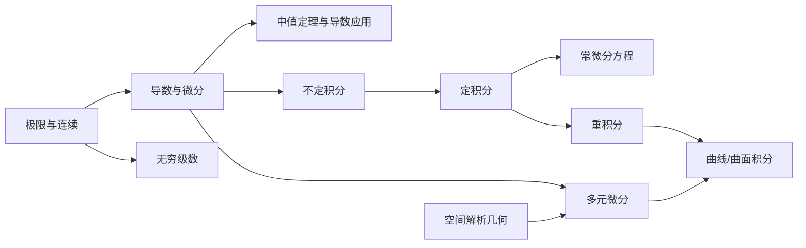

这一篇先回答三个问题：**考什么、按什么顺序复习、这套笔记怎么用**。第 01 篇开始进入正文。

## 一、考试基本信息（2027 考研）

| 项目 | 内容 |
| --- | --- |
| 预报名 | 2026 年 10 月 9 日 ～ 10 月 12 日 |
| 正式报名 | 2026 年 10 月 15 日 ～ 10 月 24 日 |
| 初试 | **2026 年 12 月 19 日 ～ 20 日** |
| 数学考试时长 | 180 分钟，满分 150 分 |

> [!NOTE] 信息来源
> 日期来自研招网发布的《2027 年全国硕士研究生招生考试公告》和教育部招生工作部署。试卷结构请以当年官方考试大纲为准。

### 数一试卷结构（近年常见形式）

| 题型 | 题量 | 分值 |
| --- | --- | --- |
| 单项选择题 | 10 题 | 50 分 |
| 填空题 | 6 题 | 30 分 |
| 解答题（含证明） | 6 题 | 70 分 |

各科大致占比：**高等数学约 60%**，线性代数约 20%，概率论与数理统计约 20%。也就是说，高数大约占 **90 分**，是拉开差距的主战场。

## 二、知识地图

高数整体是“**一元 → 多元**”的结构，后面的内容几乎都建立在“极限、导数、积分”这三样东西上：

## 三、系列目录

内容多的章节已经拆开，全系列共 16 篇加 1 篇附录：

| # | 标题 | 重点 | 考频 |
| --- | --- | --- | --- |
| 00 | 导读与复习路线 | 本篇 | — |
| 01 | 函数、极限与连续 | 等价无穷小、泰勒求极限、间断点 | ★★★ |
| 02 | 导数与微分 | 导数定义、隐函数/参数方程求导、高阶导数 | ★★★ |
| 03 | 微分中值定理 | 罗尔/拉格朗日/柯西、**证明题构造辅助函数** | ★★★ |
| 04 | 导数的应用 | 洛必达、泰勒公式、极值、凹凸性、渐近线、不等式 | ★★★ |
| 05 | 不定积分 | 换元、分部、有理函数积分 | ★★ |
| 06 | 定积分与反常积分 | 变限积分求导、对称性、反常积分敛散性 | ★★★ |
| 07 | 定积分的应用 | 面积、旋转体体积、弧长、物理应用 | ★★ |
| 08 | 常微分方程 | 一阶方程、二阶常系数线性、欧拉方程 | ★★★ |
| 09 | 向量代数与空间解析几何 | 平面与直线、曲面方程 | ★ |
| 10 | 多元函数微分学 | 可微性、复合求导、方向导数、条件极值 | ★★★ |
| 11 | 重积分 | 二重/三重积分换坐标、对称性、交换次序 | ★★★ |
| 12 | 曲线积分与格林公式 | 两类曲线积分、格林公式、与路径无关 | ★★★ |
| 13 | 曲面积分与高斯、斯托克斯公式 | 两类曲面积分、高斯公式补面法 | ★★★ |
| 14 | 常数项级数 | 正项级数判别法、交错级数、绝对/条件收敛 | ★★ |
| 15 | 幂级数与傅里叶级数 | 收敛域、和函数、函数展开、傅里叶系数 | ★★★ |
| 附录 | 公式速查表 | 全系列必背公式汇总 | — |

> [!IMPORTANT] 数一独有的重点
> 第 09、12、13 篇（空间解析几何、曲线曲面积分）和傅里叶级数只有数一考。数二、数三的同学可以跳过这些内容。

## 四、每篇文章的结构

后面每一篇都按同一个顺序写，方便查找：

1. **本章地图**：这一章学什么、考什么
2. **核心概念**：只讲最关键的定义，用大白话解释
3. **必背公式**：集中列出
4. **题型与套路**：每个题型按“识别特征 → 解法步骤 → 例题”来讲
5. **证明思路**：重要定理给出简短的证明思路，帮你理解它为什么成立，也能应对证明题
6. **易错点**：常见失分点
7. **小练习**：3～5 题，答案折叠
8. **本章小结**

文中的提醒框含义固定：

> [!TIP] 技巧
> 能明显省时间的做法。

> [!WARNING] 易错
> 很容易丢分的地方。

> [!IMPORTANT] 必背
> 考前一定要背熟的结论。

## 五、格式示例

下面用一道小题演示后面文章的写法。

**例** 求 $\displaystyle\lim_{x\to 0}\frac{\tan x-\sin x}{x^3}$。

**识别特征**：$\frac{0}{0}$ 型，分子是两个函数相减。直接把 $\tan x$、$\sin x$ 都换成 $x$ 会得到 $0$，这是错的。

**解法**：先提公因式，再对乘积因子做等价替换：

$$
\frac{\tan x-\sin x}{x^3}=\frac{\tan x\,(1-\cos x)}{x^3}\sim\frac{x\cdot\frac{1}{2}x^2}{x^3}=\frac{1}{2}.
$$

> [!WARNING] 易错
> 等价无穷小只能替换**乘除中的因子**，不能直接替换加减中的某一项。

**证明思路**：为什么加减不能随便替换？因为 $\tan x=x+\frac{x^3}{3}+o(x^3)$，$\sin x=x-\frac{x^3}{6}+o(x^3)$。两者的一阶项 $x$ 相减后抵消了，真正决定结果的是三阶项。只换成 $x$ 就把三阶项丢掉了。

📝 小练习：用泰勒展开验证上面的结果（点击查看答案）

由上面的展开式，$\tan x-\sin x=\left(\frac{1}{3}+\frac{1}{6}\right)x^3+o(x^3)=\frac{1}{2}x^3+o(x^3)$，所以极限为 $\frac{1}{2}$，与等价替换的结果一致。

## 六、复习路线建议

距离初试大约 **11 周**。下面是一个速成节奏，可以按自己的情况调整：

| 时间 | 任务 |
| --- | --- |
| 第 1～4 周 | 01～08 篇（一元微积分），每天 1 篇，并配套做题 |
| 第 5～7 周 | 09～15 篇（多元与级数） |
| 第 8～10 周 | 整套真题限时训练，错题回到对应篇章查漏 |
| 第 11 周 | 只看附录速查表、错题和易错点 |

> [!TIP] 怎么用这套笔记
> - **第一遍**：按顺序读，每篇的小练习都要动笔做。
> - **第二遍**：只看“题型与套路”和“易错点”。
> - **考前**：只看附录速查表。

## 本篇小结

- 数一高数约占 90 分，是数学的主战场。
- 极限、导数、积分是基础，01～06 篇一定要打牢。
- 每篇都按“地图 → 概念 → 公式 → 套路 → 证明思路 → 易错 → 练习 → 小结”的结构来写。

下一篇：**01 函数、极限与连续**。
