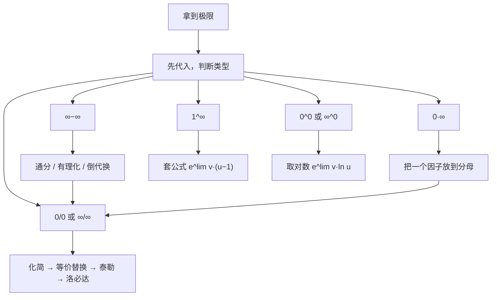

求极限几乎是每年必考的内容，而且后面的导数、积分、级数全都建立在极限之上。这一章的目标是：**拿到任何一个极限，都知道第一步该做什么**。

## 一、本章地图

| 模块 | 要掌握什么 | 常见考法 |
| --- | --- | --- |
| 函数 | 有界、单调、奇偶、周期；复合与反函数 | 选择题判断性质 |
| 极限概念 | 定义、左右极限、唯一性、保号性 | 选择题判断真假 |
| 求极限 | 七种未定式、等价无穷小、泰勒、洛必达 | 选择、填空、解答第一题 |
| 数列极限 | 单调有界、夹逼、定积分定义 | 解答题 |
| 无穷小比较 | 阶的比较、反求参数 | 选择、填空 |
| 连续与间断 | 间断点分类、闭区间连续函数性质 | 选择、证明题 |

求极限的总流程：

## 二、核心概念

### 1. 函数的四个性质

- **有界性**：存在 $M>0$，使 $|f(x)|\le M$。注意：有界与否要说明“在哪个区间上”。
- **单调性**：在区间上 $x_1<x_2\Rightarrow f(x_1)<f(x_2)$（单调增）。
- **奇偶性**：定义域关于原点对称，$f(-x)=-f(x)$ 为奇，$f(-x)=f(x)$ 为偶。
- **周期性**：$f(x+T)=f(x)$。

> [!TIP] 奇偶性常用结论
> 奇 × 奇 = 偶，奇 × 偶 = 奇；可导的奇函数，导数是偶函数；可导的偶函数，导数是奇函数。$\ln\left(x+\sqrt{1+x^2}\right)$ 是奇函数，这个常在对称区间积分里出现。

### 2. 极限的定义（读懂即可）

- 数列：$\lim\limits_{n\to\infty}x_n=A$ 指对任意 $\varepsilon>0$，存在 $N$，当 $n>N$ 时 $|x_n-A|<\varepsilon$。
- 函数：$\lim\limits_{x\to x_0}f(x)=A$ 指对任意 $\varepsilon>0$，存在 $\delta>0$，当 $0<|x-x_0|<\delta$ 时 $|f(x)-A|<\varepsilon$。

大白话：**只要 $x$ 足够靠近 $x_0$（但不等于 $x_0$），$f(x)$ 就能任意靠近 $A$**。所以极限和 $f(x_0)$ 本身等于多少、有没有定义都无关。

### 3. 左右极限

$$
\lim_{x\to x_0}f(x)=A\iff\lim_{x\to x_0^-}f(x)=\lim_{x\to x_0^+}f(x)=A.
$$

> [!IMPORTANT] 必须分左右算的情况
> - 分段函数在分段点处
> - 含 $e^{1/x}$：$x\to0^+$ 时趋于 $+\infty$，$x\to0^-$ 时趋于 $0$
> - 含 $\arctan\frac1x$：$x\to0^\pm$ 时分别趋于 $\pm\frac{\pi}{2}$
> - 含 $|x|$、$[x]$（取整）、$\sqrt{x^2}=|x|$
> - $x\to\infty$ 时含 $e^x$、$\arctan x$，要分 $+\infty$ 和 $-\infty$

### 4. 极限的三个性质

1. **唯一性**：极限存在则唯一。
2. **局部有界性**：$\lim\limits_{x\to x_0}f(x)$ 存在，则 $f$ 在 $x_0$ 的某个去心邻域内有界。
3. **局部保号性**：若 $\lim\limits_{x\to x_0}f(x)=A>0$，则在 $x_0$ 附近 $f(x)>0$；反过来，若在 $x_0$ 附近 $f(x)\ge0$ 且极限存在，则 $A\ge0$（注意是 $\ge$，不是 $>$）。

### 5. 无穷小与阶的比较

设 $\alpha\to0$，$\beta\to0$，且 $\beta\ne0$：

| $\lim\dfrac{\alpha}{\beta}$ | 结论 |
| --- | --- |
| $0$ | $\alpha$ 是比 $\beta$ **高阶**的无穷小，记 $\alpha=o(\beta)$ |
| $c\ne0$ | 同阶 |
| $1$ | 等价，记 $\alpha\sim\beta$ |
| $\lim\dfrac{\alpha}{\beta^k}=c\ne0$ | $\alpha$ 是 $\beta$ 的 $k$ 阶无穷小 |

**无穷小 × 有界量 = 无穷小**。例如 $\lim\limits_{x\to0}x\sin\frac1x=0$。

### 6. 连续与间断

$f$ 在 $x_0$ 连续：$\lim\limits_{x\to x_0}f(x)=f(x_0)$。三个条件缺一不可：**有定义、极限存在、两者相等**。

间断点分类：

| 类型 | 判断方法 |
| --- | --- |
| 第一类·可去 | 左右极限存在且相等，但不等于 $f(x_0)$，或 $f(x_0)$ 无定义 |
| 第一类·跳跃 | 左右极限都存在，但不相等 |
| 第二类·无穷 | 至少一侧极限为 $\infty$ |
| 第二类·振荡 | 极限振荡不存在，如 $\sin\frac1x$ 在 $x=0$ |

## 三、必背公式

### 1. 两个重要极限

$$
\lim_{x\to0}\frac{\sin x}{x}=1,\qquad \lim_{x\to\infty}\left(1+\frac1x\right)^x=e\quad\left(\text{等价写法 }\lim_{x\to0}(1+x)^{\frac1x}=e\right).
$$

### 2. 等价无穷小（$x\to0$）

> [!IMPORTANT] 必背·一阶
> $$\sin x\sim\tan x\sim\arcsin x\sim\arctan x\sim\ln(1+x)\sim e^x-1\sim x$$
> $$1-\cos x\sim\frac{x^2}{2},\qquad (1+x)^a-1\sim ax,\qquad a^x-1\sim x\ln a$$

> [!IMPORTANT] 必背·差的阶（加减时用）
> $$x-\sin x\sim\frac{x^3}{6},\quad \tan x-x\sim\frac{x^3}{3},\quad \arcsin x-x\sim\frac{x^3}{6},\quad x-\arctan x\sim\frac{x^3}{3}$$
> $$x-\ln(1+x)\sim\frac{x^2}{2},\qquad e^x-1-x\sim\frac{x^2}{2},\qquad \tan x-\sin x\sim\frac{x^3}{2}$$

公式里的 $x$ 可以换成任何趋于 $0$ 的式子 $\square$，例如 $\ln(1+x^2)\sim x^2$，$e^{\sin x}-1\sim\sin x\sim x$。

### 3. 常用泰勒展开（$x\to0$）

$$
\begin{aligned}
e^x&=1+x+\frac{x^2}{2!}+\frac{x^3}{3!}+o(x^3)\\
\sin x&=x-\frac{x^3}{3!}+o(x^4)\\
\cos x&=1-\frac{x^2}{2!}+\frac{x^4}{4!}+o(x^5)\\
\ln(1+x)&=x-\frac{x^2}{2}+\frac{x^3}{3}+o(x^3)\\
(1+x)^a&=1+ax+\frac{a(a-1)}{2}x^2+o(x^2)\\
\tan x&=x+\frac{x^3}{3}+o(x^3)\\
\arcsin x&=x+\frac{x^3}{6}+o(x^3)\\
\arctan x&=x-\frac{x^3}{3}+o(x^3)
\end{aligned}
$$

> [!TIP] 展开到几阶？
> - 分式：**上下同阶**。分母是 $x^4$，分子就展开到 $x^4$。
> - 加减：展开到**第一个不能抵消的项**为止。

### 4. 1^∞ 型公式

若 $u\to1$，$v\to\infty$，则

$$
\lim u^v=e^{\lim v\,(u-1)}.
$$

### 5. 增长速度（$x\to+\infty$）

$$
\ln^a x\ll x^b\ll c^x\quad(a,b>0,\ c>1);\qquad \text{数列：}\ \ln^a n\ll n^b\ll c^n\ll n!\ll n^n.
$$

## 四、题型与解题套路

### 题型 1：0/0 型

**识别特征**：代入后分子分母都是 $0$。

**解法步骤**：

1. **先化简**：非零因子先算出来（如 $\cos x\to1$ 直接代入）；根式先有理化。
2. **等价替换**：只替换乘除中的因子。
3. **泰勒展开**：出现加减、等价替换失效时用。
4. **洛必达**：上面都不好用时再用，每求一次导先化简。

**例 1** 求 $\displaystyle\lim_{x\to0}\frac{\cos x-e^{-\frac{x^2}{2}}}{x^4}$。

**解** 分母是 $x^4$，分子展开到 $x^4$：

$$
\cos x=1-\frac{x^2}{2}+\frac{x^4}{24}+o(x^4),\qquad e^{-\frac{x^2}{2}}=1-\frac{x^2}{2}+\frac12\cdot\frac{x^4}{4}+o(x^4)=1-\frac{x^2}{2}+\frac{x^4}{8}+o(x^4).
$$

相减：$\cos x-e^{-\frac{x^2}{2}}=\left(\frac1{24}-\frac{3}{24}\right)x^4+o(x^4)=-\frac{x^4}{12}+o(x^4)$，所以极限为 $\boxed{-\dfrac{1}{12}}$。

> [!WARNING] 易错
> 这题如果把 $\cos x$ 和 $e^{-x^2/2}$ 都替换成 $1-\frac{x^2}{2}$，分子会变成 $0$，这是错误的。加减中替换，必须保留到不能抵消的那一项。

### 题型 2：∞−∞ 型

**识别特征**：两个都趋于 $\infty$ 的式子相减。

**解法**：

- 分式相减 → **通分**，化成 0/0。
- 根式相减 → **有理化**。
- $x\to\infty$ 且不好通分 → **倒代换** $t=\frac1x$。

**例 2** 求 $\displaystyle\lim_{x\to0}\left(\frac1{x^2}-\frac1{x\tan x}\right)$。

**解** 通分：

$$
\frac1{x^2}-\frac1{x\tan x}=\frac{\tan x-x}{x^2\tan x}\sim\frac{\frac{x^3}{3}}{x^3}\to\boxed{\frac13}.
$$

分母中 $\tan x$ 是乘积因子，可以换成 $x$；分子是差，用必背的 $\tan x-x\sim\frac{x^3}{3}$。

**例 3** 求 $\displaystyle\lim_{x\to+\infty}\left[x-x^2\ln\left(1+\frac1x\right)\right]$。

**解** 令 $t=\frac1x\to0^+$：

$$
\text{原式}=\lim_{t\to0^+}\left[\frac1t-\frac{\ln(1+t)}{t^2}\right]=\lim_{t\to0^+}\frac{t-\ln(1+t)}{t^2}=\boxed{\frac12}.
$$

**例 4** 求 $\displaystyle\lim_{x\to+\infty}\left(\sqrt{x^2+x}-x\right)$。

**解** 有理化：$\displaystyle\frac{x}{\sqrt{x^2+x}+x}=\frac{1}{\sqrt{1+\frac1x}+1}\to\boxed{\frac12}$。

### 题型 3：0·∞ 型

**解法**：把其中一个因子“翻”到分母，变成 0/0 或 ∞/∞。一般把**对数、反三角函数留在分子**，因为它们求导后更简单。

例如 $\displaystyle\lim_{x\to0^+}x\ln x=\lim_{x\to0^+}\frac{\ln x}{\frac1x}\overset{\text{洛}}{=}\lim_{x\to0^+}\frac{\frac1x}{-\frac1{x^2}}=\lim_{x\to0^+}(-x)=0$。

> [!IMPORTANT] 必背
> $\lim\limits_{x\to0^+}x^a\ln x=0\ (a>0)$，后面会反复用到。

### 题型 4：1^∞ 型

**识别特征**：底数趋于 $1$，指数趋于 $\infty$。

**解法**：直接套公式 $\lim u^v=e^{\lim v(u-1)}$。

**例 5** 求 $\displaystyle\lim_{x\to0}(\cos x)^{\frac1{x^2}}$。

**解** $v(u-1)=\dfrac{\cos x-1}{x^2}\to-\dfrac12$，所以原式 $=\boxed{e^{-\frac12}}$。

**例 6** 求 $\displaystyle\lim_{x\to\infty}\left(\frac{x+1}{x-1}\right)^x$。

**解** $u-1=\dfrac{2}{x-1}$，$v(u-1)=\dfrac{2x}{x-1}\to2$，所以原式 $=\boxed{e^2}$。

### 题型 5：0^0 与 ∞^0 型

**解法**：取对数，$u^v=e^{v\ln u}$，指数部分变成 0·∞。

**例 7** 求 $\displaystyle\lim_{x\to0^+}x^{\sin x}$。

**解** $\sin x\ln x\sim x\ln x\to0$，所以原式 $=e^0=\boxed{1}$。

### 题型 6：数列极限

三种主要方法：

| 方法 | 识别特征 |
| --- | --- |
| 单调有界准则 | 递推数列 $x_{n+1}=f(x_n)$ |
| 夹逼准则 | $n$ 项求和，每项分母“差一点点”一样 |
| 定积分定义 | $n$ 项求和，可以写成 $\frac1n\sum f\left(\frac kn\right)$，详见第 06 篇 |

另外，数列极限可以**转成函数极限**再算（把 $n$ 换成 $x$），这样就能用洛必达。数列本身不连续，**不能直接对 $n$ 求导**。

**例 8（夹逼）** 求 $\displaystyle\lim_{n\to\infty}\sum_{k=1}^n\frac{n}{n^2+k}$。

**解** 每一项满足 $\dfrac{n}{n^2+n}\le\dfrac{n}{n^2+k}\le\dfrac{n}{n^2+1}$，求和得

$$
\frac{n^2}{n^2+n}\le\sum_{k=1}^n\frac{n}{n^2+k}\le\frac{n^2}{n^2+1}.
$$

两边都趋于 $1$，所以极限为 $\boxed{1}$。

**例 9（单调有界）** 设 $x_1=\sqrt2$，$x_{n+1}=\sqrt{2+x_n}$，证明 $\{x_n\}$ 收敛并求极限。

**解** 套路固定为三步：

1. **有界**（数学归纳法）：$x_1=\sqrt2<2$；若 $x_n<2$，则 $x_{n+1}=\sqrt{2+x_n}<\sqrt4=2$。所以 $0<x_n<2$。
2. **单调**：$x_{n+1}^2-x_n^2=2+x_n-x_n^2=(2-x_n)(1+x_n)>0$，所以 $x_{n+1}>x_n$，单调递增。
3. **求极限**：单调有界必收敛，设极限为 $A$，对递推式两边取极限得 $A=\sqrt{2+A}$，解得 $A=2$（$A=-1$ 舍去，因为 $x_n>0$）。

> [!WARNING] 易错
> 必须**先证明极限存在**，才能对递推式两边取极限。否则会出现类似这样的错误：$x_{n+1}=2x_n$，“设极限为 $A$”，得 $A=2A$，$A=0$，但这个数列其实是发散的。

### 题型 7：无穷小比较与反求参数

**解法**：把两个无穷小都化成 $cx^k$ 的形式（用等价或泰勒），比较 $k$ 和 $c$。

**例 10** 当 $x\to0$ 时，$(1+ax^2)^{\frac13}-1$ 与 $\cos x-1$ 是等价无穷小，求 $a$。

**解** $(1+ax^2)^{\frac13}-1\sim\dfrac{a}{3}x^2$，$\cos x-1\sim-\dfrac{x^2}{2}$。等价要求 $\dfrac a3=-\dfrac12$，所以 $\boxed{a=-\dfrac32}$。

**例 11** 已知 $\displaystyle\lim_{x\to0}\frac{\ln(1+x)-(ax+bx^2)}{x^2}=2$，求 $a,b$。

**解** 分子泰勒展开：

$$
\ln(1+x)-ax-bx^2=(1-a)x+\left(-\frac12-b\right)x^2+o(x^2).
$$

除以 $x^2$ 后极限存在，$x$ 的系数必须为 $0$：$a=1$；再令 $-\frac12-b=2$，得 $b=-\frac52$。

> [!TIP] 反求参数的通用思路
> 极限是有限值，而分母趋于 $0$，那么分子也必须趋于 $0$。泰勒展开后，从低阶到高阶逐项让系数满足条件。

### 题型 8：间断点分类

**解法步骤**：

1. 找可疑点：分母为 $0$ 的点、分段点、对数和根号的定义域端点。
2. 对每个点分别求左右极限。
3. 对照分类表下结论。

**例 12** 求 $f(x)=\dfrac{x^2-x}{|x|(x^2-1)}$ 的间断点并分类。

**解** 可疑点为 $x=0,\pm1$。当 $x\ne1$ 时，约去 $x-1$，得 $f(x)=\dfrac{x}{|x|(x+1)}$。

- $x=0$：$\dfrac{x}{|x|}$ 在左侧为 $-1$，右侧为 $1$，所以 $f(0^-)=-1$，$f(0^+)=1$，是**跳跃间断点**。
- $x=1$：$\lim\limits_{x\to1}f(x)=\dfrac{1}{1\cdot2}=\dfrac12$，但 $f(1)$ 无定义，是**可去间断点**。
- $x=-1$：在 $-1$ 附近 $\dfrac{x}{|x|}=-1$，$f(x)=-\dfrac{1}{x+1}\to\infty$，是**无穷间断点**。

### 题型 9：零点定理证明方程有根

**闭区间上连续函数的性质**：

- **最值定理**：在 $[a,b]$ 上连续，必有最大值和最小值（因此必有界）。
- **介值定理**：能取到最大值和最小值之间的任何值。
- **零点定理**：若 $f(a)f(b)<0$，则存在 $\xi\in(a,b)$，使 $f(\xi)=0$。

**例 13** 证明方程 $x^5-3x=1$ 在 $(1,2)$ 内至少有一个根。

**证** 令 $f(x)=x^5-3x-1$，它在 $[1,2]$ 上连续。$f(1)=-3<0$，$f(2)=25>0$，由零点定理，存在 $\xi\in(1,2)$ 使 $f(\xi)=0$。

> [!TIP] 证“恰有一个根”
> 零点定理只能证明“至少一个”。要证“恰好一个”，再加上**单调性**（下一篇用导数判断）。

## 五、证明思路

### 1. 为什么 $\lim\limits_{x\to0}\frac{\sin x}{x}=1$

在单位圆中，对 $0<x<\frac\pi2$，比较三块面积：三角形 $<$ 扇形 $<$ 大三角形，即

$$
\frac12\sin x<\frac12x<\frac12\tan x\ \Longrightarrow\ \cos x<\frac{\sin x}{x}<1.
$$

$\cos x\to1$，由夹逼准则得极限为 $1$。$x<0$ 时由偶函数性质同样成立。

### 2. 为什么等价替换只能替换乘除因子

若 $\alpha\sim\alpha'$，则

$$
\lim\alpha\beta=\lim\frac{\alpha}{\alpha'}\cdot\alpha'\beta=1\cdot\lim\alpha'\beta.
$$

这一步只依赖“乘一个趋于 $1$ 的因子”。加减时没有这样的因子可以拆出来，替换会丢掉高阶项，所以不成立。

### 3. 为什么 $\lim u^v=e^{\lim v(u-1)}$

$u^v=e^{v\ln u}$，而 $u\to1$ 时 $\ln u=\ln\bigl(1+(u-1)\bigr)\sim u-1$，所以 $v\ln u$ 与 $v(u-1)$ 的极限相同。

### 4. 为什么零点定理成立（二分法）

把 $[a,b]$ 对半分，总有一半端点处函数值异号；不断对半分，得到一串长度趋于 $0$ 的闭区间，它们收缩到一点 $\xi$。由连续性，$f(\xi)$ 既 $\le0$ 又 $\ge0$，所以 $f(\xi)=0$。

## 六、易错点

> [!CAUTION] 洛必达的条件
> 洛必达要求“求导后的极限存在或为 $\infty$”。如果求导后极限不存在，**不能说明原极限不存在**。
>
> 例如 $\lim\limits_{x\to\infty}\dfrac{x+\sin x}{x}$：洛必达后得到 $\lim(1+\cos x)$，不存在；但原式 $=\lim\left(1+\dfrac{\sin x}{x}\right)=1$。

- **加减中乱用等价替换**：$\tan x-\sin x$ 不能替换成 $x-x=0$。
- **忘记分左右**：$e^{1/x}$、$\arctan\frac1x$、$|x|$、分段函数，以及 $x\to\infty$ 时的 $e^x$。
- **$x\to0$ 和 $x\to\infty$ 搞混**：$\lim\limits_{x\to0}x\sin\frac1x=0$（无穷小乘有界），但 $\lim\limits_{x\to\infty}x\sin\frac1x=1$（$\sin\frac1x\sim\frac1x$）。
- **1^∞ 当成 1**：$(1+\frac1x)^x$ 的底数趋于 $1$，但结果是 $e$。
- **数列直接用洛必达**：要先换成函数极限。
- **递推数列没证收敛就求极限**。
- **保号性的方向**：$f(x)>0$ 只能推出极限 $\ge0$。

## 七、小练习

**1.** 求 $\displaystyle\lim_{x\to0}\frac{x-\sin x}{x^2\ln(1+x)}$。

点击查看答案

分母 $x^2\ln(1+x)\sim x^3$，分子 $x-\sin x\sim\dfrac{x^3}{6}$，所以极限为 $\dfrac16$。

**2.** 求 $\displaystyle\lim_{x\to0}(1+2x)^{\frac1{\sin x}}$。

点击查看答案

1^∞ 型：$v(u-1)=\dfrac{2x}{\sin x}\to2$，所以极限为 $e^2$。

**3.** 求 $\displaystyle\lim_{x\to0}\frac{e^x-e^{\sin x}}{x-\sin x}$。

点击查看答案

提出公因式：$e^x-e^{\sin x}=e^{\sin x}\left(e^{x-\sin x}-1\right)\sim1\cdot(x-\sin x)$，所以极限为 $1$。

套路：**两个指数相减，先提公因式**，再用 $e^{\square}-1\sim\square$。

**4.** 求 $\displaystyle\lim_{n\to\infty}\left(1+\frac1n+\frac1{n^2}\right)^n$。

点击查看答案

1^∞ 型：$v(u-1)=n\left(\dfrac1n+\dfrac1{n^2}\right)=1+\dfrac1n\to1$，所以极限为 $e$。

**5.** 求 $f(x)=\dfrac{1}{1-e^{\frac{x}{x-1}}}$ 的间断点并分类。

点击查看答案

可疑点为 $x=0$（分母 $1-e^0=0$）和 $x=1$（指数无定义）。

- $x=0$：$\dfrac{x}{x-1}\to0$，分母 $\to0$，$f(x)\to\infty$，是**无穷间断点**。
- $x=1$：
  - $x\to1^+$ 时 $\dfrac{x}{x-1}\to+\infty$，$e^{\frac{x}{x-1}}\to+\infty$，$f(x)\to0$；
  - $x\to1^-$ 时 $\dfrac{x}{x-1}\to-\infty$，$e^{\frac{x}{x-1}}\to0$，$f(x)\to1$。

  左右极限存在但不相等，是**跳跃间断点**。

## 八、本章小结

- 求极限第一步永远是**代入判断类型**，然后按流程图选方法。
- 等价替换只用于**乘除因子**；加减用**泰勒**，展开到不能抵消为止。
- 1^∞ 直接套 $e^{\lim v(u-1)}$；0^0、∞^0 先取对数。
- 递推数列用**单调有界**，并且要先证收敛；求和型用**夹逼**或**定积分定义**。
- 间断点：先找可疑点，再算左右极限，最后对照分类表。

下一篇：**02 导数与微分**。
