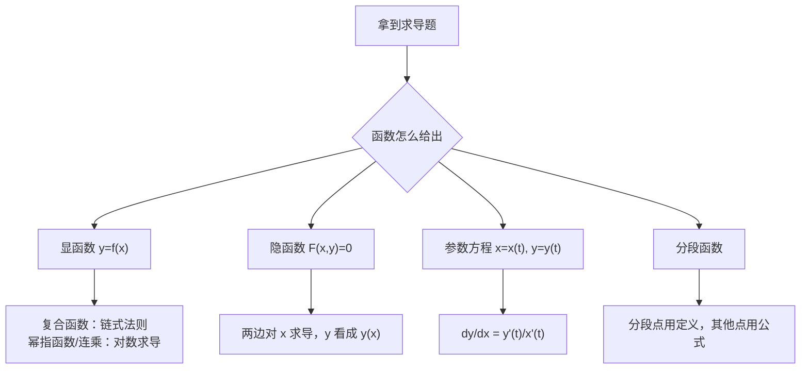

这一章分两部分：**导数定义**（考概念，选择题常设陷阱）和**求导计算**（考熟练度，后面每章都要用）。目标是：定义题不踩坑，求导题不算错。

## 一、本章地图

| 模块 | 要掌握什么 | 常见考法 |
| --- | --- | --- |
| 导数定义 | 定义式的变形、左右导数 | 选择题判断可导；用定义求导 |
| 可导性 | 可导与连续的关系、分段点、绝对值函数 | 选择、填空 |
| 求导法则 | 四则、复合、反函数 | 基本功 |
| 特殊求导 | 隐函数、参数方程、对数求导法 | 填空、解答 |
| 高阶导数 | 常见 $n$ 阶公式、莱布尼茨公式、泰勒法 | 填空 |
| 微分与应用 | 微分、切线法线、相关变化率 | 填空 |

## 二、核心概念

### 1. 导数的定义

$$
f'(x_0)=\lim_{\Delta x\to0}\frac{f(x_0+\Delta x)-f(x_0)}{\Delta x}=\lim_{x\to x_0}\frac{f(x)-f(x_0)}{x-x_0}.
$$

大白话：**导数是函数在一点处的瞬时变化率**，几何意义是切线斜率。

> [!IMPORTANT] 定义式的结构（判断题全靠它）
> 一个合法的导数定义式必须同时满足：
> 1. **一端固定**：减去的必须是 $f(x_0)$ 本身；
> 2. **另一端动**：动点 $x_0+\square$ 中的 $\square\to0$，且能**从两侧**趋于 $0$；
> 3. **分母与增量一致**：分母正好是 $\square$（或与它等价）。

### 2. 左右导数

$$
f'_-(x_0)=\lim_{x\to x_0^-}\frac{f(x)-f(x_0)}{x-x_0},\qquad f'_+(x_0)=\lim_{x\to x_0^+}\frac{f(x)-f(x_0)}{x-x_0}.
$$

$f$ 在 $x_0$ 可导 $\iff$ 左右导数都存在且相等。

### 3. 可导与连续

$$
\text{可导}\Longrightarrow\text{连续},\qquad\text{连续}\not\Longrightarrow\text{可导}.
$$

反例：$f(x)=|x|$ 在 $x=0$ 连续但不可导（左导数 $-1$，右导数 $1$，图像有尖点）。

### 4. 微分

若 $\Delta y=A\Delta x+o(\Delta x)$，则称 $f$ 在 $x_0$ **可微**，$\mathrm dy=A\Delta x$。

对一元函数：**可微 $\iff$ 可导**，且 $\mathrm dy=f'(x_0)\,\mathrm dx$。

**一阶微分形式不变性**：无论 $u$ 是自变量还是中间变量，都有 $\mathrm d f(u)=f'(u)\,\mathrm du$。这在隐函数和后面的积分换元中很有用。

## 三、必背公式

### 1. 基本导数表

$$
\begin{aligned}
&(x^a)'=ax^{a-1} && (a^x)'=a^x\ln a && (\log_a x)'=\frac{1}{x\ln a}\\
&(\sin x)'=\cos x && (\cos x)'=-\sin x && (\tan x)'=\sec^2x\\
&(\cot x)'=-\csc^2x && (\sec x)'=\sec x\tan x && (\csc x)'=-\csc x\cot x\\
&(\arcsin x)'=\frac{1}{\sqrt{1-x^2}} && (\arccos x)'=-\frac{1}{\sqrt{1-x^2}} && (\arctan x)'=\frac{1}{1+x^2}\\
&(\operatorname{arccot}x)'=-\frac{1}{1+x^2} && \left[\ln\left(x+\sqrt{x^2\pm1}\right)\right]'=\frac{1}{\sqrt{x^2\pm1}} && (\ln|x|)'=\frac1x
\end{aligned}
$$

### 2. 求导法则

$$
(uv)'=u'v+uv',\qquad\left(\frac uv\right)'=\frac{u'v-uv'}{v^2},\qquad [f(g(x))]'=f'(g(x))\,g'(x).
$$

### 3. 反函数、参数方程

> [!IMPORTANT] 必背
> 反函数：
> $$\frac{\mathrm dx}{\mathrm dy}=\frac{1}{y'},\qquad \frac{\mathrm d^2x}{\mathrm dy^2}=-\frac{y''}{(y')^3}$$
> 参数方程 $x=x(t),\ y=y(t)$：
> $$\frac{\mathrm dy}{\mathrm dx}=\frac{y'(t)}{x'(t)},\qquad \frac{\mathrm d^2y}{\mathrm dx^2}=\frac{\dfrac{\mathrm d}{\mathrm dt}\left(\dfrac{\mathrm dy}{\mathrm dx}\right)}{x'(t)}$$

### 4. 常见 n 阶导数

$$
\begin{aligned}
&(e^{ax})^{(n)}=a^ne^{ax} && (\sin x)^{(n)}=\sin\left(x+\frac{n\pi}{2}\right)\\
&(\cos x)^{(n)}=\cos\left(x+\frac{n\pi}{2}\right) && \left(\frac{1}{x+a}\right)^{(n)}=\frac{(-1)^nn!}{(x+a)^{n+1}}\\
&\left[\ln(1+x)\right]^{(n)}=\frac{(-1)^{n-1}(n-1)!}{(1+x)^n} && (x^m)^{(n)}=0\quad(n>m)
\end{aligned}
$$

### 5. 莱布尼茨公式

$$
(uv)^{(n)}=\sum_{k=0}^{n}\binom nk u^{(k)}v^{(n-k)}.
$$

形式和二项式定理一样。适用于**一个因子是多项式**的情况，因为多项式求几次导就变成 $0$，求和只剩几项。

### 6. 切线与法线

曲线 $y=f(x)$ 在 $(x_0,y_0)$ 处：

$$
\text{切线：}y-y_0=f'(x_0)(x-x_0),\qquad\text{法线：}y-y_0=-\frac{1}{f'(x_0)}(x-x_0).
$$

## 四、题型与解题套路

### 题型 1：已知极限，求导数

**识别特征**：题目给出含 $f$ 的极限，问 $f'(x_0)$。

**解法**：把所给极限**凑成导数定义的形式**。常用两个技巧：

- 先由“分母趋于 $0$、极限存在”推出 $f(x_0)$ 的值；
- 分子加一项减一项 $f(x_0)$，拆成两个定义式。

**例 1** 设 $f(x)$ 在 $x=0$ 处连续，且 $\displaystyle\lim_{x\to0}\frac{f(x)}{x}=2$，求 $f(0)$ 和 $f'(0)$。

**解** 分母 $\to0$，极限存在，所以 $\lim\limits_{x\to0}f(x)=0$；又 $f$ 连续，得 $f(0)=0$。于是

$$
f'(0)=\lim_{x\to0}\frac{f(x)-f(0)}{x}=\lim_{x\to0}\frac{f(x)}{x}=\boxed2.
$$

**例 2** 设 $f'(x_0)$ 存在，求 $\displaystyle\lim_{h\to0}\frac{f(x_0+2h)-f(x_0-h)}{h}$。

**解** 加一项减一项 $f(x_0)$：

$$
\frac{f(x_0+2h)-f(x_0)}{h}-\frac{f(x_0-h)-f(x_0)}{h}=2\cdot\frac{f(x_0+2h)-f(x_0)}{2h}+\frac{f(x_0-h)-f(x_0)}{-h}\to2f'(x_0)+f'(x_0)=\boxed{3f'(x_0)}.
$$

> [!WARNING] 这种拆法的前提
> 只有**已知 $f'(x_0)$ 存在**时才能这样拆。反过来，由这种“两端都动”的极限存在，**推不出** $f'(x_0)$ 存在，见题型 2。

### 题型 2：判断可导（选择题陷阱）

**解法**：对照“一端固定、另一端从两侧动、分母一致”三条逐一检查。

**例 3** 设 $f(0)=0$，下列哪个条件能推出 $f(x)$ 在 $x=0$ 处可导？

- (A) $\displaystyle\lim_{h\to0}\frac{f(h)-f(-h)}{2h}$ 存在
- (B) $\displaystyle\lim_{h\to0}\frac{f(1-\cos h)}{h^2}$ 存在
- (C) $\displaystyle\lim_{h\to0}\frac{f(h^3)}{h^3}$ 存在
- (D) $\displaystyle\lim_{h\to0}\frac{f(2h)-f(h)}{h}$ 存在

**解**

- (A) 两端都动，没有固定的 $f(0)$。反例：$f(x)=|x|$，分子恒为 $0$，极限存在，但 $f$ 在 $0$ 处不可导。
- (B) $1-\cos h\ge0$，动点**只从右侧**趋于 $0$，只能推出右导数 $f'_+(0)$ 存在。反例同样是 $|x|$。
- (C) $t=h^3$ 能从两侧趋于 $0$，$\dfrac{f(h^3)}{h^3}=\dfrac{f(t)-f(0)}{t}$，正好是定义式。**能推出**。
- (D) 两端都动。反例：$f(0)=0$，$x\ne0$ 时 $f(x)=1$。分子 $f(2h)-f(h)$ 恒为 $0$，极限存在，但 $f$ 在 $0$ 处不连续，更不可导。

答案为 $\boxed{\text{C}}$。

> [!TIP] 速判口诀
> 平方、$1-\cos$、$e^h-1$ 中的 $h^2$ 这类**恒非负**的增量，只能得到单侧导数；奇次幂 $h^3$、$\sin h$、$\tan h$ 这类**能取正负**的增量没问题。

### 题型 3：分段函数与绝对值函数的可导性

**解法**：

- **分段点**：必须用定义分别求左右导数，不能直接对两段公式求导后代入（除非已知导函数在该点的极限存在）。
- **含参数**：先由**连续**列一个方程，再由**左右导数相等**列一个方程。
- **绝对值**：用下面这个结论。

> [!IMPORTANT] 必背结论
> 设 $\varphi(x)$ 在 $x=a$ 处连续，则 $\varphi(x)\,|x-a|$ 在 $x=a$ 处可导 $\iff\varphi(a)=0$。

**例 4** 设 $f(x)=\begin{cases}e^x,&x\le0\\ax+b,&x>0\end{cases}$ 在 $x=0$ 处可导，求 $a,b$。

**解**

- 连续：$f(0^+)=b$，$f(0)=e^0=1$，所以 $b=1$。
- 可导：$f'_-(0)=(e^x)'\big|_{x=0}=1$，$f'_+(0)=\lim\limits_{x\to0^+}\dfrac{ax+1-1}{x}=a$，所以 $a=1$。

答案：$\boxed{a=1,\ b=1}$。

**例 5** 求 $f(x)=(x^2-x-2)\,|x^3-x|$ 的不可导点个数。

**解** $|x^3-x|=|x|\,|x-1|\,|x+1|$，可疑点为 $x=0,1,-1$。对每个点，把其余因子看成 $\varphi(x)$：

| 点 | $\varphi(x)$ | $\varphi$ 在该点的值 | 结论 |
| --- | --- | --- | --- |
| $x=0$ | $(x^2-x-2)\,\lvert x-1\rvert\,\lvert x+1\rvert$ | $-2\ne0$ | 不可导 |
| $x=1$ | $(x^2-x-2)\,\lvert x\rvert\,\lvert x+1\rvert$ | $-4\ne0$ | 不可导 |
| $x=-1$ | $(x^2-x-2)\,\lvert x\rvert\,\lvert x-1\rvert$ | $0$ | 可导 |

不可导点共 $\boxed{2}$ 个。

### 题型 4：复合函数与对数求导法

**解法**：

- 复合函数：**从外往里**一层层求导，每层乘上里一层的导数。
- **幂指函数** $u^v$、**多个因子连乘除、带根号**：先取对数再求导。

**例 6** 求 $y=x^{\sin x}\ (x>0)$ 的导数。

**解** 取对数：$\ln y=\sin x\ln x$。两边对 $x$ 求导：

$$
\frac{y'}{y}=\cos x\ln x+\frac{\sin x}{x}\ \Longrightarrow\ y'=x^{\sin x}\left(\cos x\ln x+\frac{\sin x}{x}\right).
$$

也可以直接写成 $y=e^{\sin x\ln x}$ 再按复合函数求导，结果一样。

### 题型 5：隐函数求导

**解法步骤**：

1. 方程两边同时对 $x$ 求导，**把 $y$ 看成 $x$ 的函数**，遇到 $y$ 的函数要乘 $y'$；
2. 解出 $y'$；
3. 求二阶导时，对第 1 步的式子**再求一次导**，然后代入已知的 $x,y,y'$ 的值，比先解出 $y'$ 再求导更省事。

**例 7** 设 $y=y(x)$ 由 $e^y+xy=e$ 确定，求 $y'(0)$ 和 $y''(0)$。

**解** 先求点：$x=0$ 时 $e^y=e$，得 $y(0)=1$。

两边对 $x$ 求导：

$$
e^yy'+y+xy'=0. \tag{1}
$$

代入 $x=0,\ y=1$：$ey'+1=0$，所以 $y'(0)=-\dfrac1e$。

对 (1) 再求导：

$$
e^y(y')^2+e^yy''+y'+y'+xy''=0.
$$

代入 $x=0,\ y=1,\ y'=-\frac1e$：$e\cdot\dfrac1{e^2}+ey''-\dfrac2e=0$，得 $y''(0)=\boxed{\dfrac{1}{e^2}}$。

### 题型 6：参数方程求导

**例 8** 设 $\begin{cases}x=t-\sin t\\y=1-\cos t\end{cases}$，求 $t=\dfrac\pi2$ 处的 $\dfrac{\mathrm dy}{\mathrm dx}$ 和 $\dfrac{\mathrm d^2y}{\mathrm dx^2}$。

**解** 一阶：

$$
\frac{\mathrm dy}{\mathrm dx}=\frac{\sin t}{1-\cos t}.
$$

二阶：先把一阶导数对 $t$ 求导，**再除以 $x'(t)$**：

$$
\frac{\mathrm d}{\mathrm dt}\left(\frac{\sin t}{1-\cos t}\right)=\frac{\cos t(1-\cos t)-\sin^2t}{(1-\cos t)^2}=\frac{\cos t-1}{(1-\cos t)^2}=-\frac{1}{1-\cos t},
$$

$$
\frac{\mathrm d^2y}{\mathrm dx^2}=\frac{-\frac{1}{1-\cos t}}{1-\cos t}=-\frac{1}{(1-\cos t)^2}.
$$

代入 $t=\dfrac\pi2$：$\dfrac{\mathrm dy}{\mathrm dx}=\boxed1$，$\dfrac{\mathrm d^2y}{\mathrm dx^2}=\boxed{-1}$。

> [!WARNING] 最常见的错误
> 二阶导写成 $\dfrac{y''(t)}{x''(t)}$，或者只对 $t$ 求导而忘了除以 $x'(t)$。

### 题型 7：反函数的导数

**例 9** 设 $y=x+e^x$，$x=x(y)$ 是它的反函数，求 $\dfrac{\mathrm d^2x}{\mathrm dy^2}$ 在 $x=0$ 处的值。

**解** $y'=1+e^x$，$y''=e^x$。$x=0$ 时 $y'=2$，$y''=1$，所以

$$
\frac{\mathrm d^2x}{\mathrm dy^2}=-\frac{y''}{(y')^3}=\boxed{-\frac18}.
$$

### 题型 8：高阶导数

三种方法：

| 方法 | 适用情况 |
| --- | --- |
| 套公式 | 分式先拆成部分分式；三角函数先降次、积化和差 |
| 莱布尼茨公式 | 多项式 × 另一个函数 |
| 泰勒展开 | 只求 $f^{(n)}(0)$ |

**例 10** 求 $y=\dfrac{1}{x^2-3x+2}$ 的 $n$ 阶导数。

**解** 拆分：$\dfrac{1}{(x-1)(x-2)}=\dfrac{1}{x-2}-\dfrac{1}{x-1}$，再套公式：

$$
y^{(n)}=(-1)^nn!\left[\frac{1}{(x-2)^{n+1}}-\frac{1}{(x-1)^{n+1}}\right].
$$

**例 11** 求 $y=x^2e^{2x}$ 的 $n$ 阶导数。

**解** 取 $u=x^2$（只有前 3 阶非零），$v=e^{2x}$：

$$
\begin{aligned}
y^{(n)}&=x^2\cdot2^ne^{2x}+n\cdot2x\cdot2^{n-1}e^{2x}+\frac{n(n-1)}{2}\cdot2\cdot2^{n-2}e^{2x}\\
&=2^{n-2}e^{2x}\left[4x^2+4nx+n(n-1)\right].
\end{aligned}
$$

**例 12** 设 $f(x)=x^2\ln(1+x)$，求 $f^{(n)}(0)\ (n\ge3)$。

**解** 泰勒展开中 $x^n$ 的系数等于 $\dfrac{f^{(n)}(0)}{n!}$。

$$
x^2\ln(1+x)=x^2\sum_{k=1}^{\infty}\frac{(-1)^{k-1}x^k}{k}=\sum_{k=1}^{\infty}\frac{(-1)^{k-1}x^{k+2}}{k}.
$$

$x^n$ 对应 $k=n-2$，系数为 $\dfrac{(-1)^{n-3}}{n-2}=\dfrac{(-1)^{n-1}}{n-2}$，所以

$$
f^{(n)}(0)=\boxed{\frac{(-1)^{n-1}\,n!}{n-2}}.
$$

> [!TIP] 泰勒法的核心
> $$f^{(n)}(0)=n!\times(x^n\text{ 的系数})$$
> 这比用莱布尼茨公式快得多。

### 题型 9：切线、法线与相关变化率

**例 13** 求曲线 $y=\ln x$ 过原点的切线方程。

**解** 注意“**过**原点”不代表切点是原点。设切点为 $(a,\ln a)$，切线为 $y-\ln a=\dfrac1a(x-a)$。

代入原点 $(0,0)$：$-\ln a=-1$，得 $a=e$。切线方程为 $\boxed{y=\dfrac xe}$。

> [!WARNING] 易错
> “在某点处的切线”：这个点就是切点；“过某点的切线”：这个点不一定是切点，要先设切点。

**例 14（相关变化率）** 球的半径以 $2\ \text{cm/s}$ 的速度增大，求半径为 $10\ \text{cm}$ 时体积的增长速度。

**解** $V=\dfrac43\pi r^3$，两边对时间 $t$ 求导：

$$
\frac{\mathrm dV}{\mathrm dt}=4\pi r^2\frac{\mathrm dr}{\mathrm dt}=4\pi\cdot100\cdot2=\boxed{800\pi\ \text{cm}^3/\text{s}}.
$$

套路：**先写出变量之间的关系式，再两边对时间求导**。

## 五、证明思路

### 1. 可导必连续

$$
f(x)-f(x_0)=\frac{f(x)-f(x_0)}{x-x_0}\cdot(x-x_0)\to f'(x_0)\cdot0=0.
$$

所以 $\lim\limits_{x\to x_0}f(x)=f(x_0)$，即连续。

### 2. 乘积法则

关键一步是**加一项减一项** $u(x+h)v(x)$：

$$
\frac{u(x+h)v(x+h)-u(x)v(x)}{h}=u(x+h)\frac{v(x+h)-v(x)}{h}+v(x)\frac{u(x+h)-u(x)}{h}\to uv'+u'v.
$$

这里用到 $u$ 可导所以连续，$u(x+h)\to u(x)$。

### 3. 链式法则

设 $u=g(x)$，$y=f(u)$。直观上：

$$
\frac{\Delta y}{\Delta x}=\frac{\Delta y}{\Delta u}\cdot\frac{\Delta u}{\Delta x}\to f'(u)\,g'(x).
$$

严格证明还要处理 $\Delta u=0$ 的情况，考试不要求。

### 4. 反函数与参数方程的二阶导

都是链式法则：

- 反函数：$\dfrac{\mathrm dx}{\mathrm dy}=\dfrac1{y'(x)}$ 是 $x$ 的函数，对 $y$ 求导要乘 $\dfrac{\mathrm dx}{\mathrm dy}$：
  $$\frac{\mathrm d^2x}{\mathrm dy^2}=\frac{\mathrm d}{\mathrm dx}\left(\frac1{y'}\right)\cdot\frac{\mathrm dx}{\mathrm dy}=-\frac{y''}{(y')^2}\cdot\frac{1}{y'}=-\frac{y''}{(y')^3}.$$
- 参数方程：$\dfrac{\mathrm dy}{\mathrm dx}$ 是 $t$ 的函数，对 $x$ 求导要乘 $\dfrac{\mathrm dt}{\mathrm dx}=\dfrac1{x'(t)}$，所以二阶导是“对 $t$ 求导，再除以 $x'(t)$”。

### 5. 绝对值结论 $\varphi(x)|x-a|$

$$
\lim_{x\to a^\pm}\frac{\varphi(x)|x-a|-0}{x-a}=\pm\varphi(a).
$$

左右导数分别为 $-\varphi(a)$ 和 $\varphi(a)$，两者相等当且仅当 $\varphi(a)=0$。

### 6. 莱布尼茨公式

对 $n$ 用数学归纳法。$(uv)'=u'v+uv'$ 每求一次导，就相当于把“导数次数”分给 $u$ 或 $v$，系数的组合规律与 $(a+b)^n$ 展开完全相同，所以系数是 $\dbinom nk$。

## 六、易错点

> [!CAUTION] 导函数在一点的极限 ≠ 该点的导数
> $f(x)=\begin{cases}x^2\sin\frac1x,&x\ne0\\0,&x=0\end{cases}$
>
> 用定义：$f'(0)=\lim\limits_{x\to0}x\sin\frac1x=0$，可导。
>
> 但 $x\ne0$ 时 $f'(x)=2x\sin\frac1x-\cos\frac1x$，$\lim\limits_{x\to0}f'(x)$ 不存在。
>
> 所以：**分段点的导数必须用定义求**；“可导”不代表“导函数连续”。

- **判断可导时漏掉“一端固定”**：$\dfrac{f(x_0+h)-f(x_0-h)}{2h}$ 极限存在不能推出可导。
- **增量只从一侧趋于 $0$**：$f(h^2)$、$f(1-\cos h)$ 只能得到单侧导数。
- **分段点只检查可导，不检查连续**：含参数时要先用连续列方程。
- **参数方程二阶导忘记除以 $x'(t)$**。
- **隐函数忘记乘 $y'$**：$(e^y)'=e^yy'$，不是 $e^y$。
- **$|f(x)|$ 的可导性**：若 $f(x_0)=0$ 且 $f'(x_0)\ne0$，则 $|f(x)|$ 在 $x_0$ 不可导。
- **“过某点”的切线**当成以该点为切点。

## 七、小练习

**1.** 设曲线 $y=f(x)$ 满足 $\displaystyle\lim_{x\to0}\frac{f(1)-f(1-x)}{2x}=-1$，求曲线在点 $(1,f(1))$ 处的切线斜率。

点击查看答案

$\dfrac{f(1)-f(1-x)}{2x}=\dfrac12\cdot\dfrac{f(1-x)-f(1)}{-x}\to\dfrac12f'(1)=-1$，所以斜率 $f'(1)=-2$。

**2.** 设 $y=y(x)$ 由 $y=1+xe^y$ 确定，求 $y'(0)$。

点击查看答案

$x=0$ 时 $y=1$。两边求导：$y'=e^y+xe^yy'$。代入 $x=0,\ y=1$：$y'(0)=e$。

**3.** 设 $\begin{cases}x=\ln(1+t^2)\\y=t-\arctan t\end{cases}$，求 $\dfrac{\mathrm dy}{\mathrm dx}$ 和 $\dfrac{\mathrm d^2y}{\mathrm dx^2}$。

点击查看答案

$x'(t)=\dfrac{2t}{1+t^2}$，$y'(t)=1-\dfrac1{1+t^2}=\dfrac{t^2}{1+t^2}$，所以 $\dfrac{\mathrm dy}{\mathrm dx}=\dfrac t2$。

$\dfrac{\mathrm d^2y}{\mathrm dx^2}=\dfrac{\frac12}{\frac{2t}{1+t^2}}=\dfrac{1+t^2}{4t}$。

**4.** 求 $y=\sin^2x$ 的 $n$ 阶导数。

点击查看答案

先降次：$\sin^2x=\dfrac{1-\cos2x}{2}$。所以

$$y^{(n)}=-\frac12\cdot2^n\cos\left(2x+\frac{n\pi}2\right)=-2^{n-1}\cos\left(2x+\frac{n\pi}2\right).$$

**5.** 求 $f(x)=(x^2-1)\,|x^2-3x+2|$ 的不可导点。

点击查看答案

$|x^2-3x+2|=|x-1|\,|x-2|$，可疑点为 $x=1,2$。

- $x=1$：$\varphi(x)=(x^2-1)|x-2|$，$\varphi(1)=0$，**可导**。
- $x=2$：$\varphi(x)=(x^2-1)|x-1|$，$\varphi(2)=3\ne0$，**不可导**。

所以只有 $x=2$ 一个不可导点。

## 八、本章小结

- 导数定义三要素：**一端固定、另一端从两侧动、分母一致**。判断题逐条核对。
- 分段点用**定义**求导；含参数先用**连续**、再用**左右导数相等**列方程。
- $\varphi(x)|x-a|$ 在 $a$ 处可导 $\iff\varphi(a)=0$。
- 幂指函数和连乘除用**对数求导法**；隐函数两边对 $x$ 求导，**$y$ 的函数要乘 $y'$**。
- 参数方程二阶导：**对 $t$ 求导，再除以 $x'(t)$**。
- 高阶导数：拆分/降次后套公式，多项式乘积用**莱布尼茨**，只求 $f^{(n)}(0)$ 用**泰勒**。

下一篇：**03 微分中值定理**。
