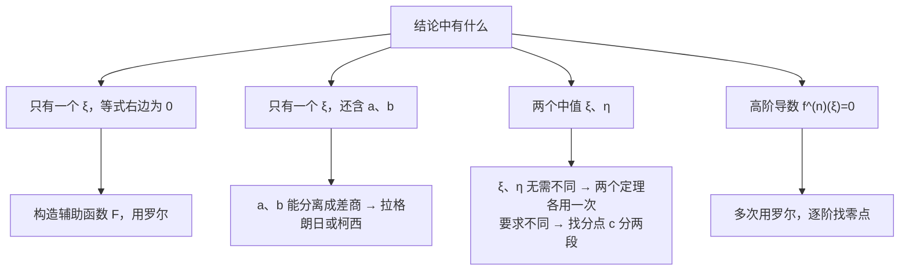

数一几乎每年都有一道和中值定理相关的证明题。很多人觉得证明题无从下手，其实常考的类型很固定：**看结论的形状，选对定理，造对辅助函数**。这一章就把这几种套路讲清楚。

## 一、本章地图

| 模块 | 要掌握什么 | 常见考法 |
| --- | --- | --- |
| 四个定理 | 费马、罗尔、拉格朗日、柯西的条件与结论 | 选择题判断条件 |
| 构造辅助函数 | 还原法、常用辅助函数表 | 解答题证明 $\exists\,\xi$ |
| 多次罗尔 | 证明高阶导数有零点 | 解答题 |
| 双中值 | 证明 $\exists\,\xi,\eta$ | 解答题 |
| 拉格朗日的应用 | 证明不等式、求极限、证明恒等式 | 解答、填空 |

拿到证明题，先看结论：

## 二、核心概念

### 1. 费马引理

若 $f$ 在 $x_0$ 处**可导**，且 $x_0$ 是**极值点**，则 $f'(x_0)=0$。

大白话：光滑曲线在山顶或谷底的切线是水平的。

### 2. 罗尔定理

若 $f$ 满足：

1. 在 $[a,b]$ 上连续；
2. 在 $(a,b)$ 内可导；
3. $f(a)=f(b)$，

则存在 $\xi\in(a,b)$，使 $f'(\xi)=0$。

### 3. 拉格朗日中值定理

若 $f$ 在 $[a,b]$ 上连续，在 $(a,b)$ 内可导，则存在 $\xi\in(a,b)$，使

$$
f(b)-f(a)=f'(\xi)(b-a).
$$

几何意义：曲线上一定有一点的切线**平行于连接两端点的弦**。

常用的等价写法：令 $\xi=a+\theta(b-a)$，$0<\theta<1$，则

$$
f(b)-f(a)=f'\bigl(a+\theta(b-a)\bigr)(b-a).
$$

### 4. 柯西中值定理

若 $f,g$ 在 $[a,b]$ 上连续，在 $(a,b)$ 内可导，且 $g'(x)\ne0$，则存在 $\xi\in(a,b)$，使

$$
\frac{f(b)-f(a)}{g(b)-g(a)}=\frac{f'(\xi)}{g'(\xi)}.
$$

取 $g(x)=x$ 就是拉格朗日；拉格朗日中再加 $f(a)=f(b)$ 就是罗尔。所以三者是**由特殊到一般**的关系：

$$
\text{罗尔}\subset\text{拉格朗日}\subset\text{柯西}.
$$

### 5. 两个推论

- 若在区间 $I$ 上 $f'(x)\equiv0$，则 $f$ 在 $I$ 上是**常数**。
- 若在区间 $I$ 上 $f'(x)\equiv g'(x)$，则 $f(x)=g(x)+C$。

### 6. 零点个数的结论

- 若 $f$ 有 $n$ 个不同零点，则 $f'$ 至少有 $n-1$ 个零点（相邻零点之间用罗尔）。
- 反过来，若 $f^{(n)}(x)\ne0$，则 $f$ **至多**有 $n$ 个零点。

## 三、必背公式

> [!IMPORTANT] 三个定理的结论
> $$\text{罗尔：}f'(\xi)=0\qquad\text{拉格朗日：}\frac{f(b)-f(a)}{b-a}=f'(\xi)\qquad\text{柯西：}\frac{f(b)-f(a)}{g(b)-g(a)}=\frac{f'(\xi)}{g'(\xi)}$$
> 条件统一记为：**闭区间连续，开区间可导**。罗尔再加端点值相等，柯西再加 $g'\ne0$。

> [!IMPORTANT] 常用辅助函数表
> | 要证的结论 | 辅助函数 $F(x)$ |
> | --- | --- |
> | $f'(\xi)+\lambda f(\xi)=0$ | $e^{\lambda x}f(x)$ |
> | $f'(\xi)+g'(\xi)f(\xi)=0$ | $e^{g(x)}f(x)$ |
> | $\xi f'(\xi)+kf(\xi)=0$ | $x^kf(x)$ |
> | $f'(\xi)g(\xi)+f(\xi)g'(\xi)=0$ | $f(x)g(x)$ |
> | $f'(\xi)g(\xi)-f(\xi)g'(\xi)=0$ | $\dfrac{f(x)}{g(x)}$ |
> | $f'(\xi)=k$ | $f(x)-kx$ |
> | 多项式方程 $p(\xi)=0$ 有根 | $p$ 的一个原函数 |

最常用的是前三行，它们本质是同一件事：**乘一个因子，让左边变成某个函数的导数**。

## 四、题型与解题套路

### 题型 1：直接用罗尔，证明 $f'(\xi)=0$

**解法**：找两个函数值相等的点。如果题目没直接给，常用**介值定理**或**积分中值定理**先造出一个点。

**例 1** 设 $f$ 在 $[0,3]$ 上连续，在 $(0,3)$ 内可导，且 $f(0)+f(1)+f(2)=3$，$f(3)=1$。证明存在 $\xi\in(0,3)$，使 $f'(\xi)=0$。

**证** 已有 $f(3)=1$，只需在 $[0,2]$ 上再找一个点 $c$ 使 $f(c)=1$。

$f$ 在 $[0,2]$ 上连续，有最大值 $M$ 和最小值 $m$，于是

$$
m\le\frac{f(0)+f(1)+f(2)}{3}=1\le M.
$$

由介值定理，存在 $c\in[0,2]$ 使 $f(c)=1=f(3)$。在 $[c,3]$ 上用罗尔，存在 $\xi\in(c,3)\subset(0,3)$，使 $f'(\xi)=0$。

> [!TIP] 平均值套路
> 看到“几个函数值之和等于某个数”，就用**最值 + 介值定理**：平均值一定夹在最小值和最大值之间。

### 题型 2：构造辅助函数（还原法）

**识别特征**：结论是“存在 $\xi$，使含 $f(\xi)$、$f'(\xi)$ 的式子等于 $0$”。

**解法步骤（还原法）**：

1. 把 $\xi$ 换成 $x$，得到一个关于 $f,f'$ 的等式；
2. 把它看成微分方程，**解出来写成 $F(x)=C$ 的形式**，这个 $F$ 就是辅助函数；
3. 验证 $F$ 在区间两端的值相等，用罗尔。

**例 2** 设 $f$ 在 $[0,1]$ 上连续，在 $(0,1)$ 内可导，且 $f(1)=0$。证明存在 $\xi\in(0,1)$，使

$$
\xi f'(\xi)+2f(\xi)=0.
$$

**分析** 还原：$xf'(x)+2f(x)=0$。两边乘 $x$ 得 $x^2f'(x)+2xf(x)=0$，即 $\bigl(x^2f(x)\bigr)'=0$。所以取 $F(x)=x^2f(x)$。

**证** 令 $F(x)=x^2f(x)$，则 $F(0)=0$，$F(1)=f(1)=0$。由罗尔，存在 $\xi\in(0,1)$，使

$$
F'(\xi)=2\xi f(\xi)+\xi^2f'(\xi)=\xi\bigl[2f(\xi)+\xi f'(\xi)\bigr]=0.
$$

因为 $\xi\ne0$，所以 $\xi f'(\xi)+2f(\xi)=0$。

**例 3** 设 $f$ 在 $[0,1]$ 上连续，在 $(0,1)$ 内可导，$f(0)=f(1)=0$，$f\left(\frac12\right)=1$。证明：

1. 存在 $\eta\in\left(\frac12,1\right)$，使 $f(\eta)=\eta$；
2. 对任意实数 $\lambda$，存在 $\xi\in(0,\eta)$，使 $f'(\xi)-\lambda\bigl[f(\xi)-\xi\bigr]=1$。

**证** (1) 令 $\varphi(x)=f(x)-x$。$\varphi\left(\frac12\right)=\frac12>0$，$\varphi(1)=-1<0$，由零点定理，存在 $\eta\in\left(\frac12,1\right)$ 使 $\varphi(\eta)=0$，即 $f(\eta)=\eta$。

(2) 把结论改写为 $\bigl[f'(\xi)-1\bigr]-\lambda\bigl[f(\xi)-\xi\bigr]=0$，即 $\varphi'(\xi)-\lambda\varphi(\xi)=0$。

这是辅助函数表第一行（$\lambda$ 换成 $-\lambda$），取 $F(x)=e^{-\lambda x}\varphi(x)=e^{-\lambda x}\bigl[f(x)-x\bigr]$。

$F(0)=0$，$F(\eta)=e^{-\lambda\eta}\varphi(\eta)=0$。由罗尔，存在 $\xi\in(0,\eta)$，使

$$
F'(\xi)=e^{-\lambda\xi}\bigl[\varphi'(\xi)-\lambda\varphi(\xi)\bigr]=0.
$$

$e^{-\lambda\xi}\ne0$，所以 $f'(\xi)-1-\lambda\bigl[f(\xi)-\xi\bigr]=0$，得证。

> [!TIP] 第 (1) 问通常是第 (2) 问的铺垫
> 第 (1) 问找到的 $\eta$，往往就是第 (2) 问罗尔定理要用的一个端点。

### 题型 3：多项式方程有根（原函数法）

**识别特征**：证明某个方程在区间内有根，直接用零点定理找不到异号的点。

**解法**：把方程左边看成某个函数的导数，**取原函数作辅助函数**，用罗尔。

**例 4** 设 $a+b+c=0$。证明方程 $3ax^2+2bx+c=0$ 在 $(0,1)$ 内至少有一个根。

**证** $3ax^2+2bx+c$ 的一个原函数是 $F(x)=ax^3+bx^2+cx$。

$F(0)=0$，$F(1)=a+b+c=0$。由罗尔，存在 $\xi\in(0,1)$，使 $F'(\xi)=3a\xi^2+2b\xi+c=0$。

### 题型 4：多次用罗尔，证明高阶导数有零点

**解法**：先找 $f$ 的零点（或相等的函数值），用罗尔得到 $f'$ 的零点，再对 $f'$ 用罗尔，逐阶往上推。

**例 5** 设 $f$ 在 $[0,3]$ 上二阶可导，且 $f(0)=f(1)=f(3)=0$。证明存在 $\xi\in(0,3)$，使 $f''(\xi)=0$。

**证** 在 $[0,1]$ 和 $[1,3]$ 上分别用罗尔，得 $\xi_1\in(0,1)$，$\xi_2\in(1,3)$，使 $f'(\xi_1)=f'(\xi_2)=0$。

再对 $f'$ 在 $[\xi_1,\xi_2]$ 上用罗尔，得 $\xi\in(\xi_1,\xi_2)\subset(0,3)$，使 $f''(\xi)=0$。

**例 6** 求 $f(x)=x(x-1)(x-2)(x-3)$ 的导函数 $f'(x)=0$ 的实根个数。

**解** $f$ 有 4 个零点 $0,1,2,3$。在 $[0,1]$、$[1,2]$、$[2,3]$ 上分别用罗尔，$f'$ 至少有 3 个根。

又 $f'$ 是三次多项式，至多 3 个根。所以 $f'(x)=0$ 恰有 $\boxed3$ 个实根。

### 题型 5：结论中含 $a,b$（拉格朗日或柯西）

**识别特征**：结论里只有一个 $\xi$，但同时出现 $f(a)$、$f(b)$ 或 $a,b$。

**解法**：

1. 把含 $\xi$ 的部分移到一边，含 $a,b$ 的部分移到另一边；
2. 若 $a,b$ 一边能写成 $\dfrac{f(b)-f(a)}{b-a}$，用拉格朗日；
3. 若能写成 $\dfrac{f(b)-f(a)}{g(b)-g(a)}$，用柯西，关键是**认出 $g$**。

**例 7** 设 $0<a<b$，$f$ 在 $[a,b]$ 上连续，在 $(a,b)$ 内可导。证明存在 $\xi\in(a,b)$，使

$$
f(b)-f(a)=\xi f'(\xi)\ln\frac ba.
$$

**分析** 分离：$\dfrac{f(b)-f(a)}{\ln b-\ln a}=\xi f'(\xi)=\dfrac{f'(\xi)}{1/\xi}$。右边正是 $f'$ 除以 $(\ln x)'$，所以 $g(x)=\ln x$。

**证** 取 $g(x)=\ln x$，在 $[a,b]$ 上 $g'(x)=\frac1x\ne0$。由柯西中值定理，存在 $\xi\in(a,b)$，使

$$
\frac{f(b)-f(a)}{\ln b-\ln a}=\frac{f'(\xi)}{1/\xi}=\xi f'(\xi),
$$

整理即得结论。

### 题型 6：双中值问题

**情况一：$\xi,\eta$ 不要求不同。** 一般是对**同一个区间**用两次中值定理（常见组合：拉格朗日 + 柯西），然后把两个式子中相同的部分消掉。

**例 8** 设 $0<a<b$，$f$ 在 $[a,b]$ 上连续，在 $(a,b)$ 内可导。证明存在 $\xi,\eta\in(a,b)$，使

$$
f'(\xi)=\frac{a+b}{2\eta}f'(\eta).
$$

**证** 右边有 $\dfrac{f'(\eta)}{2\eta}$，这是 $f'$ 除以 $(x^2)'$，对 $f$ 和 $g(x)=x^2$ 用柯西：

$$
\frac{f(b)-f(a)}{b^2-a^2}=\frac{f'(\eta)}{2\eta}.
$$

再对 $f$ 用拉格朗日：$f(b)-f(a)=f'(\xi)(b-a)$。代入上式：

$$
\frac{f'(\xi)(b-a)}{(b-a)(b+a)}=\frac{f'(\eta)}{2\eta}\ \Longrightarrow\ f'(\xi)=\frac{a+b}{2\eta}f'(\eta).
$$

**情况二：要求 $\xi\ne\eta$。** 这时必须**找一个分点 $c$**，在 $[a,c]$ 和 $[c,b]$ 上各用一次拉格朗日，两个中值自然落在不同区间。

**例 9** 设 $f$ 在 $[0,1]$ 上连续，在 $(0,1)$ 内可导，$f(0)=0$，$f(1)=1$。证明：

1. 存在 $c\in(0,1)$，使 $f(c)=1-c$；
2. 存在两个不同的点 $\xi,\eta\in(0,1)$，使 $f'(\xi)f'(\eta)=1$。

**证** (1) 令 $\varphi(x)=f(x)-1+x$，$\varphi(0)=-1<0$，$\varphi(1)=1>0$，由零点定理得 $c$。

(2) 在 $[0,c]$ 和 $[c,1]$ 上分别用拉格朗日：

$$
f'(\xi)=\frac{f(c)-f(0)}{c}=\frac{1-c}{c},\qquad f'(\eta)=\frac{f(1)-f(c)}{1-c}=\frac{c}{1-c}.
$$

其中 $\xi\in(0,c)$，$\eta\in(c,1)$，所以 $\xi\ne\eta$，且 $f'(\xi)f'(\eta)=1$。

> [!TIP] 分点 $c$ 怎么找
> 先写出 $f'(\xi)f'(\eta)=\dfrac{f(c)}{c}\cdot\dfrac{1-f(c)}{1-c}$，看要让它等于 $1$，$f(c)$ 应该取什么值。这里 $f(c)=1-c$ 正好使分子分母约掉。题目第 (1) 问往往直接把分点给你了。

### 题型 7：用拉格朗日证明不等式

**识别特征**：不等式中出现 $f(b)-f(a)$ 的形式，或者能整理成这种形式。

**解法**：用拉格朗日把差变成 $f'(\xi)(b-a)$，再利用 $a<\xi<b$ 对 $f'(\xi)$ 放缩。

**例 10** 设 $0<a<b$，证明

$$
\frac{b-a}{b}<\ln\frac ba<\frac{b-a}{a}.
$$

**证** 对 $f(x)=\ln x$ 在 $[a,b]$ 上用拉格朗日：

$$
\ln b-\ln a=\frac{1}{\xi}(b-a),\qquad a<\xi<b.
$$

由 $\dfrac1b<\dfrac1\xi<\dfrac1a$，各乘 $b-a>0$ 即得结论。

### 题型 8：用拉格朗日求极限

**识别特征**：极限中出现**同一个函数在两点处的差**，如 $f(\square_1)-f(\square_2)$。

**例 11** 求 $\displaystyle\lim_{x\to+\infty}x^2\left[\arctan\frac{a}{x}-\arctan\frac{a}{x+1}\right]$（$a\ne0$）。

**解** 对 $\arctan t$ 在 $\frac{a}{x+1}$ 与 $\frac ax$ 之间用拉格朗日：

$$
\arctan\frac ax-\arctan\frac a{x+1}=\frac{1}{1+\xi^2}\left(\frac ax-\frac a{x+1}\right)=\frac{1}{1+\xi^2}\cdot\frac{a}{x(x+1)},
$$

$\xi$ 夹在两个都趋于 $0$ 的数之间，所以 $\xi\to0$。于是

$$
\text{原式}=\lim_{x\to+\infty}\frac{1}{1+\xi^2}\cdot\frac{ax^2}{x(x+1)}=\boxed a.
$$

### 题型 9：证明恒等式

**解法**：令 $F(x)=$ 左边 $-$ 右边，证明 $F'(x)\equiv0$，再代一个特殊点求出常数。

**例 12** 证明 $\arcsin x+\arccos x=\dfrac\pi2$，$x\in[-1,1]$。

**证** 令 $F(x)=\arcsin x+\arccos x$。在 $(-1,1)$ 内

$$
F'(x)=\frac{1}{\sqrt{1-x^2}}-\frac{1}{\sqrt{1-x^2}}=0,
$$

所以 $F(x)\equiv C$。取 $x=0$ 得 $C=\dfrac\pi2$。端点 $x=\pm1$ 直接代入验证也成立。

## 五、证明思路

### 1. 费马引理

设 $x_0$ 是极大值点，在 $x_0$ 附近 $f(x)\le f(x_0)$，所以

$$
\frac{f(x)-f(x_0)}{x-x_0}\begin{cases}\ge0,&x<x_0\\\le0,&x>x_0\end{cases}
$$

由极限的保号性，$f'_-(x_0)\ge0$，$f'_+(x_0)\le0$。又因为可导，两者相等，只能等于 $0$。

### 2. 罗尔定理

$f$ 在 $[a,b]$ 上连续，必有最大值 $M$ 和最小值 $m$。

- 若 $M=m$，$f$ 是常数，任取 $\xi$ 都有 $f'(\xi)=0$。
- 若 $M>m$，由于 $f(a)=f(b)$，$M$ 和 $m$ 至少有一个在**区间内部**取到，该点是极值点，由费马引理导数为 $0$。

### 3. 拉格朗日：从 $f$ 中减去弦

弦的方程是 $L(x)=f(a)+\dfrac{f(b)-f(a)}{b-a}(x-a)$。令 $F(x)=f(x)-L(x)$，则 $F(a)=F(b)=0$。由罗尔，存在 $\xi$ 使

$$
F'(\xi)=f'(\xi)-\frac{f(b)-f(a)}{b-a}=0.
$$

直观上，就是把图像“扳平”，使两端等高，再用罗尔。

### 4. 柯西：同样的思路

令 $F(x)=f(x)-\dfrac{f(b)-f(a)}{g(b)-g(a)}g(x)$，可以验证 $F(a)=F(b)$，用罗尔即得。

> [!WARNING] 不能用两次拉格朗日证明柯西
> 分别对 $f$、$g$ 用拉格朗日，得到的是 $\dfrac{f'(\xi_1)}{g'(\xi_2)}$，两个中值一般**不相同**，推不出柯西。

### 5. 还原法为什么有效

以 $f'(x)+\lambda f(x)=0$ 为例，把它当作微分方程来解：

$$
\frac{f'}{f}=-\lambda\ \Longrightarrow\ \ln|f|=-\lambda x+C\ \Longrightarrow\ e^{\lambda x}f(x)=C.
$$

这说明 $\bigl(e^{\lambda x}f(x)\bigr)'=e^{\lambda x}\bigl[f'(x)+\lambda f(x)\bigr]$，正好包含要证的式子。乘上的 $e^{\lambda x}$ 恒不为 $0$，所以 $F'(\xi)=0$ 就等价于结论成立。$x^kf(x)$ 也是同样的道理。

## 六、易错点

> [!CAUTION] 中值 $\xi$ 依赖于区间
> 拉格朗日中的 $\xi$ 随 $a,b$（或 $x$）变化而变化，**不是常数**。求极限时只能用夹逼说明 $\xi$ 的去向，例如 $\xi$ 夹在两个趋于 $0$ 的量之间，所以 $\xi\to0$。不能把 $\xi$ 当作常数提出去，也不能对它随意求导。

- **条件不全**：三个定理都要求“闭区间连续、开区间可导”，选择题常把其中一个去掉。例如 $f(x)=|x|$ 在 $[-1,1]$ 上 $f(-1)=f(1)$，但 $x=0$ 不可导，不存在 $f'(\xi)=0$。
- **$\xi$ 的范围**：结论中 $\xi$ 在**开区间**内，写证明时不要写成闭区间。
- **罗尔定理的逆命题不成立**：$f'(\xi)=0$ 不能推出 $f(a)=f(b)$。
- **导数为 $0$ 不一定是极值点**：$f(x)=x^3$ 在 $x=0$ 处导数为 $0$，但不是极值点。费马引理只说“极值点处导数为 $0$”。
- **双中值要求不同时只用一个区间**：两个中值可能重合，必须分段。
- **构造辅助函数后忘了说明因子不为 $0$**：例如例 2 要说明 $\xi\ne0$，例 3 要说明 $e^{-\lambda\xi}\ne0$。

## 七、小练习

**1.** 证明对任意实数 $a,b$，$|\sin a-\sin b|\le|a-b|$。

点击查看答案

$a=b$ 时显然成立。$a\ne b$ 时，对 $\sin x$ 用拉格朗日：$\sin a-\sin b=\cos\xi\,(a-b)$。由 $|\cos\xi|\le1$ 得 $|\sin a-\sin b|\le|a-b|$。

**2.** 设 $f$ 在 $[0,1]$ 上连续，在 $(0,1)$ 内可导，$f(1)=0$。证明存在 $\xi\in(0,1)$，使 $f'(\xi)=-\dfrac{f(\xi)}{\xi}$。

点击查看答案

结论即 $\xi f'(\xi)+f(\xi)=0$，对应辅助函数表中 $k=1$ 的情况。令 $F(x)=xf(x)$，$F(0)=0$，$F(1)=f(1)=0$。由罗尔，存在 $\xi\in(0,1)$ 使 $F'(\xi)=f(\xi)+\xi f'(\xi)=0$。

**3.** 设 $f$ 在 $[a,b]$ 上连续，在 $(a,b)$ 内可导，$f(a)=f(b)=0$。证明存在 $\xi\in(a,b)$，使 $f'(\xi)=f(\xi)$。

点击查看答案

结论即 $f'(\xi)-f(\xi)=0$，对应 $\lambda=-1$，令 $F(x)=e^{-x}f(x)$。$F(a)=F(b)=0$，由罗尔，存在 $\xi$ 使

$$F'(\xi)=e^{-\xi}\bigl[f'(\xi)-f(\xi)\bigr]=0.$$

$e^{-\xi}\ne0$，所以 $f'(\xi)=f(\xi)$。

**4.** 设 $f$ 在 $[a,b]$ 上二阶可导，$f(a)=f(b)=0$，且存在 $c\in(a,b)$ 使 $f(c)>0$。证明存在 $\xi\in(a,b)$，使 $f''(\xi)<0$。

点击查看答案

在 $[a,c]$ 和 $[c,b]$ 上分别用拉格朗日：

$$f'(\xi_1)=\frac{f(c)-f(a)}{c-a}>0,\qquad f'(\xi_2)=\frac{f(b)-f(c)}{b-c}<0,$$

其中 $a<\xi_1<c<\xi_2<b$。再对 $f'$ 在 $[\xi_1,\xi_2]$ 上用拉格朗日：

$$f''(\xi)=\frac{f'(\xi_2)-f'(\xi_1)}{\xi_2-\xi_1}<0.$$

**5.** 设 $a>0$，证明方程 $x^3+ax-1=0$ 在 $(0,1)$ 内恰有一个实根。

点击查看答案

**存在**：令 $f(x)=x^3+ax-1$，$f(0)=-1<0$，$f(1)=a>0$，由零点定理至少有一个根。

**唯一**：若有两个根 $x_1<x_2$，则 $f(x_1)=f(x_2)=0$，由罗尔存在 $\xi$ 使 $f'(\xi)=0$。但 $f'(x)=3x^2+a>0$，矛盾。所以恰有一个实根。

## 八、本章小结

- 三个定理的条件都是**闭区间连续、开区间可导**；罗尔 ⊂ 拉格朗日 ⊂ 柯西。
- 结论只有 $\xi$ 且等于 $0$：用**还原法**造辅助函数，再用罗尔。最常用 $e^{\lambda x}f(x)$ 和 $x^kf(x)$。
- 结论含 $a,b$：分离后认出差商，用**拉格朗日**；认出 $\dfrac{f'}{g'}$，用**柯西**。
- 双中值：不要求不同，同一区间用两次定理；要求不同，**找分点**分两段。
- 高阶导数有零点：**多次罗尔**，逐阶找零点。
- 拉格朗日还能**证明不等式**（对 $f'(\xi)$ 放缩）、**求极限**（处理同一函数在两点的差）。

下一篇：**04 导数的应用**（洛必达、泰勒公式、单调性与极值、凹凸性、渐近线、不等式证明）。
