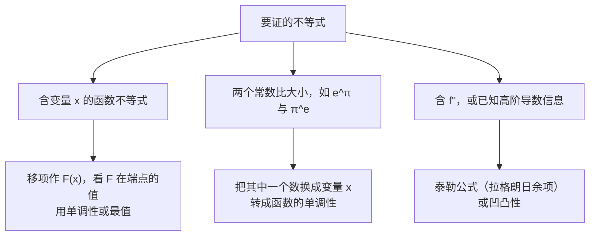

上一篇的中值定理是“工具”，这一篇是用这些工具研究函数：**函数在哪里增减、哪里取极值、图像怎么弯、往远处怎么走**。最后落到两类常考大题：**证明不等式**和**讨论方程根的个数**。

## 一、本章地图

| 模块 | 要掌握什么 | 常见考法 |
| --- | --- | --- |
| 洛必达法则 | 条件、与等价替换配合 | 求极限 |
| 泰勒公式 | 佩亚诺余项、拉格朗日余项 | 求极限、证明题 |
| 单调性与极值 | 单调区间、极值的三种判别法 | 选择、填空、解答 |
| 最值 | 闭区间最值、唯一驻点 | 填空、应用题 |
| 凹凸性与拐点 | 二阶导数判别 | 选择、填空 |
| 渐近线 | 水平、铅直、斜渐近线 | 选择题数条数 |
| 曲率 | 曲率公式、曲率半径 | 填空（数一） |
| 不等式与根的个数 | 构造函数、研究单调性和最值 | 解答题 |

证明不等式选方法：

## 二、核心概念

### 1. 洛必达法则

若 $x\to x_0$（或 $x\to\infty$）时：

1. $f(x)$ 与 $g(x)$ 同时趋于 $0$，或同时趋于 $\infty$；
2. $f,g$ 在 $x_0$ 的去心邻域内可导，且 $g'(x)\ne0$；
3. $\lim\dfrac{f'(x)}{g'(x)}$ 存在，或为 $\infty$，

则

$$
\lim\frac{f(x)}{g(x)}=\lim\frac{f'(x)}{g'(x)}.
$$

> [!IMPORTANT] 用洛必达前先做两件事
> 1. **先化简**：能代入的非零因子先代入，能等价替换的先替换。
> 2. **每求一次导都要重新判断类型**：不再是 0/0 或 ∞/∞ 就停下。

### 2. 泰勒公式

设 $f$ 在 $x_0$ 附近有足够阶的导数，则

$$
f(x)=\sum_{k=0}^{n}\frac{f^{(k)}(x_0)}{k!}(x-x_0)^k+R_n(x).
$$

余项有两种写法：

| 余项 | 形式 | 条件 | 用途 |
| --- | --- | --- | --- |
| 佩亚诺余项 | $R_n(x)=o\bigl((x-x_0)^n\bigr)$ | $f$ 在 $x_0$ 处 $n$ 阶可导 | **局部**：求极限、判断阶、判断极值 |
| 拉格朗日余项 | $R_n(x)=\dfrac{f^{(n+1)}(\xi)}{(n+1)!}(x-x_0)^{n+1}$，$\xi$ 在 $x_0$ 与 $x$ 之间 | $f$ 有 $n+1$ 阶导数 | **整体**：证明不等式、估计误差 |

$x_0=0$ 时称为**麦克劳林公式**，第 01 篇的常用展开式就是它。

大白话：泰勒公式就是**用多项式去逼近函数**。$n=0$ 时的拉格朗日余项形式就是拉格朗日中值定理。

### 3. 单调性

在区间 $I$ 内，$f'(x)>0\Rightarrow f$ 单调增；$f'(x)<0\Rightarrow f$ 单调减。

个别点处 $f'(x)=0$ 不影响单调性。例如 $x^3$ 在 $x=0$ 处导数为 $0$，但它在整个实数轴上单调增。

### 4. 极值

若在 $x_0$ 的某个去心邻域内 $f(x)<f(x_0)$，称 $f(x_0)$ 为**极大值**；反之为极小值。极值是**局部**概念。

极值点只可能出现在两类点：

- **驻点**：$f'(x_0)=0$；
- **不可导点**。

判断这些候选点是不是极值点，有三种方法：

| 方法 | 条件 | 结论 |
| --- | --- | --- |
| 第一充分条件 | $f'$ 在 $x_0$ 两侧变号 | 左正右负为极大，左负右正为极小 |
| 第二充分条件 | $f'(x_0)=0$，$f''(x_0)\ne0$ | $f''(x_0)<0$ 极大，$f''(x_0)>0$ 极小 |
| 高阶判别法 | $f'(x_0)=\cdots=f^{(n-1)}(x_0)=0$，$f^{(n)}(x_0)\ne0$ | $n$ 为偶数时是极值点（$f^{(n)}>0$ 极小）；$n$ 为奇数时不是 |

例如 $x^4$ 在 $x=0$ 处：前三阶导数为 $0$，$f^{(4)}(0)=24>0$，$n=4$ 为偶数，是极小值点。$x^3$ 在 $x=0$ 处：$n=3$ 为奇数，不是极值点。

### 5. 凹凸性与拐点

> [!NOTE] 关于“凹”和“凸”
> 本系列采用同济版教材和考研的叫法：$f''>0$ 时曲线是**凹**的（像碗口朝上），$f''<0$ 时曲线是**凸**的。有些教材叫法正好相反，做题时以题目定义为准。

- 凹：对区间内任意 $x_1\ne x_2$，$f\left(\dfrac{x_1+x_2}{2}\right)<\dfrac{f(x_1)+f(x_2)}{2}$，即**弦在曲线上方**。
- 判别：$f''(x)>0\Rightarrow$ 凹；$f''(x)<0\Rightarrow$ 凸。

**拐点**：曲线凹凸性发生改变的点。候选点为 $f''(x_0)=0$ 或 $f''$ 不存在的点，再检查 $f''$ 在两侧是否**变号**。

> [!WARNING] 拐点要写成坐标
> 拐点是曲线上的点，要写成 $(x_0,f(x_0))$；极值点只写横坐标 $x_0$。

### 6. 渐近线

| 类型 | 判断方法 |
| --- | --- |
| 水平渐近线 $y=b$ | $\lim\limits_{x\to+\infty}f(x)=b$ 或 $\lim\limits_{x\to-\infty}f(x)=b$ |
| 铅直渐近线 $x=x_0$ | $\lim\limits_{x\to x_0^+}f(x)=\infty$ 或 $\lim\limits_{x\to x_0^-}f(x)=\infty$ |
| 斜渐近线 $y=kx+b$ | $k=\lim\dfrac{f(x)}{x}\ne0$，$b=\lim\bigl[f(x)-kx\bigr]$，两个极限都要存在 |

铅直渐近线的候选点：**分母为 $0$ 的点、无定义点、定义域的有限端点**。

### 7. 曲率（数一）

曲率 $K$ 描述曲线弯曲得有多厉害：直线的曲率为 $0$，半径为 $R$ 的圆曲率处处为 $\dfrac1R$。

曲率半径 $\rho=\dfrac1K$。曲率圆是在该点与曲线相切、曲率相同、位于曲线凹侧的圆。

## 三、必背公式

> [!IMPORTANT] 泰勒公式（拉格朗日余项）
> $$f(x)=f(x_0)+f'(x_0)(x-x_0)+\cdots+\frac{f^{(n)}(x_0)}{n!}(x-x_0)^n+\frac{f^{(n+1)}(\xi)}{(n+1)!}(x-x_0)^{n+1}$$

> [!IMPORTANT] 斜渐近线
> $$k=\lim_{x\to\infty}\frac{f(x)}{x},\qquad b=\lim_{x\to\infty}\bigl[f(x)-kx\bigr]$$
> $+\infty$ 和 $-\infty$ 要分开算。同一方向上，水平渐近线和斜渐近线**不会同时存在**。

> [!IMPORTANT] 弧微分与曲率
> $$\mathrm ds=\sqrt{1+y'^2}\,\mathrm dx,\qquad K=\frac{|y''|}{(1+y'^2)^{3/2}},\qquad \rho=\frac1K$$
> 参数方程 $x=x(t),\ y=y(t)$：
> $$K=\frac{|x'y''-x''y'|}{(x'^2+y'^2)^{3/2}}$$

## 四、题型与解题套路

### 题型 1：洛必达与等价替换配合

**例 1** 求 $\displaystyle\lim_{x\to0}\frac{\tan x-x}{x-\sin x}$。

**解** 0/0 型，先用一次洛必达：

$$
\lim_{x\to0}\frac{\sec^2x-1}{1-\cos x}=\lim_{x\to0}\frac{\tan^2x}{1-\cos x}.
$$

此时分子分母都是乘积形式，直接等价替换：$\dfrac{x^2}{\frac{x^2}{2}}=\boxed2$。

验证：用第 01 篇的结论，$\dfrac{\frac{x^3}{3}}{\frac{x^3}{6}}=2$，一致。

> [!TIP] 先洛一次，再换
> 洛必达一次后，往往就出现了可以等价替换的乘积因子。不要一直求导下去，越求越复杂。

**例 2** 求 $\displaystyle\lim_{x\to+\infty}\frac{x^{100}}{e^x}$。

**解** ∞/∞ 型，连续用 100 次洛必达，分子变成常数 $100!$，分母仍是 $e^x$，所以极限为 $\boxed0$。

这正是第 01 篇“增长速度”结论 $x^b\ll e^x$ 的来源。

### 题型 2：只知道某点的高阶导数，求极限

**识别特征**：题目只说 $f$ 在**某一点**二阶可导，没说 $f''$ 连续。

**例 3** 设 $f$ 在 $x=0$ 处二阶可导，$f(0)=0$，$f'(0)=1$，$f''(0)=2$。求 $\displaystyle\lim_{x\to0}\frac{f(x)-x}{x^2}$。

**解** $f''(0)$ 存在，说明 $f'$ 在 $0$ 附近存在，可以用**一次**洛必达：

$$
\lim_{x\to0}\frac{f'(x)-1}{2x}=\frac12\lim_{x\to0}\frac{f'(x)-f'(0)}{x-0}=\frac12f''(0)=\boxed1.
$$

第二步不能再用洛必达，要用**导数定义**。

> [!CAUTION] 为什么不能洛两次
> 如果洛两次，得到 $\lim\limits_{x\to0}\dfrac{f''(x)}{2}$。这要求 $f''$ 在 $0$ 附近存在且在 $0$ 处连续，而题目只给了 $f''(0)$ 存在。结果碰巧相同，但过程会被扣分。
>
> 另一种做法：用佩亚诺余项的泰勒公式，$f(x)=x+x^2+o(x^2)$，直接得到 $1$。

### 题型 3：求单调区间与极值

**解法步骤**：

1. 求定义域；
2. 求 $f'(x)$，找出**驻点**和**不可导点**；
3. 用这些点把定义域分段，列表判断 $f'$ 的符号；
4. 写出单调区间和极值。

**例 4** 求 $f(x)=x^{\frac23}(x-5)$ 的单调区间与极值。

**解** 定义域为 $\mathbb R$。$f(x)=x^{\frac53}-5x^{\frac23}$，

$$
f'(x)=\frac53x^{\frac23}-\frac{10}{3}x^{-\frac13}=\frac{5(x-2)}{3\sqrt[3]x}.
$$

驻点 $x=2$，不可导点 $x=0$。列表：

| 区间 | $(-\infty,0)$ | $0$ | $(0,2)$ | $2$ | $(2,+\infty)$ |
| --- | --- | --- | --- | --- | --- |
| $f'$ | $+$ | 不存在 | $-$ | $0$ | $+$ |
| $f$ | 增 | 极大值 $0$ | 减 | 极小值 $-3\sqrt[3]4$ | 增 |

单调增区间为 $(-\infty,0]$ 和 $[2,+\infty)$，单调减区间为 $[0,2]$。极大值 $f(0)=0$，极小值 $f(2)=2^{\frac23}\cdot(-3)=-3\sqrt[3]4$。

> [!WARNING] 易漏
> 不可导点也可能是极值点。本例 $x=0$ 处导数不存在，却是极大值点。

### 题型 4：由极限判断极值

**识别特征**：题目没给函数表达式，只给了一个含 $f(x)-f(x_0)$ 的极限。

**解法**：用**极限的保号性**，判断 $f(x)-f(x_0)$ 在 $x_0$ 附近的符号。

**例 5** 设 $f(0)=0$，$\displaystyle\lim_{x\to0}\frac{f(x)}{1-\cos x}=2$。判断 $x=0$ 是否为极值点。

**解** 极限为 $2>0$，由保号性，在 $0$ 的某个去心邻域内 $\dfrac{f(x)}{1-\cos x}>0$。而 $1-\cos x>0$，所以 $f(x)>0=f(0)$。

因此 $x=0$ 是**极小值点**。

顺便还能得到 $f'(0)=\lim\limits_{x\to0}\dfrac{f(x)}{x}=\lim\limits_{x\to0}\dfrac{f(x)}{1-\cos x}\cdot\dfrac{1-\cos x}{x}=2\cdot0=0$。

### 题型 5：闭区间上的最值

**解法**：比较三类点的函数值，最大的是最大值，最小的是最小值：**驻点、不可导点、区间端点**。

**例 6** 求 $f(x)=x^3-3x$ 在 $[-2,3]$ 上的最值。

**解** $f'(x)=3x^2-3=0$，驻点 $x=\pm1$。计算：

$$
f(-2)=-2,\quad f(-1)=2,\quad f(1)=-2,\quad f(3)=18.
$$

最大值为 $\boxed{18}$，最小值为 $\boxed{-2}$。

> [!TIP] 唯一驻点
> 若 $f$ 在区间内只有**一个**驻点，且它是极大（小）值点，那么它就是最大（小）值点。应用题常用这个结论，不用再比较端点。

### 题型 6：凹凸区间与拐点

**例 7** 求 $y=x^4-2x^3+1$ 的凹凸区间与拐点。

**解** $y'=4x^3-6x^2$，$y''=12x^2-12x=12x(x-1)$。$y''=0$ 的点为 $x=0,1$。

| 区间 | $(-\infty,0)$ | $(0,1)$ | $(1,+\infty)$ |
| --- | --- | --- | --- |
| $y''$ | $+$ | $-$ | $+$ |
| 曲线 | 凹 | 凸 | 凹 |

两侧都变号，所以拐点为 $\boxed{(0,1)}$ 和 $\boxed{(1,0)}$。

**例 8** 求 $y=\sqrt[3]x$ 的拐点。

**解** $y''=-\dfrac29x^{-\frac53}$，在 $x=0$ 处**不存在**。$x<0$ 时 $y''>0$（凹），$x>0$ 时 $y''<0$（凸），变号了。

所以 $(0,0)$ 是拐点。这个例子说明：**$f''$ 不存在的点也可能是拐点**。

### 题型 7：求渐近线（数条数）

**解法步骤**：

1. **铅直**：找无定义点，求单侧极限是否为 $\infty$；
2. **水平**：分别求 $x\to+\infty$ 和 $x\to-\infty$ 的极限；
3. **斜**：在没有水平渐近线的方向上，求 $k$ 和 $b$。

**例 9** 求曲线 $y=\dfrac1x+\ln(1+e^x)$ 的渐近线条数。

**解**

- **铅直**：$x\to0$ 时 $\dfrac1x\to\infty$，所以 $x=0$ 是铅直渐近线。
- **$x\to-\infty$**：$\dfrac1x\to0$，$\ln(1+e^x)\to\ln1=0$，所以 $y=0$ 是水平渐近线。
- **$x\to+\infty$**：$y\to+\infty$，没有水平渐近线。求斜渐近线：

$$
\ln(1+e^x)=\ln\bigl[e^x(1+e^{-x})\bigr]=x+\ln(1+e^{-x}),
$$

$$
k=\lim_{x\to+\infty}\frac yx=\lim_{x\to+\infty}\left[\frac1{x^2}+1+\frac{\ln(1+e^{-x})}{x}\right]=1,
$$

$$
b=\lim_{x\to+\infty}(y-x)=\lim_{x\to+\infty}\left[\frac1x+\ln(1+e^{-x})\right]=0.
$$

所以 $y=x$ 是斜渐近线。

共 $\boxed3$ 条。

> [!TIP] 处理 $\ln(1+e^x)$ 的技巧
> $x\to+\infty$ 时，**把 $e^x$ 提出来**：$\ln(1+e^x)=x+\ln(1+e^{-x})$。这样斜渐近线一眼就能看出来。

### 题型 8：求曲率

**例 10** 求抛物线 $y=x^2$ 在点 $(1,1)$ 处的曲率和曲率半径。

**解** $y'=2x$，$y''=2$。在 $x=1$ 处 $y'=2$，$y''=2$：

$$
K=\frac{2}{(1+4)^{3/2}}=\boxed{\frac{2}{5\sqrt5}},\qquad\rho=\frac{5\sqrt5}{2}.
$$

在顶点 $(0,0)$ 处 $y'=0$，$K=2$，这是曲率最大的地方：抛物线在顶点处弯得最厉害。

### 题型 9：用单调性或最值证明不等式

**解法步骤**：

1. 移项，令 $F(x)=$ 左边 $-$ 右边；
2. 找到一个端点使 $F=0$（或已知符号）；
3. 证明 $F'$ 的符号固定（单调），或求出 $F$ 的最小值。

$F'$ 的符号看不出来时，**再求一次导**，用 $F''$ 判断 $F'$ 的单调性。

**例 11** 证明：当 $x>0$ 时，$\ln(1+x)>x-\dfrac{x^2}{2}$。

**证** 令 $F(x)=\ln(1+x)-x+\dfrac{x^2}{2}$，$F(0)=0$。

$$
F'(x)=\frac{1}{1+x}-1+x=\frac{1-(1+x)+x(1+x)}{1+x}=\frac{x^2}{1+x}>0\quad(x>0).
$$

$F$ 在 $[0,+\infty)$ 上单调增，所以 $x>0$ 时 $F(x)>F(0)=0$。

**例 12** 证明：对一切实数 $x$，$e^x\ge1+x$。

**证** 令 $F(x)=e^x-1-x$，$F'(x)=e^x-1$。$x<0$ 时 $F'<0$，$x>0$ 时 $F'>0$，所以 $F$ 在 $x=0$ 处取最小值 $F(0)=0$。故 $F(x)\ge0$。

### 题型 10：比较两个常数的大小

**解法**：把其中一个数**换成变量**，转化为函数的单调性。

**例 13** 比较 $e^\pi$ 与 $\pi^e$ 的大小。

**解** 两边取对数，比较 $\pi$ 与 $e\ln\pi$，即比较 $\dfrac{\ln e}{e}$ 与 $\dfrac{\ln\pi}{\pi}$。

令 $g(x)=\dfrac{\ln x}{x}$，$g'(x)=\dfrac{1-\ln x}{x^2}$。$x>e$ 时 $g'(x)<0$，$g$ 单调减。

因为 $\pi>e$，所以 $\dfrac{\ln\pi}{\pi}<\dfrac{\ln e}{e}=\dfrac1e$，即 $e\ln\pi<\pi$，所以 $\boxed{\pi^e<e^\pi}$。

> [!TIP] 记住 $\dfrac{\ln x}{x}$
> 它在 $(0,e)$ 上增，在 $(e,+\infty)$ 上减，最大值为 $\dfrac1e$。比较 $a^b$ 与 $b^a$ 这类问题几乎都靠它。

### 题型 11：用凹凸性证明不等式

**例 14** 证明：当 $0<x<\dfrac\pi2$ 时，$\sin x>\dfrac{2}{\pi}x$。

**证** 令 $f(x)=\sin x$，在 $\left(0,\dfrac\pi2\right)$ 内 $f''(x)=-\sin x<0$，曲线是**凸**的。

凸的曲线位于连接两端点的弦的**上方**。两端点为 $(0,0)$ 和 $\left(\dfrac\pi2,1\right)$，弦的方程为 $y=\dfrac{2}{\pi}x$。所以 $\sin x>\dfrac2\pi x$。

> [!TIP] 几何直观
> - 凹（$f''>0$）：曲线在弦的**下方**，在切线的**上方**。
> - 凸（$f''<0$）：曲线在弦的**上方**，在切线的**下方**。

### 题型 12：用泰勒公式证明（含 $f''$ 的证明题）

**识别特征**：题目给了 $f''$ 的条件，或要证的结论含 $f''(\xi)$，同时已知某点的 $f'=0$（如最值点）。

**解法**：在**已知信息最多的点**（通常是 $f'=0$ 的点）展开到二阶，然后代入端点。

**例 15** 设 $f$ 在 $[0,1]$ 上二阶可导，$f(0)=f(1)=0$，且 $f$ 在 $[0,1]$ 上的最小值为 $-1$。证明存在 $\xi\in(0,1)$，使 $f''(\xi)\ge8$。

**证** 端点处 $f=0>-1$，所以最小值在内部某点 $c\in(0,1)$ 取到，$f(c)=-1$，并由费马引理 $f'(c)=0$。

在 $c$ 处用拉格朗日余项的泰勒公式：

$$
f(x)=f(c)+f'(c)(x-c)+\frac{f''(\eta)}{2}(x-c)^2=-1+\frac{f''(\eta)}{2}(x-c)^2.
$$

分别代入 $x=0$ 和 $x=1$：

$$
0=-1+\frac{f''(\xi_1)}{2}c^2\ \Rightarrow\ f''(\xi_1)=\frac{2}{c^2},\qquad 0=-1+\frac{f''(\xi_2)}{2}(1-c)^2\ \Rightarrow\ f''(\xi_2)=\frac{2}{(1-c)^2},
$$

其中 $\xi_1\in(0,c)$，$\xi_2\in(c,1)$。

- 若 $c\le\dfrac12$，则 $f''(\xi_1)=\dfrac{2}{c^2}\ge8$；
- 若 $c>\dfrac12$，则 $1-c<\dfrac12$，$f''(\xi_2)=\dfrac{2}{(1-c)^2}>8$。

总之存在 $\xi\in(0,1)$ 使 $f''(\xi)\ge8$。

**例 16** 设 $f''(x)>0$。证明对任意 $x$ 和 $x_0$，$f(x)\ge f(x_0)+f'(x_0)(x-x_0)$。

**证** 在 $x_0$ 处展开：

$$
f(x)=f(x_0)+f'(x_0)(x-x_0)+\frac{f''(\xi)}{2}(x-x_0)^2\ge f(x_0)+f'(x_0)(x-x_0).
$$

这就是“凹的曲线在切线上方”的严格证明。

### 题型 13：讨论方程根的个数

**解法步骤**：

1. **分离参数**：把方程化成 $g(x)=k$ 的形式；
2. 研究 $g$ 的单调区间、极值，以及**定义域端点处的极限**；
3. 画出 $g$ 的大致图像，看水平线 $y=k$ 与它有几个交点。

**例 17** 讨论方程 $\ln x=kx$ 的实根个数。

**解** $x>0$，方程等价于 $\dfrac{\ln x}{x}=k$。令 $g(x)=\dfrac{\ln x}{x}$。

由例 13，$g$ 在 $(0,e)$ 上增，在 $(e,+\infty)$ 上减，最大值 $g(e)=\dfrac1e$。端点处的极限：

$$
\lim_{x\to0^+}g(x)=-\infty,\qquad\lim_{x\to+\infty}g(x)=0^+.
$$

所以 $g$ 在 $(0,e)$ 上从 $-\infty$ 增到 $\dfrac1e$，在 $(e,+\infty)$ 上从 $\dfrac1e$ 减到 $0$（始终为正）。

| $k$ 的范围 | 根的个数 |
| --- | --- |
| $k>\dfrac1e$ | 0 个 |
| $k=\dfrac1e$ | 1 个（$x=e$） |
| $0<k<\dfrac1e$ | 2 个 |
| $k\le0$ | 1 个 |

> [!WARNING] 端点极限决定结果
> 只求极值、不求端点极限，就判断不了根的个数。本题若不知道 $x\to+\infty$ 时 $g\to0^+$，就会误以为 $k\le0$ 时右侧也有根。

## 五、证明思路

### 1. 单调性判别法

任取 $x_1<x_2$，由拉格朗日中值定理：

$$
f(x_2)-f(x_1)=f'(\xi)(x_2-x_1).
$$

$f'(\xi)>0$，$x_2-x_1>0$，所以 $f(x_2)>f(x_1)$。

### 2. 洛必达法则（0/0 型，$x\to x_0$）

补充定义 $f(x_0)=g(x_0)=0$，使 $f,g$ 在 $x_0$ 处连续。对 $x_0$ 与 $x$ 之间的区间用柯西中值定理：

$$
\frac{f(x)}{g(x)}=\frac{f(x)-f(x_0)}{g(x)-g(x_0)}=\frac{f'(\xi)}{g'(\xi)}.
$$

$\xi$ 夹在 $x_0$ 和 $x$ 之间，$x\to x_0$ 时 $\xi\to x_0$，于是两个极限相等。

### 3. 极值的第二充分条件

$f'(x_0)=0$，所以

$$
f''(x_0)=\lim_{x\to x_0}\frac{f'(x)-f'(x_0)}{x-x_0}=\lim_{x\to x_0}\frac{f'(x)}{x-x_0}>0.
$$

由保号性，在 $x_0$ 附近 $f'(x)$ 与 $x-x_0$ **同号**：左侧 $f'<0$，右侧 $f'>0$。由第一充分条件，$x_0$ 是极小值点。

### 4. 拉格朗日余项

令 $R(x)=f(x)-P_n(x)$，其中 $P_n$ 是 $n$ 阶泰勒多项式。由构造，

$$
R(x_0)=R'(x_0)=\cdots=R^{(n)}(x_0)=0.
$$

对 $\dfrac{R(x)}{(x-x_0)^{n+1}}$ 反复用 $n+1$ 次柯西中值定理（每次分子分母在 $x_0$ 处都为 $0$），最后得到

$$
\frac{R(x)}{(x-x_0)^{n+1}}=\frac{R^{(n+1)}(\xi)}{(n+1)!}=\frac{f^{(n+1)}(\xi)}{(n+1)!}.
$$

### 5. $f''>0$ 时曲线是凹的

取 $x_1<x_2$，中点 $x_0=\dfrac{x_1+x_2}{2}$，$h=\dfrac{x_2-x_1}{2}$。在两个半区间上分别用拉格朗日：

$$
f(x_0)-f(x_1)=f'(\xi_1)h,\qquad f(x_2)-f(x_0)=f'(\xi_2)h,\qquad\xi_1<x_0<\xi_2.
$$

$f''>0$ 说明 $f'$ 单调增，$f'(\xi_1)<f'(\xi_2)$，所以 $f(x_0)-f(x_1)<f(x_2)-f(x_0)$，即

$$
f(x_0)<\frac{f(x_1)+f(x_2)}{2}.
$$

## 六、易错点

> [!CAUTION] 驻点 ≠ 极值点 ≠ 拐点
> - $f'(x_0)=0$ 只是“可能是极值点”。$x^3$ 在 $0$ 处是驻点，但不是极值点。
> - $f''(x_0)=0$ 只是“可能是拐点”。$x^4$ 在 $0$ 处 $f''=0$，但两侧都凹，不是拐点。
> - 反过来，不可导点和 $f''$ 不存在的点也可能是极值点或拐点。

- **洛必达条件不满足**：求导后极限不存在，不能说明原极限不存在；只知道一点处的高阶导数时，不能洛到底。
- **漏掉不可导点**：求极值和最值时，候选点包括不可导点。
- **拐点写成横坐标**：拐点要写 $(x_0,f(x_0))$。
- **渐近线不分 $\pm\infty$**：$e^x$、$\arctan x$、$\ln(1+e^x)$ 等，两个方向的结果往往不同。
- **斜渐近线只求 $k$ 不求 $b$**：$k$ 存在但 $b$ 不存在（如 $y=x+\sqrt x$ 中 $b\to\infty$），就没有斜渐近线。
- **根的个数只看极值、不看端点极限**。
- **泰勒公式用错余项**：证明不等式要用拉格朗日余项；佩亚诺余项只能说明局部情况。

## 七、小练习

**1.** 求 $f(x)=xe^{-x}$ 的单调区间、极值、凹凸区间和拐点。

点击查看答案

$f'(x)=(1-x)e^{-x}$：在 $(-\infty,1)$ 上增，在 $(1,+\infty)$ 上减，极大值 $f(1)=\dfrac1e$。

$f''(x)=(x-2)e^{-x}$：在 $(-\infty,2)$ 上凸，在 $(2,+\infty)$ 上凹，拐点为 $\left(2,\dfrac{2}{e^2}\right)$。

**2.** 求曲线 $y=\dfrac{x^2}{x+1}$ 的全部渐近线。

点击查看答案

- 铅直：$x\to-1$ 时 $y\to\infty$，得 $x=-1$。
- 斜：$k=\lim\dfrac{x}{x+1}=1$，$b=\lim\left(\dfrac{x^2}{x+1}-x\right)=\lim\dfrac{-x}{x+1}=-1$，得 $y=x-1$（$x\to\pm\infty$ 相同）。
- 无水平渐近线。

**3.** 证明：当 $x>0$ 时，$\dfrac{x}{1+x}<\ln(1+x)<x$。

点击查看答案

右边：令 $g(x)=x-\ln(1+x)$，$g(0)=0$，$g'(x)=\dfrac{x}{1+x}>0$，所以 $g(x)>0$。

左边：令 $h(x)=\ln(1+x)-\dfrac{x}{1+x}$，$h(0)=0$，$h'(x)=\dfrac{1}{1+x}-\dfrac{1}{(1+x)^2}=\dfrac{x}{(1+x)^2}>0$，所以 $h(x)>0$。

**4.** 求方程 $x^3-3x+1=0$ 的实根个数。

点击查看答案

令 $f(x)=x^3-3x+1$，$f'(x)=3(x^2-1)$。$f$ 在 $(-\infty,-1)$ 上增，在 $(-1,1)$ 上减，在 $(1,+\infty)$ 上增。

极大值 $f(-1)=3>0$，极小值 $f(1)=-1<0$，且 $x\to-\infty$ 时 $f\to-\infty$，$x\to+\infty$ 时 $f\to+\infty$。

三个单调区间上各有一个根，共 **3 个**实根。

**5.** 求曲线 $y=\ln x$ 上曲率最大的点及最大曲率。

点击查看答案

$y'=\dfrac1x$，$y''=-\dfrac1{x^2}$，

$$K(x)=\frac{\frac1{x^2}}{\left(1+\frac1{x^2}\right)^{3/2}}=\frac{x}{(1+x^2)^{3/2}}.$$

$K'(x)=\dfrac{1-2x^2}{(1+x^2)^{5/2}}$，唯一驻点 $x=\dfrac{1}{\sqrt2}$，左正右负，是最大值点。

最大曲率 $K=\dfrac{1/\sqrt2}{(3/2)^{3/2}}=\dfrac{2\sqrt3}{9}$，对应点为 $\left(\dfrac{1}{\sqrt2},-\dfrac{\ln2}{2}\right)$。

## 八、本章小结

- 洛必达：**先化简，洛一次后看能否等价替换**；只知道一点处高阶导数时，最后一步用导数定义。
- 泰勒公式：佩亚诺余项管**局部**（极限、极值），拉格朗日余项管**整体**（不等式、证明题）。
- 极值候选点：**驻点 + 不可导点**；最值还要加上**端点**。
- 拐点候选点：**$f''=0$ 或不存在**，并且两侧要变号；结果写成坐标。
- 渐近线：铅直看无定义点，水平和斜分 $\pm\infty$ 讨论。
- 不等式：作差构造函数，用单调性、最值、凹凸性或泰勒公式。
- 根的个数：**分离参数**，研究单调性、极值和**端点极限**。

下一篇：**05 不定积分**。
