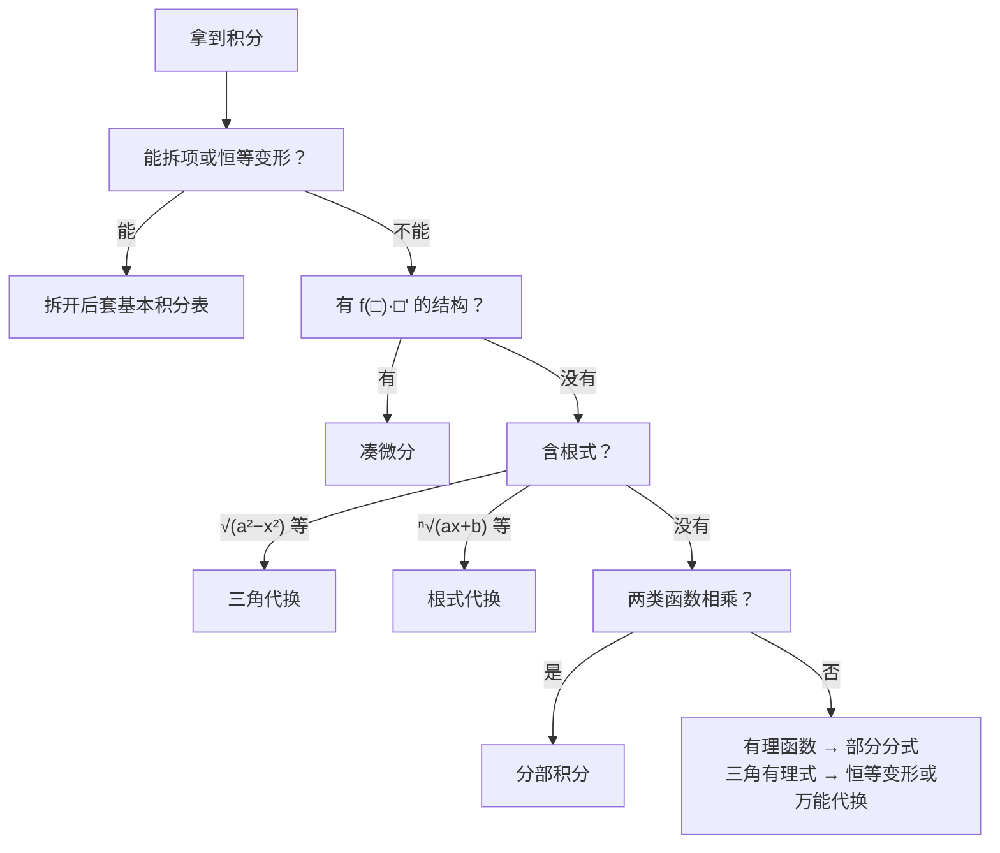

不定积分单独出大题的情况不多，但后面的定积分、微分方程、重积分、曲线曲面积分，最后都要落到“求原函数”上。这一章的目标是：**看到被积函数，知道该用哪种方法**，并且算得又快又准。

## 一、本章地图

| 模块 | 要掌握什么 | 常见考法 |
| --- | --- | --- |
| 原函数概念 | 原函数存在性、不定积分与导数互逆 | 选择题 |
| 基本积分表 | 约 20 个公式 | 基本功 |
| 第一换元（凑微分） | 常见凑微分形式 | 所有积分题 |
| 第二换元 | 三角代换、根式代换、倒代换 | 解答题 |
| 分部积分 | “反对幂指三”、表格法、循环积分 | 解答题 |
| 有理函数积分 | 部分分式分解 | 解答题 |
| 三角有理式 | 恒等变形、万能代换 | 解答题 |
| 分段函数 | 原函数要连续 | 选择、解答 |

拿到一个积分，按下面的顺序考虑：

## 二、核心概念

### 1. 原函数与不定积分

若在区间 $I$ 上 $F'(x)=f(x)$，称 $F$ 是 $f$ 的一个**原函数**。$f$ 的全体原函数称为**不定积分**：

$$
\int f(x)\,\mathrm dx=F(x)+C.
$$

同一个函数的两个原函数只差一个常数（由第 03 篇的推论：导数相同的函数只差常数）。

### 2. 积分与求导互逆

$$
\left[\int f(x)\,\mathrm dx\right]'=f(x),\qquad\int F'(x)\,\mathrm dx=F(x)+C.
$$

先积后导，原样不变；先导后积，要加 $C$。

### 3. 原函数存在性

> [!IMPORTANT] 必背结论
> 1. 在区间 $I$ 上**连续**的函数，一定有原函数。
> 2. 在区间 $I$ 内有**第一类间断点**（可去或跳跃）的函数，在 $I$ 上**没有**原函数。
> 3. 有**第二类间断点**的函数，可能有原函数，也可能没有。

第 3 条的例子：$F(x)=x^2\sin\dfrac1x$（$F(0)=0$）处处可导，

$$
F'(x)=f(x)=\begin{cases}2x\sin\dfrac1x-\cos\dfrac1x,&x\ne0\\[2mm]0,&x=0\end{cases}
$$

$f$ 在 $x=0$ 处是第二类（振荡）间断点，但它有原函数 $F$。这个例子在第 02 篇的易错点中出现过。

### 4. 原函数与定积分的区别

“有原函数”和“定积分存在（可积）”是两回事：

- 有跳跃间断点的函数，没有原函数，但在闭区间上**可积**（第 06 篇详细讲）。
- 上面的 $f(x)$ 有原函数，但它在 $0$ 附近无界，这一点不影响原函数存在。

## 三、必背公式

### 1. 基本积分表

$$
\begin{aligned}
&\int x^a\,\mathrm dx=\frac{x^{a+1}}{a+1}+C\ (a\ne-1) && \int\frac{\mathrm dx}{x}=\ln\lvert x\rvert+C\\
&\int a^x\,\mathrm dx=\frac{a^x}{\ln a}+C && \int e^x\,\mathrm dx=e^x+C\\
&\int\sin x\,\mathrm dx=-\cos x+C && \int\cos x\,\mathrm dx=\sin x+C\\
&\int\tan x\,\mathrm dx=-\ln\lvert\cos x\rvert+C && \int\cot x\,\mathrm dx=\ln\lvert\sin x\rvert+C\\
&\int\sec x\,\mathrm dx=\ln\lvert\sec x+\tan x\rvert+C && \int\csc x\,\mathrm dx=\ln\lvert\csc x-\cot x\rvert+C\\
&\int\sec^2x\,\mathrm dx=\tan x+C && \int\csc^2x\,\mathrm dx=-\cot x+C\\
&\int\sec x\tan x\,\mathrm dx=\sec x+C && \int\csc x\cot x\,\mathrm dx=-\csc x+C
\end{aligned}
$$

> [!IMPORTANT] 必背·含 $a$ 的公式（$a>0$）
> $$\int\frac{\mathrm dx}{a^2+x^2}=\frac1a\arctan\frac xa+C\qquad\int\frac{\mathrm dx}{x^2-a^2}=\frac{1}{2a}\ln\left\lvert\frac{x-a}{x+a}\right\rvert+C$$
> $$\int\frac{\mathrm dx}{\sqrt{a^2-x^2}}=\arcsin\frac xa+C\qquad\int\frac{\mathrm dx}{\sqrt{x^2\pm a^2}}=\ln\left\lvert x+\sqrt{x^2\pm a^2}\right\rvert+C$$
> $$\int\sqrt{a^2-x^2}\,\mathrm dx=\frac{a^2}{2}\arcsin\frac xa+\frac x2\sqrt{a^2-x^2}+C$$

### 2. 常见凑微分形式

| 被积函数中出现 | 凑成 |
| --- | --- |
| $x\,\mathrm dx$ | $\frac12\,\mathrm d(x^2)$ |
| $\dfrac{\mathrm dx}{\sqrt x}$ | $2\,\mathrm d\sqrt x$ |
| $\dfrac{\mathrm dx}{x^2}$ | $-\mathrm d\left(\dfrac1x\right)$ |
| $\dfrac{\mathrm dx}{x}$ | $\mathrm d(\ln x)$ |
| $e^x\,\mathrm dx$ | $\mathrm d(e^x)$ |
| $\cos x\,\mathrm dx$、$\sin x\,\mathrm dx$ | $\mathrm d(\sin x)$、$-\mathrm d(\cos x)$ |
| $\sec^2x\,\mathrm dx$ | $\mathrm d(\tan x)$ |
| $\dfrac{\mathrm dx}{1+x^2}$ | $\mathrm d(\arctan x)$ |
| $\dfrac{\mathrm dx}{\sqrt{1-x^2}}$ | $\mathrm d(\arcsin x)$ |
| $\mathrm dx$ | $\frac1a\,\mathrm d(ax+b)$ |

### 3. 分部积分公式

$$
\int u\,\mathrm dv=uv-\int v\,\mathrm du.
$$

### 4. 三种代换

| 结构 | 代换 | 用到的恒等式 |
| --- | --- | --- |
| $\sqrt{a^2-x^2}$ | $x=a\sin t$ | $1-\sin^2t=\cos^2t$ |
| $\sqrt{a^2+x^2}$ | $x=a\tan t$ | $1+\tan^2t=\sec^2t$ |
| $\sqrt{x^2-a^2}$ | $x=a\sec t$ | $\sec^2t-1=\tan^2t$ |
| $\sqrt[n]{ax+b}$、$\sqrt{\dfrac{ax+b}{cx+d}}$ | 令整个根式 $=t$ | 去掉根号 |
| 三角有理式 $R(\sin x,\cos x)$ | $t=\tan\dfrac x2$ | $\sin x=\dfrac{2t}{1+t^2}$，$\cos x=\dfrac{1-t^2}{1+t^2}$，$\mathrm dx=\dfrac{2\,\mathrm dt}{1+t^2}$ |

## 四、题型与解题套路

### 题型 1：凑微分（第一换元法）

**识别特征**：被积函数可以写成 $f\bigl(\varphi(x)\bigr)\varphi'(x)$，即“某个函数的复合”乘上“里层函数的导数”。

**解法**：

$$
\int f\bigl(\varphi(x)\bigr)\varphi'(x)\,\mathrm dx=\int f(u)\,\mathrm du\Big|_{u=\varphi(x)}.
$$

**例 1** 求下列积分：

1. $\displaystyle\int\frac{x}{1+x^2}\,\mathrm dx$
2. $\displaystyle\int\frac{\mathrm dx}{x(1+\ln x)}$
3. $\displaystyle\int\frac{e^{\sqrt x}}{\sqrt x}\,\mathrm dx$

**解**

1. $x\,\mathrm dx=\frac12\,\mathrm d(1+x^2)$，原式 $=\dfrac12\ln(1+x^2)+C$。
2. $\dfrac{\mathrm dx}{x}=\mathrm d(1+\ln x)$，原式 $=\ln\lvert1+\ln x\rvert+C$。
3. $\dfrac{\mathrm dx}{\sqrt x}=2\,\mathrm d\sqrt x$，原式 $=2e^{\sqrt x}+C$。

**例 2** 求 $\displaystyle\int\frac{\mathrm dx}{x^2+2x+5}$。

**解** 二次式不能分解时，**先配方**：$x^2+2x+5=(x+1)^2+4$。

$$
\int\frac{\mathrm d(x+1)}{(x+1)^2+2^2}=\boxed{\frac12\arctan\frac{x+1}{2}+C}.
$$

**例 3** 求 $\displaystyle\int\frac{\mathrm dx}{1+e^x}$。

**解** 分子加一项减一项 $e^x$：

$$
\int\frac{1+e^x-e^x}{1+e^x}\,\mathrm dx=\int\mathrm dx-\int\frac{\mathrm d(1+e^x)}{1+e^x}=\boxed{x-\ln(1+e^x)+C}.
$$

> [!TIP] 凑微分的信号
> 被积函数里**同时出现** $\varphi(x)$ 和 $\varphi'(x)$，比如同时有 $\ln x$ 和 $\frac1x$、同时有 $\arctan x$ 和 $\frac{1}{1+x^2}$，基本就是凑微分。

### 题型 2：三角函数的积分

**解法**：

| 形式 | 方法 |
| --- | --- |
| $\sin^mx\cos^nx$，有一个是**奇次** | 拆出一个奇次的因子去凑微分，其余用 $\sin^2+\cos^2=1$ 化掉 |
| $\sin^mx\cos^nx$，**都是偶次** | 用倍角公式降次 |
| $\sin ax\cos bx$ 等 | 积化和差 |
| $\tan^nx$、$\sec^nx$ | 用 $\tan^2x=\sec^2x-1$，凑 $\mathrm d(\tan x)$ |

**例 4** 求 $\displaystyle\int\sin^3x\,\mathrm dx$。

**解** 奇次，拆出一个 $\sin x$：

$$
\int\sin^2x\cdot\sin x\,\mathrm dx=-\int(1-\cos^2x)\,\mathrm d(\cos x)=\boxed{-\cos x+\frac{\cos^3x}{3}+C}.
$$

**例 5** 求 $\displaystyle\int\sin^2x\cos^2x\,\mathrm dx$。

**解** 都是偶次，降次：

$$
\sin^2x\cos^2x=\frac{\sin^22x}{4}=\frac{1-\cos4x}{8},
$$

$$
\text{原式}=\boxed{\frac x8-\frac{\sin4x}{32}+C}.
$$

**例 6** 求 $\displaystyle\int\frac{\sin x}{\sin x+\cos x}\,\mathrm dx$。

**解** 这类 $\dfrac{a\sin x+b\cos x}{c\sin x+d\cos x}$ 的积分，把分子写成“**分母 + 分母的导数**”的组合：

$$
\sin x=A(\sin x+\cos x)+B(\cos x-\sin x).
$$

比较系数：$A-B=1$，$A+B=0$，得 $A=\frac12$，$B=-\frac12$。于是

$$
\text{原式}=\int\frac12\,\mathrm dx-\frac12\int\frac{\mathrm d(\sin x+\cos x)}{\sin x+\cos x}=\boxed{\frac x2-\frac12\ln\lvert\sin x+\cos x\rvert+C}.
$$

### 题型 3：三角代换

**识别特征**：被积函数含 $\sqrt{a^2-x^2}$、$\sqrt{a^2+x^2}$ 或 $\sqrt{x^2-a^2}$，且凑微分做不了。

**解法步骤**：

1. 按表选代换，去掉根号；
2. 对 $t$ 积分；
3. **画直角三角形**，把 $t$ 的三角函数换回 $x$。

**例 7** 求 $\displaystyle\int\sqrt{a^2-x^2}\,\mathrm dx\ (a>0)$。

**解** 令 $x=a\sin t$，$t\in\left[-\frac\pi2,\frac\pi2\right]$，则 $\sqrt{a^2-x^2}=a\cos t$，$\mathrm dx=a\cos t\,\mathrm dt$。

$$
\int a^2\cos^2t\,\mathrm dt=\frac{a^2}{2}\int(1+\cos2t)\,\mathrm dt=\frac{a^2}{2}\left(t+\sin t\cos t\right)+C.
$$

回代：$\sin t=\dfrac xa$，$\cos t=\dfrac{\sqrt{a^2-x^2}}{a}$，得

$$
\boxed{\frac{a^2}{2}\arcsin\frac xa+\frac x2\sqrt{a^2-x^2}+C}.
$$

**例 8** 求 $\displaystyle\int\frac{\mathrm dx}{x^2\sqrt{1+x^2}}$。

**解** 令 $x=\tan t$，$\mathrm dx=\sec^2t\,\mathrm dt$，$\sqrt{1+x^2}=\sec t$：

$$
\int\frac{\sec^2t}{\tan^2t\sec t}\,\mathrm dt=\int\frac{\cos t}{\sin^2t}\,\mathrm dt=-\frac{1}{\sin t}+C.
$$

画三角形：对边 $x$，邻边 $1$，斜边 $\sqrt{1+x^2}$，所以 $\sin t=\dfrac{x}{\sqrt{1+x^2}}$。

$$
\text{原式}=\boxed{-\frac{\sqrt{1+x^2}}{x}+C}.
$$

> [!TIP] 回代用直角三角形
> 由 $x=a\sin t$ 等式子画出直角三角形，三条边都用 $x$ 表示，需要哪个三角函数就直接读出来，不容易出错。

### 题型 4：根式代换与倒代换

**例 9** 求 $\displaystyle\int\frac{\mathrm dx}{1+\sqrt x}$。

**解** 令 $t=\sqrt x$，$x=t^2$，$\mathrm dx=2t\,\mathrm dt$：

$$
\int\frac{2t}{1+t}\,\mathrm dt=2\int\left(1-\frac{1}{1+t}\right)\mathrm dt=2t-2\ln(1+t)+C=\boxed{2\sqrt x-2\ln(1+\sqrt x)+C}.
$$

**例 10** 求 $\displaystyle\int\frac{\mathrm dx}{\sqrt x+\sqrt[3]x}$。

**解** 根指数 2 和 3 的最小公倍数是 6，令 $t=\sqrt[6]x$，$x=t^6$，$\mathrm dx=6t^5\,\mathrm dt$：

$$
\int\frac{6t^5}{t^3+t^2}\,\mathrm dt=6\int\frac{t^3}{t+1}\,\mathrm dt=6\int\left(t^2-t+1-\frac{1}{t+1}\right)\mathrm dt.
$$

$$
=2t^3-3t^2+6t-6\ln\lvert t+1\rvert+C,\quad t=\sqrt[6]x.
$$

> [!TIP] 倒代换
> 分母次数比分子高很多时（如 $\dfrac{1}{x^4\sqrt{1+x^2}}$），可以令 $x=\dfrac1t$，把高次的分母“翻”上去。

### 题型 5：分部积分

**识别特征**：两类不同的函数相乘，如 $x\,e^x$、$x\ln x$、$e^x\sin x$；或者单独一个 $\ln x$、$\arctan x$、$\arcsin x$。

**选 $u$ 的口诀“反对幂指三”**：按**反三角函数、对数函数、幂函数、指数函数、三角函数**的顺序，**排在前面的当 $u$**（留着求导），排在后面的凑进 $\mathrm dv$。

**例 11** 求 $\displaystyle\int\ln x\,\mathrm dx$ 和 $\displaystyle\int x\arctan x\,\mathrm dx$。

**解** 第一个，$u=\ln x$，$v=x$：

$$
\int\ln x\,\mathrm dx=x\ln x-\int x\cdot\frac1x\,\mathrm dx=\boxed{x\ln x-x+C}.
$$

第二个，$u=\arctan x$，$\mathrm dv=x\,\mathrm dx$，$v=\dfrac{x^2}{2}$：

$$
\int x\arctan x\,\mathrm dx=\frac{x^2}{2}\arctan x-\frac12\int\frac{x^2}{1+x^2}\,\mathrm dx=\frac{x^2}{2}\arctan x-\frac12(x-\arctan x)+C.
$$

整理得 $\boxed{\dfrac{x^2+1}{2}\arctan x-\dfrac x2+C}$。

**例 12（表格法）** 求 $\displaystyle\int x^2\cos x\,\mathrm dx$。

**解** 多项式要分部好几次，用表格法更快：左列对多项式**不断求导**直到 $0$，右列对另一个函数**不断积分**，然后斜着相乘，符号正负交替。

| 符号 | 求导列 | 积分列 |
| --- | --- | --- |
| $+$ | $x^2$ | $\cos x$ |
| $-$ | $2x$ | $\sin x$ |
| $+$ | $2$ | $-\cos x$ |
| | $0$ | $-\sin x$ |

斜着相乘：

$$
\text{原式}=x^2\sin x-2x(-\cos x)+2(-\sin x)+C=\boxed{x^2\sin x+2x\cos x-2\sin x+C}.
$$

**例 13（循环积分）** 求 $\displaystyle\int e^x\sin x\,\mathrm dx$。

**解** 记 $I=\displaystyle\int e^x\sin x\,\mathrm dx$。分部两次：

$$
I=e^x\sin x-\int e^x\cos x\,\mathrm dx=e^x\sin x-\left(e^x\cos x+\int e^x\sin x\,\mathrm dx\right)=e^x(\sin x-\cos x)-I.
$$

原积分又出现了，移项解方程：

$$
I=\boxed{\frac{e^x}{2}(\sin x-\cos x)+C}.
$$

> [!WARNING] 循环积分的两个要点
> 1. 两次分部时，$u$ 必须选**同一类**函数（都选三角或都选指数），否则会绕回原点，得到 $I=I$。
> 2. 解出 $I$ 后**再补上 $C$**。

### 题型 6：有理函数积分

**解法步骤**：

1. 若是**假分式**（分子次数 $\ge$ 分母次数），先做多项式除法，化成多项式 + 真分式；
2. 分母**因式分解**；
3. 按下表**拆成部分分式**，求出系数；
4. 每一项分别积分。

| 分母中的因式 | 对应的部分分式 |
| --- | --- |
| $x-a$ | $\dfrac{A}{x-a}$ |
| $(x-a)^k$ | $\dfrac{A_1}{x-a}+\dfrac{A_2}{(x-a)^2}+\cdots+\dfrac{A_k}{(x-a)^k}$ |
| $x^2+px+q$（$p^2<4q$） | $\dfrac{Bx+C}{x^2+px+q}$ |

**例 14** 求 $\displaystyle\int\frac{x+3}{x^2-5x+6}\,\mathrm dx$。

**解** $x^2-5x+6=(x-2)(x-3)$，设 $\dfrac{x+3}{(x-2)(x-3)}=\dfrac{A}{x-2}+\dfrac{B}{x-3}$。

用**留数法**（遮住一个因式，代入它的零点）：

$$
A=\frac{x+3}{x-3}\Big|_{x=2}=-5,\qquad B=\frac{x+3}{x-2}\Big|_{x=3}=6.
$$

$$
\text{原式}=\boxed{-5\ln\lvert x-2\rvert+6\ln\lvert x-3\rvert+C}.
$$

**例 15** 求 $\displaystyle\int\frac{\mathrm dx}{x(x-1)^2}$。

**解** 设 $\dfrac{1}{x(x-1)^2}=\dfrac{A}{x}+\dfrac{B}{x-1}+\dfrac{D}{(x-1)^2}$。

- 留数法：$A=\dfrac{1}{(x-1)^2}\Big|_{x=0}=1$，$D=\dfrac1x\Big|_{x=1}=1$。
- 比较 $x^2$ 的系数：通分后分子为 $A(x-1)^2+Bx(x-1)+Dx$，$x^2$ 系数为 $A+B=0$，所以 $B=-1$。

$$
\text{原式}=\boxed{\ln\lvert x\rvert-\ln\lvert x-1\rvert-\frac{1}{x-1}+C}.
$$

**例 16** 求 $\displaystyle\int\frac{\mathrm dx}{x(x^2+1)}$。

**解** 设 $\dfrac{1}{x(x^2+1)}=\dfrac Ax+\dfrac{Bx+D}{x^2+1}$。留数法 $A=1$；通分比较 $x^2$ 系数：$A+B=0$，$B=-1$；比较 $x$ 系数：$D=0$。

$$
\text{原式}=\int\left(\frac1x-\frac{x}{x^2+1}\right)\mathrm dx=\boxed{\ln\lvert x\rvert-\frac12\ln(x^2+1)+C}.
$$

### 题型 7：三角有理式积分

**解法**：

1. **先试恒等变形**：倍角、半角公式往往一步就能做完；
2. 实在不行，用**万能代换** $t=\tan\dfrac x2$，化成有理函数。万能代换一定能做，但计算量大。

**例 17** 求 $\displaystyle\int\frac{\mathrm dx}{1+\cos x}$。

**解** 半角公式：$1+\cos x=2\cos^2\dfrac x2$。

$$
\int\frac{\mathrm dx}{2\cos^2\frac x2}=\int\sec^2\frac x2\,\mathrm d\left(\frac x2\right)=\boxed{\tan\frac x2+C}.
$$

**例 18** 求 $\displaystyle\int\frac{\mathrm dx}{2+\cos x}$。

**解** 恒等变形不好做，用万能代换。令 $t=\tan\dfrac x2$：

$$
2+\cos x=\frac{2(1+t^2)+(1-t^2)}{1+t^2}=\frac{3+t^2}{1+t^2},\qquad\mathrm dx=\frac{2\,\mathrm dt}{1+t^2}.
$$

$$
\text{原式}=\int\frac{2}{3+t^2}\,\mathrm dt=\frac{2}{\sqrt3}\arctan\frac{t}{\sqrt3}+C=\boxed{\frac{2}{\sqrt3}\arctan\left(\frac{1}{\sqrt3}\tan\frac x2\right)+C}.
$$

### 题型 8：分段函数的不定积分

**解法**：每一段分别积分，然后**利用原函数在分段点处连续**，确定各段常数之间的关系，最后只保留一个任意常数 $C$。

**例 19** 求 $\displaystyle\int e^{\lvert x\rvert}\,\mathrm dx$。

**解** 分段积分：

$$
F(x)=\begin{cases}e^x+C_1,&x\ge0\\-e^{-x}+C_2,&x<0\end{cases}
$$

原函数可导，所以一定连续。在 $x=0$ 处：$1+C_1=-1+C_2$，即 $C_2=C_1+2$。记 $C_1=C$，

$$
\int e^{\lvert x\rvert}\,\mathrm dx=\boxed{\begin{cases}e^x+C,&x\ge0\\-e^{-x}+2+C,&x<0\end{cases}}
$$

> [!WARNING] 最常见的错误
> 两段各写一个独立的 $C$，或者两段用同一个 $C$ 但没检查连续性。这样得到的“原函数”在分段点处不连续，也就不可导，不是原函数。

### 题型 9：抽象函数与原函数的关系

**例 20** 已知 $f(x)$ 的一个原函数是 $e^{-x^2}$，求 $\displaystyle\int xf'(x)\,\mathrm dx$。

**解** 由题意 $f(x)=\left(e^{-x^2}\right)'=-2xe^{-x^2}$。对所求积分分部：

$$
\int xf'(x)\,\mathrm dx=xf(x)-\int f(x)\,\mathrm dx=-2x^2e^{-x^2}-e^{-x^2}+C.
$$

> [!TIP] 见到 $f'$ 就分部
> 被积函数中有 $f'(x)$ 或 $f''(x)$ 时，把它凑进 $\mathrm dv$ 做分部积分，就能降一阶。

**例 21** 设 $f'(\ln x)=1+x$，求 $f(x)$。

**解** 令 $t=\ln x$，则 $x=e^t$，$f'(t)=1+e^t$。所以

$$
f(t)=t+e^t+C,\qquad\text{即}\ \boxed{f(x)=x+e^x+C}.
$$

**例 22（选择题）** 下列函数在 $(-1,1)$ 上**没有**原函数的是：

- (A) $f(x)=\lvert x\rvert$
- (B) $f(x)=\begin{cases}x+1,&x\ge0\\x,&x<0\end{cases}$
- (C) $f(x)=\begin{cases}2x\sin\dfrac1x-\cos\dfrac1x,&x\ne0\\0,&x=0\end{cases}$
- (D) $f(x)=\sin x$

**解** (A)、(D) 连续，有原函数。(C) 是 $x^2\sin\frac1x$ 的导数，有原函数。(B) 在 $x=0$ 处有**跳跃间断点**，没有原函数。答案为 $\boxed{\text{B}}$。

## 五、证明思路

### 1. 换元法就是链式法则倒过来

设 $F'(u)=f(u)$，由链式法则

$$
\frac{\mathrm d}{\mathrm dx}F\bigl(\varphi(x)\bigr)=f\bigl(\varphi(x)\bigr)\varphi'(x),
$$

所以 $F\bigl(\varphi(x)\bigr)$ 就是 $f\bigl(\varphi(x)\bigr)\varphi'(x)$ 的原函数。

第二换元法反过来用：令 $x=\psi(t)$，要求 $\psi$ **单调可导**，才能保证最后能用反函数 $t=\psi^{-1}(x)$ 回代。这就是三角代换要限制 $t$ 的范围的原因。

### 2. 分部积分就是乘积法则倒过来

$(uv)'=u'v+uv'$，两边积分：

$$
uv=\int v\,\mathrm du+\int u\,\mathrm dv\ \Longrightarrow\ \int u\,\mathrm dv=uv-\int v\,\mathrm du.
$$

“反对幂指三”的道理：反三角和对数求导后变成代数式，变简单了，所以适合当 $u$；指数和三角积分后形式不变，所以适合凑进 $\mathrm dv$。

### 3. 有第一类间断点的函数没有原函数

设 $F'=f$ 在区间上处处成立，$x_0$ 是 $f$ 的第一类间断点。

由拉格朗日中值定理，$x<x_0$ 时

$$
\frac{F(x)-F(x_0)}{x-x_0}=F'(\xi)=f(\xi),\quad x<\xi<x_0.
$$

令 $x\to x_0^-$，得 $F'_-(x_0)=\lim\limits_{x\to x_0^-}f(x)$。同理 $F'_+(x_0)=\lim\limits_{x\to x_0^+}f(x)$。

- 跳跃间断：左右极限不相等，于是 $F$ 在 $x_0$ 处左右导数不相等，$F$ 不可导，矛盾。
- 可去间断：左右极限相等但不等于 $f(x_0)$，于是 $F'(x_0)\ne f(x_0)$，矛盾。

一句话：**导函数要么连续，要么有第二类间断点，不会有第一类间断点。**

### 4. 连续函数必有原函数

构造 $F(x)=\displaystyle\int_a^xf(t)\,\mathrm dt$，第 06 篇会证明 $F'(x)=f(x)$。

### 5. 留数法为什么成立

以 $\dfrac{x+3}{(x-2)(x-3)}=\dfrac{A}{x-2}+\dfrac{B}{x-3}$ 为例，两边同乘 $x-2$：

$$
\frac{x+3}{x-3}=A+\frac{B(x-2)}{x-3}.
$$

令 $x=2$，右边第二项为 $0$，就得到 $A$。

## 六、易错点

> [!CAUTION] 积分结果的形式可以不同
> $\displaystyle\int\sin x\cos x\,\mathrm dx$ 可以算出 $\dfrac{\sin^2x}{2}$、$-\dfrac{\cos^2x}{2}$ 或 $-\dfrac{\cos2x}{4}$（各加 $C$）。三者之间只差常数，**都对**。检验方法是对结果求导，看能不能还原成被积函数。

- **忘记加 $C$**，或循环积分中 $C$ 加的位置不对。
- **$\ln$ 忘记加绝对值**：$\displaystyle\int\frac{\mathrm dx}{x}=\ln\lvert x\rvert+C$。像 $\ln(1+x^2)$、$\ln(1+e^x)$ 里面恒正，可以不加。
- **换元后忘记回代**：最后结果必须是 $x$ 的函数。
- **凑微分漏系数**：$\displaystyle\int e^{2x}\,\mathrm dx=\frac12e^{2x}+C$，不是 $e^{2x}+C$。
- **假分式没先做除法**就拆部分分式。
- **部分分式少写项**：$(x-1)^2$ 要对应两项；$x^2+1$ 的分子是 $Bx+C$，不是常数。
- **分段函数的原函数不连续**。
- **以为初等函数的原函数都是初等函数**：$e^{-x^2}$、$\dfrac{\sin x}{x}$、$\dfrac{1}{\ln x}$ 的原函数存在，但不能用初等函数表示（俗称“积不出来”）。

## 七、小练习

**1.** 求 $\displaystyle\int\frac{\mathrm dx}{x\ln x\,\ln(\ln x)}$。

点击查看答案

连续凑微分：$\dfrac{\mathrm dx}{x}=\mathrm d(\ln x)$，$\dfrac{\mathrm d(\ln x)}{\ln x}=\mathrm d\bigl(\ln(\ln x)\bigr)$。

原式 $=\displaystyle\int\frac{\mathrm d\bigl(\ln(\ln x)\bigr)}{\ln(\ln x)}=\ln\bigl\lvert\ln(\ln x)\bigr\rvert+C$。

**2.** 求 $\displaystyle\int x^2e^x\,\mathrm dx$。

点击查看答案

表格法：求导列 $x^2,\ 2x,\ 2,\ 0$；积分列都是 $e^x$。

原式 $=x^2e^x-2xe^x+2e^x+C=(x^2-2x+2)e^x+C$。

**3.** 求 $\displaystyle\int\frac{\mathrm dx}{\sqrt{x(1-x)}}$。

点击查看答案

令 $t=\sqrt x$，$x=t^2$，$\mathrm dx=2t\,\mathrm dt$：

$$\int\frac{2t}{t\sqrt{1-t^2}}\,\mathrm dt=2\arcsin t+C=2\arcsin\sqrt x+C.$$

**4.** 求 $\displaystyle\int\frac{2x+3}{x^2+2x+2}\,\mathrm dx$。

点击查看答案

分子拆成“分母的导数 + 常数”：$2x+3=(2x+2)+1$。

$$\int\frac{2x+2}{x^2+2x+2}\,\mathrm dx+\int\frac{\mathrm dx}{(x+1)^2+1}=\ln(x^2+2x+2)+\arctan(x+1)+C.$$

**5.** 求 $\displaystyle\int e^{2x}\cos x\,\mathrm dx$。

点击查看答案

记为 $I$，两次分部都把 $e^{2x}$ 凑进 $\mathrm dv$：

$$I=\frac12e^{2x}\cos x+\frac12\int e^{2x}\sin x\,\mathrm dx=\frac12e^{2x}\cos x+\frac14e^{2x}\sin x-\frac14I.$$

移项得 $\dfrac54I=\dfrac{e^{2x}}{4}(2\cos x+\sin x)$，所以

$$I=\frac{e^{2x}}{5}(2\cos x+\sin x)+C.$$

## 八、本章小结

- 连续函数一定有原函数；有**第一类间断点**的函数一定没有原函数。
- 方法选择顺序：**恒等变形 → 凑微分 → 换元 → 分部 → 有理函数**。
- 根式：$\sqrt{a^2\pm x^2}$、$\sqrt{x^2-a^2}$ 用**三角代换**，回代画直角三角形；$\sqrt[n]{ax+b}$ 令整个根式为 $t$。
- 分部积分按“**反对幂指三**”选 $u$；多项式乘积用**表格法**；$e^x$ 乘三角函数用**循环积分**。
- 有理函数：先除法，再分解，**留数法**求系数。
- 三角有理式：先试**恒等变形**，不行再用**万能代换**。
- 分段函数的原函数必须**连续**，只保留一个 $C$。

下一篇：**06 定积分与反常积分**。
