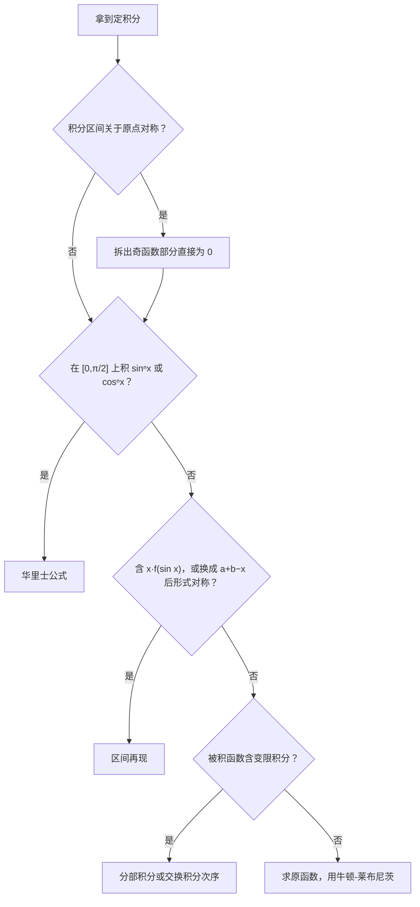

上一篇解决了“求原函数”，这一篇讲定积分。定积分的计算题，往往**用对称性、公式或换元技巧就能少算一大半**；概念题则集中在“可积、有原函数、变限积分的性质”这几个容易混淆的地方。最后是反常积分，重点是判断收敛还是发散。

## 一、本章地图

| 模块 | 要掌握什么 | 常见考法 |
| --- | --- | --- |
| 定义与可积性 | 黎曼和、可积的充分条件和必要条件 | 选择题 |
| 性质 | 比较、估值、积分中值定理 | 选择、证明题 |
| 变限积分 | 求导公式、连续性与可导性 | 填空、解答，与洛必达结合 |
| 计算 | 牛顿-莱布尼茨、换元、分部 | 填空、解答 |
| 计算技巧 | 奇偶性、周期性、华里士公式、区间再现 | 填空 |
| 定积分定义求极限 | $n$ 项和化成定积分 | 填空、解答 |
| 反常积分 | 计算、判敛、$p$ 积分 | 选择、填空 |

计算定积分前，先看有没有捷径：

## 二、核心概念

### 1. 定积分的定义

把 $[a,b]$ 任意分成 $n$ 个小区间，在每个小区间 $[x_{i-1},x_i]$ 上任取一点 $\xi_i$，作和

$$
\sum_{i=1}^{n}f(\xi_i)\Delta x_i.
$$

当最大的小区间长度 $\lambda\to0$ 时，如果这个和的极限存在，并且**与分法和 $\xi_i$ 的取法无关**，就称 $f$ 在 $[a,b]$ 上可积，极限值记为 $\displaystyle\int_a^bf(x)\,\mathrm dx$。

大白话：**定积分就是“分割、近似、求和、取极限”**，几何意义是曲边梯形的有向面积（$x$ 轴上方为正，下方为负）。

定积分的值只与被积函数和积分区间有关，与积分变量用什么字母无关：$\displaystyle\int_a^bf(x)\,\mathrm dx=\int_a^bf(t)\,\mathrm dt$。

### 2. 可积条件

> [!IMPORTANT] 必背
> - **必要条件**：$f$ 在 $[a,b]$ 上可积 $\Rightarrow$ $f$ 在 $[a,b]$ 上**有界**。
> - **充分条件**（满足任一即可积）：
>   1. $f$ 在 $[a,b]$ 上连续；
>   2. $f$ 在 $[a,b]$ 上有界，且只有**有限个间断点**；
>   3. $f$ 在 $[a,b]$ 上单调。

### 3. 可积与有原函数的区别

这是选择题最爱考的地方，结合第 05 篇一起记：

| 函数在 $[a,b]$ 上的情况 | 可积？ | 有原函数？ |
| --- | --- | --- |
| 连续 | 可积 | 有 |
| 有跳跃间断点（有界） | 可积 | **没有** |
| 有可去间断点（有界） | 可积 | **没有** |
| 有第二类间断点 | 不一定 | 不一定 |

### 4. 变限积分

设 $f$ 在 $[a,b]$ 上可积，称 $\Phi(x)=\displaystyle\int_a^xf(t)\,\mathrm dt$ 为**变上限积分**。

> [!IMPORTANT] 变限积分的性质
> 1. $f$ 可积 $\Rightarrow\Phi$ **连续**。
> 2. $f$ 连续 $\Rightarrow\Phi$ **可导**，且 $\Phi'(x)=f(x)$。所以连续函数一定有原函数。
> 3. 若 $f$ 在 $x_0$ 处有**跳跃**间断点，则 $\Phi$ 在 $x_0$ 处连续但**不可导**（左右导数分别等于 $f$ 的左右极限）。
> 4. 若 $f$ 在 $x_0$ 处有**可去**间断点，则 $\Phi$ 在 $x_0$ 处**可导**，但 $\Phi'(x_0)=\lim\limits_{x\to x_0}f(x)\ne f(x_0)$。

**奇偶性**：设 $f$ 连续，

- $f$ 是奇函数 $\Rightarrow\displaystyle\int_0^xf(t)\,\mathrm dt$ 是偶函数；
- $f$ 是偶函数 $\Rightarrow\displaystyle\int_0^xf(t)\,\mathrm dt$ 是奇函数。

注意下限必须是 $0$。若下限是 $a\ne0$，偶函数的变限积分不一定是奇函数。

### 5. 反常积分

**无穷区间**：

$$
\int_a^{+\infty}f(x)\,\mathrm dx=\lim_{b\to+\infty}\int_a^bf(x)\,\mathrm dx.
$$

**无界函数（瑕积分）**：若 $f$ 在 $a$ 附近无界（$a$ 称为**瑕点**），

$$
\int_a^bf(x)\,\mathrm dx=\lim_{\varepsilon\to0^+}\int_{a+\varepsilon}^bf(x)\,\mathrm dx.
$$

极限存在称为**收敛**，否则称为**发散**。

> [!WARNING] 两端都“反常”时必须拆开
> $\displaystyle\int_{-\infty}^{+\infty}f(x)\,\mathrm dx$ 收敛，要求 $\displaystyle\int_{-\infty}^0$ 和 $\displaystyle\int_0^{+\infty}$ **各自**收敛。
>
> 例如 $\displaystyle\int_{-\infty}^{+\infty}x\,\mathrm dx$ 是**发散**的。虽然 $\displaystyle\lim_{b\to+\infty}\int_{-b}^bx\,\mathrm dx=0$，但这不是反常积分的定义，不能用“奇函数在对称区间上积分为 0”。

## 三、必背公式

### 1. 牛顿-莱布尼茨公式

若 $f$ 在 $[a,b]$ 上连续，$F$ 是它的一个原函数，则

$$
\int_a^bf(x)\,\mathrm dx=F(b)-F(a).
$$

### 2. 变限积分求导

> [!IMPORTANT] 必背
> 设 $f$ 连续，$\varphi,\psi$ 可导，则
> $$\frac{\mathrm d}{\mathrm dx}\int_{\psi(x)}^{\varphi(x)}f(t)\,\mathrm dt=f\bigl(\varphi(x)\bigr)\varphi'(x)-f\bigl(\psi(x)\bigr)\psi'(x).$$
> 前提是**被积函数中不含 $x$**。如果含 $x$，要先提出来或换元。

### 3. 估值定理与积分中值定理

- **估值**：若 $m\le f(x)\le M$，则 $m(b-a)\le\displaystyle\int_a^bf(x)\,\mathrm dx\le M(b-a)$。
- **积分中值定理**：$f$ 在 $[a,b]$ 上连续，则存在 $\xi\in[a,b]$，使
  $$\int_a^bf(x)\,\mathrm dx=f(\xi)(b-a).$$
  $f(\xi)$ 就是 $f$ 在 $[a,b]$ 上的**平均值**。
- **推广形式**：$f,g$ 连续，$g$ 在 $[a,b]$ 上**不变号**，则存在 $\xi\in[a,b]$，使
  $$\int_a^bf(x)g(x)\,\mathrm dx=f(\xi)\int_a^bg(x)\,\mathrm dx.$$

### 4. 对称性与周期性

$$
\int_{-a}^af(x)\,\mathrm dx=\begin{cases}0,&f\text{ 为奇函数}\\[1mm]2\displaystyle\int_0^af(x)\,\mathrm dx,&f\text{ 为偶函数}\end{cases}
$$

$$
\int_{-a}^af(x)\,\mathrm dx=\int_0^a\bigl[f(x)+f(-x)\bigr]\,\mathrm dx\quad(\text{任意 }f\text{ 都成立})
$$

若 $f$ 以 $T$ 为周期，则对任意 $a$，

$$
\int_a^{a+T}f(x)\,\mathrm dx=\int_0^Tf(x)\,\mathrm dx.
$$

### 5. 华里士公式（点火公式）

> [!IMPORTANT] 必背
> $$\int_0^{\frac\pi2}\sin^nx\,\mathrm dx=\int_0^{\frac\pi2}\cos^nx\,\mathrm dx=\begin{cases}\dfrac{(n-1)!!}{n!!}\cdot\dfrac\pi2,&n\text{ 为正偶数}\\[3mm]\dfrac{(n-1)!!}{n!!},&n\text{ 为正奇数}\end{cases}$$
> 其中 $n!!$ 是**双阶乘**：$5!!=5\cdot3\cdot1$，$6!!=6\cdot4\cdot2$，并约定 $0!!=1$。

例如：

$$
\int_0^{\frac\pi2}\sin^5x\,\mathrm dx=\frac{4\cdot2}{5\cdot3\cdot1}=\frac{8}{15},\qquad\int_0^{\frac\pi2}\cos^6x\,\mathrm dx=\frac{5\cdot3\cdot1}{6\cdot4\cdot2}\cdot\frac\pi2=\frac{5\pi}{32}.
$$

区间不是 $\left[0,\frac\pi2\right]$ 时，先用对称性化过去，例如 $\displaystyle\int_0^\pi\sin^nx\,\mathrm dx=2\int_0^{\frac\pi2}\sin^nx\,\mathrm dx$。

### 6. 区间再现公式

$$
\int_a^bf(x)\,\mathrm dx=\int_a^bf(a+b-x)\,\mathrm dx.
$$

两个常用推论：

$$
\int_0^{\frac\pi2}f(\sin x)\,\mathrm dx=\int_0^{\frac\pi2}f(\cos x)\,\mathrm dx,\qquad\int_0^\pi xf(\sin x)\,\mathrm dx=\frac\pi2\int_0^\pi f(\sin x)\,\mathrm dx.
$$

### 7. 定积分定义求极限

$$
\lim_{n\to\infty}\frac1n\sum_{k=1}^nf\left(\frac kn\right)=\int_0^1f(x)\,\mathrm dx.
$$

### 8. 反常积分的判敛工具

> [!IMPORTANT] $p$ 积分（必背）
> $$\int_1^{+\infty}\frac{\mathrm dx}{x^p}\ \begin{cases}\text{收敛},&p>1\\\text{发散},&p\le1\end{cases}\qquad\int_0^1\frac{\mathrm dx}{x^p}\ \begin{cases}\text{收敛},&p<1\\\text{发散},&p\ge1\end{cases}$$
> 记法：**无穷远处要衰减得够快（$p>1$），瑕点处要发散得够慢（$p<1$）**。$p=1$ 时两边都发散。

另一个常用结论：$\displaystyle\int_2^{+\infty}\frac{\mathrm dx}{x\ln^px}$ 当 $p>1$ 时收敛，$p\le1$ 时发散。

**比较判别法（极限形式）**：设 $f,g\ge0$，在无穷远处（或瑕点处）$\displaystyle\lim\frac{f}{g}=c$，$0<c<+\infty$，则 $\int f$ 与 $\int g$ 敛散性相同。实际做题时，就是**用等价无穷小或无穷大，把被积函数化成 $\dfrac{1}{x^p}$ 的形式**，再看 $p$。

**$\Gamma$ 函数**（偶尔用到）：

$$
\Gamma(s)=\int_0^{+\infty}x^{s-1}e^{-x}\,\mathrm dx,\qquad\Gamma(n+1)=n!,\qquad\Gamma\left(\frac12\right)=\sqrt\pi,\qquad\int_0^{+\infty}e^{-x^2}\,\mathrm dx=\frac{\sqrt\pi}2.
$$

## 四、题型与解题套路

### 题型 1：变限积分求导

**解法**：

- 被积函数不含 $x$：直接套公式。
- 被积函数含 $x$：
  - $x$ 能作为因子提出来，就**先提出**；
  - 提不出来（如 $f(x-t)$），就**换元**，把 $x$ 换到积分限上。

**例 1** 求 $\displaystyle\frac{\mathrm d}{\mathrm dx}\int_{x^2}^{x^3}e^{t^2}\,\mathrm dt$。

**解** 直接套公式：

$$
e^{(x^3)^2}\cdot3x^2-e^{(x^2)^2}\cdot2x=\boxed{3x^2e^{x^6}-2xe^{x^4}}.
$$

**例 2** 设 $f$ 连续，求 $\displaystyle\frac{\mathrm d}{\mathrm dx}\int_0^xtf(x-t)\,\mathrm dt$。

**解** 被积函数含 $x$，令 $u=x-t$，则 $t=x-u$，$\mathrm dt=-\mathrm du$，$t:0\to x$ 对应 $u:x\to0$：

$$
\int_0^xtf(x-t)\,\mathrm dt=\int_0^x(x-u)f(u)\,\mathrm du=x\int_0^xf(u)\,\mathrm du-\int_0^xuf(u)\,\mathrm du.
$$

对 $x$ 求导，第一项用乘积法则：

$$
\int_0^xf(u)\,\mathrm du+xf(x)-xf(x)=\boxed{\int_0^xf(u)\,\mathrm du}.
$$

> [!WARNING] 最常见的错误
> 直接写成 $xf(x-x)=xf(0)$。被积函数含 $x$ 时，公式不能直接套。

### 题型 2：变限积分与洛必达结合求极限

**例 3** 求 $\displaystyle\lim_{x\to0}\frac{\int_0^{x^2}\sin t\,\mathrm dt}{x^4}$。

**解** 0/0 型，洛必达：

$$
\lim_{x\to0}\frac{\sin(x^2)\cdot2x}{4x^3}=\lim_{x\to0}\frac{x^2\cdot2x}{4x^3}=\boxed{\frac12}.
$$

> [!TIP] 等价无穷小的积分
> 当 $x\to0$ 时，若 $f(t)\sim t^k$，则 $\displaystyle\int_0^{x}f(t)\,\mathrm dt\sim\frac{x^{k+1}}{k+1}$。本题 $\sin t\sim t$，所以 $\displaystyle\int_0^{x^2}\sin t\,\mathrm dt\sim\frac{x^4}{2}$，一步得到 $\frac12$。

### 题型 3：利用对称性计算

**例 4** 求 $\displaystyle\int_{-1}^1\left(x+\sqrt{1-x^2}\right)^2\mathrm dx$。

**解** 展开：$x^2+2x\sqrt{1-x^2}+1-x^2=1+2x\sqrt{1-x^2}$。

$2x\sqrt{1-x^2}$ 是奇函数，在对称区间上积分为 $0$。所以

$$
\text{原式}=\int_{-1}^1\mathrm dx=\boxed2.
$$

> [!TIP] 对称区间的第一反应
> 看到 $\displaystyle\int_{-a}^a$，先把被积函数拆成奇函数部分和偶函数部分，奇函数部分直接扔掉。

**例 5** 求 $\displaystyle\int_0^\pi\sin^4x\,\mathrm dx$。

**解** $\sin^4x$ 关于 $x=\frac\pi2$ 对称，先化到 $\left[0,\frac\pi2\right]$，再用华里士公式：

$$
2\int_0^{\frac\pi2}\sin^4x\,\mathrm dx=2\cdot\frac{3\cdot1}{4\cdot2}\cdot\frac\pi2=\boxed{\frac{3\pi}8}.
$$

### 题型 4：区间再现

**识别特征**：被积函数比较复杂，但把 $x$ 换成 $a+b-x$ 后，形式变得和原式“配对”。

**例 6** 求 $\displaystyle I=\int_0^{\frac\pi2}\frac{\sin x}{\sin x+\cos x}\,\mathrm dx$。

**解** 令 $x=\frac\pi2-t$，$\sin$ 和 $\cos$ 互换：

$$
I=\int_0^{\frac\pi2}\frac{\cos x}{\cos x+\sin x}\,\mathrm dx.
$$

两式相加：$2I=\displaystyle\int_0^{\frac\pi2}1\,\mathrm dx=\frac\pi2$，所以 $I=\boxed{\dfrac\pi4}$。

第 05 篇的例 6 求的是这个函数的不定积分，过程要长得多。

**例 7** 求 $\displaystyle\int_0^\pi\frac{x\sin x}{1+\cos^2x}\,\mathrm dx$。

**解** 被积函数是 $x\cdot f(\sin x)$ 的形式（$\cos^2x=1-\sin^2x$），用推论：

$$
\text{原式}=\frac\pi2\int_0^\pi\frac{\sin x}{1+\cos^2x}\,\mathrm dx=\frac\pi2\Bigl[-\arctan(\cos x)\Bigr]_0^\pi=\frac\pi2\left(\frac\pi4+\frac\pi4\right)=\boxed{\frac{\pi^2}4}.
$$

### 题型 5：换元与分部积分

**定积分换元要点**：**换元必换限**，算完不用回代。

**例 8** 求 $\displaystyle\int_0^{\ln2}\sqrt{e^x-1}\,\mathrm dx$。

**解** 令 $t=\sqrt{e^x-1}$，则 $x=\ln(1+t^2)$，$\mathrm dx=\dfrac{2t}{1+t^2}\,\mathrm dt$，$x:0\to\ln2$ 对应 $t:0\to1$：

$$
\int_0^1\frac{2t^2}{1+t^2}\,\mathrm dt=2\int_0^1\left(1-\frac{1}{1+t^2}\right)\mathrm dt=2\left(1-\frac\pi4\right)=\boxed{2-\frac\pi2}.
$$

**例 9（被积函数含变限积分）** 设 $f(x)=\displaystyle\int_x^1e^{-t^2}\,\mathrm dt$，求 $\displaystyle\int_0^1f(x)\,\mathrm dx$。

**解** $e^{-t^2}$ 的原函数不是初等函数，$f(x)$ 求不出来。用分部积分，把 $f$ 求导：

$$
\int_0^1f(x)\,\mathrm dx=\Bigl[xf(x)\Bigr]_0^1-\int_0^1xf'(x)\,\mathrm dx.
$$

$f(1)=0$，所以第一项为 $0$；$f'(x)=-e^{-x^2}$。于是

$$
\text{原式}=\int_0^1xe^{-x^2}\,\mathrm dx=\left[-\frac12e^{-x^2}\right]_0^1=\boxed{\frac12\left(1-\frac1e\right)}.
$$

> [!TIP] 被积函数是变限积分
> 求不出原函数的变限积分，把它当作分部积分的 $u$，**求导后积分号就消失了**。也可以写成二重积分后交换积分次序，第 11 篇会讲。

### 题型 6：绝对值与分段函数的积分

**解法**：找出绝对值内部的零点（或分段点），把区间拆开，每段去掉绝对值再积分。

**例 10** 求 $\displaystyle\int_{-1}^2\lvert x^2-x\rvert\,\mathrm dx$。

**解** $x^2-x=x(x-1)$，零点为 $0,1$。在 $[-1,0]$ 和 $[1,2]$ 上非负，在 $[0,1]$ 上非正：

$$
\int_{-1}^0(x^2-x)\,\mathrm dx+\int_0^1(x-x^2)\,\mathrm dx+\int_1^2(x^2-x)\,\mathrm dx=\frac56+\frac16+\frac56=\boxed{\frac{11}6}.
$$

### 题型 7：含定积分的函数方程

**识别特征**：$f(x)$ 的表达式里含有 $\displaystyle\int_a^bf(t)\,\mathrm dt$。

**解法**：定积分是一个**常数**，设它为 $A$，两边在 $[a,b]$ 上积分，解出 $A$。

**例 11** 设 $f$ 连续，且 $f(x)=x+2\displaystyle\int_0^1f(t)\,\mathrm dt$，求 $f(x)$。

**解** 设 $A=\displaystyle\int_0^1f(t)\,\mathrm dt$，则 $f(x)=x+2A$。两边在 $[0,1]$ 上积分：

$$
A=\frac12+2A\ \Longrightarrow\ A=-\frac12.
$$

所以 $f(x)=\boxed{x-1}$。

### 题型 8：用定积分定义求数列极限

**识别特征**：$n$ 项求和，每一项能写成 $\dfrac1n\cdot f\left(\dfrac kn\right)$。

**解法步骤**：

1. 从每一项中提出 $\dfrac1n$；
2. 把剩下的部分写成 $\dfrac kn$ 的函数 $f\left(\dfrac kn\right)$；
3. 写成 $\displaystyle\int_0^1f(x)\,\mathrm dx$。

**例 12** 求 $\displaystyle\lim_{n\to\infty}\sum_{k=1}^n\frac{n}{n^2+k^2}$。

**解**

$$
\frac{n}{n^2+k^2}=\frac1n\cdot\frac{1}{1+\left(\frac kn\right)^2},
$$

所以

$$
\text{原式}=\int_0^1\frac{\mathrm dx}{1+x^2}=\boxed{\frac\pi4}.
$$

> [!TIP] 和第 01 篇夹逼法的区别
> - 每一项的分母“**差一点点**”（如 $n^2+k$，$k$ 相对 $n^2$ 可忽略）：用**夹逼**。
> - 每一项的分母**差得多**（如 $n^2+k^2$，$k^2$ 与 $n^2$ 同阶）：用**定积分定义**。

### 题型 9：积分中值定理与积分不等式

**例 13** 求 $\displaystyle\lim_{n\to\infty}\int_0^1\frac{x^n}{1+x}\,\mathrm dx$。

**解** 在 $[0,1]$ 上，$0\le\dfrac{x^n}{1+x}\le x^n$，所以

$$
0\le\int_0^1\frac{x^n}{1+x}\,\mathrm dx\le\int_0^1x^n\,\mathrm dx=\frac1{n+1}\to0.
$$

由夹逼准则，极限为 $\boxed0$。

> [!WARNING] 不能先求极限再积分
> 不能把 $\lim$ 直接移进积分号，写成 $\displaystyle\int_0^1\lim_{n\to\infty}\frac{x^n}{1+x}\,\mathrm dx$。这一步需要额外条件，考研范围内的标准做法是**放缩 + 夹逼**。

**例 14** 设 $f$ 在 $[0,1]$ 上连续，在 $(0,1)$ 内可导，且 $3\displaystyle\int_{\frac23}^1f(x)\,\mathrm dx=f(0)$。证明存在 $\xi\in(0,1)$，使 $f'(\xi)=0$。

**证** 由积分中值定理，存在 $c\in\left[\frac23,1\right]$，使

$$
\int_{\frac23}^1f(x)\,\mathrm dx=f(c)\cdot\frac13.
$$

代入条件得 $f(c)=f(0)$。在 $[0,c]$ 上用罗尔定理，存在 $\xi\in(0,c)\subset(0,1)$，使 $f'(\xi)=0$。

> [!TIP] 和第 03 篇的联系
> 证明题中的积分条件，通常先用**积分中值定理**“去掉积分号”，得到一个函数值相等的点，再用罗尔定理。

### 题型 10：反常积分的计算

**解法**：和定积分一样求原函数，只是在“反常”的那一端取极限。

**例 15** 求 $\displaystyle\int_1^{+\infty}\frac{\mathrm dx}{x(1+x)}$。

**解** 拆项：$\dfrac{1}{x(1+x)}=\dfrac1x-\dfrac1{1+x}$，

$$
\int_1^{+\infty}\frac{\mathrm dx}{x(1+x)}=\lim_{b\to+\infty}\Bigl[\ln\frac{x}{1+x}\Bigr]_1^b=0-\ln\frac12=\boxed{\ln2}.
$$

> [!WARNING] 不能拆成两个反常积分
> $\displaystyle\int_1^{+\infty}\frac{\mathrm dx}{x}$ 和 $\displaystyle\int_1^{+\infty}\frac{\mathrm dx}{1+x}$ 都发散，写成两者相减就成了“$\infty-\infty$”。必须先在 $[1,b]$ 上合并计算，最后再取极限。

**例 16** 求 $\displaystyle\int_0^{+\infty}x^2e^{-x}\,\mathrm dx$。

**解** 这正是 $\Gamma(3)=2!=\boxed2$。用第 05 篇的表格法也能算：原函数为 $-(x^2+2x+2)e^{-x}$，代入上下限得 $0-(-2)=2$。

### 题型 11：反常积分判敛

**解法步骤**：

1. **找出所有“反常”的地方**：无穷远端点，以及使被积函数无界的点（瑕点）。
2. 有多个反常点时，**拆成若干个积分**，每个积分只含一个反常点。
3. 在每个反常点附近，用等价关系把被积函数化成 $\dfrac{1}{x^p}$ 或 $\dfrac{1}{(x-a)^p}$ 的形式，对照 $p$ 积分判断。
4. **全部收敛才收敛**，有一个发散就发散。

**例 17** 讨论 $\displaystyle\int_0^{+\infty}\frac{\mathrm dx}{x^a(1+x)}$ 的敛散性（$a$ 为实数）。

**解** 反常点有两个：$x=0$（当 $a>0$ 时是瑕点）和 $+\infty$。拆成 $\displaystyle\int_0^1+\int_1^{+\infty}$。

- $x\to0^+$：$\dfrac{1}{x^a(1+x)}\sim\dfrac1{x^a}$，收敛要求 $a<1$。
- $x\to+\infty$：$\dfrac{1}{x^a(1+x)}\sim\dfrac{1}{x^{a+1}}$，收敛要求 $a+1>1$，即 $a>0$。

两边都收敛，所以原积分**当且仅当 $0<a<1$ 时收敛**。

**例 18** 判断 $\displaystyle\int_0^1\ln x\,\mathrm dx$ 是否收敛，收敛则求值。

**解** $x=0$ 是瑕点。$\lvert\ln x\rvert$ 趋于无穷的速度比任何 $\dfrac1{x^p}$（$p>0$）都慢，比如 $\lvert\ln x\rvert\le\dfrac{1}{\sqrt x}$（$x$ 充分接近 $0$），而 $p=\frac12<1$，所以收敛。计算：

$$
\int_0^1\ln x\,\mathrm dx=\lim_{\varepsilon\to0^+}\Bigl[x\ln x-x\Bigr]_\varepsilon^1=-1-\lim_{\varepsilon\to0^+}(\varepsilon\ln\varepsilon-\varepsilon)=\boxed{-1}.
$$

这里用到第 01 篇的 $\lim\limits_{x\to0^+}x\ln x=0$。

## 五、证明思路

### 1. 变限积分的导数（微积分基本定理）

$$
\frac{\Phi(x+h)-\Phi(x)}{h}=\frac1h\int_x^{x+h}f(t)\,\mathrm dt=f(\xi),\quad\xi\text{ 在 }x\text{ 与 }x+h\text{ 之间}.
$$

第二步是积分中值定理。$h\to0$ 时 $\xi\to x$，由 $f$ 连续，$f(\xi)\to f(x)$，所以 $\Phi'(x)=f(x)$。

### 2. 牛顿-莱布尼茨公式

$\Phi(x)=\displaystyle\int_a^xf(t)\,\mathrm dt$ 是 $f$ 的一个原函数，$F$ 也是，所以 $F(x)=\Phi(x)+C$。于是

$$
F(b)-F(a)=\Phi(b)-\Phi(a)=\int_a^bf(t)\,\mathrm dt-0.
$$

### 3. 积分中值定理

$f$ 在 $[a,b]$ 上连续，有最小值 $m$ 和最大值 $M$。由估值定理，

$$
m\le\frac{1}{b-a}\int_a^bf(x)\,\mathrm dx\le M.
$$

再由介值定理，存在 $\xi$ 使 $f(\xi)$ 恰好等于中间这个平均值。

### 4. 对称性与区间再现

都是换元：

- 奇函数：令 $x=-t$，$\displaystyle\int_{-a}^0f(x)\,\mathrm dx=\int_0^af(-t)\,\mathrm dt=-\int_0^af(t)\,\mathrm dt$，与 $\displaystyle\int_0^a$ 抵消。
- 区间再现：令 $x=a+b-t$，上下限互换，$\mathrm dx=-\mathrm dt$ 的负号再把上下限换回来。
- $\displaystyle\int_0^\pi xf(\sin x)\,\mathrm dx$：令 $x=\pi-t$，记原积分为 $I$，得
  $$I=\int_0^\pi(\pi-t)f(\sin t)\,\mathrm dt=\pi\int_0^\pi f(\sin t)\,\mathrm dt-I,$$
  移项即得。

### 5. 华里士公式的递推

记 $I_n=\displaystyle\int_0^{\frac\pi2}\sin^nx\,\mathrm dx$。把 $\sin^nx$ 写成 $\sin^{n-1}x\cdot\sin x$ 做分部积分，再用 $\cos^2x=1-\sin^2x$，可以得到

$$
I_n=\frac{n-1}{n}I_{n-2}.
$$

一直递推到 $I_0=\dfrac\pi2$（$n$ 为偶数）或 $I_1=1$（$n$ 为奇数），就得到双阶乘的形式。

### 6. $p$ 积分

$p\ne1$ 时，

$$
\int_1^b\frac{\mathrm dx}{x^p}=\frac{b^{1-p}-1}{1-p}.
$$

$b\to+\infty$ 时：$p>1$，$b^{1-p}\to0$，收敛到 $\dfrac{1}{p-1}$；$p<1$，$b^{1-p}\to+\infty$，发散。$p=1$ 时积分为 $\ln b\to+\infty$，发散。瑕积分的情况同理。

## 六、易错点

> [!CAUTION] 有瑕点不能直接用牛顿-莱布尼茨公式
> $$\int_{-1}^1\frac{\mathrm dx}{x^2}\overset{?}{=}\left[-\frac1x\right]_{-1}^1=-2$$
> 这是**错的**。被积函数恒为正，积分不可能是负数。$x=0$ 是瑕点，拆开后 $\displaystyle\int_0^1\frac{\mathrm dx}{x^2}$ 发散（$p=2\ge1$），所以原积分**发散**。
>
> 计算定积分前，先检查区间内**有没有使被积函数无界的点**。

- **变限积分求导时被积函数含 $x$**：要先提出或换元。
- **换元不换限**，或换限后又回代。
- **对称区间上的反常积分**：不能用“奇函数积分为 0”，要拆开分别判敛。
- **两个发散的反常积分相减**：必须先合并再取极限。
- **可积和有原函数混淆**：有跳跃间断点的有界函数，可积但没有原函数。
- **华里士公式只适用于 $\left[0,\frac\pi2\right]$**：其他区间先用对称性或周期性化过去。
- **积分中值定理的 $\xi$ 与区间有关**：和第 03 篇一样，不能当常数。

## 七、小练习

**1.** 求 $\displaystyle\lim_{x\to0}\frac{\int_0^x\left(e^{t^2}-1\right)\mathrm dt}{x^3}$。

点击查看答案

洛必达：$\displaystyle\lim_{x\to0}\frac{e^{x^2}-1}{3x^2}=\lim_{x\to0}\frac{x^2}{3x^2}=\frac13$。

**2.** 求 $\displaystyle\int_{-2}^2\left(x^5\cos x+\sqrt{4-x^2}\right)\mathrm dx$。

点击查看答案

$x^5\cos x$ 是奇函数，积分为 $0$。$\displaystyle\int_{-2}^2\sqrt{4-x^2}\,\mathrm dx$ 是半径为 $2$ 的半圆面积，等于 $2\pi$。

所以原式 $=2\pi$。

**3.** 求 $\displaystyle\int_0^{\frac\pi2}\sin^6x\,\mathrm dx$。

点击查看答案

华里士公式，$n=6$ 为偶数：$\dfrac{5\cdot3\cdot1}{6\cdot4\cdot2}\cdot\dfrac\pi2=\dfrac{5\pi}{32}$。

**4.** 求 $\displaystyle\lim_{n\to\infty}\frac1n\sum_{k=1}^n\sin\frac{k\pi}{n}$。

点击查看答案

$f(x)=\sin\pi x$，原式 $=\displaystyle\int_0^1\sin\pi x\,\mathrm dx=\left[-\frac{\cos\pi x}{\pi}\right]_0^1=\frac2\pi$。

**5.** 判断 $\displaystyle\int_1^{+\infty}\frac{\mathrm dx}{x\sqrt{x-1}}$ 是否收敛，收敛则求值。

点击查看答案

反常点有两个：

- $x=1$ 是瑕点，$\dfrac{1}{x\sqrt{x-1}}\sim\dfrac{1}{(x-1)^{1/2}}$，$p=\frac12<1$，收敛；
- $x\to+\infty$ 时 $\sim\dfrac{1}{x^{3/2}}$，$p=\frac32>1$，收敛。

所以原积分收敛。计算：令 $t=\sqrt{x-1}$，$x=t^2+1$，$\mathrm dx=2t\,\mathrm dt$，

$$\int_0^{+\infty}\frac{2t}{(t^2+1)t}\,\mathrm dt=2\int_0^{+\infty}\frac{\mathrm dt}{1+t^2}=2\cdot\frac\pi2=\pi.$$

## 八、本章小结

- 可积看**有界 + 间断点有限**；有原函数看**有没有第一类间断点**，两者不要混淆。
- 变限积分求导：上限代入乘上限导数，减去下限代入乘下限导数；**被积函数含 $x$ 先处理**。
- 计算前先找捷径：**对称区间扔掉奇函数**、$\left[0,\frac\pi2\right]$ 上用**华里士公式**、形式对称用**区间再现**。
- 换元必换限；被积函数是求不出的变限积分时，用**分部积分**把它求导。
- 含 $\frac1n$、分母同阶的 $n$ 项和：化成 $\displaystyle\int_0^1f(x)\,\mathrm dx$。
- 反常积分：**先找所有反常点，拆开逐个判断**，化成 $p$ 积分比较；有瑕点不能直接用牛顿-莱布尼茨公式。

下一篇：**07 定积分的应用**。
