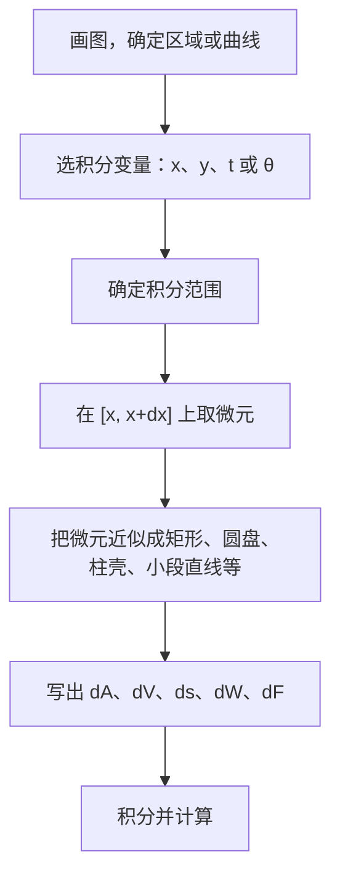

这一章的计算本身不难，难点在于**把题目描述的量正确地写成积分**。所有公式都来自同一个思想：**元素法**。只要掌握了元素法，公式忘了也能自己推出来。

## 一、本章地图

| 模块 | 要掌握什么 | 常见考法 |
| --- | --- | --- |
| 元素法 | 取微元、写表达式、积分 | 所有应用题的基础 |
| 平面面积 | 直角坐标、参数方程、极坐标 | 填空、解答 |
| 体积 | 旋转体（圆盘法、柱壳法）、平行截面 | 填空、解答 |
| 弧长 | 三种坐标形式 | 填空 |
| 旋转曲面面积 | 侧面积公式 | 填空（数一） |
| 物理应用 | 做功、水压力、引力 | 解答（数一） |
| 形心与平均值 | 形心公式、函数平均值 | 填空 |
| 综合 | 与最值、微分方程结合 | 解答 |

拿到应用题，按下面的步骤写积分：

## 二、核心概念

### 1. 元素法（微元法）

如果所求的量 $Q$ 满足：

1. **可加**：把区间分成若干小段，$Q$ 就分成对应的若干部分，总量等于各部分之和；
2. **能近似**：在小区间 $[x,x+\mathrm dx]$ 上，对应的部分 $\Delta Q\approx q(x)\,\mathrm dx$，误差是比 $\mathrm dx$ 高阶的无穷小，

那么

$$
Q=\int_a^bq(x)\,\mathrm dx.
$$

大白话：**在一小段上“以直代曲”“以不变代变”，写出这一小段的贡献 $\mathrm dQ$，再加起来。**

### 2. 常用的微元近似

| 要求的量 | 小段近似成 | 微元 |
| --- | --- | --- |
| 面积 | 竖条小矩形 | $\mathrm dA=\lvert f(x)-g(x)\rvert\,\mathrm dx$ |
| 极坐标面积 | 小扇形 | $\mathrm dA=\dfrac12r^2(\theta)\,\mathrm d\theta$ |
| 绕 $x$ 轴旋转体积 | 薄圆盘 | $\mathrm dV=\pi f^2(x)\,\mathrm dx$ |
| 绕 $y$ 轴旋转体积 | 薄柱壳 | $\mathrm dV=2\pi\lvert x\rvert\,\lvert f(x)\rvert\,\mathrm dx$ |
| 弧长 | 小段直线（勾股定理） | $\mathrm ds=\sqrt{(\mathrm dx)^2+(\mathrm dy)^2}$ |
| 旋转曲面面积 | 圆台侧面 | $\mathrm dS=2\pi\lvert y\rvert\,\mathrm ds$ |

## 三、必背公式

### 1. 平面图形的面积

> [!IMPORTANT] 必背
> **直角坐标**（按 $x$ 积分，上减下；按 $y$ 积分，右减左）：
> $$A=\int_a^b\bigl[f(x)-g(x)\bigr]\mathrm dx\qquad A=\int_c^d\bigl[\varphi(y)-\psi(y)\bigr]\mathrm dy$$
> **参数方程** $x=x(t),\ y=y(t)$：
> $$A=\left\lvert\int_{t_1}^{t_2}y(t)\,x'(t)\,\mathrm dt\right\rvert$$
> **极坐标** $r=r(\theta)$，$\alpha\le\theta\le\beta$：
> $$A=\frac12\int_\alpha^\beta r^2(\theta)\,\mathrm d\theta$$

### 2. 体积

> [!IMPORTANT] 必背
> 设 $f$ 在 $[a,b]$ 上连续，区域由 $y=f(x)$、$x=a$、$x=b$ 和 $x$ 轴围成。
>
> **绕 $x$ 轴**（圆盘法）：
> $$V_x=\pi\int_a^bf^2(x)\,\mathrm dx$$
> **绕 $y$ 轴**（柱壳法，$0\le a<b$）：
> $$V_y=2\pi\int_a^bx\,\lvert f(x)\rvert\,\mathrm dx$$
> **已知平行截面面积 $A(x)$**：
> $$V=\int_a^bA(x)\,\mathrm dx$$

**绕任意直线旋转**：

- 绕水平直线 $y=y_0$：用垫圈（圆环）法，$\mathrm dV=\pi\bigl(R_{\text{外}}^2-R_{\text{内}}^2\bigr)\mathrm dx$，半径是**到旋转轴的距离**。
- 绕竖直直线 $x=x_0$：用柱壳法，$\mathrm dV=2\pi\lvert x-x_0\rvert\cdot h(x)\,\mathrm dx$，$h(x)$ 是竖条的高。

### 3. 弧长

> [!IMPORTANT] 必背
> $$\text{直角坐标：}s=\int_a^b\sqrt{1+y'^2}\,\mathrm dx$$
> $$\text{参数方程：}s=\int_{t_1}^{t_2}\sqrt{x'^2(t)+y'^2(t)}\,\mathrm dt$$
> $$\text{极坐标：}s=\int_\alpha^\beta\sqrt{r^2(\theta)+r'^2(\theta)}\,\mathrm d\theta$$

### 4. 旋转曲面面积（数一）

曲线 $y=f(x)$（$a\le x\le b$）绕 $x$ 轴旋转一周，侧面积为

$$
S=2\pi\int_a^b\lvert f(x)\rvert\sqrt{1+f'^2(x)}\,\mathrm dx.
$$

参数方程形式：$S=2\pi\displaystyle\int_{t_1}^{t_2}\lvert y(t)\rvert\sqrt{x'^2(t)+y'^2(t)}\,\mathrm dt$。

### 5. 物理应用（数一）

| 物理量 | 微元 | 说明 |
| --- | --- | --- |
| 变力做功 | $\mathrm dW=F(x)\,\mathrm dx$ | 抽水做功：$\mathrm dW=\rho g\cdot\mathrm dV\cdot(\text{提升高度})$ |
| 水压力 | $\mathrm dF=\rho g\,h(x)\cdot w(x)\,\mathrm dx$ | $h$ 是**深度**，$w$ 是该深度处的板宽 |
| 引力 | $\mathrm dF=\dfrac{Gm\,\mathrm dM}{r^2}$ | 方向不同时要分解，再分别积分 |

水的密度 $\rho=1000\ \text{kg/m}^3$，$g=9.8\ \text{m/s}^2$。

### 6. 形心与平均值

区域 $D$ 由 $y=f(x)\ (f\ge0)$、$x=a$、$x=b$ 和 $x$ 轴围成，面积为 $A$，形心为

$$
\bar x=\frac{1}{A}\int_a^bxf(x)\,\mathrm dx,\qquad\bar y=\frac{1}{A}\int_a^b\frac12f^2(x)\,\mathrm dx.
$$

函数在 $[a,b]$ 上的平均值：

$$
\bar f=\frac{1}{b-a}\int_a^bf(x)\,\mathrm dx.
$$

> [!TIP] 古尔丁定理（用来检验）
> 平面图形绕一条不穿过它的直线旋转，体积 $=$ 面积 $\times$ 形心转过的圆周长，即 $V=2\pi d\cdot A$，$d$ 为形心到旋转轴的距离。考试很少直接考，但可以用来**检查体积算得对不对**。

## 四、题型与解题套路

### 题型 1：直角坐标求面积

**解法步骤**：

1. 画图，求出曲线的交点；
2. **选积分变量**：哪个方向上“上下边界”或“左右边界”不需要分段，就选哪个；
3. 上减下（或右减左），积分。

**例 1** 求 $y=x^2$ 与 $y=\sqrt x$ 所围图形的面积。

**解** 交点为 $(0,0)$ 和 $(1,1)$，在 $[0,1]$ 上 $\sqrt x\ge x^2$：

$$
A=\int_0^1\left(\sqrt x-x^2\right)\mathrm dx=\frac23-\frac13=\boxed{\frac13}.
$$

**例 2** 求抛物线 $y^2=2x$ 与直线 $y=x-4$ 所围图形的面积。

**解** 联立：$y^2=2(y+4)$，$y^2-2y-8=0$，得 $y=-2$ 或 $y=4$，交点为 $(2,-2)$ 和 $(8,4)$。

若按 $x$ 积分，下边界在 $x=2$ 处从抛物线换成直线，要分两段。**按 $y$ 积分**更简单：右边界是直线 $x=y+4$，左边界是抛物线 $x=\dfrac{y^2}{2}$：

$$
A=\int_{-2}^4\left(y+4-\frac{y^2}{2}\right)\mathrm dy=\left[\frac{y^2}{2}+4y-\frac{y^3}{6}\right]_{-2}^4=\frac{40}{3}+\frac{14}{3}=\boxed{18}.
$$

> [!TIP] 怎么选积分变量
> 用竖线扫过区域，如果“上边界”或“下边界”中途换了曲线，就要分段；这时换成横线扫（按 $y$ 积分），往往不用分段。

### 题型 2：参数方程求面积

**例 3** 求摆线 $x=a(t-\sin t)$，$y=a(1-\cos t)$ 的一拱（$0\le t\le2\pi$）与 $x$ 轴所围图形的面积。

**解**

$$
A=\int_0^{2\pi}y\,x'(t)\,\mathrm dt=a^2\int_0^{2\pi}(1-\cos t)^2\,\mathrm dt=a^2\int_0^{2\pi}\left(1-2\cos t+\cos^2t\right)\mathrm dt.
$$

$\displaystyle\int_0^{2\pi}\cos t\,\mathrm dt=0$，$\displaystyle\int_0^{2\pi}\cos^2t\,\mathrm dt=\pi$，所以 $A=a^2(2\pi+\pi)=\boxed{3\pi a^2}$。

**例 4** 用参数方程求椭圆 $\dfrac{x^2}{a^2}+\dfrac{y^2}{b^2}=1$ 的面积。

**解** 设 $x=a\cos t$，$y=b\sin t$。由对称性，面积是第一象限部分的 4 倍。第一象限中 $x$ 从 $0$ 到 $a$，对应 $t$ 从 $\frac\pi2$ 到 $0$：

$$
A=4\int_{\frac\pi2}^0b\sin t\cdot(-a\sin t)\,\mathrm dt=4ab\int_0^{\frac\pi2}\sin^2t\,\mathrm dt=4ab\cdot\frac\pi4=\boxed{\pi ab}.
$$

### 题型 3：极坐标求面积

**解法步骤**：

1. 画出曲线，确定 $\theta$ 的范围，**保证 $r\ge0$**；
2. 有对称性的先算一部分；
3. 两条曲线之间的面积：$\dfrac12\displaystyle\int\bigl(r_{\text{外}}^2-r_{\text{内}}^2\bigr)\mathrm d\theta$。

**例 5** 求心形线 $r=a(1+\cos\theta)$ 所围图形的面积。

**解**

$$
A=\frac12\int_0^{2\pi}a^2(1+\cos\theta)^2\,\mathrm d\theta=\frac{a^2}{2}\int_0^{2\pi}\left(1+2\cos\theta+\cos^2\theta\right)\mathrm d\theta=\frac{a^2}{2}(2\pi+\pi)=\boxed{\frac{3\pi a^2}{2}}.
$$

**例 6** 求圆 $r=3\cos\theta$ 内、心形线 $r=1+\cos\theta$ 外的部分的面积。

**解** 交点：$3\cos\theta=1+\cos\theta$，$\cos\theta=\frac12$，$\theta=\pm\frac\pi3$。在 $\left[-\frac\pi3,\frac\pi3\right]$ 上圆在外、心形线在内。由上下对称性：

$$
A=2\cdot\frac12\int_0^{\frac\pi3}\left[9\cos^2\theta-(1+\cos\theta)^2\right]\mathrm d\theta=\int_0^{\frac\pi3}\left(8\cos^2\theta-2\cos\theta-1\right)\mathrm d\theta.
$$

用 $8\cos^2\theta=4+4\cos2\theta$：

$$
\int_0^{\frac\pi3}\left(3+4\cos2\theta-2\cos\theta\right)\mathrm d\theta=\pi+2\sin\frac{2\pi}{3}-2\sin\frac\pi3=\pi+\sqrt3-\sqrt3=\boxed{\pi}.
$$

### 题型 4：旋转体体积

**例 7** 设 $D$ 由 $y=\sin x\ (0\le x\le\pi)$ 和 $x$ 轴围成，分别求 $D$ 绕 $x$ 轴、绕 $y$ 轴旋转所得的体积。

**解** 绕 $x$ 轴，圆盘法：

$$
V_x=\pi\int_0^\pi\sin^2x\,\mathrm dx=\pi\cdot\frac\pi2=\boxed{\frac{\pi^2}{2}}.
$$

绕 $y$ 轴，柱壳法：

$$
V_y=2\pi\int_0^\pi x\sin x\,\mathrm dx=2\pi\cdot\pi=\boxed{2\pi^2}.
$$

其中 $\displaystyle\int_0^\pi x\sin x\,\mathrm dx=\Bigl[-x\cos x+\sin x\Bigr]_0^\pi=\pi$，也可以用第 06 篇的区间再现公式：$\dfrac\pi2\displaystyle\int_0^\pi\sin x\,\mathrm dx=\pi$。

> [!TIP] 绕 $y$ 轴优先用柱壳法
> 绕 $y$ 轴如果用圆盘法，要把 $y=\sin x$ 反解成 $x$ 关于 $y$ 的函数，而且左右两支要分开处理，很麻烦。柱壳法直接按 $x$ 积分，不用反解。

### 题型 5：绕任意直线旋转

**例 8** 设 $D$ 由 $y=x^2$ 和 $y=1$ 围成，求 $D$ 绕直线 $y=-1$ 旋转所得的体积。

**解** 垫圈法。在 $x$ 处，外半径是 $y=1$ 到 $y=-1$ 的距离 $2$，内半径是 $y=x^2$ 到 $y=-1$ 的距离 $x^2+1$：

$$
V=\pi\int_{-1}^1\left[2^2-(x^2+1)^2\right]\mathrm dx=2\pi\int_0^1\left(3-2x^2-x^4\right)\mathrm dx=2\pi\left(3-\frac23-\frac15\right)=\boxed{\frac{64\pi}{15}}.
$$

> [!WARNING] 半径是到旋转轴的距离
> 绕 $y=-1$ 旋转时，半径是 $y-(-1)=y+1$，不是 $y$。绕 $x=x_0$ 用柱壳法时，柱壳半径是 $\lvert x-x_0\rvert$。

### 题型 6：已知平行截面面积求体积

**例 9** 一个立体的底面是圆 $x^2+y^2\le R^2$，垂直于 $x$ 轴的截面都是正方形。求它的体积。

**解** 在 $x$ 处，截面正方形的边长是圆在该处的弦长 $2\sqrt{R^2-x^2}$，面积 $A(x)=4(R^2-x^2)$：

$$
V=\int_{-R}^R4(R^2-x^2)\,\mathrm dx=8\int_0^R(R^2-x^2)\,\mathrm dx=\boxed{\frac{16R^3}{3}}.
$$

### 题型 7：弧长

**例 10** 求曲线 $y=\dfrac23x^{\frac32}$ 在 $0\le x\le3$ 上的弧长。

**解** $y'=\sqrt x$，$\sqrt{1+y'^2}=\sqrt{1+x}$：

$$
s=\int_0^3\sqrt{1+x}\,\mathrm dx=\frac23\Bigl[(1+x)^{\frac32}\Bigr]_0^3=\frac23(8-1)=\boxed{\frac{14}{3}}.
$$

**例 11** 求摆线一拱 $x=a(t-\sin t)$，$y=a(1-\cos t)$（$0\le t\le2\pi$）的长度。

**解**

$$
\sqrt{x'^2+y'^2}=a\sqrt{(1-\cos t)^2+\sin^2t}=a\sqrt{2-2\cos t}=2a\left\lvert\sin\frac t2\right\rvert.
$$

在 $[0,2\pi]$ 上 $\sin\frac t2\ge0$：

$$
s=\int_0^{2\pi}2a\sin\frac t2\,\mathrm dt=2a\Bigl[-2\cos\frac t2\Bigr]_0^{2\pi}=\boxed{8a}.
$$

**例 12** 求心形线 $r=a(1+\cos\theta)$ 的全长。

**解**

$$
\sqrt{r^2+r'^2}=a\sqrt{(1+\cos\theta)^2+\sin^2\theta}=a\sqrt{2+2\cos\theta}=2a\left\lvert\cos\frac\theta2\right\rvert.
$$

由对称性，算上半部分（$0\le\theta\le\pi$，此时 $\cos\frac\theta2\ge0$）再乘 2：

$$
s=2\int_0^\pi2a\cos\frac\theta2\,\mathrm d\theta=4a\Bigl[2\sin\frac\theta2\Bigr]_0^\pi=\boxed{8a}.
$$

> [!WARNING] 开根号后的绝对值
> $\sqrt{2-2\cos t}=2\left\lvert\sin\frac t2\right\rvert$，必须带绝对值。如果在 $[0,2\pi]$ 上直接积 $\cos\frac\theta2$（不加绝对值），后半段会变成负数，结果算成 $0$。

### 题型 8：旋转曲面面积（数一）

**例 13** 用旋转曲面面积公式求半径为 $R$ 的球面面积。

**解** 球面由 $y=\sqrt{R^2-x^2}$（$-R\le x\le R$）绕 $x$ 轴旋转得到。$y'=-\dfrac{x}{\sqrt{R^2-x^2}}$，

$$
y\sqrt{1+y'^2}=\sqrt{R^2-x^2}\cdot\frac{R}{\sqrt{R^2-x^2}}=R.
$$

$$
S=2\pi\int_{-R}^RR\,\mathrm dx=\boxed{4\pi R^2}.
$$

> [!CAUTION] 侧面积用 $\mathrm ds$，不是 $\mathrm dx$
> 如果写成 $2\pi\displaystyle\int\lvert y\rvert\,\mathrm dx$，对球面会得到 $\pi^2R^2$，是错的。体积可以用 $\mathrm dx$（薄圆盘的厚度），但侧面积必须用斜边长 $\mathrm ds$（圆台侧面沿母线的宽度）。

### 题型 9：变力做功（抽水问题）

**解法**：在深度 $x$ 处取厚度为 $\mathrm dx$ 的一薄层水，

$$
\mathrm dW=\underbrace{\rho g\cdot\mathrm dV}_{\text{这层水的重力}}\times\underbrace{(\text{提升距离})}_{\text{从深度 }x\text{ 抽到出口}}.
$$

**例 14** 一个圆柱形水池，底面半径 $3\ \text{m}$，高 $5\ \text{m}$，装满水。把水全部从池口抽出，需要做多少功？

**解** 以池口为原点，$x$ 轴竖直向下。深度 $x$ 处厚 $\mathrm dx$ 的薄层体积为 $9\pi\,\mathrm dx$，需要提升 $x$ 米：

$$
W=\int_0^5\rho g\cdot9\pi x\,\mathrm dx=9\pi\rho g\cdot\frac{25}{2}=112.5\pi\rho g.
$$

代入 $\rho=1000$，$g=9.8$：$W=1.1025\times10^6\pi\ \text{J}\approx\boxed{3.46\times10^6\ \text{J}}$。

> [!TIP] 坐标轴的选法
> 以水面或池口为原点、向下为正，提升距离就是 $x$，最省事。如果出口高出池口 $h$ 米，提升距离改为 $x+h$。

### 题型 10：水压力

**解法**：压强随深度变化，在深度 $x$ 处取一条水平窄带，

$$
\mathrm dF=\underbrace{\rho gx}_{\text{压强}}\times\underbrace{w(x)\,\mathrm dx}_{\text{窄带面积}}.
$$

**例 15** 一块等腰三角形薄板竖直放入水中，底边长 $6\ \text{m}$ 恰好与水面平齐，顶点朝下，高 $3\ \text{m}$。求薄板一侧所受的水压力。

**解** 深度 $x$ 处的板宽由相似三角形得 $w(x)=6\left(1-\dfrac x3\right)=6-2x$：

$$
F=\int_0^3\rho gx(6-2x)\,\mathrm dx=\rho g\left[3x^2-\frac23x^3\right]_0^3=\rho g(27-18)=9\rho g.
$$

代入得 $F=9\times9800=\boxed{88200\ \text{N}}$。

### 题型 11：引力

**例 16** 一根均匀细杆长 $l$，线密度为 $\mu$。在杆的延长线上、距杆的一端 $a$ 处有一个质量为 $m$ 的质点。求杆对质点的引力。

**解** 以质点为原点，杆位于 $[a,a+l]$ 上。在 $x$ 处取长 $\mathrm dx$ 的一小段，质量 $\mu\,\mathrm dx$，所有小段的引力方向相同：

$$
F=\int_a^{a+l}\frac{Gm\mu}{x^2}\,\mathrm dx=Gm\mu\left(\frac1a-\frac{1}{a+l}\right)=\boxed{\frac{Gm\mu l}{a(a+l)}}.
$$

> [!WARNING] 方向不同时要分解
> 如果质点不在杆的延长线上（例如在杆的中垂线上），各小段的引力方向不同，不能直接相加。要先把 $\mathrm dF$ 分解到 $x$、$y$ 两个方向，分别积分，并利用对称性消去一个分量。

### 题型 12：形心

**例 17** 求 $y=\sin x\ (0\le x\le\pi)$ 与 $x$ 轴所围区域的形心。

**解** 面积 $A=\displaystyle\int_0^\pi\sin x\,\mathrm dx=2$。

区域关于 $x=\frac\pi2$ 对称，所以 $\bar x=\dfrac\pi2$。

$$
\bar y=\frac1A\int_0^\pi\frac12\sin^2x\,\mathrm dx=\frac12\cdot\frac12\cdot\frac\pi2=\boxed{\frac\pi8}.
$$

**验证**：用古尔丁定理，绕 $x$ 轴的体积 $=2\pi\bar y\cdot A=2\pi\cdot\dfrac\pi8\cdot2=\dfrac{\pi^2}{2}$，与例 7 的结果一致。

### 题型 13：与最值结合的综合题

**例 18** 设 $0<t<1$，记 $S_1$ 为曲线 $y=x^2$、直线 $y=t^2$ 和 $y$ 轴所围的面积，$S_2$ 为曲线 $y=x^2$、直线 $y=t^2$ 和 $x=1$ 所围的面积。求 $t$ 使 $S=S_1+S_2$ 最小。

**解**

$$
S_1=\int_0^t(t^2-x^2)\,\mathrm dx=\frac23t^3,\qquad S_2=\int_t^1(x^2-t^2)\,\mathrm dx=\frac{1-t^3}{3}-t^2(1-t).
$$

$$
S(t)=\frac43t^3-t^2+\frac13,\qquad S'(t)=4t^2-2t=2t(2t-1).
$$

在 $(0,1)$ 内唯一驻点为 $t=\frac12$，且 $S'$ 在它左侧为负、右侧为正，是最小值点。

最小值 $S\left(\frac12\right)=\dfrac16-\dfrac14+\dfrac13=\boxed{\dfrac14}$。

> [!TIP] 综合题的套路
> 先用含参数的积分写出要优化的量，再用第 04 篇求最值的方法。写积分时**参数当常数**，积分完再对参数求导。

## 五、证明思路

### 1. 为什么元素法成立

元素法其实是定积分定义的简写。在小区间上 $\Delta Q=q(\xi_i)\Delta x_i+o(\Delta x_i)$，求和后

$$
Q=\sum q(\xi_i)\Delta x_i+\sum o(\Delta x_i).
$$

第一项的极限就是 $\displaystyle\int_a^bq(x)\,\mathrm dx$。第二项中每个误差都是 $\Delta x_i$ 的高阶无穷小，加起来仍然趋于 $0$。所以写微元时，**只要保留与 $\mathrm dx$ 同阶的部分**。

### 2. 极坐标面积公式

在 $[\theta,\theta+\mathrm d\theta]$ 上，曲边扇形近似为半径 $r(\theta)$、圆心角 $\mathrm d\theta$ 的圆扇形，面积为

$$
\mathrm dA=\frac12r^2(\theta)\,\mathrm d\theta.
$$

### 3. 柱壳法

把 $[x,x+\mathrm dx]$ 上的竖条绕 $y$ 轴旋转，得到一个薄圆筒。把它沿竖直方向剪开、摊平，近似为一块长方体薄板：

- 长：圆筒的周长 $2\pi x$；
- 高：$f(x)$；
- 厚：$\mathrm dx$。

所以 $\mathrm dV=2\pi xf(x)\,\mathrm dx$。

### 4. 弧长公式

在小段上用切线段近似曲线，由勾股定理：

$$
\mathrm ds=\sqrt{(\mathrm dx)^2+(\mathrm dy)^2}=\sqrt{1+\left(\frac{\mathrm dy}{\mathrm dx}\right)^2}\,\mathrm dx.
$$

参数方程中把 $\mathrm dx=x'\,\mathrm dt$、$\mathrm dy=y'\,\mathrm dt$ 代入即可。

极坐标中 $x=r\cos\theta$，$y=r\sin\theta$，可以算出

$$
x'^2+y'^2=(r'\cos\theta-r\sin\theta)^2+(r'\sin\theta+r\cos\theta)^2=r^2+r'^2.
$$

### 5. 为什么侧面积要用 $\mathrm ds$

体积的微元是薄圆盘，用 $\mathrm dx$ 代替真实厚度，误差是高阶无穷小，不影响结果。

侧面积的微元是一圈窄带，它的真实宽度是沿曲线方向的 $\mathrm ds$。如果用 $\mathrm dx$ 代替，两者之比是 $\dfrac{\mathrm ds}{\mathrm dx}=\sqrt{1+y'^2}$，一般不趋于 $1$，误差**不是高阶无穷小**，所以不能替换。

## 六、易错点

> [!CAUTION] 极坐标中 $\theta$ 的范围
> 四叶玫瑰线 $r=a\cos2\theta$：如果直接写 $\dfrac12\displaystyle\int_0^{2\pi}a^2\cos^22\theta\,\mathrm d\theta$，碰巧也能得到四片叶子的总面积 $\dfrac{\pi a^2}{2}$。但对 $r=a\sin3\theta$ 这类三叶玫瑰线，在 $[0,2\pi]$ 上积分会**把每片叶子算两次**。
>
> 稳妥的做法是：**先找出一片叶子对应的 $\theta$ 范围（$r\ge0$），算一片，再乘片数**。

- **按 $x$ 积分需要分段时没有分段**：换成按 $y$ 积分。
- **参数方程面积忘记取绝对值**：$t$ 增大时 $x$ 可能减小，积分会出现负号。
- **绕 $y$ 轴用了 $\pi\displaystyle\int f^2\,\mathrm dx$**：那是绕 $x$ 轴的公式。
- **绕任意直线时，半径没有换成到旋转轴的距离**。
- **垫圈法写成 $\pi(R_{\text{外}}-R_{\text{内}})^2$**：应该是 $\pi\bigl(R_{\text{外}}^2-R_{\text{内}}^2\bigr)$。
- **弧长开根号后丢了绝对值**。
- **侧面积用 $\mathrm dx$ 代替 $\mathrm ds$**。
- **水压力用高度代替深度**：压强 $\rho gx$ 中的 $x$ 是到水面的深度。
- **引力方向不同时直接相加**。

## 七、小练习

**1.** 求曲线 $y=e^x$、$y=e^{-x}$ 与直线 $x=1$ 所围图形的面积。

点击查看答案

两曲线交于 $(0,1)$，在 $[0,1]$ 上 $e^x\ge e^{-x}$：

$$A=\int_0^1\left(e^x-e^{-x}\right)\mathrm dx=e+\frac1e-2.$$

**2.** 设 $D$ 由 $y=\sqrt x$、$x=4$ 和 $x$ 轴围成，分别求 $D$ 绕 $x$ 轴、绕 $y$ 轴旋转所得的体积。

点击查看答案

$$V_x=\pi\int_0^4x\,\mathrm dx=8\pi,\qquad V_y=2\pi\int_0^4x\sqrt x\,\mathrm dx=2\pi\cdot\frac25\cdot4^{\frac52}=\frac{128\pi}{5}.$$

**3.** 求曲线 $y=\ln\cos x$ 在 $0\le x\le\dfrac\pi4$ 上的弧长。

点击查看答案

$y'=-\tan x$，$\sqrt{1+\tan^2x}=\sec x$：

$$s=\int_0^{\frac\pi4}\sec x\,\mathrm dx=\Bigl[\ln\lvert\sec x+\tan x\rvert\Bigr]_0^{\frac\pi4}=\ln\left(\sqrt2+1\right).$$

**4.** 求四叶玫瑰线 $r=a\cos2\theta$ 所围图形的总面积。

点击查看答案

一片叶子对应 $-\dfrac\pi4\le\theta\le\dfrac\pi4$（此时 $r\ge0$）：

$$A_1=\frac12\int_{-\frac\pi4}^{\frac\pi4}a^2\cos^22\theta\,\mathrm d\theta=\frac{a^2}{2}\cdot\frac\pi4=\frac{\pi a^2}{8}.$$

共 4 片，总面积为 $\dfrac{\pi a^2}{2}$。

**5.** 一个矩形闸门竖直放在水中，宽 $2\ \text{m}$，高 $3\ \text{m}$，上沿与水面平齐。求闸门一侧所受的水压力。

点击查看答案

深度 $x$ 处的宽度恒为 $2$：

$$F=\int_0^3\rho gx\cdot2\,\mathrm dx=9\rho g=88200\ \text{N}.$$

和例 15 的三角形薄板结果相同，可以想一想为什么：两者面积分别是 $6$ 和 $9$，形心深度分别是 $1.5$ 和 $1$，“面积 × 形心深度”都等于 $9$。

## 八、本章小结

- 所有应用题都用**元素法**：取微元、以直代曲、写出 $\mathrm dQ$、积分。
- 面积：直角坐标“上减下”，需要分段就换变量；参数方程 $\displaystyle\int y\,\mathrm dx$ 取绝对值；极坐标 $\dfrac12\displaystyle\int r^2\,\mathrm d\theta$，**先定 $\theta$ 范围**。
- 体积：绕 $x$ 轴用**圆盘**，绕 $y$ 轴用**柱壳**，绕任意直线时半径是**到轴的距离**；已知截面面积就直接积 $A(x)$。
- 弧长三种形式都来自 $\mathrm ds=\sqrt{\mathrm dx^2+\mathrm dy^2}$，开根号**注意绝对值**。
- 侧面积 $2\pi\displaystyle\int\lvert y\rvert\,\mathrm ds$，**必须用 $\mathrm ds$**。
- 物理应用：做功看**重力 × 提升距离**，水压力看**深度 × 宽度**，引力方向不同要**分解**。

下一篇：**08 常微分方程**。
