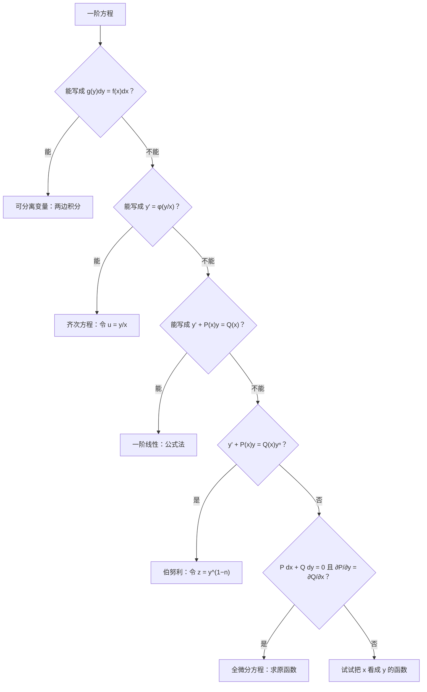

微分方程是考研的固定考点，几乎每年都有。好消息是**题型非常固定**：先判断方程属于哪一类，每一类都有现成的解法。这一篇的重点就是“认类型”。

## 一、本章地图

| 模块 | 要掌握什么 | 常见考法 |
| --- | --- | --- |
| 基本概念 | 阶、通解、特解、解的结构 | 选择题 |
| 一阶方程 | 可分离、齐次、一阶线性、伯努利、全微分 | 填空、解答 |
| 可降阶方程 | $y''=f(x,y')$、$y''=f(y,y')$ | 填空、解答 |
| 二阶常系数齐次 | 特征方程三种情况 | 填空 |
| 二阶常系数非齐次 | 待定系数法设特解 | 填空、解答 |
| 欧拉方程（数一） | 换元 $x=e^t$ | 填空 |
| 应用 | 几何、物理问题列方程 | 解答 |

拿到一个一阶方程，按下面的顺序判断类型：

## 二、核心概念

### 1. 基本术语

- **阶**：方程中未知函数导数的最高阶数。
- **通解**：含有**独立的**任意常数，且常数个数**等于方程的阶数**的解。
- **特解**：不含任意常数的解，一般由初始条件确定通解中的常数得到。

> [!NOTE] 通解不一定包含全部解
> 例如 $y'=y^2$ 的通解是 $y=-\dfrac{1}{x+C}$，但 $y=0$ 也是解，却不在通解里。考研中“通解”按上面的定义理解即可。

### 2. 线性方程解的结构

二阶线性方程：

$$
y''+P(x)y'+Q(x)y=f(x)\tag{非齐次}
$$

$$
y''+P(x)y'+Q(x)y=0\tag{齐次}
$$

> [!IMPORTANT] 解的结构（必背）
> 1. 若 $y_1,y_2$ 是齐次方程的两个**线性无关**的解（即 $\dfrac{y_1}{y_2}$ 不是常数），则齐次方程的通解为 $Y=C_1y_1+C_2y_2$。
> 2. 非齐次方程的通解 $=$ 对应齐次方程的通解 $+$ 非齐次方程的一个特解：$y=Y+y^*$。
> 3. 非齐次方程的两个解之差，是齐次方程的解。
> 4. **叠加原理**：若 $y_1^*$ 是右端为 $f_1(x)$ 的特解，$y_2^*$ 是右端为 $f_2(x)$ 的特解，则 $y_1^*+y_2^*$ 是右端为 $f_1(x)+f_2(x)$ 的特解。

第 3 条最常考：已知非齐次方程的几个解，反求通解。

## 三、必背公式

### 1. 一阶线性方程

> [!IMPORTANT] 必背
> $y'+P(x)y=Q(x)$ 的通解为
> $$y=e^{-\int P(x)\,\mathrm dx}\left[\int Q(x)e^{\int P(x)\,\mathrm dx}\,\mathrm dx+C\right].$$
> 公式中的 $\int P(x)\,\mathrm dx$ 只取**一个**原函数，不用加 $C$。

### 2. 各类一阶方程的解法

| 类型 | 标准形式 | 解法 |
| --- | --- | --- |
| 可分离变量 | $y'=f(x)g(y)$ | $\displaystyle\int\frac{\mathrm dy}{g(y)}=\int f(x)\,\mathrm dx$ |
| 齐次方程 | $y'=\varphi\left(\dfrac yx\right)$ | 令 $u=\dfrac yx$，$y'=u+xu'$，化为可分离 |
| 一阶线性 | $y'+P(x)y=Q(x)$ | 公式法 |
| 伯努利 | $y'+P(x)y=Q(x)y^n$ | 令 $z=y^{1-n}$，化为关于 $z$ 的一阶线性 |
| 全微分 | $P\,\mathrm dx+Q\,\mathrm dy=0$，$\dfrac{\partial P}{\partial y}=\dfrac{\partial Q}{\partial x}$ | 求 $u(x,y)$ 使 $\mathrm du=P\,\mathrm dx+Q\,\mathrm dy$，通解 $u=C$ |

### 3. 可降阶的二阶方程

| 类型 | 解法 |
| --- | --- |
| $y''=f(x)$ | 直接积分两次 |
| $y''=f(x,y')$，**不含 $y$** | 令 $p=y'$，则 $y''=p'$ |
| $y''=f(y,y')$，**不含 $x$** | 令 $p=y'$，则 $y''=p\dfrac{\mathrm dp}{\mathrm dy}$ |

### 4. 二阶常系数齐次方程

> [!IMPORTANT] 必背
> $y''+py'+qy=0$ 的特征方程为 $r^2+pr+q=0$。
>
> | 特征根 | 通解 |
> | --- | --- |
> | 两个不等实根 $r_1\ne r_2$ | $y=C_1e^{r_1x}+C_2e^{r_2x}$ |
> | 二重根 $r_1=r_2=r$ | $y=(C_1+C_2x)e^{rx}$ |
> | 共轭复根 $\alpha\pm\beta i$ | $y=e^{\alpha x}(C_1\cos\beta x+C_2\sin\beta x)$ |

高阶也一样：$k$ 重实根 $r$ 对应 $(C_1+C_2x+\dots+C_kx^{k-1})e^{rx}$。

### 5. 二阶常系数非齐次方程的特解

> [!IMPORTANT] 待定系数法（必背）
> **类型一**：$f(x)=P_m(x)e^{\lambda x}$（$P_m$ 是 $m$ 次多项式），设
> $$y^*=x^kQ_m(x)e^{\lambda x},$$
> $Q_m$ 是待定的 $m$ 次多项式；$k$ 是 $\lambda$ 作为特征根的**重数**（不是根取 0，单根取 1，二重根取 2）。
>
> **类型二**：$f(x)=e^{\alpha x}\bigl[P_l(x)\cos\beta x+P_n(x)\sin\beta x\bigr]$，设
> $$y^*=x^ke^{\alpha x}\bigl[R_m(x)\cos\beta x+S_m(x)\sin\beta x\bigr],$$
> $m=\max\{l,n\}$；$k$ 看 $\alpha+\beta i$ 是不是特征根（不是取 0，是取 1）。**$\cos$ 和 $\sin$ 两项都要设**。

### 6. 欧拉方程（数一）

$x^2y''+pxy'+qy=f(x)$：令 $x=e^t$（即 $t=\ln x$），记 $D=\dfrac{\mathrm d}{\mathrm dt}$，则

$$
xy'=Dy,\qquad x^2y''=D(D-1)y.
$$

方程化为关于 $t$ 的常系数方程，解出后把 $t=\ln x$ 代回。

## 四、题型与解题套路

### 题型 1：可分离变量

**例 1** 求 $y'=\dfrac{xy}{1+x^2}$ 满足 $y(0)=2$ 的特解。

**解** 分离变量：$\dfrac{\mathrm dy}{y}=\dfrac{x}{1+x^2}\,\mathrm dx$，积分得

$$
\ln\lvert y\rvert=\frac12\ln(1+x^2)+C_1\ \Longrightarrow\ y=C\sqrt{1+x^2}.
$$

由 $y(0)=2$ 得 $C=2$，特解为 $\boxed{y=2\sqrt{1+x^2}}$。

> [!TIP] 绝对值和常数的处理
> 两边取指数后，$\pm e^{C_1}$ 合写成任意常数 $C$；$y=0$ 也是解，对应 $C=0$。所以通解直接写成 $y=C\sqrt{1+x^2}$ 即可。

### 题型 2：齐次方程

**例 2** 求 $xy'=y+x\tan\dfrac yx$ 的通解。

**解** 两边除以 $x$：$y'=\dfrac yx+\tan\dfrac yx$。令 $u=\dfrac yx$，$y'=u+xu'$：

$$
u+xu'=u+\tan u\ \Longrightarrow\ \frac{\cos u}{\sin u}\,\mathrm du=\frac{\mathrm dx}{x}.
$$

积分得 $\ln\lvert\sin u\rvert=\ln\lvert x\rvert+C_1$，即 $\sin u=Cx$。通解为 $\boxed{\sin\dfrac yx=Cx}$。

### 题型 3：一阶线性方程

**例 3** 求 $y'+\dfrac{y}{x}=\dfrac{\sin x}{x}$（$x>0$）的通解。

**解** $P(x)=\dfrac1x$，$e^{\int P\,\mathrm dx}=e^{\ln x}=x$：

$$
y=\frac1x\left[\int\frac{\sin x}{x}\cdot x\,\mathrm dx+C\right]=\boxed{\frac{C-\cos x}{x}}.
$$

**例 4（把 $x$ 看成 $y$ 的函数）** 求 $(x+y^2)\,\mathrm dy=y\,\mathrm dx$（$y>0$）的通解。

**解** 关于 $y$ 不是线性的，但改写为

$$
\frac{\mathrm dx}{\mathrm dy}-\frac{x}{y}=y,
$$

就是关于 $x(y)$ 的一阶线性方程，$P(y)=-\dfrac1y$，$e^{\int P\,\mathrm dy}=\dfrac1y$：

$$
x=y\left[\int y\cdot\frac1y\,\mathrm dy+C\right]=\boxed{y^2+Cy}.
$$

> [!TIP] 方程关于 $y$ 解不动时
> 把 $\dfrac{\mathrm dx}{\mathrm dy}$ 当未知函数试一试。特征是方程中 $x$ 只以一次方出现，而 $y$ 的次数较高。

### 题型 4：伯努利方程

**例 5** 求 $y'-y=xy^2$ 的通解。

**解** $n=2$，两边除以 $y^2$：$y^{-2}y'-y^{-1}=x$。令 $z=y^{-1}$，$z'=-y^{-2}y'$：

$$
z'+z=-x.
$$

一阶线性：$z=e^{-x}\left[\displaystyle\int-xe^x\,\mathrm dx+C\right]=e^{-x}\bigl[-(x-1)e^x+C\bigr]=1-x+Ce^{-x}$。

所以通解为 $\boxed{\dfrac1y=1-x+Ce^{-x}}$（另有解 $y=0$）。

### 题型 5：全微分方程

**例 6** 求 $(3x^2+2xy)\,\mathrm dx+(x^2+2y)\,\mathrm dy=0$ 的通解。

**解** $P=3x^2+2xy$，$Q=x^2+2y$，$\dfrac{\partial P}{\partial y}=2x=\dfrac{\partial Q}{\partial x}$，是全微分方程。

**凑微分**：$3x^2\,\mathrm dx+2y\,\mathrm dy+(2xy\,\mathrm dx+x^2\,\mathrm dy)=\mathrm d(x^3)+\mathrm d(y^2)+\mathrm d(x^2y)$。

通解为 $\boxed{x^3+x^2y+y^2=C}$。

> [!TIP] 凑微分常用的组合
> $x\,\mathrm dy+y\,\mathrm dx=\mathrm d(xy)$，$\dfrac{x\,\mathrm dy-y\,\mathrm dx}{x^2}=\mathrm d\left(\dfrac yx\right)$，$\dfrac{x\,\mathrm dx+y\,\mathrm dy}{x^2+y^2}=\mathrm d\left(\dfrac12\ln(x^2+y^2)\right)$。凑不出来时，用第 12 篇的曲线积分方法求原函数。

### 题型 6：可降阶方程

**例 7（不含 $y$）** 求 $xy''+y'=0$ 的通解。

**解** 令 $p=y'$：$xp'+p=0$，即 $(xp)'=0$，所以 $xp=C_1$，$y'=\dfrac{C_1}{x}$。

通解为 $\boxed{y=C_1\ln\lvert x\rvert+C_2}$。

**例 8（不含 $x$）** 求 $yy''=(y')^2$ 满足 $y(0)=1$，$y'(0)=2$ 的特解。

**解** 令 $p=y'$，$y''=p\dfrac{\mathrm dp}{\mathrm dy}$：$yp\dfrac{\mathrm dp}{\mathrm dy}=p^2$。由初始条件 $p\ne0$，约去 $p$：

$$
\frac{\mathrm dp}{p}=\frac{\mathrm dy}{y}\ \Longrightarrow\ p=C_1y.
$$

$x=0$ 时 $y=1$，$p=2$，得 $C_1=2$。再解 $y'=2y$：$y=C_2e^{2x}$，由 $y(0)=1$ 得 $C_2=1$。

特解为 $\boxed{y=e^{2x}}$。

> [!WARNING] 尽早代入初始条件
> 可降阶方程每积分一次就出现一个常数。**积分一次就代一次初始条件**，后面的计算会简单很多。

### 题型 7：二阶常系数齐次方程

**例 9** 分别求下列方程的通解：

1. $y''-2y'-3y=0$；
2. $y''+4y'+4y=0$；
3. $y''+2y'+5y=0$。

**解**

1. 特征方程 $r^2-2r-3=0$，$r_1=3$，$r_2=-1$，通解 $\boxed{y=C_1e^{3x}+C_2e^{-x}}$。
2. 特征方程 $r^2+4r+4=0$，二重根 $r=-2$，通解 $\boxed{y=(C_1+C_2x)e^{-2x}}$。
3. 特征方程 $r^2+2r+5=0$，$r=-1\pm2i$，通解 $\boxed{y=e^{-x}(C_1\cos2x+C_2\sin2x)}$。

### 题型 8：二阶常系数非齐次方程

**解法步骤**：

1. 解特征方程，写出齐次通解 $Y$；
2. 看右端 $f(x)$ 属于哪一类，确定 $\lambda$（或 $\alpha+\beta i$），**比较它和特征根**，定出 $k$；
3. 按公式设出 $y^*$，代入求系数；
4. 通解 $y=Y+y^*$。

**例 10** 求 $y''-3y'+2y=xe^{2x}$ 的通解。

**解** 特征根 $r_1=1$，$r_2=2$，$Y=C_1e^x+C_2e^{2x}$。

右端 $\lambda=2$ 是**单根**，$k=1$，$P_m$ 是一次多项式，设 $y^*=x(ax+b)e^{2x}$。

令 $u=ax^2+bx$，利用下面 TIP 中的公式，代入后化为

$$
u''+(2\cdot2-3)u'+(4-6+2)u=x\ \Longrightarrow\ 2a+2ax+b=x.
$$

比较系数：$a=\dfrac12$，$b=-1$。通解为

$$
\boxed{y=C_1e^x+C_2e^{2x}+\left(\frac12x^2-x\right)e^{2x}}.
$$

> [!TIP] 代入求系数的简便公式
> 对 $y''+py'+qy=P_m(x)e^{\lambda x}$，设 $y^*=u(x)e^{\lambda x}$，代入后约去 $e^{\lambda x}$，得到
> $$u''+(2\lambda+p)u'+(\lambda^2+p\lambda+q)u=P_m(x).$$
> - $\lambda$ 不是特征根：$u$ 的系数非零，$u$ 取 $m$ 次多项式；
> - $\lambda$ 是单根：$u$ 的系数为 0，$u'$ 的系数非零，$u$ 要比 $P_m$ 高一次；
> - $\lambda$ 是二重根：只剩 $u''=P_m$，$u$ 要高两次。
>
> 这正好解释了公式里 $x^k$ 的来历，也比直接对 $y^*$ 求两次导快得多。

**例 11** 求 $y''+y=\cos x$ 的通解。

**解** 特征根 $\pm i$，$Y=C_1\cos x+C_2\sin x$。

右端 $\alpha+\beta i=i$ 是特征根，$k=1$，设 $y^*=x(a\cos x+b\sin x)$。求导：

$$
y^{*\prime\prime}=2(-a\sin x+b\cos x)-x(a\cos x+b\sin x).
$$

代入：$y^{*\prime\prime}+y^*=-2a\sin x+2b\cos x=\cos x$，得 $a=0$，$b=\dfrac12$。通解为

$$
\boxed{y=C_1\cos x+C_2\sin x+\frac x2\sin x}.
$$

> [!WARNING] 设特解时 $\cos$ 和 $\sin$ 都要写
> 右端只有 $\cos x$，特解也要设成 $a\cos x+b\sin x$ 两项。本题 $a$ 恰好为 0，但事先不知道。

### 题型 9：解的结构

**例 12** 已知 $y_1=x^2$，$y_2=x^2+e^x$，$y_3=x^2+e^{2x}$ 是某二阶常系数线性非齐次方程的三个解，求该方程的通解，并写出这个方程。

**解** 非齐次方程的两个解之差是齐次方程的解：$y_2-y_1=e^x$，$y_3-y_1=e^{2x}$，两者线性无关。所以通解为

$$
\boxed{y=C_1e^x+C_2e^{2x}+x^2}.
$$

齐次部分的特征根是 $1,2$，特征方程 $(r-1)(r-2)=r^2-3r+2=0$，所以方程为 $y''-3y'+2y=f(x)$。把 $y^*=x^2$ 代入，$f(x)=2-6x+2x^2$。方程是

$$
y''-3y'+2y=2x^2-6x+2.
$$

### 题型 10：欧拉方程（数一）

**例 13** 求 $x^2y''+xy'-y=x^2$（$x>0$）的通解。

**解** 令 $x=e^t$，$x^2y''=D(D-1)y$，$xy'=Dy$：

$$
D(D-1)y+Dy-y=e^{2t}\ \Longrightarrow\ \frac{\mathrm d^2y}{\mathrm dt^2}-y=e^{2t}.
$$

特征根 $\pm1$，$\lambda=2$ 不是特征根，设 $y^*=Ae^{2t}$，代入得 $4A-A=1$，$A=\dfrac13$。所以

$$
y=C_1e^t+C_2e^{-t}+\frac13e^{2t}.
$$

代回 $e^t=x$：$\boxed{y=C_1x+\dfrac{C_2}{x}+\dfrac{x^2}{3}}$。

### 题型 11：积分方程化为微分方程

**识别特征**：未知函数出现在变限积分里。

**解法**：两边求导（可能要求两次），化成微分方程；**再把原方程中的 $x$ 取成积分下限，得到初始条件**。

**例 14** 设 $f$ 连续，且 $f(x)=e^x-\displaystyle\int_0^x(x-t)f(t)\,\mathrm dt$，求 $f(x)$。

**解** 由第 06 篇例 2，$\dfrac{\mathrm d}{\mathrm dx}\displaystyle\int_0^x(x-t)f(t)\,\mathrm dt=\int_0^xf(t)\,\mathrm dt$。两边求导两次：

$$
f'(x)=e^x-\int_0^xf(t)\,\mathrm dt,\qquad f''(x)=e^x-f(x).
$$

初始条件：原式取 $x=0$ 得 $f(0)=1$；第一式取 $x=0$ 得 $f'(0)=1$。

解 $f''+f=e^x$：$Y=C_1\cos x+C_2\sin x$，设 $f^*=Ae^x$，$2A=1$，$A=\dfrac12$。

由 $f(0)=C_1+\dfrac12=1$，$f'(0)=C_2+\dfrac12=1$，得 $C_1=C_2=\dfrac12$：

$$
\boxed{f(x)=\frac12\left(\cos x+\sin x+e^x\right)}.
$$

> [!WARNING] 初始条件藏在原方程里
> 求导会丢掉信息，必须从原方程（以及每次求导后的方程）中取 $x=0$ 补回初始条件，否则常数定不出来。

### 题型 12：应用题

**解法**：把题目中的几何或物理关系翻译成含导数的等式，再按类型求解。

**例 15（几何）** 曲线 $y=y(x)$（$x>0$）过点 $(1,1)$，曲线上任一点处的切线在 $y$ 轴上的截距等于该点的横坐标。求这条曲线。

**解** 点 $(x,y)$ 处的切线为 $Y-y=y'(X-x)$，令 $X=0$，截距为 $y-xy'$。由条件 $y-xy'=x$，即

$$
y'-\frac yx=-1.
$$

一阶线性，$e^{\int P\,\mathrm dx}=\dfrac1x$：$y=x\left[\displaystyle\int-\frac1x\,\mathrm dx+C\right]=x(C-\ln x)$。

由 $y(1)=1$ 得 $C=1$，曲线为 $\boxed{y=x(1-\ln x)}$。

**例 16（物理）** 质量为 $m$ 的物体从静止开始下落，所受空气阻力与速度成正比（比例系数 $k>0$）。求速度 $v(t)$。

**解** 由牛顿第二定律，$m\dfrac{\mathrm dv}{\mathrm dt}=mg-kv$，$v(0)=0$。分离变量：

$$
\frac{\mathrm dv}{mg-kv}=\frac{\mathrm dt}{m}\ \Longrightarrow\ -\frac1k\ln(mg-kv)=\frac tm+C.
$$

由 $v(0)=0$ 定出常数，整理得

$$
\boxed{v(t)=\frac{mg}{k}\left(1-e^{-\frac{k}{m}t}\right)}.
$$

$t\to+\infty$ 时 $v\to\dfrac{mg}{k}$，这就是“收尾速度”。

## 五、证明思路

### 1. 一阶线性公式（常数变易法）

先解齐次方程 $y'+Py=0$，分离变量得 $y=Ce^{-\int P\,\mathrm dx}$。

把常数 $C$ 换成函数 $C(x)$，设 $y=C(x)e^{-\int P\,\mathrm dx}$，代入原方程，含 $C(x)$ 的项互相抵消，剩下

$$
C'(x)e^{-\int P\,\mathrm dx}=Q(x)\ \Longrightarrow\ C(x)=\int Qe^{\int P\,\mathrm dx}\,\mathrm dx+C.
$$

### 2. 特征方程的由来

猜 $y=e^{rx}$，代入 $y''+py'+qy=0$，得 $(r^2+pr+q)e^{rx}=0$。所以 $r$ 必须满足特征方程。

**二重根时 $xe^{rx}$ 也是解**：用题型 8 TIP 中的公式，$u=x$，$u''=0$；二重根满足 $r^2+pr+q=0$ 且 $2r+p=0$，所以左边为 0。

**复根时**：$e^{(\alpha+\beta i)x}=e^{\alpha x}(\cos\beta x+i\sin\beta x)$，它的实部和虚部分别是实数解。

### 3. 解的结构

线性方程的左端 $L[y]=y''+Py'+Qy$ 满足 $L[C_1y_1+C_2y_2]=C_1L[y_1]+C_2L[y_2]$。由此：

- 齐次解的线性组合仍是齐次解；
- $L[y_1]=f$，$L[y_2]=f$，则 $L[y_1-y_2]=0$；
- $L[y_1^*]=f_1$，$L[y_2^*]=f_2$，则 $L[y_1^*+y_2^*]=f_1+f_2$。

### 4. 欧拉方程的换元

$x=e^t$，$\dfrac{\mathrm dt}{\mathrm dx}=\dfrac1x$，所以

$$
y'=\frac1x\frac{\mathrm dy}{\mathrm dt},\qquad y''=\frac{1}{x^2}\left(\frac{\mathrm d^2y}{\mathrm dt^2}-\frac{\mathrm dy}{\mathrm dt}\right).
$$

于是 $xy'=Dy$，$x^2y''=(D^2-D)y=D(D-1)y$。

### 5. 伯努利方程的换元

两边除以 $y^n$：$y^{-n}y'+Py^{1-n}=Q$。令 $z=y^{1-n}$，则 $z'=(1-n)y^{-n}y'$，方程变为

$$
\frac{z'}{1-n}+Pz=Q,
$$

是关于 $z$ 的一阶线性方程。

## 六、易错点

> [!CAUTION] 特解中 $k$ 的取法
> $k$ 由 $\lambda$（或 $\alpha+\beta i$）**是不是特征根、是几重根**决定，与右端多项式的次数无关。
>
> 例如 $y''-2y'+y=e^x$：$\lambda=1$ 是**二重根**，应设 $y^*=Ax^2e^x$。设成 $Ae^x$ 或 $Axe^x$，代入后都会得到 $0=e^x$ 的矛盾。

- **一阶线性方程没有化成标准形式**：$y'$ 的系数必须是 1，再读出 $P(x)$。
- **公式中 $\int P\,\mathrm dx$ 又加了常数**：只取一个原函数。
- **分离变量时除掉了 $y$，漏掉 $y=0$ 这个解**。
- **类型二只设了 $\cos$ 或只设了 $\sin$**。
- **$P_m$ 是一次多项式，特解却只设了常数 $A$**：$Q_m$ 要设成完整的 $m$ 次多项式 $ax+b$。
- **积分方程忘记找初始条件**。
- **欧拉方程解完忘记把 $t=\ln x$ 代回**。

## 七、小练习

**1.** 求 $y'=e^{x-y}$ 满足 $y(0)=0$ 的特解。

点击查看答案

分离变量：$e^y\,\mathrm dy=e^x\,\mathrm dx$，积分得 $e^y=e^x+C$。由 $y(0)=0$ 得 $C=0$，特解为 $y=x$。

**2.** 求 $y''-4y'+4y=0$ 满足 $y(0)=1$，$y'(0)=0$ 的特解。

点击查看答案

二重根 $r=2$，$y=(C_1+C_2x)e^{2x}$。由 $y(0)=1$ 得 $C_1=1$。

$y'=\bigl[C_2+2(C_1+C_2x)\bigr]e^{2x}$，由 $y'(0)=C_2+2=0$ 得 $C_2=-2$。

特解为 $y=(1-2x)e^{2x}$。

**3.** 写出 $y''-2y'+5y=e^x\cos2x$ 的特解形式（不用求系数）。

点击查看答案

特征根 $1\pm2i$。右端 $\alpha+\beta i=1+2i$ 是特征根，$k=1$：

$$y^*=xe^x(A\cos2x+B\sin2x).$$

**4.** 求 $y''-y=e^x+1$ 的通解。

点击查看答案

特征根 $\pm1$，$Y=C_1e^x+C_2e^{-x}$。用叠加原理分别求：

- 右端 $e^x$：$\lambda=1$ 是单根，设 $Axe^x$。用 TIP 公式，$u=Ax$：$u''+2u'=2A=1$，$A=\dfrac12$。
- 右端 $1$：设常数 $B$，$-B=1$，$B=-1$。

通解为 $y=C_1e^x+C_2e^{-x}+\dfrac12xe^x-1$。

**5.** 求 $xy'+y=x^2$ 的通解。

点击查看答案

左边恰好是 $(xy)'$，所以 $xy=\dfrac{x^3}{3}+C$，通解为 $y=\dfrac{x^2}{3}+\dfrac Cx$。

也可以化成 $y'+\dfrac yx=x$ 用公式法，结果相同。

## 八、本章小结

- 先**认类型**：可分离、齐次（$u=\frac yx$）、一阶线性（公式）、伯努利（$z=y^{1-n}$）、全微分（凑微分）。解不动时把 $x$ 看成 $y$ 的函数。
- 可降阶：不含 $y$ 令 $y''=p'$，不含 $x$ 令 $y''=p\dfrac{\mathrm dp}{\mathrm dy}$。
- 常系数齐次：特征根**不等实根、二重根、共轭复根**三种通解。
- 常系数非齐次：$y^*=x^k\cdot(\text{同类型})$，$k$ 看**特征根的重数**；三角函数**两项都设**。
- 解的结构：**非齐次解之差是齐次解**，常用来反求通解。
- 欧拉方程：$x=e^t$，$x^2y''=D(D-1)y$。
- 积分方程：**求导 + 从原方程找初始条件**。

下一篇：**09 向量代数与空间解析几何**。
