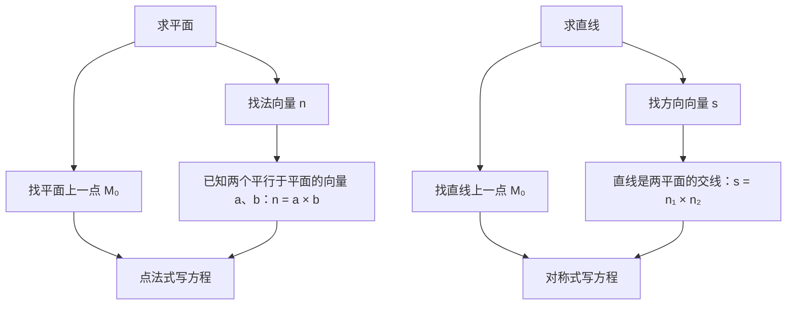

这一章是数一专属，直接出题的分值不高，常见的是一道填空或选择。但后面第 10～13 篇处处要用：切平面和法线要用平面、直线方程，重积分要画空间区域，曲面积分要求法向量和投影。所以这一篇的目标是**公式熟练，图形会画**。

## 一、本章地图

| 模块 | 要掌握什么 | 常见考法 |
| --- | --- | --- |
| 向量运算 | 数量积、向量积、混合积及几何意义 | 填空、选择 |
| 平面 | 点法式、一般式、截距式 | 填空 |
| 直线 | 对称式、参数式、一般式 | 填空 |
| 位置关系 | 夹角、平行、垂直、距离 | 填空、选择 |
| 曲面与曲线 | 旋转曲面、柱面、二次曲面、投影 | 为第 11～13 篇服务 |

求平面或直线方程，核心就是找到“一个点 + 一个方向”：

## 二、核心概念

### 1. 向量与坐标

向量 $\boldsymbol a=(a_x,a_y,a_z)$ 的模为 $\lvert\boldsymbol a\rvert=\sqrt{a_x^2+a_y^2+a_z^2}$。

**方向余弦**：$\boldsymbol a$ 与三个坐标轴正向的夹角为 $\alpha,\beta,\gamma$，则

$$
\cos\alpha=\frac{a_x}{\lvert\boldsymbol a\rvert},\quad\cos\beta=\frac{a_y}{\lvert\boldsymbol a\rvert},\quad\cos\gamma=\frac{a_z}{\lvert\boldsymbol a\rvert},\qquad\cos^2\alpha+\cos^2\beta+\cos^2\gamma=1.
$$

$(\cos\alpha,\cos\beta,\cos\gamma)$ 就是与 $\boldsymbol a$ 同方向的单位向量。第 10 篇的方向导数会用到。

### 2. 三种乘积

> [!IMPORTANT] 必背
> **数量积（点乘）**，结果是数：
> $$\boldsymbol a\cdot\boldsymbol b=\lvert\boldsymbol a\rvert\lvert\boldsymbol b\rvert\cos\theta=a_xb_x+a_yb_y+a_zb_z$$
> **向量积（叉乘）**，结果是向量，**同时垂直于 $\boldsymbol a$ 和 $\boldsymbol b$**，方向按右手法则：
> $$\boldsymbol a\times\boldsymbol b=\begin{vmatrix}\boldsymbol i&\boldsymbol j&\boldsymbol k\\a_x&a_y&a_z\\b_x&b_y&b_z\end{vmatrix},\qquad\lvert\boldsymbol a\times\boldsymbol b\rvert=\lvert\boldsymbol a\rvert\lvert\boldsymbol b\rvert\sin\theta$$
> **混合积**，结果是数：
> $$[\boldsymbol a\,\boldsymbol b\,\boldsymbol c]=(\boldsymbol a\times\boldsymbol b)\cdot\boldsymbol c=\begin{vmatrix}a_x&a_y&a_z\\b_x&b_y&b_z\\c_x&c_y&c_z\end{vmatrix}$$

### 3. 几何意义

| 运算 | 几何意义 | 判定条件 |
| --- | --- | --- |
| $\boldsymbol a\cdot\boldsymbol b$ | 投影与夹角 | $\boldsymbol a\perp\boldsymbol b\iff\boldsymbol a\cdot\boldsymbol b=0$ |
| $\lvert\boldsymbol a\times\boldsymbol b\rvert$ | 以 $\boldsymbol a,\boldsymbol b$ 为邻边的**平行四边形面积** | $\boldsymbol a\parallel\boldsymbol b\iff\boldsymbol a\times\boldsymbol b=\boldsymbol 0\iff$ 坐标成比例 |
| $\lvert[\boldsymbol a\,\boldsymbol b\,\boldsymbol c]\rvert$ | 以 $\boldsymbol a,\boldsymbol b,\boldsymbol c$ 为棱的**平行六面体体积** | 三向量共面 $\iff[\boldsymbol a\,\boldsymbol b\,\boldsymbol c]=0$ |

三角形面积是平行四边形的一半，四面体体积是平行六面体的 $\dfrac16$。

> [!WARNING] 叉乘不满足交换律
> $\boldsymbol a\times\boldsymbol b=-\boldsymbol b\times\boldsymbol a$，并且 $\boldsymbol a\times\boldsymbol a=\boldsymbol 0$。

## 三、必背公式

### 1. 平面方程

| 形式 | 方程 | 说明 |
| --- | --- | --- |
| 点法式 | $A(x-x_0)+B(y-y_0)+C(z-z_0)=0$ | 过点 $(x_0,y_0,z_0)$，法向量 $\boldsymbol n=(A,B,C)$ |
| 一般式 | $Ax+By+Cz+D=0$ | **$x,y,z$ 的系数就是法向量** |
| 截距式 | $\dfrac xa+\dfrac yb+\dfrac zc=1$ | 在三轴上的截距为 $a,b,c$ |

一般式的特殊情况：缺哪个变量，平面就**平行于**哪个坐标轴；$D=0$ 则过原点。例如 $x+y=1$ 平行于 $z$ 轴。

### 2. 直线方程

| 形式 | 方程 | 说明 |
| --- | --- | --- |
| 对称式（点向式） | $\dfrac{x-x_0}{m}=\dfrac{y-y_0}{n}=\dfrac{z-z_0}{p}$ | 过点 $(x_0,y_0,z_0)$，方向向量 $\boldsymbol s=(m,n,p)$ |
| 参数式 | $x=x_0+mt,\ y=y_0+nt,\ z=z_0+pt$ | 求交点时最好用 |
| 一般式 | $\begin{cases}A_1x+B_1y+C_1z+D_1=0\\A_2x+B_2y+C_2z+D_2=0\end{cases}$ | 两个平面的交线，$\boldsymbol s=\boldsymbol n_1\times\boldsymbol n_2$ |

对称式中分母可以为 0，表示分子也为 0。例如 $\dfrac{x-1}{0}=\dfrac{y}{2}=\dfrac{z}{3}$ 表示直线在平面 $x=1$ 内。

### 3. 夹角

> [!IMPORTANT] 必背
> 平面与平面（取锐角）：$\cos\theta=\dfrac{\lvert\boldsymbol n_1\cdot\boldsymbol n_2\rvert}{\lvert\boldsymbol n_1\rvert\lvert\boldsymbol n_2\rvert}$
>
> 直线与直线（取锐角）：$\cos\theta=\dfrac{\lvert\boldsymbol s_1\cdot\boldsymbol s_2\rvert}{\lvert\boldsymbol s_1\rvert\lvert\boldsymbol s_2\rvert}$
>
> 直线与平面：$\sin\varphi=\dfrac{\lvert\boldsymbol s\cdot\boldsymbol n\rvert}{\lvert\boldsymbol s\rvert\lvert\boldsymbol n\rvert}$。**注意是 $\sin$**，因为直线与法向量的夹角是 $\dfrac\pi2-\varphi$。

### 4. 距离

> [!IMPORTANT] 必背
> **点到平面**：点 $M_0(x_0,y_0,z_0)$ 到平面 $Ax+By+Cz+D=0$ 的距离
> $$d=\frac{\lvert Ax_0+By_0+Cz_0+D\rvert}{\sqrt{A^2+B^2+C^2}}$$
> **点到直线**：$M_1$ 是直线上一点，$\boldsymbol s$ 是方向向量，则点 $M_0$ 到直线的距离
> $$d=\frac{\left\lvert\overrightarrow{M_1M_0}\times\boldsymbol s\right\rvert}{\lvert\boldsymbol s\rvert}$$
> **两平行平面** $Ax+By+Cz+D_1=0$ 与 $Ax+By+Cz+D_2=0$：$d=\dfrac{\lvert D_1-D_2\rvert}{\sqrt{A^2+B^2+C^2}}$

### 5. 平面束

过直线 $\begin{cases}A_1x+B_1y+C_1z+D_1=0\\A_2x+B_2y+C_2z+D_2=0\end{cases}$ 的平面（除第二个平面外）都可以写成

$$
(A_1x+B_1y+C_1z+D_1)+\lambda(A_2x+B_2y+C_2z+D_2)=0.
$$

“过某条直线的平面”这类题，用平面束只需求一个参数 $\lambda$。

### 6. 常见曲面

| 名称 | 方程 | 形状 |
| --- | --- | --- |
| 球面 | $x^2+y^2+z^2=R^2$ | |
| 椭球面 | $\dfrac{x^2}{a^2}+\dfrac{y^2}{b^2}+\dfrac{z^2}{c^2}=1$ | |
| 旋转抛物面 | $z=x^2+y^2$ | 开口向上的“碗” |
| 圆锥面 | $z=\sqrt{x^2+y^2}$ | 顶点在原点，开口向上 |
| 圆柱面 | $x^2+y^2=R^2$ | 母线平行于 $z$ 轴（缺 $z$） |
| 单叶双曲面 | $\dfrac{x^2}{a^2}+\dfrac{y^2}{b^2}-\dfrac{z^2}{c^2}=1$ | 一个负号，连通的“腰” |
| 双叶双曲面 | $\dfrac{x^2}{a^2}+\dfrac{y^2}{b^2}-\dfrac{z^2}{c^2}=-1$ | 两个负号，分成上下两片 |
| 双曲抛物面（马鞍面） | $z=x^2-y^2$ | 马鞍形 |

> [!TIP] 认曲面的方法
> - **缺一个变量**：柱面，母线平行于所缺变量对应的坐标轴。
> - **含 $x^2+y^2$ 的整体**：绕 $z$ 轴的旋转曲面。
> - **其余**：用平行于坐标面的平面去截（“截痕法”），看截出来的曲线是圆、椭圆、双曲线还是抛物线。

### 7. 旋转曲面

> [!IMPORTANT] 必背
> $yOz$ 平面上的曲线 $f(y,z)=0$ 绕 **$z$ 轴**旋转，曲面方程为
> $$f\left(\pm\sqrt{x^2+y^2},\,z\right)=0.$$
> 口诀：**绕谁转，谁不变；另一个变量换成 $\pm\sqrt{\text{另两个变量的平方和}}$**。
>
> 例如 $z=y^2$ 绕 $z$ 轴旋转得 $z=x^2+y^2$；绕 $y$ 轴旋转得 $\pm\sqrt{x^2+z^2}=y^2$，即 $x^2+z^2=y^4$。

### 8. 空间曲线在坐标面上的投影

曲线 $\begin{cases}F(x,y,z)=0\\G(x,y,z)=0\end{cases}$ 在 $xOy$ 面上的投影：从两个方程中**消去 $z$**，得到投影柱面 $H(x,y)=0$，投影曲线是

$$
\begin{cases}H(x,y)=0\\z=0\end{cases}
$$

第 11 篇求三重积分时，确定积分区域在 $xOy$ 面上的投影区域就是用这个方法。

## 四、题型与解题套路

### 题型 1：向量运算与面积、体积

**例 1** 求以 $A(1,0,0)$、$B(0,1,0)$、$C(0,0,1)$ 为顶点的三角形面积。

**解** $\overrightarrow{AB}=(-1,1,0)$，$\overrightarrow{AC}=(-1,0,1)$：

$$
\overrightarrow{AB}\times\overrightarrow{AC}=\begin{vmatrix}\boldsymbol i&\boldsymbol j&\boldsymbol k\-1&1&0\-1&0&1\end{vmatrix}=(1,1,1).
$$

面积 $S=\dfrac12\lvert(1,1,1)\rvert=\boxed{\dfrac{\sqrt3}{2}}$。

**例 2** 判断 $O(0,0,0)$、$A(1,1,0)$、$B(1,0,1)$、$C(0,1,1)$ 四点是否共面；若不共面，求四面体 $OABC$ 的体积。

**解**

$$
[\overrightarrow{OA}\,\overrightarrow{OB}\,\overrightarrow{OC}]=\begin{vmatrix}1&1&0\1&0&1\0&1&1\end{vmatrix}=1\cdot(0-1)-1\cdot(1-0)+0=-2\ne0,
$$

所以四点不共面，体积 $V=\dfrac16\cdot\lvert-2\rvert=\boxed{\dfrac13}$。

### 题型 2：求平面方程

**套路**：找一个点和法向量。法向量通常由**两个平行于平面的向量叉乘**得到。

**例 3** 求过三点 $M_1(1,1,1)$、$M_2(2,0,1)$、$M_3(0,1,3)$ 的平面方程。

**解** $\overrightarrow{M_1M_2}=(1,-1,0)$，$\overrightarrow{M_1M_3}=(-1,0,2)$：

$$
\boldsymbol n=\overrightarrow{M_1M_2}\times\overrightarrow{M_1M_3}=\begin{vmatrix}\boldsymbol i&\boldsymbol j&\boldsymbol k\1&-1&0\-1&0&2\end{vmatrix}=(-2,-2,-1).
$$

取 $\boldsymbol n=(2,2,1)$，点法式：$2(x-1)+2(y-1)+(z-1)=0$，即 $\boxed{2x+2y+z-5=0}$。

**检验**：把 $M_2$、$M_3$ 代入，$4+0+1-5=0$，$0+2+3-5=0$。

### 题型 3：求直线方程

**套路**：找一个点和方向向量。直线垂直于两个已知向量时，方向向量取它们的**叉乘**。

**例 4** 求过点 $(1,2,3)$ 且与平面 $x+y+z=1$、$x-y+2z=0$ 都平行的直线方程。

**解** 方向向量与两个法向量都垂直：

$$
\boldsymbol s=(1,1,1)\times(1,-1,2)=\begin{vmatrix}\boldsymbol i&\boldsymbol j&\boldsymbol k\1&1&1\1&-1&2\end{vmatrix}=(3,-1,-2).
$$

直线为 $\boxed{\dfrac{x-1}{3}=\dfrac{y-2}{-1}=\dfrac{z-3}{-2}}$。

**例 5** 把直线 $\begin{cases}x+y+z=1\2x-y+z=4\end{cases}$ 化为对称式。

**解** 方向向量 $\boldsymbol s=(1,1,1)\times(2,-1,1)=(2,1,-3)$。

再找直线上一点：令 $y=0$，得 $x+z=1$，$2x+z=4$，解得 $x=3$，$z=-2$。直线为

$$
\boxed{\frac{x-3}{2}=\frac{y}{1}=\frac{z+2}{-3}}.
$$

> [!TIP] 找点的技巧
> 令某个坐标为 0（通常选让剩下的方程组好解的那个），解二元一次方程组。如果令 $z=0$ 解出分数，就换一个坐标试试。

### 题型 4：交点与夹角

**例 6** 求直线 $x=1+t$，$y=2t$，$z=-1+t$ 与平面 $2x-y+z=6$ 的交点和夹角。

**解** 参数式代入平面方程：$2(1+t)-2t+(-1+t)=1+t=6$，得 $t=5$，交点为 $\boxed{(6,10,4)}$。

$\boldsymbol s=(1,2,1)$，$\boldsymbol n=(2,-1,1)$，$\boldsymbol s\cdot\boldsymbol n=2-2+1=1$，$\lvert\boldsymbol s\rvert=\lvert\boldsymbol n\rvert=\sqrt6$：

$$
\sin\varphi=\frac{1}{6},\qquad\varphi=\boxed{\arcsin\frac16}.
$$

### 题型 5：距离、投影点与对称点

**例 7** 求点 $(1,2,1)$ 到平面 $2x-2y+z+3=0$ 的距离。

**解**

$$
d=\frac{\lvert2-4+1+3\rvert}{\sqrt{4+4+1}}=\boxed{\frac23}.
$$

**例 8** 求点 $M_0(1,2,3)$ 到直线 $x=y=z$ 的距离。

**解** 直线过原点 $O$，$\boldsymbol s=(1,1,1)$，$\overrightarrow{OM_0}=(1,2,3)$：

$$
\overrightarrow{OM_0}\times\boldsymbol s=\begin{vmatrix}\boldsymbol i&\boldsymbol j&\boldsymbol k\1&2&3\1&1&1\end{vmatrix}=(-1,2,-1),\qquad d=\frac{\sqrt6}{\sqrt3}=\boxed{\sqrt2}.
$$

**例 9** 求点 $P(1,2,3)$ 在平面 $x+y+z=0$ 上的投影点，以及 $P$ 关于该平面的对称点。

**解** 过 $P$ 作平面的垂线，方向就是法向量 $(1,1,1)$：$x=1+t$，$y=2+t$，$z=3+t$。代入平面方程：$6+3t=0$，$t=-2$。

投影点（垂足）为 $\boxed{(-1,0,1)}$。对称点是 $P$ 关于垂足的对称点，相当于 $t=-4$，为 $\boxed{(-3,-2,-1)}$。

> [!TIP] 投影、对称都用“垂线参数式”
> 写出过该点、方向为法向量的直线参数式，代入平面求出 $t_0$。$t_0$ 对应垂足，$2t_0$ 对应对称点。

### 题型 6：平面束

**例 10** 求直线 $L:\begin{cases}x+y-z=0\x-y+z-2=0\end{cases}$ 在平面 $\Pi:x+y+z=0$ 上的投影直线。

**解** 投影直线是“过 $L$ 且垂直于 $\Pi$ 的平面”与 $\Pi$ 的交线。用平面束设过 $L$ 的平面：

$$
(x+y-z)+\lambda(x-y+z-2)=0,\qquad\boldsymbol n_\lambda=(1+\lambda,\,1-\lambda,\,-1+\lambda).
$$

垂直于 $\Pi$：$\boldsymbol n_\lambda\cdot(1,1,1)=1+\lambda=0$，$\lambda=-1$。代入得 $2y-2z+2=0$，即 $y-z+1=0$。

（第二个平面 $x-y+z-2=0$ 的法向量与 $(1,1,1)$ 的点积为 $1\ne0$，不垂直于 $\Pi$，所以没有漏解。）

投影直线为 $\boxed{\begin{cases}y-z+1=0\x+y+z=0\end{cases}}$。

### 题型 7：旋转曲面

**例 11** 求下列旋转曲面的方程：

1. $yOz$ 平面上的直线 $z=2y$ 绕 $z$ 轴旋转；
2. $yOz$ 平面上的椭圆 $\dfrac{y^2}{a^2}+\dfrac{z^2}{c^2}=1$ 绕 $z$ 轴旋转。

**解** 绕 $z$ 轴，$z$ 不变，$y$ 换成 $\pm\sqrt{x^2+y^2}$：

1. $z=\pm2\sqrt{x^2+y^2}$，即 $\boxed{z^2=4(x^2+y^2)}$，是圆锥面。
2. $\boxed{\dfrac{x^2+y^2}{a^2}+\dfrac{z^2}{c^2}=1}$，是旋转椭球面。

### 题型 8：识别曲面

**例 12** 说出下列方程表示的曲面：

1. $x^2+y^2=2z$；
2. $x^2-y^2+z^2=0$；
3. $x^2+y^2-z^2=1$；
4. $z^2-x^2-y^2=1$；
5. $y^2=2x$。

**解**

1. 含 $x^2+y^2$，绕 $z$ 轴旋转；$z$ 是一次的，是**旋转抛物面**。
2. 即 $y^2=x^2+z^2$，是以 $y$ 轴为轴的**圆锥面**。
3. 一个负号，**单叶双曲面**（旋转单叶双曲面）。
4. 即 $x^2+y^2-z^2=-1$，两个负号，**双叶双曲面**。
5. 缺 $z$，是母线平行于 $z$ 轴的**抛物柱面**。

### 题型 9：曲线在坐标面上的投影

**例 13** 求曲线 $\begin{cases}x^2+y^2+z^2=1\x+z=1\end{cases}$ 在 $xOy$ 面上的投影。

**解** 消去 $z$：$z=1-x$ 代入第一式，

$$
x^2+y^2+(1-x)^2=1\ \Longrightarrow\ 2x^2-2x+y^2=0.
$$

投影曲线为 $\boxed{\begin{cases}2x^2-2x+y^2=0\z=0\end{cases}}$，配方后是 $\dfrac{\left(x-\frac12\right)^2}{\frac14}+\dfrac{y^2}{\frac12}=1$，一个椭圆。

**例 14** 求旋转抛物面 $z=x^2+y^2$ 与 $z=2-x^2-y^2$ 所围立体在 $xOy$ 面上的投影区域。

**解** 两曲面的交线：$x^2+y^2=2-x^2-y^2$，即 $x^2+y^2=1$。立体夹在两曲面之间，投影区域为 $\boxed{x^2+y^2\le1}$。

第 11 篇用柱坐标计算这个立体的体积时，就要用到这个投影区域。

## 五、证明思路

### 1. 点到平面的距离

在平面上任取一点 $M_1(x_1,y_1,z_1)$，距离就是 $\overrightarrow{M_1M_0}$ 在法向量方向上的投影长度：

$$
d=\frac{\left\lvert\overrightarrow{M_1M_0}\cdot\boldsymbol n\right\rvert}{\lvert\boldsymbol n\rvert}=\frac{\lvert A(x_0-x_1)+B(y_0-y_1)+C(z_0-z_1)\rvert}{\sqrt{A^2+B^2+C^2}}.
$$

$M_1$ 在平面上，$Ax_1+By_1+Cz_1=-D$，代入分子就得到 $\lvert Ax_0+By_0+Cz_0+D\rvert$。

### 2. 点到直线的距离

以 $\overrightarrow{M_1M_0}$ 和 $\boldsymbol s$ 为邻边作平行四边形，面积是 $\left\lvert\overrightarrow{M_1M_0}\times\boldsymbol s\right\rvert$。底边长 $\lvert\boldsymbol s\rvert$，高就是所求距离：$d=\dfrac{\text{面积}}{\text{底}}$。

### 3. 混合积是体积

$\lvert\boldsymbol a\times\boldsymbol b\rvert$ 是底面平行四边形的面积，$\boldsymbol a\times\boldsymbol b$ 的方向垂直于底面。$\boldsymbol c$ 在这个方向上的投影长度就是高。所以

$$
\lvert(\boldsymbol a\times\boldsymbol b)\cdot\boldsymbol c\rvert=\text{底面积}\times\text{高}=\text{平行六面体体积}.
$$

### 4. 直线与平面的夹角用 $\sin$

直线与平面的夹角 $\varphi$，等于 $\dfrac\pi2$ 减去直线与法线的夹角。所以 $\sin\varphi=\cos\left(\dfrac\pi2-\varphi\right)=\dfrac{\lvert\boldsymbol s\cdot\boldsymbol n\rvert}{\lvert\boldsymbol s\rvert\lvert\boldsymbol n\rvert}$。

### 5. 旋转曲面的方程

$yOz$ 面上的点 $(0,y_1,z_1)$ 绕 $z$ 轴旋转时，高度 $z=z_1$ 不变，到 $z$ 轴的距离 $\lvert y_1\rvert$ 不变。旋转后的点 $(x,y,z)$ 满足 $\sqrt{x^2+y^2}=\lvert y_1\rvert$，即 $y_1=\pm\sqrt{x^2+y^2}$。把它代入 $f(y_1,z_1)=0$ 即得。

## 六、易错点

> [!CAUTION] 直线与平面的夹角
> 用 $\boldsymbol s$ 和 $\boldsymbol n$ 算出的是 $\sin\varphi$，不是 $\cos\varphi$。
>
> 判定条件也要对应：
> - 直线**平行于**平面：$\boldsymbol s\perp\boldsymbol n$，即 $\boldsymbol s\cdot\boldsymbol n=0$；
> - 直线**垂直于**平面：$\boldsymbol s\parallel\boldsymbol n$，即坐标成比例。
>
> 这两条和“两直线平行、垂直”的条件刚好反过来，很容易记混。

- **叉乘行列式展开时，$\boldsymbol j$ 前面忘记负号**。
- **点到平面距离公式中 $D$ 漏写**：方程要先化成 $Ax+By+Cz+D=0$ 的形式。
- **平行平面距离公式使用前，没有把两个方程的 $A,B,C$ 化成相同的数**。
- **旋转曲面中替换错了变量**：绕 $z$ 轴时 $z$ 不变，替换的是另一个变量。
- **平面束漏掉第二个平面本身**：要单独检验。
- **把 $x^2+y^2=1$（空间中的圆柱面）当成圆**：空间中的曲线要用两个方程表示。

## 七、小练习

**1.** 设 $\boldsymbol a=(1,2,2)$，$\boldsymbol b=(2,-1,2)$。求 $\boldsymbol a$ 与 $\boldsymbol b$ 夹角的余弦，以及以它们为邻边的平行四边形面积。

点击查看答案

$\boldsymbol a\cdot\boldsymbol b=2-2+4=4$，$\lvert\boldsymbol a\rvert=\lvert\boldsymbol b\rvert=3$，$\cos\theta=\dfrac49$。

$\boldsymbol a\times\boldsymbol b=(6,2,-5)$，面积 $=\sqrt{36+4+25}=\sqrt{65}$。

检验：$\lvert\boldsymbol a\rvert^2\lvert\boldsymbol b\rvert^2-(\boldsymbol a\cdot\boldsymbol b)^2=81-16=65$，一致。

**2.** 求过点 $(1,-1,2)$ 且垂直于直线 $\dfrac{x-1}{2}=\dfrac{y}{-1}=\dfrac{z+1}{3}$ 的平面方程。

点击查看答案

直线的方向向量就是平面的法向量 $\boldsymbol n=(2,-1,3)$：

$$2(x-1)-(y+1)+3(z-2)=0,\quad\text{即}\quad2x-y+3z-9=0.$$

**3.** 求平行平面 $x+2y+2z=1$ 与 $x+2y+2z=7$ 之间的距离。

点击查看答案

$$d=\frac{\lvert7-1\rvert}{\sqrt{1+4+4}}=2.$$

**4.** $xOy$ 面上的双曲线 $\dfrac{x^2}{4}-\dfrac{y^2}{9}=1$ 分别绕 $x$ 轴、绕 $y$ 轴旋转，求所得曲面方程，并说出曲面名称。

点击查看答案

- 绕 $x$ 轴：$x$ 不变，$y$ 换成 $\pm\sqrt{y^2+z^2}$，得 $\dfrac{x^2}{4}-\dfrac{y^2+z^2}{9}=1$，**双叶双曲面**。
- 绕 $y$ 轴：$y$ 不变，$x$ 换成 $\pm\sqrt{x^2+z^2}$，得 $\dfrac{x^2+z^2}{4}-\dfrac{y^2}{9}=1$，**单叶双曲面**。

**5.** 求球面 $x^2+y^2+z^2=2$ 与上半锥面 $z=\sqrt{x^2+y^2}$ 的交线在 $xOy$ 面上的投影。

点击查看答案

由锥面得 $z^2=x^2+y^2$，代入球面：$2(x^2+y^2)=2$，即 $x^2+y^2=1$。

投影曲线为 $\begin{cases}x^2+y^2=1\z=0\end{cases}$。这个“冰淇淋筒”形状的立体在第 11 篇会再次出现。

## 八、本章小结

- 三种积：点乘管**夹角和垂直**，叉乘管**面积和平行**、并给出**公垂向量**，混合积管**体积和共面**。
- 平面要**点 + 法向量**，直线要**点 + 方向向量**；缺什么向量，就用叉乘造出来。
- 直线与平面的夹角用 $\sin$，平行、垂直的判定条件与两直线的情形相反。
- 距离：点到平面用公式，点到直线用“叉乘面积 ÷ 底”。
- 投影点、对称点：写**垂线参数式**；过直线的平面：用**平面束**。
- 曲面：缺变量是柱面，含 $x^2+y^2$ 是旋转面；旋转口诀“**绕谁转谁不变**”。
- 投影：**消去一个变量**，得到投影柱面。

下一篇：**10 多元函数微分学**。
