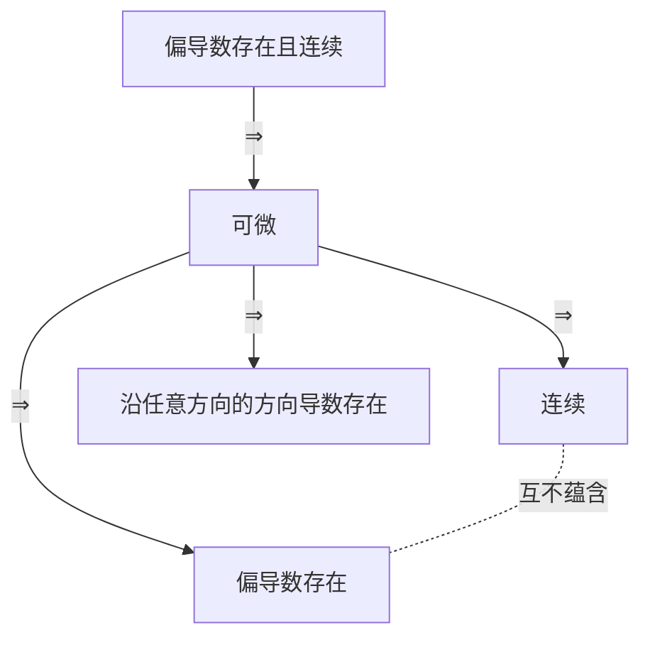

多元函数微分学是一元微分的推广，大部分方法都能类比。真正**新的、也是最容易出错的**有三块：连续、可偏导、可微三者之间的关系，复合函数求导时的链式法则，条件极值。这一篇围绕这三块展开。

## 一、本章地图

| 模块 | 要掌握什么 | 常见考法 |
| --- | --- | --- |
| 极限与连续 | 二重极限的判断（尤其是不存在） | 选择题 |
| 偏导数与全微分 | 定义、可微的判定 | 选择题，常考分段函数在原点处 |
| 复合函数求导 | 链式法则、抽象函数的二阶偏导 | 填空、解答 |
| 隐函数求导 | 公式法、方程组求导 | 填空 |
| 方向导数与梯度 | 计算公式、梯度的意义 | 填空（数一） |
| 几何应用 | 切平面与法线、切线与法平面 | 填空（数一） |
| 极值与最值 | 无条件极值、拉格朗日乘数法 | 解答题 |

几个概念之间的关系是选择题的核心：

图中实线箭头**反过来都不成立**；连续和偏导数存在之间**互不蕴含**。这和一元函数（可导 $\iff$ 可微）不同。

## 二、核心概念

### 1. 二重极限

$\displaystyle\lim_{(x,y)\to(x_0,y_0)}f(x,y)=A$ 要求点 $(x,y)$ 以**任意方式**趋于 $(x_0,y_0)$ 时，$f$ 都趋于 $A$。

> [!IMPORTANT] 判断二重极限
> - **证明不存在**：找两条路径，使极限不同；或沿某条路径极限不存在。常用 $y=kx$、$y=kx^2$。
> - **证明存在并求值**：
>   1. 放缩 + 夹逼，常用 $\lvert xy\rvert\le\dfrac{x^2+y^2}{2}$、$\lvert x\rvert\le\sqrt{x^2+y^2}$；
>   2. 极坐标代换 $x=r\cos\theta$，$y=r\sin\theta$，要求极限与 $\theta$ **无关**（一致趋于）；
>   3. 一元的方法（等价无穷小、有界乘无穷小）照常使用。
>
> **沿所有直线趋近的极限都相同，也不能说明极限存在。**

### 2. 偏导数

$$
f_x(x_0,y_0)=\lim_{\Delta x\to0}\frac{f(x_0+\Delta x,y_0)-f(x_0,y_0)}{\Delta x}.
$$

大白话：**把 $y$ 固定为 $y_0$，对 $x$ 求一元导数**。所以求某一点处的偏导数，可以先代入 $y=y_0$ 再对 $x$ 求导，往往更简单。

**高阶混合偏导**：若 $f_{xy}$ 和 $f_{yx}$ 在某区域内**连续**，则两者相等。考研中的函数一般满足这个条件。

### 3. 全微分

若 $\Delta z=f(x_0+\Delta x,y_0+\Delta y)-f(x_0,y_0)$ 可以写成

$$
\Delta z=A\Delta x+B\Delta y+o(\rho),\qquad\rho=\sqrt{(\Delta x)^2+(\Delta y)^2},
$$

则称 $f$ 在 $(x_0,y_0)$ 处**可微**，且 $A=f_x(x_0,y_0)$，$B=f_y(x_0,y_0)$，全微分

$$
\mathrm dz=f_x\,\mathrm dx+f_y\,\mathrm dy.
$$

> [!IMPORTANT] 用定义判断可微（必会）
> 第一步：用定义求出 $f_x(x_0,y_0)$ 和 $f_y(x_0,y_0)$。若不存在，直接不可微。
>
> 第二步：检验
> $$\lim_{(\Delta x,\Delta y)\to(0,0)}\frac{\Delta z-f_x\Delta x-f_y\Delta y}{\sqrt{(\Delta x)^2+(\Delta y)^2}}=0$$
> 是否成立。成立则可微，否则不可微。

### 4. 方向导数与梯度（数一）

**方向导数**：函数沿方向 $\boldsymbol l$（单位向量 $\boldsymbol e_l=(\cos\alpha,\cos\beta)$）的变化率

$$
\frac{\partial f}{\partial l}=\lim_{t\to0^+}\frac{f(x_0+t\cos\alpha,y_0+t\cos\beta)-f(x_0,y_0)}{t}.
$$

**梯度**：$\operatorname{grad}f=(f_x,f_y)$，三元时为 $(f_x,f_y,f_z)$。

> [!IMPORTANT] 必背
> 若 $f$ **可微**，则
> $$\frac{\partial f}{\partial l}=f_x\cos\alpha+f_y\cos\beta=\operatorname{grad}f\cdot\boldsymbol e_l.$$
> - 沿**梯度方向**，方向导数**最大**，最大值为 $\lvert\operatorname{grad}f\rvert$；
> - 沿梯度的反方向最小，为 $-\lvert\operatorname{grad}f\rvert$；
> - 与梯度垂直的方向，方向导数为 0。

注意方向导数的定义里 $t\to0^+$ 是**单侧**的。例如 $f=\sqrt{x^2+y^2}$ 在原点处偏导数不存在，但沿任何方向的方向导数都等于 1。

## 三、必背公式

### 1. 复合函数求导（链式法则）

> [!IMPORTANT] 必背
> 设 $z=f(u,v)$，$u=u(x,y)$，$v=v(x,y)$，则
> $$\frac{\partial z}{\partial x}=f_1'\frac{\partial u}{\partial x}+f_2'\frac{\partial v}{\partial x},\qquad\frac{\partial z}{\partial y}=f_1'\frac{\partial u}{\partial y}+f_2'\frac{\partial v}{\partial y}.$$
> 其中 $f_1'$ 表示对**第一个位置的变量**求偏导，$f_2'$ 表示对第二个位置。
>
> 口诀：**连线相乘，分线相加**。画出“$z\to u,v\to x,y$”的树形图，从 $z$ 到 $x$ 的每条路径上的导数相乘，各条路径相加。

**关键提醒**：$f_1'$、$f_2'$ 本身仍然是 $u,v$ 的函数，也就是 $x,y$ 的复合函数。求二阶偏导时，**它们也要用链式法则再求导**：

$$
\frac{\partial f_1'}{\partial x}=f_{11}''\frac{\partial u}{\partial x}+f_{12}''\frac{\partial v}{\partial x}.
$$

### 2. 隐函数求导

> [!IMPORTANT] 必背
> 方程 $F(x,y,z)=0$ 确定 $z=z(x,y)$，若 $F_z\ne0$，则
> $$\frac{\partial z}{\partial x}=-\frac{F_x}{F_z},\qquad\frac{\partial z}{\partial y}=-\frac{F_y}{F_z}.$$
> 公式中 $F_x$ 是把 $x,y,z$ 都看成**独立变量**时对 $x$ 求偏导。

一元情形：$F(x,y)=0$ 确定 $y=y(x)$，$\dfrac{\mathrm dy}{\mathrm dx}=-\dfrac{F_x}{F_y}$。

**方程组的情形**：$\begin{cases}F(x,y,u,v)=0\\G(x,y,u,v)=0\end{cases}$ 确定 $u,v$ 是 $x,y$ 的函数。不用背雅可比公式，**两个方程分别对 $x$ 求偏导**（记住 $u,v$ 是 $x$ 的函数），得到关于 $u_x,v_x$ 的线性方程组，解出来即可。

### 3. 全微分形式不变性

无论 $u,v$ 是自变量还是中间变量，$z=f(u,v)$ 的全微分都是

$$
\mathrm dz=f_u\,\mathrm du+f_v\,\mathrm dv.
$$

用途：对复杂的式子**直接求全微分**，最后整理成 $\mathrm dz=A\,\mathrm dx+B\,\mathrm dy$，$A,B$ 就是两个偏导数。隐函数和方程组求导时尤其好用。

### 4. 几何应用（数一）

> [!IMPORTANT] 曲面的切平面与法线
> 曲面 $F(x,y,z)=0$ 在点 $M_0$ 处的法向量为
> $$\boldsymbol n=(F_x,F_y,F_z)\big|_{M_0}.$$
> 曲面 $z=f(x,y)$：写成 $F=f(x,y)-z$，法向量为 $(f_x,f_y,-1)$。
>
> 切平面用点法式，法线用对称式。

> [!IMPORTANT] 空间曲线的切线与法平面
> - **参数式** $x=x(t),\ y=y(t),\ z=z(t)$：切向量 $\boldsymbol T=\bigl(x'(t_0),y'(t_0),z'(t_0)\bigr)$。
> - **一般式**（两曲面交线）：切向量 $\boldsymbol T=\boldsymbol n_1\times\boldsymbol n_2$，即两个曲面法向量的叉乘。
>
> 切线用对称式，法平面用点法式（法向量就是 $\boldsymbol T$）。

### 5. 极值

> [!IMPORTANT] 无条件极值（必背）
> **必要条件**：可偏导的极值点一定是驻点，$f_x=f_y=0$。
>
> **充分条件**：在驻点处记 $A=f_{xx}$，$B=f_{xy}$，$C=f_{yy}$，
>
> | 判别式 | 结论 |
> | --- | --- |
> | $AC-B^2>0$，$A>0$ | 极小值 |
> | $AC-B^2>0$，$A<0$ | 极大值 |
> | $AC-B^2<0$ | 不是极值 |
> | $AC-B^2=0$ | 不能判断，要用定义 |

> [!IMPORTANT] 条件极值：拉格朗日乘数法（必背）
> 求 $f(x,y,z)$ 在约束 $\varphi(x,y,z)=0$ 下的极值：
> 1. 构造 $L=f(x,y,z)+\lambda\varphi(x,y,z)$；
> 2. 令 $L_x=L_y=L_z=0$，$L_\lambda=\varphi=0$；
> 3. 解出可能的极值点；实际问题中，若只有一个可能点且最值一定存在，它就是所求的最值点。
>
> 两个约束 $\varphi=0$，$\psi=0$ 时：$L=f+\lambda\varphi+\mu\psi$。

## 四、题型与解题套路

### 题型 1：二重极限

**例 1** 讨论 $\displaystyle\lim_{(x,y)\to(0,0)}\frac{xy}{x^2+y^2}$ 是否存在。

**解** 沿 $y=kx$：$\dfrac{kx^2}{(1+k^2)x^2}=\dfrac{k}{1+k^2}$，随 $k$ 变化，所以极限**不存在**。

**例 2** 求 $\displaystyle\lim_{(x,y)\to(0,0)}\frac{x^2y}{x^2+y^2}$。

**解** $\dfrac{x^2}{x^2+y^2}\le1$，所以 $\left\lvert\dfrac{x^2y}{x^2+y^2}\right\rvert\le\lvert y\rvert\to0$，极限为 $\boxed0$。

**例 3** 讨论 $\displaystyle\lim_{(x,y)\to(0,0)}\frac{x^2y}{x^4+y^2}$ 是否存在。

**解** 沿 $y=kx$：$\dfrac{kx^3}{x^4+k^2x^2}=\dfrac{kx}{x^2+k^2}\to0$，沿所有直线都趋于 0。

但沿 $y=x^2$：$\dfrac{x^4}{2x^4}=\dfrac12\ne0$。所以极限**不存在**。

> [!TIP] 选路径的技巧
> 让分母中的各项“同阶”：分母是 $x^4+y^2$，就取 $y=kx^2$，使 $x^4$ 与 $y^2$ 同阶。

### 题型 2：连续、可偏导、可微的判断

**例 4** 设
$$
f(x,y)=\begin{cases}\dfrac{x^2y^2}{(x^2+y^2)^{3/2}},&(x,y)\ne(0,0)\\0,&(x,y)=(0,0)\end{cases}
$$
讨论 $f$ 在原点处的连续性、偏导数是否存在、是否可微。

**解**

**连续**：由 $x^2y^2\le\dfrac{(x^2+y^2)^2}{4}$，$\lvert f\rvert\le\dfrac{\sqrt{x^2+y^2}}{4}\to0=f(0,0)$，连续。

**偏导数**：$f(x,0)=0$，所以 $f_x(0,0)=0$；同理 $f_y(0,0)=0$。偏导数存在。

**可微**：检验

$$
\frac{\Delta z-0-0}{\rho}=\frac{x^2y^2}{(x^2+y^2)^2}.
$$

沿 $y=x$ 等于 $\dfrac14\ne0$，所以极限不为 0，**不可微**。

> [!TIP] 这类题的固定流程
> 1. 连续：放缩 + 夹逼；
> 2. 偏导：**用定义**，先代 $y=0$ 再看对 $x$ 的极限；
> 3. 可微：计算 $\dfrac{\Delta z-f_x\Delta x-f_y\Delta y}{\rho}$ 的极限是否为 0；
> 4. 如果还问“偏导数是否连续”，先求 $(x,y)\ne(0,0)$ 处的偏导数表达式，再看它在原点的极限。

### 题型 3：复合函数求偏导

**例 5** 设 $z=f\left(xy,\dfrac xy\right)$，$f$ 具有二阶连续偏导数，求 $\dfrac{\partial z}{\partial x}$ 和 $\dfrac{\partial^2z}{\partial x\partial y}$。

**解** 记 $u=xy$，$v=\dfrac xy$。

$$
\frac{\partial z}{\partial x}=f_1'\cdot y+f_2'\cdot\frac1y.
$$

对 $y$ 求偏导时，$f_1'$ 和 $f_2'$ 也要用链式法则。$u_y=x$，$v_y=-\dfrac{x}{y^2}$：

$$
\frac{\partial f_1'}{\partial y}=f_{11}''x-f_{12}''\frac{x}{y^2},\qquad\frac{\partial f_2'}{\partial y}=f_{21}''x-f_{22}''\frac{x}{y^2}.
$$

所以

$$
\frac{\partial^2z}{\partial x\partial y}=f_1'+y\left(xf_{11}''-\frac{x}{y^2}f_{12}''\right)-\frac{1}{y^2}f_2'+\frac1y\left(xf_{21}''-\frac{x}{y^2}f_{22}''\right).
$$

由 $f_{12}''=f_{21}''$，合并 $-\dfrac xyf_{12}''+\dfrac xyf_{21}''=0$：

$$
\boxed{\frac{\partial^2z}{\partial x\partial y}=f_1'-\frac{1}{y^2}f_2'+xyf_{11}''-\frac{x}{y^3}f_{22}''}.
$$

> [!WARNING] 最常见的两个错误
> 1. 对 $f_1'$ 求导时，以为它是常数，或只写 $f_{11}''$ 一项；
> 2. 对 $y\cdot f_1'$ 求导时，忘记乘积法则，漏掉 $f_1'$ 这一项。

### 题型 4：隐函数求偏导

**例 6** 设 $z=z(x,y)$ 由 $x^2+y^2+z^2=4z$ 确定，求 $\dfrac{\partial z}{\partial x}$ 和 $\dfrac{\partial^2z}{\partial x^2}$。

**解** $F=x^2+y^2+z^2-4z$，$F_x=2x$，$F_z=2z-4$：

$$
\frac{\partial z}{\partial x}=-\frac{2x}{2z-4}=\frac{x}{2-z}.
$$

再对 $x$ 求偏导，$z$ 是 $x$ 的函数，用商的求导法则：

$$
\frac{\partial^2z}{\partial x^2}=\frac{(2-z)+xz_x}{(2-z)^2}=\frac{(2-z)+\frac{x^2}{2-z}}{(2-z)^2}=\boxed{\frac{(2-z)^2+x^2}{(2-z)^3}}.
$$

**例 7（全微分形式不变性）** 设 $z=z(x,y)$ 由 $e^z=xyz$ 确定，求 $\mathrm dz$。

**解** 两边求全微分：$e^z\,\mathrm dz=yz\,\mathrm dx+xz\,\mathrm dy+xy\,\mathrm dz$，所以

$$
\mathrm dz=\frac{yz\,\mathrm dx+xz\,\mathrm dy}{e^z-xy}=\boxed{\frac{z\,(y\,\mathrm dx+x\,\mathrm dy)}{xy(z-1)}}.
$$

最后一步用 $e^z=xyz$ 化简分母：$xyz-xy=xy(z-1)$。

### 题型 5：方向导数与梯度

**例 8** 求 $f(x,y,z)=xy^2+z^3$ 在点 $P(1,1,1)$ 处沿方向 $\boldsymbol l=(2,-1,2)$ 的方向导数，以及在该点处方向导数的最大值。

**解** $\operatorname{grad}f=(y^2,\,2xy,\,3z^2)$，在 $P$ 处为 $(1,2,3)$。

单位向量 $\boldsymbol e_l=\dfrac{(2,-1,2)}{3}$：

$$
\frac{\partial f}{\partial l}=(1,2,3)\cdot\frac{(2,-1,2)}{3}=\frac{2-2+6}{3}=\boxed2.
$$

方向导数的最大值为 $\lvert\operatorname{grad}f\rvert=\sqrt{1+4+9}=\boxed{\sqrt{14}}$，沿梯度方向 $(1,2,3)$ 取得。

> [!WARNING] 方向向量要单位化
> 公式中用的是**单位**向量 $\boldsymbol e_l$。直接用 $(2,-1,2)$ 点乘梯度，会得到 $6$，是错的。

### 题型 6：几何应用

**例 9** 求椭球面 $x^2+2y^2+3z^2=6$ 在点 $(1,1,1)$ 处的切平面和法线方程。

**解** $F=x^2+2y^2+3z^2-6$，$\boldsymbol n=(2x,4y,6z)\big|_{(1,1,1)}=(2,4,6)$，取 $(1,2,3)$。

切平面：$(x-1)+2(y-1)+3(z-1)=0$，即 $\boxed{x+2y+3z=6}$。

法线：$\boxed{\dfrac{x-1}{1}=\dfrac{y-1}{2}=\dfrac{z-1}{3}}$。

**例 10** 求螺旋线 $x=\cos t$，$y=\sin t$，$z=t$ 在 $t=\dfrac\pi2$ 处的切线和法平面方程。

**解** 对应点为 $\left(0,1,\dfrac\pi2\right)$，切向量 $\boldsymbol T=(-\sin t,\cos t,1)\big|_{t=\frac\pi2}=(-1,0,1)$。

切线：$\boxed{\dfrac{x}{-1}=\dfrac{y-1}{0}=\dfrac{z-\frac\pi2}{1}}$。

法平面：$-(x-0)+0\cdot(y-1)+\left(z-\dfrac\pi2\right)=0$，即 $\boxed{x-z+\dfrac\pi2=0}$。

### 题型 7：无条件极值

**例 11** 求 $f(x,y)=x^3-3x+y^2$ 的极值。

**解** 驻点：$f_x=3x^2-3=0$，$f_y=2y=0$，得 $(1,0)$ 和 $(-1,0)$。

二阶偏导：$A=f_{xx}=6x$，$B=f_{xy}=0$，$C=f_{yy}=2$。

- $(1,0)$：$A=6$，$AC-B^2=12>0$，$A>0$，**极小值** $f(1,0)=\boxed{-2}$；
- $(-1,0)$：$A=-6$，$AC-B^2=-12<0$，**不是极值点**。

### 题型 8：条件极值与最值

**例 12** 求函数 $f=xyz$ 在约束 $x+y+z=3$（$x,y,z>0$）下的最大值。

**解** $L=xyz+\lambda(x+y+z-3)$：

$$
L_x=yz+\lambda=0,\quad L_y=xz+\lambda=0,\quad L_z=xy+\lambda=0.
$$

由前两式 $yz=xz$，$z>0$，得 $x=y$；同理 $y=z$。代入约束，$x=y=z=1$。

在区域边界上（某个变量趋于 0）$f\to0$，所以内部唯一可能点就是最大值点，最大值为 $\boxed1$。

> [!TIP] 解拉格朗日方程组的技巧
> 把含 $\lambda$ 的几个方程**相除**或**相减**消去 $\lambda$，得到变量之间的关系，再代入约束。利用对称性往往能很快看出 $x=y=z$。

**例 13（闭区域上的最值）** 求 $f(x,y)=x^2+2y^2-x$ 在闭区域 $D:x^2+y^2\le1$ 上的最大值和最小值。

**解** **第一步：内部驻点**。$f_x=2x-1=0$，$f_y=4y=0$，得 $\left(\dfrac12,0\right)$，$f=-\dfrac14$。

**第二步：边界** $x^2+y^2=1$。代入 $y^2=1-x^2$：

$$
f=x^2+2(1-x^2)-x=2-x-x^2,\qquad-1\le x\le1.
$$

对 $x$ 求导：$-1-2x=0$，$x=-\dfrac12$，$f=\dfrac94$。端点：$x=1$ 时 $f=0$，$x=-1$ 时 $f=2$。

**第三步：比较** $-\dfrac14$、$\dfrac94$、$0$、$2$：最大值 $\boxed{\dfrac94}$，最小值 $\boxed{-\dfrac14}$。

> [!TIP] 闭区域最值三步走
> **内部求驻点，边界化成一元函数（或用拉格朗日），最后比较所有候选值。**边界能直接代入化简时，比拉格朗日乘数法更快。

## 五、证明思路

### 1. 可微 $\Rightarrow$ 连续、可偏导

由可微的定义，$\Delta z=A\Delta x+B\Delta y+o(\rho)\to0$，所以连续。

取 $\Delta y=0$，$\rho=\lvert\Delta x\rvert$，则 $\dfrac{\Delta z}{\Delta x}=A+\dfrac{o(\lvert\Delta x\rvert)}{\Delta x}\to A$，所以 $f_x$ 存在且等于 $A$。

### 2. 偏导数连续 $\Rightarrow$ 可微

把全增量拆成两步，每一步只有一个变量变化：

$$
\Delta z=\bigl[f(x+\Delta x,y+\Delta y)-f(x,y+\Delta y)\bigr]+\bigl[f(x,y+\Delta y)-f(x,y)\bigr].
$$

每个方括号用一元拉格朗日中值定理，得到 $f_x(\xi,y+\Delta y)\Delta x+f_y(x,\eta)\Delta y$。由偏导数连续，$f_x(\xi,y+\Delta y)=f_x(x,y)+\varepsilon_1$，$\varepsilon_1\to0$，$f_y$ 同理，剩余部分是 $o(\rho)$。

### 3. 方向导数公式与梯度的意义

$f$ 可微，沿 $\boldsymbol e_l$ 走 $t$：$\Delta f=f_xt\cos\alpha+f_yt\cos\beta+o(t)$，除以 $t$ 取极限即得公式。

$\dfrac{\partial f}{\partial l}=\operatorname{grad}f\cdot\boldsymbol e_l=\lvert\operatorname{grad}f\rvert\cos\theta$，$\theta$ 是两者的夹角。$\theta=0$ 时最大，即沿梯度方向。

### 4. 隐函数求导公式

$F\bigl(x,y,z(x,y)\bigr)\equiv0$，两边对 $x$ 求偏导，链式法则：$F_x+F_z\cdot z_x=0$，所以 $z_x=-\dfrac{F_x}{F_z}$。

### 5. 曲面的法向量

在曲面 $F=0$ 上任取一条过 $M_0$ 的曲线 $\bigl(x(t),y(t),z(t)\bigr)$，有 $F\bigl(x(t),y(t),z(t)\bigr)\equiv0$。对 $t$ 求导：

$$
F_xx'+F_yy'+F_zz'=0,\quad\text{即}\quad(F_x,F_y,F_z)\cdot\boldsymbol T=0.
$$

所以 $(F_x,F_y,F_z)$ 垂直于曲面上过 $M_0$ 的**所有**曲线的切向量，它就是法向量。

### 6. 拉格朗日乘数法

在条件极值点处，$f$ 沿约束曲面的任何切方向的方向导数都为 0，所以 $\operatorname{grad}f$ 垂直于约束曲面，与约束曲面的法向量 $\operatorname{grad}\varphi$ 平行：

$$
\operatorname{grad}f+\lambda\operatorname{grad}\varphi=\boldsymbol 0.
$$

这正是 $L_x=L_y=L_z=0$。

## 六、易错点

> [!CAUTION] 不要把一元的结论搬过来
> - 一元：可导 $\iff$ 可微，可导 $\Rightarrow$ 连续。
> - 二元：偏导数存在**不能**推出连续，也**不能**推出可微。
>
> 例 1 中的函数（补充定义 $f(0,0)=0$）在原点处两个偏导数都等于 0，但在原点处**不连续**。

- **二重极限只验证了沿直线趋近**：要考虑 $y=kx^2$ 等曲线。
- **用极坐标时，结果与 $\theta$ 有关却说极限存在**。
- **分段函数在分段点处的偏导数，用求导公式求**：必须用定义。
- **复合函数二阶偏导时，$f_1'$ 没有继续用链式法则**。
- **隐函数公式中把 $z$ 看成 $x$ 的函数去求 $F_x$**：$F_x$ 是把 $x,y,z$ 都当独立变量时的偏导数。
- **方向导数没有把方向向量单位化**。
- **$AC-B^2=0$ 时下结论**：此时判别法失效。
- **闭区域最值漏掉边界**。

## 七、小练习

**1.** 讨论 $\displaystyle\lim_{(x,y)\to(0,0)}\frac{xy}{\sqrt{x^2+y^2}}$ 是否存在。

点击查看答案

$\lvert xy\rvert\le\dfrac{x^2+y^2}{2}$，所以 $\left\lvert\dfrac{xy}{\sqrt{x^2+y^2}}\right\rvert\le\dfrac{\sqrt{x^2+y^2}}{2}\to0$，极限为 $0$。

**2.** 设 $z=f(x^2-y^2,e^{xy})$，$f$ 可微，求 $\dfrac{\partial z}{\partial x}$ 和 $\dfrac{\partial z}{\partial y}$。

点击查看答案

$$\frac{\partial z}{\partial x}=2xf_1'+ye^{xy}f_2',\qquad\frac{\partial z}{\partial y}=-2yf_1'+xe^{xy}f_2'.$$

**3.** 设 $z=z(x,y)$ 由 $x+y+z=e^z$ 确定，求 $\dfrac{\partial z}{\partial x}$。

点击查看答案

$F=x+y+z-e^z$，$F_x=1$，$F_z=1-e^z$：

$$\frac{\partial z}{\partial x}=-\frac{1}{1-e^z}=\frac{1}{e^z-1}.$$

**4.** 求 $f(x,y)=x^2+xy+y^2-3x-6y$ 的极值。

点击查看答案

驻点：$2x+y-3=0$，$x+2y-6=0$，解得 $(0,3)$。

$A=2$，$B=1$，$C=2$，$AC-B^2=3>0$，$A>0$，极小值 $f(0,3)=9-18=-9$。

**5.** 求曲面 $z=x^2+y^2$ 上与平面 $2x+4y-z=0$ 平行的切平面方程。

点击查看答案

曲面的法向量 $(2x,2y,-1)$ 与 $(2,4,-1)$ 平行，得 $x=1$，$y=2$，切点为 $(1,2,5)$。

切平面：$2(x-1)+4(y-2)-(z-5)=0$，即 $2x+4y-z-5=0$。

## 八、本章小结

- 二重极限：证明不存在用**两条路径**；证明存在用**放缩**或极坐标。
- 概念关系：**偏导连续 ⇒ 可微 ⇒ 连续且可偏导**，反之都不成立；连续与可偏导**互不蕴含**。
- 判断可微：先用定义求偏导，再看 $\dfrac{\Delta z-f_x\Delta x-f_y\Delta y}{\rho}\to0$ 是否成立。
- 复合函数：**连线相乘，分线相加**；$f_1'$、$f_2'$ 求导时**继续用链式法则**。
- 隐函数：$z_x=-\dfrac{F_x}{F_z}$；复杂情形用**全微分形式不变性**。
- 方向导数 $=$ 梯度 $\cdot$ **单位**方向向量；梯度方向增长最快。
- 曲面法向量 $(F_x,F_y,F_z)$；交线的切向量是**两个法向量的叉乘**。
- 无条件极值看 $AC-B^2$；条件极值用**拉格朗日**；闭区域最值：**内部 + 边界 + 比较**。

下一篇：**11 重积分**。
