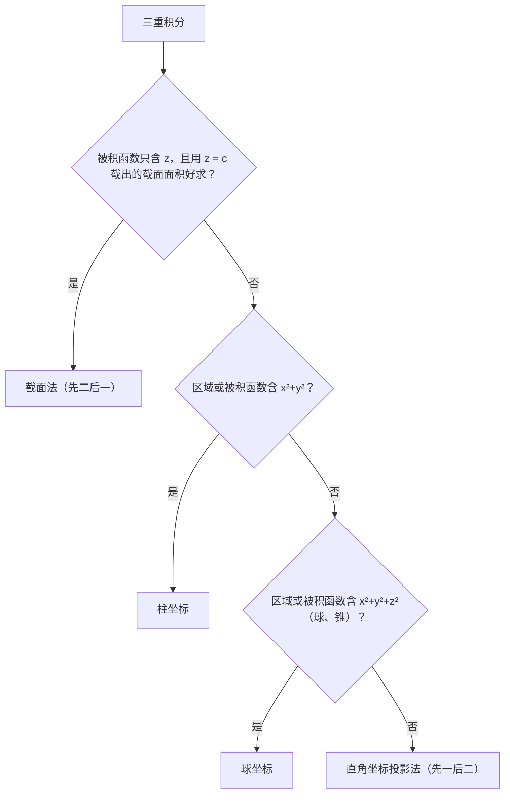

重积分的计算思路只有一个：**化成累次积分（一次一次地算定积分）**。难点不在积分本身，而在于**定限**，以及**选对坐标系、用好对称性**。这一篇的大部分篇幅都放在这几件事上。

## 一、本章地图

| 模块 | 要掌握什么 | 常见考法 |
| --- | --- | --- |
| 二重积分·直角坐标 | X 型、Y 型区域定限 | 填空、解答 |
| 二重积分·极坐标 | 什么时候用、怎么定限 | 填空、解答 |
| 交换积分次序 | 画区域、重新定限 | 填空、选择 |
| 对称性 | 奇偶对称、轮换对称 | 选择、填空 |
| 三重积分 | 投影法、截面法、柱坐标、球坐标 | 解答（数一） |
| 应用 | 体积、曲面面积、质心、转动惯量 | 填空、解答（数一） |

三重积分选方法的大致思路：

## 二、核心概念

### 1. 二重积分的定义与几何意义

$$
\iint_Df(x,y)\,\mathrm d\sigma=\lim_{\lambda\to0}\sum_{i=1}^nf(\xi_i,\eta_i)\Delta\sigma_i.
$$

与定积分一样，是“分割、近似、求和、取极限”。

- 当 $f\ge0$ 时，表示以 $D$ 为底、$z=f(x,y)$ 为顶的**曲顶柱体的体积**；
- $\displaystyle\iint_D1\,\mathrm d\sigma=$ 区域 $D$ 的**面积**。

### 2. 性质

和定积分平行：线性、对区域可加、比较、估值，以及**积分中值定理**：$f$ 在有界闭区域 $D$ 上连续，则存在 $(\xi,\eta)\in D$，使

$$
\iint_Df(x,y)\,\mathrm d\sigma=f(\xi,\eta)\cdot S_D.
$$

它常用来求形如 $\displaystyle\lim_{r\to0^+}\frac{1}{\pi r^2}\iint_{x^2+y^2\le r^2}f(x,y)\,\mathrm d\sigma=f(0,0)$ 的极限。

### 3. 区域的类型

- **X 型**：$a\le x\le b$，$\varphi_1(x)\le y\le\varphi_2(x)$。用竖线穿过区域，下边界和上边界各是一条曲线。
- **Y 型**：$c\le y\le d$，$\psi_1(y)\le x\le\psi_2(y)$。用横线穿过区域，左边界和右边界各是一条曲线。

复杂区域可以拆成若干块，每块是 X 型或 Y 型。

## 三、必背公式

### 1. 二重积分·直角坐标

$$
\iint_Df\,\mathrm d\sigma=\int_a^b\mathrm dx\int_{\varphi_1(x)}^{\varphi_2(x)}f(x,y)\,\mathrm dy\quad(\text{X 型}).
$$

$$
\iint_Df\,\mathrm d\sigma=\int_c^d\mathrm dy\int_{\psi_1(y)}^{\psi_2(y)}f(x,y)\,\mathrm dx\quad(\text{Y 型}).
$$

> [!TIP] 定限口诀
> **外层积分的上下限一定是常数，内层积分的上下限是外层变量的函数。**用平行于内层积分变量所在坐标轴的直线穿过区域，“穿入”的边界是下限，“穿出”的边界是上限。

### 2. 二重积分·极坐标

> [!IMPORTANT] 必背
> $x=r\cos\theta$，$y=r\sin\theta$，$\mathrm d\sigma=r\,\mathrm dr\,\mathrm d\theta$：
> $$\iint_Df(x,y)\,\mathrm d\sigma=\int_\alpha^\beta\mathrm d\theta\int_{r_1(\theta)}^{r_2(\theta)}f(r\cos\theta,r\sin\theta)\,r\,\mathrm dr.$$
> **不要漏掉 $r$**。
>
> 适用场景：区域是圆、扇形、圆环，或边界用极坐标写更简单；被积函数含 $x^2+y^2$ 或 $\dfrac yx$。

常见圆的极坐标方程：

| 直角坐标 | 极坐标 | $\theta$ 范围 |
| --- | --- | --- |
| $x^2+y^2=R^2$ | $r=R$ | $[0,2\pi]$ |
| $x^2+y^2=2ax$（$a>0$） | $r=2a\cos\theta$ | $\left[-\dfrac\pi2,\dfrac\pi2\right]$ |
| $x^2+y^2=2ay$（$a>0$） | $r=2a\sin\theta$ | $[0,\pi]$ |

### 3. 对称性

> [!IMPORTANT] 奇偶对称性（必背）
> 若 $D$ **关于 $y$ 轴对称**（即 $(x,y)\in D\Rightarrow(-x,y)\in D$）：
> - $f$ 关于 **$x$** 是奇函数，$f(-x,y)=-f(x,y)$：$\displaystyle\iint_Df\,\mathrm d\sigma=0$；
> - $f$ 关于 **$x$** 是偶函数：$\displaystyle\iint_Df\,\mathrm d\sigma=2\iint_{D_1}f\,\mathrm d\sigma$，$D_1$ 是 $D$ 在 $x\ge0$ 的部分。
>
> 关于 $x$ 轴对称时，看 $f$ 关于 $y$ 的奇偶性。三重积分同理：区域关于 $xOy$ 面对称，看 $f$ 关于 $z$ 的奇偶性。

> [!IMPORTANT] 轮换对称性（必背）
> 若 $D$ 关于直线 $y=x$ 对称（即把 $x,y$ 互换，$D$ 不变），则
> $$\iint_Df(x,y)\,\mathrm d\sigma=\iint_Df(y,x)\,\mathrm d\sigma.$$
> 三重积分中，若 $\Omega$ 在 $x,y,z$ 轮换下不变，则 $\displaystyle\iiint_\Omega x^2\,\mathrm dV=\iiint_\Omega y^2\,\mathrm dV=\iiint_\Omega z^2\,\mathrm dV$。

### 4. 三重积分

> [!IMPORTANT] 必背
> **投影法（先一后二）**：$\Omega$ 在 $xOy$ 面上的投影为 $D_{xy}$，下曲面 $z=z_1(x,y)$，上曲面 $z=z_2(x,y)$：
> $$\iiint_\Omega f\,\mathrm dV=\iint_{D_{xy}}\mathrm d\sigma\int_{z_1(x,y)}^{z_2(x,y)}f(x,y,z)\,\mathrm dz.$$
> **截面法（先二后一）**：$z$ 的范围是 $[c,d]$，用平面 $z=z$ 截 $\Omega$ 得截面 $D_z$：
> $$\iiint_\Omega f\,\mathrm dV=\int_c^d\mathrm dz\iint_{D_z}f(x,y,z)\,\mathrm d\sigma.$$
> 被积函数只含 $z$ 时最好用，此时内层就是 $f(z)\cdot S(D_z)$。
>
> **柱坐标**：$x=r\cos\theta$，$y=r\sin\theta$，$z=z$，$\mathrm dV=r\,\mathrm dr\,\mathrm d\theta\,\mathrm dz$。
>
> **球坐标**：$x=\rho\sin\varphi\cos\theta$，$y=\rho\sin\varphi\sin\theta$，$z=\rho\cos\varphi$，
> $$\mathrm dV=\rho^2\sin\varphi\,\mathrm d\rho\,\mathrm d\varphi\,\mathrm d\theta.$$
> 其中 $\rho$ 是到原点的距离，$\varphi\in[0,\pi]$ 是与 $z$ 轴正向的夹角，$\theta\in[0,2\pi]$ 与极坐标相同。

球坐标中常见曲面：

| 直角坐标 | 球坐标 |
| --- | --- |
| 球面 $x^2+y^2+z^2=R^2$ | $\rho=R$ |
| 球面 $x^2+y^2+z^2=2Rz$ | $\rho=2R\cos\varphi$ |
| 锥面 $z=\sqrt{x^2+y^2}$ | $\varphi=\dfrac\pi4$ |
| 锥面 $z=\sqrt3\sqrt{x^2+y^2}$ | $\varphi=\dfrac\pi6$ |

### 5. 应用公式

| 量 | 公式 |
| --- | --- |
| 平面区域面积 | $S=\displaystyle\iint_D\mathrm d\sigma$ |
| 空间区域体积 | $V=\displaystyle\iiint_\Omega\mathrm dV$，或曲顶柱体 $V=\displaystyle\iint_D\bigl[z_2-z_1\bigr]\mathrm d\sigma$ |
| 曲面 $z=f(x,y)$ 的面积 | $S=\displaystyle\iint_{D_{xy}}\sqrt{1+f_x^2+f_y^2}\,\mathrm d\sigma$ |
| 质量（密度 $\mu$） | $M=\displaystyle\iiint_\Omega\mu\,\mathrm dV$ |
| 质心 | $\bar x=\dfrac{1}{M}\displaystyle\iiint_\Omega x\mu\,\mathrm dV$，$\bar y$、$\bar z$ 同理 |
| 绕 $z$ 轴的转动惯量 | $I_z=\displaystyle\iiint_\Omega(x^2+y^2)\mu\,\mathrm dV$ |

## 四、题型与解题套路

### 题型 1：直角坐标计算二重积分

**解法步骤**：**画图 → 判断区域类型 → 定限 → 计算**。

**例 1** 求 $\displaystyle\iint_Dxy\,\mathrm d\sigma$，$D$ 由 $y=x$ 与 $y=x^2$ 围成。

**解** 交点为 $(0,0)$ 和 $(1,1)$，在 $[0,1]$ 上 $x^2\le y\le x$，按 X 型：

$$
\int_0^1x\,\mathrm dx\int_{x^2}^xy\,\mathrm dy=\int_0^1x\cdot\frac{x^2-x^4}{2}\,\mathrm dx=\frac12\left(\frac14-\frac16\right)=\boxed{\frac{1}{24}}.
$$

### 题型 2：交换积分次序

**识别特征**：按给定次序，内层积分求不出原函数（如 $e^{-y^2}$、$\dfrac{\sin y}{y}$、$e^{x^2}$）。

**解法步骤**：

1. 由累次积分的上下限**还原出区域 $D$**，画图；
2. 按另一种次序**重新定限**。

**例 2** 求 $\displaystyle\int_0^1\mathrm dx\int_x^1e^{-y^2}\,\mathrm dy$。

**解** 区域 $D:0\le x\le1,\ x\le y\le1$，是以 $(0,0)$、$(0,1)$、$(1,1)$ 为顶点的三角形。改为 Y 型：$0\le y\le1$，$0\le x\le y$：

$$
\int_0^1\mathrm dy\int_0^ye^{-y^2}\,\mathrm dx=\int_0^1ye^{-y^2}\,\mathrm dy=\boxed{\frac12\left(1-\frac1e\right)}.
$$

这与第 06 篇例 9 的结果相同，那里用的是分部积分。

**例 3** 求 $\displaystyle\int_0^1\mathrm dx\int_x^{\sqrt x}\frac{\sin y}{y}\,\mathrm dy$。

**解** 区域 $D:0\le x\le1$，$x\le y\le\sqrt x$，即夹在直线 $y=x$ 与抛物线 $y=\sqrt x$（$x=y^2$）之间。改为 Y 型：$0\le y\le1$，$y^2\le x\le y$：

$$
\int_0^1\frac{\sin y}{y}(y-y^2)\,\mathrm dy=\int_0^1(1-y)\sin y\,\mathrm dy.
$$

分部积分：$\displaystyle\int(1-y)\sin y\,\mathrm dy=-(1-y)\cos y-\sin y+C$，代入上下限：

$$
(0-\sin1)-(-1-0)=\boxed{1-\sin1}.
$$

> [!TIP] 还原区域的方法
> 把四个上下限都写成不等式：外层 $a\le x\le b$，内层 $\varphi_1(x)\le y\le\varphi_2(x)$。画出四条边界线，夹出来的部分就是 $D$。

### 题型 3：极坐标计算二重积分

**例 4** 求 $\displaystyle\iint_{x^2+y^2\le1}e^{x^2+y^2}\,\mathrm d\sigma$。

**解**

$$
\int_0^{2\pi}\mathrm d\theta\int_0^1e^{r^2}r\,\mathrm dr=2\pi\cdot\frac{e-1}{2}=\boxed{\pi(e-1)}.
$$

用直角坐标，$e^{x^2}$ 的原函数求不出来；换成极坐标后多了一个 $r$，正好凑微分。

**例 5** 求 $\displaystyle\iint_D\sqrt{x^2+y^2}\,\mathrm d\sigma$，$D:x^2+y^2\le2x$。

**解** 边界 $r=2\cos\theta$，$\theta\in\left[-\dfrac\pi2,\dfrac\pi2\right]$：

$$
\int_{-\frac\pi2}^{\frac\pi2}\mathrm d\theta\int_0^{2\cos\theta}r\cdot r\,\mathrm dr=\int_{-\frac\pi2}^{\frac\pi2}\frac{8\cos^3\theta}{3}\,\mathrm d\theta=\frac{16}{3}\int_0^{\frac\pi2}\cos^3\theta\,\mathrm d\theta=\frac{16}{3}\cdot\frac23=\boxed{\frac{32}{9}}.
$$

最后一步用了第 06 篇的华里士公式。

### 题型 4：利用对称性

**例 6** 求 $\displaystyle\iint_{x^2+y^2\le1}(x+y)^2\,\mathrm d\sigma$。

**解** 展开为 $x^2+y^2+2xy$。区域关于 $y$ 轴对称，$2xy$ 关于 $x$ 是奇函数，积分为 $0$：

$$
\text{原式}=\iint_D(x^2+y^2)\,\mathrm d\sigma=\int_0^{2\pi}\mathrm d\theta\int_0^1r^3\,\mathrm dr=\boxed{\frac\pi2}.
$$

**例 7（轮换对称性）** 设 $f$ 是正值连续函数，$a,b$ 是常数，求 $\displaystyle\iint_{x^2+y^2\le1}\frac{af(x)+bf(y)}{f(x)+f(y)}\,\mathrm d\sigma$。

**解** 记原积分为 $I$。区域关于 $y=x$ 对称，把 $x,y$ 互换：

$$
I=\iint_D\frac{af(y)+bf(x)}{f(y)+f(x)}\,\mathrm d\sigma.
$$

两式相加，分子变为 $(a+b)\bigl(f(x)+f(y)\bigr)$，与分母约去：

$$
2I=(a+b)\iint_D\mathrm d\sigma=(a+b)\pi,\qquad I=\boxed{\frac{(a+b)\pi}{2}}.
$$

> [!TIP] 和第 06 篇“区间再现”是同一个思路
> 被积函数看起来求不出来，但“互换变量后相加”变成简单函数。看到分子分母形式对称、$f$ 是抽象函数，就试试轮换对称性。

### 题型 5：分区域积分（绝对值、最值函数）

**例 8** 求 $\displaystyle\iint_D\lvert y-x^2\rvert\,\mathrm d\sigma$，$D:-1\le x\le1,\ 0\le y\le1$。

**解** 用 $y=x^2$ 把 $D$ 分成上下两块：

$$
\int_{-1}^1\mathrm dx\int_{x^2}^1(y-x^2)\,\mathrm dy=\int_{-1}^1\frac{(1-x^2)^2}{2}\,\mathrm dx=\frac{8}{15},
$$

$$
\int_{-1}^1\mathrm dx\int_0^{x^2}(x^2-y)\,\mathrm dy=\int_{-1}^1\frac{x^4}{2}\,\mathrm dx=\frac15.
$$

原式 $=\dfrac{8}{15}+\dfrac{3}{15}=\boxed{\dfrac{11}{15}}$。

### 题型 6：三重积分·投影法与截面法

**例 9** 求 $\displaystyle\iiint_\Omega z\,\mathrm dV$，$\Omega$ 由旋转抛物面 $z=x^2+y^2$ 与平面 $z=1$ 围成。

**解法一（截面法）** $z\in[0,1]$，截面 $D_z:x^2+y^2\le z$，面积 $\pi z$：

$$
\int_0^1z\cdot\pi z\,\mathrm dz=\boxed{\frac\pi3}.
$$

**解法二（柱坐标投影法）** 投影区域 $r\le1$，$z$ 从 $r^2$ 到 $1$：

$$
\int_0^{2\pi}\mathrm d\theta\int_0^1r\,\mathrm dr\int_{r^2}^1z\,\mathrm dz=2\pi\int_0^1\frac{r(1-r^4)}{2}\,\mathrm dr=\pi\left(\frac12-\frac16\right)=\frac\pi3.
$$

> [!TIP] 被积函数只含 $z$，优先截面法
> 截面法把三重积分变成“截面面积 × $f(z)$”的定积分，计算量最小。

### 题型 7：柱坐标

**例 10** 求旋转抛物面 $z=x^2+y^2$ 与 $z=2-x^2-y^2$ 所围立体的体积。

**解** 第 09 篇例 14 已求出投影区域为 $x^2+y^2\le1$。在柱坐标下，$z$ 从 $r^2$ 到 $2-r^2$：

$$
V=\int_0^{2\pi}\mathrm d\theta\int_0^1(2-2r^2)\,r\,\mathrm dr=2\pi\left(1-\frac12\right)=\boxed{\pi}.
$$

### 题型 8：球坐标

**例 11** 求由上半锥面 $z=\sqrt{x^2+y^2}$ 与球面 $x^2+y^2+z^2=2$ 所围“冰淇淋筒”形立体的体积。

**解** 锥面是 $\varphi=\dfrac\pi4$，球面是 $\rho=\sqrt2$：

$$
V=\int_0^{2\pi}\mathrm d\theta\int_0^{\frac\pi4}\sin\varphi\,\mathrm d\varphi\int_0^{\sqrt2}\rho^2\,\mathrm d\rho=2\pi\left(1-\frac{\sqrt2}{2}\right)\cdot\frac{2\sqrt2}{3}.
$$

$\left(1-\dfrac{\sqrt2}{2}\right)\cdot\dfrac{2\sqrt2}{3}=\dfrac{2\sqrt2-2}{3}$，所以 $V=\boxed{\dfrac{4\pi(\sqrt2-1)}{3}}$。

**例 12** 求 $\displaystyle\iiint_{x^2+y^2+z^2\le1}x^2\,\mathrm dV$。

**解** 由轮换对称性，$\displaystyle\iiint x^2=\iiint y^2=\iiint z^2=\frac13\iiint(x^2+y^2+z^2)$。用球坐标：

$$
\iiint_\Omega(x^2+y^2+z^2)\,\mathrm dV=\int_0^{2\pi}\mathrm d\theta\int_0^\pi\sin\varphi\,\mathrm d\varphi\int_0^1\rho^4\,\mathrm d\rho=2\pi\cdot2\cdot\frac15=\frac{4\pi}{5}.
$$

所以原式 $=\boxed{\dfrac{4\pi}{15}}$。

> [!WARNING] 球坐标的体积元
> $\mathrm dV=\rho^2\sin\varphi\,\mathrm d\rho\,\mathrm d\varphi\,\mathrm d\theta$，**$\rho^2\sin\varphi$ 一个都不能少**；$\varphi$ 的范围是 $[0,\pi]$，不是 $[0,2\pi]$。

### 题型 9：曲面面积

**例 13** 求旋转抛物面 $z=x^2+y^2$ 在 $z\le1$ 部分的面积。

**解** $\sqrt{1+f_x^2+f_y^2}=\sqrt{1+4x^2+4y^2}$，投影区域 $x^2+y^2\le1$：

$$
S=\int_0^{2\pi}\mathrm d\theta\int_0^1\sqrt{1+4r^2}\,r\,\mathrm dr=2\pi\cdot\frac18\cdot\frac23\Bigl[(1+4r^2)^{\frac32}\Bigr]_0^1=\boxed{\frac{\pi\left(5\sqrt5-1\right)}{6}}.
$$

### 题型 10：质心

**例 14** 求均匀上半球体 $x^2+y^2+z^2\le R^2$，$z\ge0$ 的质心。

**解** 由对称性，$\bar x=\bar y=0$。体积 $V=\dfrac23\pi R^3$。

$$
\iiint_\Omega z\,\mathrm dV=\int_0^{2\pi}\mathrm d\theta\int_0^{\frac\pi2}\cos\varphi\sin\varphi\,\mathrm d\varphi\int_0^R\rho^3\,\mathrm d\rho=2\pi\cdot\frac12\cdot\frac{R^4}{4}=\frac{\pi R^4}{4}.
$$

$\bar z=\dfrac{\pi R^4/4}{2\pi R^3/3}=\dfrac{3R}{8}$，质心为 $\boxed{\left(0,0,\dfrac{3R}{8}\right)}$。

### 题型 11：积分中值定理求极限

**例 15** 求 $\displaystyle\lim_{r\to0^+}\frac{1}{\pi r^2}\iint_{x^2+y^2\le r^2}e^{x^2-y^2}\cos(x+y)\,\mathrm d\sigma$。

**解** 由积分中值定理，存在 $(\xi,\eta)$ 在圆内，使积分等于 $e^{\xi^2-\eta^2}\cos(\xi+\eta)\cdot\pi r^2$。$r\to0^+$ 时 $(\xi,\eta)\to(0,0)$，极限为 $e^0\cos0=\boxed1$。

## 五、证明思路

### 1. 二重积分化为累次积分

以 X 型区域、$f\ge0$ 为例：用平面 $x=x_0$ 去截曲顶柱体，截面是一块曲边梯形，面积为

$$
A(x_0)=\int_{\varphi_1(x_0)}^{\varphi_2(x_0)}f(x_0,y)\,\mathrm dy.
$$

由第 07 篇的“平行截面面积求体积”，$V=\displaystyle\int_a^bA(x)\,\mathrm dx$，这正是累次积分。

### 2. 极坐标的面积元为什么多一个 $r$

用 $r=$ 常数和 $\theta=$ 常数的曲线分割区域。小块近似为一个“弯曲的矩形”：

- 径向的边长为 $\mathrm dr$；
- 圆弧方向的边长为 $r\,\mathrm d\theta$（弧长 = 半径 × 圆心角）。

所以 $\mathrm d\sigma=r\,\mathrm dr\,\mathrm d\theta$。球坐标同理：三条边分别是 $\mathrm d\rho$、$\rho\,\mathrm d\varphi$、$\rho\sin\varphi\,\mathrm d\theta$（$\rho\sin\varphi$ 是到 $z$ 轴的距离），相乘得 $\rho^2\sin\varphi$。

### 3. 对称性

区域关于 $y$ 轴对称，$f$ 关于 $x$ 是奇函数时：左右两半上对应点 $(x,y)$ 与 $(-x,y)$ 处的函数值互为相反数，面积元相同，所以两半的积分互相抵消。严格证明就是在左半部分做换元 $x=-u$。

### 4. 用二重积分求 $\displaystyle\int_0^{+\infty}e^{-x^2}\,\mathrm dx$

记 $I=\displaystyle\int_0^{+\infty}e^{-x^2}\,\mathrm dx$，则

$$
I^2=\int_0^{+\infty}e^{-x^2}\,\mathrm dx\int_0^{+\infty}e^{-y^2}\,\mathrm dy=\iint_{x\ge0,y\ge0}e^{-(x^2+y^2)}\,\mathrm d\sigma=\int_0^{\frac\pi2}\mathrm d\theta\int_0^{+\infty}e^{-r^2}r\,\mathrm dr=\frac\pi4.
$$

所以 $I=\dfrac{\sqrt\pi}{2}$，这正是第 06 篇引用过的结论。

## 六、易错点

> [!CAUTION] 对称性要同时看区域和被积函数
> 用“奇函数积分为 0”时，必须检查两点：
> 1. 区域关于**哪条轴**对称；
> 2. 被积函数关于**对应的那个变量**是不是奇函数。
>
> 例如 $D$ 关于 $y$ 轴对称（左右对称），要看 $f$ 关于 **$x$** 的奇偶性，而不是关于 $y$。两者配错，是对称性题目最常见的错误。

- **极坐标漏掉 $r$**，球坐标漏掉 $\rho^2\sin\varphi$。
- **外层积分限中出现了变量**：外层上下限必须是常数。
- **交换次序时没有画图**，直接把上下限对调。
- **$r=2a\cos\theta$ 的 $\theta$ 范围写成 $[0,2\pi]$**：应为 $\left[-\dfrac\pi2,\dfrac\pi2\right]$，否则 $r<0$。
- **球坐标中 $\varphi$ 的范围写成 $[0,2\pi]$**。
- **曲面面积忘记乘 $\sqrt{1+f_x^2+f_y^2}$**。
- **轮换对称性只看了被积函数，没检查区域在 $x,y$ 互换后是否不变**。

## 七、小练习

**1.** 求 $\displaystyle\int_0^1\mathrm dy\int_y^1e^{x^2}\,\mathrm dx$。

点击查看答案

区域 $0\le y\le x\le1$。交换次序：

$$\int_0^1\mathrm dx\int_0^xe^{x^2}\,\mathrm dy=\int_0^1xe^{x^2}\,\mathrm dx=\frac{e-1}{2}.$$

**2.** 求 $\displaystyle\iint_{x^2+y^2\le a^2}\sqrt{a^2-x^2-y^2}\,\mathrm d\sigma$（$a>0$）。

点击查看答案

几何意义：半径为 $a$ 的上半球体积，为 $\dfrac23\pi a^3$。

用极坐标验证：$2\pi\displaystyle\int_0^a\sqrt{a^2-r^2}\,r\,\mathrm dr=2\pi\cdot\frac13a^3=\frac23\pi a^3$。

**3.** 求 $\displaystyle\iint_{\lvert x\rvert+\lvert y\rvert\le1}\left(x+y^3+1\right)\mathrm d\sigma$。

点击查看答案

区域关于两条坐标轴都对称。$x$ 关于 $x$ 是奇函数，$y^3$ 关于 $y$ 是奇函数，积分都为 $0$。

剩下 $\displaystyle\iint_D1\,\mathrm d\sigma$，即正方形 $\lvert x\rvert+\lvert y\rvert\le1$ 的面积，对角线长 $2$，面积为 $2$。

**4.** 用截面法求 $\displaystyle\iiint_{x^2+y^2+z^2\le1}z^2\,\mathrm dV$，并与例 12 比较。

点击查看答案

截面 $D_z:x^2+y^2\le1-z^2$，面积 $\pi(1-z^2)$：

$$\int_{-1}^1z^2\cdot\pi(1-z^2)\,\mathrm dz=\pi\left(\frac23-\frac25\right)=\frac{4\pi}{15}.$$

与例 12 的 $\displaystyle\iiint x^2\,\mathrm dV$ 相同，符合轮换对称性。

**5.** 求锥面 $z=\sqrt{x^2+y^2}$ 与平面 $z=1$ 所围立体的体积。

点击查看答案

柱坐标，$z$ 从 $r$ 到 $1$：

$$V=\int_0^{2\pi}\mathrm d\theta\int_0^1(1-r)\,r\,\mathrm dr=2\pi\left(\frac12-\frac13\right)=\frac\pi3.$$

与圆锥体积公式 $\dfrac13\pi R^2h=\dfrac\pi3$ 一致。

## 八、本章小结

- 计算重积分就是**化为累次积分**，关键是**画图定限**：外层限是常数，内层限是外层变量的函数。
- 内层积分求不出来时，**交换积分次序**：先还原区域，再重新定限。
- 圆形区域或含 $x^2+y^2$：用**极坐标**，$\mathrm d\sigma=r\,\mathrm dr\,\mathrm d\theta$。
- 计算前先看**对称性**：奇偶对称看“区域关于哪条轴对称、函数关于对应变量的奇偶”；轮换对称看“互换变量后区域不变”。
- 三重积分：被积函数只含 $z$ 用**截面法**；含 $x^2+y^2$ 用**柱坐标**；球、锥用**球坐标**，$\mathrm dV=\rho^2\sin\varphi\,\mathrm d\rho\,\mathrm d\varphi\,\mathrm d\theta$。
- 应用：体积、曲面面积 $\displaystyle\iint\sqrt{1+f_x^2+f_y^2}\,\mathrm d\sigma$、质心、转动惯量。

下一篇：**12 曲线积分与格林公式**。
