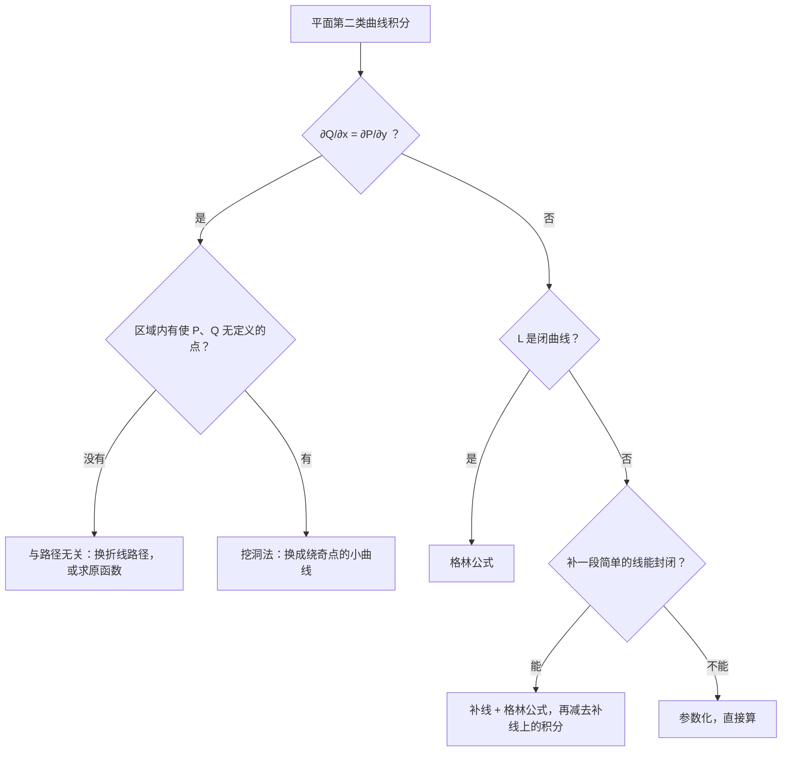

曲线积分是数一专属内容，几乎每年都有一道大题落在曲线积分或曲面积分上。这一篇的重点是第二类曲线积分：**什么时候直接参数化，什么时候用格林公式，什么时候利用路径无关**。三条路选对了，计算量往往只剩一小半。

## 一、本章地图

| 模块 | 要掌握什么 | 常见考法 |
| --- | --- | --- |
| 第一类曲线积分 | 参数化、$\mathrm ds$ 公式、对称性 | 填空 |
| 第二类曲线积分 | 参数化、方向 | 填空、解答 |
| 两类的联系 | 切向量的方向余弦 | 选择 |
| 格林公式 | 条件、正向、补线法 | 解答 |
| 路径无关 | 四个等价条件、求原函数 | 解答 |
| 奇点 | 挖洞法 | 解答 |
| 空间曲线积分 | 参数化；斯托克斯公式见第 13 篇 | 填空、解答 |

计算平面上的第二类曲线积分 $\displaystyle\int_LP\,\mathrm dx+Q\,\mathrm dy$，按下面的顺序考虑：

## 二、核心概念

### 1. 第一类曲线积分（对弧长）

$$
\int_Lf(x,y)\,\mathrm ds=\lim_{\lambda\to0}\sum_{i=1}^nf(\xi_i,\eta_i)\Delta s_i.
$$

物理意义：线密度为 $f$ 的曲线形构件的**质量**。$\displaystyle\int_L1\,\mathrm ds$ 就是曲线 $L$ 的**长度**。

**特点：与方向无关**，$\Delta s_i$ 永远是正的。

### 2. 第二类曲线积分（对坐标）

$$
\int_LP(x,y)\,\mathrm dx+Q(x,y)\,\mathrm dy.
$$

物理意义：质点在力场 $\boldsymbol F=(P,Q)$ 中沿 $L$ 运动时**做的功**。

**特点：与方向有关**，反向则变号：

$$
\int_{L^-}P\,\mathrm dx+Q\,\mathrm dy=-\int_LP\,\mathrm dx+Q\,\mathrm dy.
$$

### 3. 两类曲线积分的联系

设 $(\cos\alpha,\cos\beta)$ 是 $L$ 上**沿积分方向**的单位切向量，则

$$
\int_LP\,\mathrm dx+Q\,\mathrm dy=\int_L(P\cos\alpha+Q\cos\beta)\,\mathrm ds.
$$

原因：$\mathrm dx=\cos\alpha\,\mathrm ds$，$\mathrm dy=\cos\beta\,\mathrm ds$。

### 4. 闭曲线的正向

**沿边界行走时，区域始终在左手边**，这个方向称为正向。

- 单个区域的外边界：**逆时针**为正；
- 区域内部挖了洞（复连通区域）：外边界逆时针，**内边界顺时针**。

## 三、必背公式

### 1. 第一类曲线积分的计算

> [!IMPORTANT] 必背
> 曲线 $L:x=x(t),\ y=y(t)$，$\alpha\le t\le\beta$：
> $$\int_Lf(x,y)\,\mathrm ds=\int_\alpha^\beta f\bigl(x(t),y(t)\bigr)\sqrt{x'^2(t)+y'^2(t)}\,\mathrm dt\qquad(\alpha<\beta).$$
> **下限必须小于上限**，因为 $\mathrm ds>0$。
>
> $L:y=y(x)$ 时 $\mathrm ds=\sqrt{1+y'^2}\,\mathrm dx$；极坐标 $r=r(\theta)$ 时 $\mathrm ds=\sqrt{r^2+r'^2}\,\mathrm d\theta$。这就是第 07 篇的弧长公式。

**两个化简技巧**：

1. **曲线方程可以直接代入被积函数**：在 $x^2+y^2=R^2$ 上，$\displaystyle\int_L(x^2+y^2)\,\mathrm ds=\int_LR^2\,\mathrm ds$。
2. **对称性**：$L$ 关于 $y$ 轴对称，$f$ 关于 $x$ 是奇函数，则积分为 $0$；轮换对称（$L$ 在 $x,y$ 互换下不变）则 $\displaystyle\int_Lf(x,y)\,\mathrm ds=\int_Lf(y,x)\,\mathrm ds$。和第 11 篇重积分的对称性一样。

### 2. 第二类曲线积分的计算

> [!IMPORTANT] 必背
> 曲线 $L:x=x(t),\ y=y(t)$，**起点对应 $t=\alpha$，终点对应 $t=\beta$**：
> $$\int_LP\,\mathrm dx+Q\,\mathrm dy=\int_\alpha^\beta\Bigl[P\bigl(x(t),y(t)\bigr)x'(t)+Q\bigl(x(t),y(t)\bigr)y'(t)\Bigr]\mathrm dt.$$
> 这里 $\alpha$ **不一定小于** $\beta$，由方向决定。

### 3. 格林公式

> [!IMPORTANT] 必背
> 设闭区域 $D$ 由分段光滑的曲线 $L$ 围成，$P,Q$ 在 $D$ 上具有**一阶连续偏导数**，$L$ 取**正向**，则
> $$\oint_LP\,\mathrm dx+Q\,\mathrm dy=\iint_D\left(\frac{\partial Q}{\partial x}-\frac{\partial P}{\partial y}\right)\mathrm d\sigma.$$
> 三个条件缺一不可：**曲线封闭、取正向、$P,Q$ 在 $D$ 内偏导数连续（没有奇点）**。

**推论（面积公式）**：取 $P=-y$，$Q=x$，

$$
S_D=\frac12\oint_Lx\,\mathrm dy-y\,\mathrm dx.
$$

### 4. 积分与路径无关

> [!IMPORTANT] 四个等价条件（必背）
> 设 $D$ 是**单连通区域**（没有洞），$P,Q$ 在 $D$ 内具有一阶连续偏导数。以下四条等价：
> 1. 沿 $D$ 内任意闭曲线，$\displaystyle\oint_LP\,\mathrm dx+Q\,\mathrm dy=0$；
> 2. $\displaystyle\int_LP\,\mathrm dx+Q\,\mathrm dy$ 在 $D$ 内与路径无关，只与起点和终点有关；
> 3. $P\,\mathrm dx+Q\,\mathrm dy$ 是某个函数 $u(x,y)$ 的全微分；
> 4. 在 $D$ 内处处有 $\dfrac{\partial Q}{\partial x}=\dfrac{\partial P}{\partial y}$。
>
> 实际做题时用第 4 条判断，用第 2、3 条计算。

**与路径无关时的计算**：

- **换路径**：常选平行于坐标轴的折线；
- **求原函数** $u$：$\displaystyle\int_A^BP\,\mathrm dx+Q\,\mathrm dy=u(B)-u(A)$。

求原函数的公式（沿折线 $(x_0,y_0)\to(x,y_0)\to(x,y)$）：

$$
u(x,y)=\int_{x_0}^xP(x,y_0)\,\mathrm dx+\int_{y_0}^yQ(x,y)\,\mathrm dy.
$$

也可以像第 08 篇的全微分方程那样**凑微分**，通常更快。

### 5. 空间曲线积分

空间曲线 $\Gamma:x=x(t),\ y=y(t),\ z=z(t)$：

$$
\int_\Gamma f\,\mathrm ds=\int_\alpha^\beta f\cdot\sqrt{x'^2+y'^2+z'^2}\,\mathrm dt\quad(\alpha<\beta),
$$

$$
\int_\Gamma P\,\mathrm dx+Q\,\mathrm dy+R\,\mathrm dz=\int_\alpha^\beta(Px'+Qy'+Rz')\,\mathrm dt\quad(\alpha\text{ 对应起点}).
$$

空间闭曲线上的第二类积分，还可以用第 13 篇的**斯托克斯公式**。

## 四、题型与解题套路

### 题型 1：第一类曲线积分

**例 1** 求 $\displaystyle\oint_L(x^2+y^2)\,\mathrm ds$，$L$ 为圆周 $x^2+y^2=a^2$。

**解** 把曲线方程代入被积函数：

$$
\oint_La^2\,\mathrm ds=a^2\cdot2\pi a=\boxed{2\pi a^3}.
$$

**例 2** 求 $\displaystyle\int_Lx\,\mathrm ds$，$L$ 为抛物线 $y=x^2$ 上 $0\le x\le1$ 的一段。

**解** $\mathrm ds=\sqrt{1+4x^2}\,\mathrm dx$：

$$
\int_0^1x\sqrt{1+4x^2}\,\mathrm dx=\frac{1}{12}\Bigl[(1+4x^2)^{\frac32}\Bigr]_0^1=\boxed{\frac{5\sqrt5-1}{12}}.
$$

**例 3** 设椭圆 $L:\dfrac{x^2}{4}+\dfrac{y^2}{3}=1$ 的周长为 $a$，求 $\displaystyle\oint_L(2xy+3x^2+4y^2)\,\mathrm ds$。

**解** $L$ 关于 $y$ 轴对称，$2xy$ 关于 $x$ 是奇函数，积分为 $0$。在 $L$ 上 $3x^2+4y^2=12$，所以

$$
\text{原式}=\oint_L12\,\mathrm ds=\boxed{12a}.
$$

> [!TIP] 第一类曲线积分的两个“偷懒”方法
> **先代入曲线方程，再看对称性。**很多题这样处理后根本不用参数化。

### 题型 2：第二类曲线积分·直接参数化

**例 4** 求 $\displaystyle I=\int_L(x+y)\,\mathrm dx+(y-x)\,\mathrm dy$，从点 $(1,1)$ 到点 $(4,2)$，路径分别为：

1. 抛物线 $y^2=x$；
2. 直线段。

**解**

1. 取 $y=t$，$x=t^2$，$t$ 从 $1$ 到 $2$，$\mathrm dx=2t\,\mathrm dt$：
   $$I=\int_1^2\bigl[(t^2+t)\cdot2t+(t-t^2)\bigr]\mathrm dt=\int_1^2(2t^3+t^2+t)\,\mathrm dt=\frac{15}{2}+\frac73+\frac32=\boxed{\frac{34}{3}}.$$
2. 取 $x=1+3t$，$y=1+t$，$t$ 从 $0$ 到 $1$：
   $$I=\int_0^1\bigl[(2+4t)\cdot3+(-2t)\cdot1\bigr]\mathrm dt=\int_0^1(6+10t)\,\mathrm dt=\boxed{11}.$$

两条路径的结果不同。原因是 $\dfrac{\partial Q}{\partial x}=-1\ne1=\dfrac{\partial P}{\partial y}$，积分与路径**有关**。

### 题型 3：格林公式

**例 5** 求 $\displaystyle\oint_L(2xy-x^2)\,\mathrm dx+(x+y^2)\,\mathrm dy$，$L$ 是由 $y=x^2$ 和 $y^2=x$ 所围区域的正向边界。

**解** $\dfrac{\partial Q}{\partial x}-\dfrac{\partial P}{\partial y}=1-2x$。区域 $D:0\le x\le1$，$x^2\le y\le\sqrt x$：

$$
\iint_D(1-2x)\,\mathrm d\sigma=\int_0^1(1-2x)\left(\sqrt x-x^2\right)\mathrm dx=\frac23-\frac13-\frac45+\frac12=\boxed{\frac{1}{30}}.
$$

**例 6（面积）** 用曲线积分求椭圆 $x=a\cos t$，$y=b\sin t$ 的面积。

**解** $x\,\mathrm dy-y\,\mathrm dx=(ab\cos^2t+ab\sin^2t)\,\mathrm dt=ab\,\mathrm dt$：

$$
S=\frac12\int_0^{2\pi}ab\,\mathrm dt=\boxed{\pi ab}.
$$

### 题型 4：补线法

**识别特征**：曲线**不封闭**，直接参数化很难算，但 $\dfrac{\partial Q}{\partial x}-\dfrac{\partial P}{\partial y}$ 很简单。

**解法步骤**：

1. 补一段简单的线 $L_1$（通常是坐标轴上的线段），使 $L+L_1$ 封闭；
2. 检查方向，用格林公式算 $\displaystyle\oint_{L+L_1}$；
3. 单独算 $\displaystyle\int_{L_1}$；
4. $\displaystyle\int_L=\oint_{L+L_1}-\int_{L_1}$。

**例 7** 求 $\displaystyle I=\int_L(e^x\sin y-my)\,\mathrm dx+(e^x\cos y-m)\,\mathrm dy$，其中 $L$ 是从点 $A(a,0)$ 沿上半圆周 $x^2+y^2=ax$（$a>0$）到原点 $O$ 的一段。

**解** $\dfrac{\partial Q}{\partial x}-\dfrac{\partial P}{\partial y}=e^x\cos y-(e^x\cos y-m)=m$。

补线段 $\overrightarrow{OA}$（沿 $x$ 轴从 $O$ 到 $A$），$L+\overrightarrow{OA}$ 是**逆时针**的闭曲线，围成的区域 $D$ 是半径为 $\dfrac a2$ 的上半圆，面积 $\dfrac{\pi a^2}{8}$。

在 $\overrightarrow{OA}$ 上 $y=0$，$\mathrm dy=0$，$P=0$，积分为 $0$。所以

$$
I=\iint_Dm\,\mathrm d\sigma-0=\boxed{\frac{\pi ma^2}{8}}.
$$

> [!WARNING] 补线后检查方向
> 补完以后，闭曲线如果是**顺时针**，格林公式要**加负号**。画图看清楚区域在不在左手边。

### 题型 5：与路径无关·换路径或求原函数

**例 8** 求 $\displaystyle\int_L(2xy+y^2)\,\mathrm dx+(x^2+2xy)\,\mathrm dy$，$L$ 是曲线 $y=2x^3$ 上从 $(0,0)$ 到 $(1,2)$ 的一段。

**解** $\dfrac{\partial P}{\partial y}=2x+2y=\dfrac{\partial Q}{\partial x}$，在全平面成立，与路径无关。

凑微分：$(2xy\,\mathrm dx+x^2\,\mathrm dy)+(y^2\,\mathrm dx+2xy\,\mathrm dy)=\mathrm d(x^2y)+\mathrm d(xy^2)$，原函数 $u=x^2y+xy^2$。

$$
\text{原式}=u(1,2)-u(0,0)=2+4=\boxed6.
$$

**例 9** 确定 $\lambda$，使 $\displaystyle\int_L(x^4+4xy^\lambda)\,\mathrm dx+(6x^{\lambda-1}y^2-5y^4)\,\mathrm dy$ 与路径无关，并求从 $(0,0)$ 到 $(1,2)$ 的积分值。

**解** 由 $\dfrac{\partial P}{\partial y}=\dfrac{\partial Q}{\partial x}$：

$$
4\lambda xy^{\lambda-1}=6(\lambda-1)x^{\lambda-2}y^2.
$$

比较 $x$ 和 $y$ 的指数：$\lambda-2=1$ 且 $\lambda-1=2$，得 $\lambda=3$；系数 $4\cdot3=6\cdot2$，成立。

原函数：$u=\dfrac{x^5}{5}+2x^2y^3-y^5$（检验：$u_x=x^4+4xy^3$，$u_y=6x^2y^2-5y^4$）。

$$
\text{原式}=u(1,2)=\frac15+16-32=\boxed{-\frac{79}{5}}.
$$

> [!TIP] 求原函数的两种方法
> - **凑微分**：把 $P\,\mathrm dx+Q\,\mathrm dy$ 分组，每组凑成某个函数的全微分。
> - **偏积分**：$u=\displaystyle\int P\,\mathrm dx+\varphi(y)$，再对 $y$ 求偏导，与 $Q$ 比较定出 $\varphi(y)$。

### 题型 6：有奇点·挖洞法

**识别特征**：$\dfrac{\partial Q}{\partial x}=\dfrac{\partial P}{\partial y}$，但 $P,Q$ 在某点（通常是原点）无定义，且曲线**包围**这个点。

**解法**：在奇点周围挖一个小洞，小曲线 $C$ 的形状**按分母选**，使分母在 $C$ 上是常数。在 $L$ 与 $C$ 之间的区域上用格林公式，得到

$$
\oint_L=\oint_C\quad(\text{两者同为逆时针}).
$$

**例 10** 求 $\displaystyle\oint_L\frac{x\,\mathrm dy-y\,\mathrm dx}{x^2+y^2}$，$L$ 是一条不经过原点的分段光滑正向闭曲线。

**解** $P=\dfrac{-y}{x^2+y^2}$，$Q=\dfrac{x}{x^2+y^2}$，可以算出

$$
\frac{\partial Q}{\partial x}=\frac{y^2-x^2}{(x^2+y^2)^2}=\frac{\partial P}{\partial y}\quad\bigl((x,y)\ne(0,0)\bigr).
$$

- **$L$ 不包围原点**：由格林公式，积分为 $\boxed0$。
- **$L$ 包围原点**：换成逆时针小圆 $C:x=\varepsilon\cos\theta$，$y=\varepsilon\sin\theta$，$x\,\mathrm dy-y\,\mathrm dx=\varepsilon^2\,\mathrm d\theta$：
  $$\oint_L=\oint_C=\int_0^{2\pi}\frac{\varepsilon^2}{\varepsilon^2}\,\mathrm d\theta=\boxed{2\pi}.$$

**例 11** 求 $\displaystyle\oint_L\frac{x\,\mathrm dy-y\,\mathrm dx}{4x^2+y^2}$，$L$ 为圆周 $x^2+y^2=1$，逆时针方向。

**解** 同样可以验证 $\dfrac{\partial Q}{\partial x}=\dfrac{y^2-4x^2}{(4x^2+y^2)^2}=\dfrac{\partial P}{\partial y}$，原点是奇点且在 $L$ 内部。

**按分母选小曲线**：取椭圆 $C:4x^2+y^2=\varepsilon^2$，参数式 $x=\dfrac\varepsilon2\cos t$，$y=\varepsilon\sin t$，逆时针。

$$
x\,\mathrm dy-y\,\mathrm dx=\frac{\varepsilon^2}{2}\cos^2t\,\mathrm dt+\frac{\varepsilon^2}{2}\sin^2t\,\mathrm dt=\frac{\varepsilon^2}{2}\,\mathrm dt.
$$

$$
\oint_L=\oint_C=\int_0^{2\pi}\frac{\varepsilon^2/2}{\varepsilon^2}\,\mathrm dt=\boxed\pi.
$$

> [!CAUTION] 有奇点时不能直接说“积分为 0”
> 区域内有奇点时，区域不是单连通的，“$\dfrac{\partial Q}{\partial x}=\dfrac{\partial P}{\partial y}\Rightarrow$ 闭曲线积分为 0”**不成立**。例 10 就是反例。

### 题型 7：两类曲线积分的互化

**例 12** 把 $\displaystyle\int_LP\,\mathrm dx+Q\,\mathrm dy$ 化为第一类曲线积分，$L$ 为抛物线 $y=x^2$ 上从 $(0,0)$ 到 $(1,1)$ 的一段。

**解** 沿 $x$ 增大方向的切向量为 $(1,2x)$，单位化为 $\dfrac{(1,2x)}{\sqrt{1+4x^2}}$：

$$
\int_LP\,\mathrm dx+Q\,\mathrm dy=\boxed{\int_L\frac{P+2xQ}{\sqrt{1+4x^2}}\,\mathrm ds}.
$$

### 题型 8：空间曲线积分

**例 13** 求 $\displaystyle\int_\Gamma y\,\mathrm dx-x\,\mathrm dy+z\,\mathrm dz$，$\Gamma$ 为螺旋线 $x=\cos t$，$y=\sin t$，$z=t$ 上从 $t=0$ 到 $t=2\pi$ 的一段。

**解**

$$
\int_0^{2\pi}\bigl[\sin t\cdot(-\sin t)-\cos t\cdot\cos t+t\bigr]\mathrm dt=\int_0^{2\pi}(t-1)\,\mathrm dt=\boxed{2\pi^2-2\pi}.
$$

**例 14** 求 $\displaystyle\oint_\Gamma x^2\,\mathrm ds$，$\Gamma$ 为球面 $x^2+y^2+z^2=a^2$ 与平面 $x+y+z=0$ 的交线。

**解** $\Gamma$ 在 $x,y,z$ 轮换下不变，所以

$$
\oint_\Gamma x^2\,\mathrm ds=\frac13\oint_\Gamma(x^2+y^2+z^2)\,\mathrm ds=\frac{a^2}{3}\oint_\Gamma\mathrm ds.
$$

平面过球心，$\Gamma$ 是半径为 $a$ 的大圆，周长 $2\pi a$。原式 $=\boxed{\dfrac{2\pi a^3}{3}}$。

## 五、证明思路

### 1. 格林公式

以既是 X 型又是 Y 型的区域为例，分别证明

$$
-\oint_LP\,\mathrm dx=\iint_D\frac{\partial P}{\partial y}\,\mathrm d\sigma,\qquad\oint_LQ\,\mathrm dy=\iint_D\frac{\partial Q}{\partial x}\,\mathrm d\sigma.
$$

看第一个。$D:a\le x\le b$，$\varphi_1(x)\le y\le\varphi_2(x)$。右边先对 $y$ 积分，用牛顿-莱布尼茨公式：

$$
\iint_D\frac{\partial P}{\partial y}\,\mathrm d\sigma=\int_a^b\Bigl[P\bigl(x,\varphi_2(x)\bigr)-P\bigl(x,\varphi_1(x)\bigr)\Bigr]\mathrm dx.
$$

左边：$L$ 由下边界（从左到右）、上边界（从右到左）和可能的竖直线段组成。竖直线段上 $\mathrm dx=0$，积分为 $0$。所以

$$
\oint_LP\,\mathrm dx=\int_a^bP\bigl(x,\varphi_1(x)\bigr)\mathrm dx-\int_a^bP\bigl(x,\varphi_2(x)\bigr)\mathrm dx,
$$

正好是上式的相反数。一般区域可以用辅助线切成若干块，辅助线上的积分来回各一次，互相抵消。

### 2. 路径无关的条件

- (4) ⇒ (1)：单连通区域内任一闭曲线围成的区域都在 $D$ 内，用格林公式，被积函数为 $0$。
- (1) ⇒ (2)：两条同起点、同终点的路径，一条正走、一条反走，拼成一条闭曲线。
- (2) ⇒ (3)：定义 $u(x,y)=\displaystyle\int_{(x_0,y_0)}^{(x,y)}P\,\mathrm dx+Q\,\mathrm dy$，它与路径无关，可以证明 $u_x=P$，$u_y=Q$。
- (3) ⇒ (4)：$P=u_x$，$Q=u_y$，$\dfrac{\partial P}{\partial y}=u_{xy}=u_{yx}=\dfrac{\partial Q}{\partial x}$。

### 3. 挖洞法

设 $L$ 包围奇点，在 $L$ 内画一条包围奇点的小闭曲线 $C$。$L$ 与 $C$ 之间的区域 $D'$ 内没有奇点，它的正向边界是“$L$ 逆时针 + $C$ 顺时针”。用格林公式：

$$
\oint_L+\oint_{C^{\text{顺}}}=\iint_{D'}0\,\mathrm d\sigma=0,\qquad\text{即}\quad\oint_L=\oint_{C^{\text{逆}}}.
$$

## 六、易错点

> [!CAUTION] 两类曲线积分的定限规则相反
> - **第一类**（$\mathrm ds$）：参数**下限小于上限**，与方向无关。
> - **第二类**（$\mathrm dx$、$\mathrm dy$）：参数**下限对应起点，上限对应终点**，下限可以大于上限。
>
> 把第二类的规则用到第一类上，会得到负的弧长或质量。

- **格林公式用于不封闭的曲线**：要先补线。
- **补线后没有减去补线上的积分**，或闭曲线是顺时针却没加负号。
- **区域内有奇点仍直接用格林公式**：要挖洞。
- **挖洞时小曲线的形状没有按分母选**：分母是 $4x^2+y^2$，就挖椭圆 $4x^2+y^2=\varepsilon^2$。
- **判断路径无关时忽略单连通的要求**。
- **格林公式中 $\dfrac{\partial Q}{\partial x}-\dfrac{\partial P}{\partial y}$ 的顺序写反**：记作“$Q$ 对 $x$ 减 $P$ 对 $y$”。

## 七、小练习

**1.** 求 $\displaystyle\int_L(x+y)\,\mathrm ds$，$L$ 是从 $(1,0)$ 到 $(0,1)$ 的直线段。

点击查看答案

在 $L$ 上 $x+y=1$，所以原式 $=\displaystyle\int_L\mathrm ds=$ 线段长度 $=\sqrt2$。

**2.** 求 $\displaystyle\int_Lx\,\mathrm dy-y\,\mathrm dx$，$L$ 是上半圆周 $x^2+y^2=1$ 上从 $(1,0)$ 到 $(-1,0)$ 的一段。

点击查看答案

$x=\cos t$，$y=\sin t$，$t$ 从 $0$ 到 $\pi$，$x\,\mathrm dy-y\,\mathrm dx=\mathrm dt$，原式 $=\pi$。

**3.** 求 $\displaystyle\oint_L(y-x)\,\mathrm dx+(3x+y)\,\mathrm dy$，$L$ 是圆周 $(x-1)^2+(y-4)^2=9$，逆时针方向。

点击查看答案

$\dfrac{\partial Q}{\partial x}-\dfrac{\partial P}{\partial y}=3-1=2$，由格林公式，原式 $=2\cdot9\pi=18\pi$。

**4.** 证明 $\displaystyle\int_{(1,0)}^{(2,1)}(2xy-y^4+3)\,\mathrm dx+(x^2-4xy^3)\,\mathrm dy$ 与路径无关，并求其值。

点击查看答案

$\dfrac{\partial P}{\partial y}=2x-4y^3=\dfrac{\partial Q}{\partial x}$，全平面成立，与路径无关。

原函数 $u=x^2y-xy^4+3x$，原式 $=u(2,1)-u(1,0)=(4-2+6)-3=5$。

**5.** 求 $\displaystyle\oint_L\frac{x\,\mathrm dy-y\,\mathrm dx}{x^2+y^2}$，$L$ 分别为：(1) $(x-2)^2+y^2=1$；(2) $\lvert x\rvert+\lvert y\rvert=1$，都取逆时针方向。

点击查看答案

1. 原点在圆外，积分为 $0$。
2. 原点在正方形内，由例 10，积分为 $2\pi$。

## 八、本章小结

- 第一类曲线积分：**参数化，下限小于上限**；先代入曲线方程、再用对称性。
- 第二类曲线积分：**参数化，下限对应起点**；反向变号。
- 闭曲线、无奇点：**格林公式** $\displaystyle\oint P\,\mathrm dx+Q\,\mathrm dy=\iint\left(Q_x-P_y\right)\mathrm d\sigma$，注意正向。
- 不闭合但 $Q_x-P_y$ 简单：**补线**再用格林公式，最后减去补线部分。
- $Q_x=P_y$ 且单连通：**与路径无关**，换折线或求原函数。
- 有奇点：**挖洞**，小曲线按分母的形状选。
- 两类互化：$\mathrm dx=\cos\alpha\,\mathrm ds$，$\mathrm dy=\cos\beta\,\mathrm ds$。

下一篇：**13 曲面积分与高斯、斯托克斯公式**。
