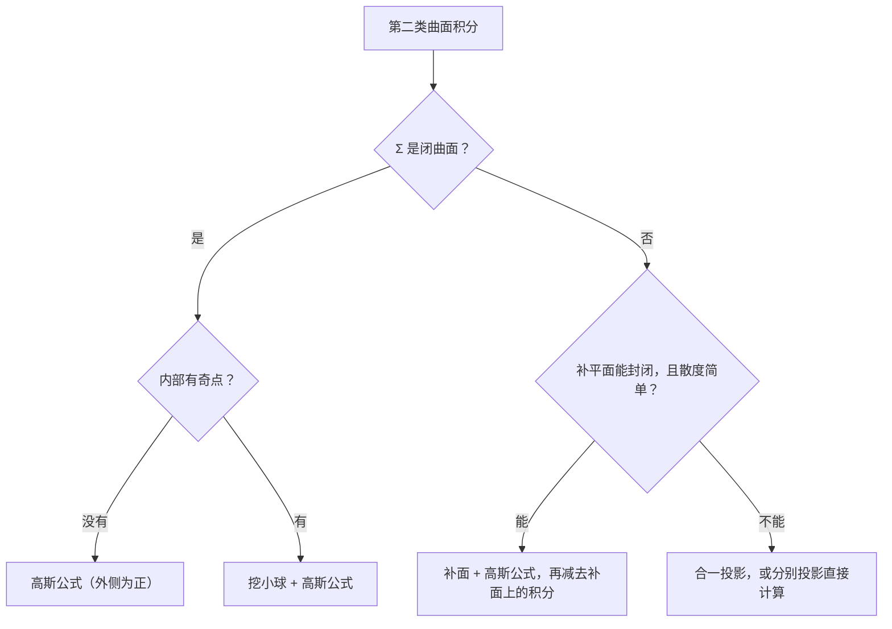

这一篇和第 12 篇是“一一对应”的：第一类曲面积分对应第一类曲线积分，第二类对应第二类，**高斯公式**对应格林公式，**补面法**对应补线法。按这个对应关系去记，会轻松很多。

## 一、本章地图

| 模块 | 要掌握什么 | 常见考法 |
| --- | --- | --- |
| 第一类曲面积分 | 投影、$\mathrm dS$ 公式、对称性 | 填空、解答 |
| 第二类曲面积分 | 投影、定侧（正负号） | 解答 |
| 两类的联系 | 法向量的方向余弦、合一投影 | 解答 |
| 高斯公式 | 条件、外侧、补面法、挖洞 | 解答（大题常客） |
| 斯托克斯公式 | 右手法则、行列式形式 | 填空、解答 |
| 场论 | 散度、旋度、通量、环流量 | 填空 |

与第 12 篇的对应关系：

| 曲线积分（第 12 篇） | 曲面积分（本篇） |
| --- | --- |
| 第一类 $\displaystyle\int_Lf\,\mathrm ds$ | 第一类 $\displaystyle\iint_\Sigma f\,\mathrm dS$ |
| 第二类 $\displaystyle\int_LP\,\mathrm dx+Q\,\mathrm dy$ | 第二类 $\displaystyle\iint_\Sigma P\,\mathrm dy\,\mathrm dz+Q\,\mathrm dz\,\mathrm dx+R\,\mathrm dx\,\mathrm dy$ |
| 格林公式：闭曲线 → 二重积分 | 高斯公式：闭曲面 → 三重积分 |
| 补线法 | 补面法 |
| 挖洞法 | 挖洞法（挖小球） |

计算第二类曲面积分时，按下面的顺序考虑：

## 二、核心概念

### 1. 第一类曲面积分（对面积）

$$
\iint_\Sigma f(x,y,z)\,\mathrm dS.
$$

物理意义：面密度为 $f$ 的曲面的**质量**。$\displaystyle\iint_\Sigma1\,\mathrm dS$ 是曲面 $\Sigma$ 的**面积**。**与曲面的侧无关。**

### 2. 曲面的侧

把曲面分成两侧，选定一侧，就是选定了每点处法向量的指向：

- **上侧**：法向量与 $z$ 轴正向夹角为锐角，$\cos\gamma>0$；**下侧**相反；
- **前侧**（$\cos\alpha>0$）、**后侧**；**右侧**（$\cos\beta>0$）、**左侧**；
- 闭曲面分**外侧**和**内侧**。

### 3. 第二类曲面积分（对坐标）

$$
\iint_\Sigma P\,\mathrm dy\,\mathrm dz+Q\,\mathrm dz\,\mathrm dx+R\,\mathrm dx\,\mathrm dy.
$$

物理意义：流速场 $\boldsymbol v=(P,Q,R)$ 在单位时间内穿过 $\Sigma$ 指定一侧的流量（**通量**）。**与侧有关，换侧变号。**

### 4. 两类曲面积分的联系

设 $(\cos\alpha,\cos\beta,\cos\gamma)$ 是 $\Sigma$ 上**指定一侧**的单位法向量，则

$$
\iint_\Sigma P\,\mathrm dy\,\mathrm dz+Q\,\mathrm dz\,\mathrm dx+R\,\mathrm dx\,\mathrm dy=\iint_\Sigma(P\cos\alpha+Q\cos\beta+R\cos\gamma)\,\mathrm dS.
$$

原因：$\mathrm dy\,\mathrm dz=\cos\alpha\,\mathrm dS$，$\mathrm dz\,\mathrm dx=\cos\beta\,\mathrm dS$，$\mathrm dx\,\mathrm dy=\cos\gamma\,\mathrm dS$。

### 5. 散度与旋度

向量场 $\boldsymbol A=(P,Q,R)$：

$$
\operatorname{div}\boldsymbol A=\frac{\partial P}{\partial x}+\frac{\partial Q}{\partial y}+\frac{\partial R}{\partial z},\qquad\operatorname{rot}\boldsymbol A=\begin{vmatrix}\boldsymbol i&\boldsymbol j&\boldsymbol k\\\dfrac{\partial}{\partial x}&\dfrac{\partial}{\partial y}&\dfrac{\partial}{\partial z}\\P&Q&R\end{vmatrix}.
$$

- **散度**是数，表示某点处“源”的强度（每单位体积向外流出的量）；
- **旋度**是向量，表示某点处的“旋转”强度。

## 三、必背公式

### 1. 第一类曲面积分的计算

> [!IMPORTANT] 必背
> 曲面 $\Sigma:z=z(x,y)$，在 $xOy$ 面上的投影为 $D_{xy}$：
> $$\iint_\Sigma f(x,y,z)\,\mathrm dS=\iint_{D_{xy}}f\bigl(x,y,z(x,y)\bigr)\sqrt{1+z_x^2+z_y^2}\,\mathrm dx\,\mathrm dy.$$
> 步骤：**一代（把 $z$ 代入）、二换（$\mathrm dS$ 换成 $\sqrt{1+z_x^2+z_y^2}\,\mathrm dx\,\mathrm dy$）、三投影（确定 $D_{xy}$）**。
>
> 若曲面写成 $x=x(y,z)$ 或 $y=y(z,x)$ 更方便，就向对应的坐标面投影。

$\sqrt{1+z_x^2+z_y^2}$ 就是第 11 篇曲面面积公式中的那个因子。和第一类曲线积分一样，**先代入曲面方程、再用对称性**。

### 2. 第二类曲面积分的计算

> [!IMPORTANT] 必背
> 以 $\displaystyle\iint_\Sigma R\,\mathrm dx\,\mathrm dy$ 为例，$\Sigma:z=z(x,y)$，投影为 $D_{xy}$：
> $$\iint_\Sigma R(x,y,z)\,\mathrm dx\,\mathrm dy=\pm\iint_{D_{xy}}R\bigl(x,y,z(x,y)\bigr)\,\mathrm dx\,\mathrm dy.$$
> **上侧取正，下侧取负。**
>
> $\displaystyle\iint P\,\mathrm dy\,\mathrm dz$ 向 $yOz$ 面投影，前侧取正；$\displaystyle\iint Q\,\mathrm dz\,\mathrm dx$ 向 $zOx$ 面投影，右侧取正。
>
> 口诀：**一代、二投、三定号**。

**特殊情况**：若 $\Sigma$ **垂直于** $xOy$ 面（例如柱面 $x^2+y^2=1$ 的侧面），它在 $xOy$ 面上的投影是一条曲线，面积为 0，所以 $\displaystyle\iint_\Sigma R\,\mathrm dx\,\mathrm dy=0$。

### 3. 合一投影法

> [!IMPORTANT] 合一投影（数一常用）
> $\Sigma:z=z(x,y)$，取**上侧**，法向量 $(-z_x,-z_y,1)$，则 $\mathrm dy\,\mathrm dz=-z_x\,\mathrm dx\,\mathrm dy$，$\mathrm dz\,\mathrm dx=-z_y\,\mathrm dx\,\mathrm dy$：
> $$\iint_\Sigma P\,\mathrm dy\,\mathrm dz+Q\,\mathrm dz\,\mathrm dx+R\,\mathrm dx\,\mathrm dy=\iint_{D_{xy}}\bigl[P\cdot(-z_x)+Q\cdot(-z_y)+R\bigr]\mathrm dx\,\mathrm dy.$$
> 取下侧则整体加负号。这样**只需向一个坐标面投影**，避免分三次投影。

### 4. 高斯公式

> [!IMPORTANT] 必背
> 设空间闭区域 $\Omega$ 由分片光滑的闭曲面 $\Sigma$ 围成，$P,Q,R$ 在 $\Omega$ 上具有**一阶连续偏导数**，$\Sigma$ 取**外侧**，则
> $$\oiint_\Sigma P\,\mathrm dy\,\mathrm dz+Q\,\mathrm dz\,\mathrm dx+R\,\mathrm dx\,\mathrm dy=\iiint_\Omega\left(\frac{\partial P}{\partial x}+\frac{\partial Q}{\partial y}+\frac{\partial R}{\partial z}\right)\mathrm dV.$$
> 三个条件：**曲面封闭、取外侧、内部没有奇点**。和格林公式完全平行。

用散度写：$\displaystyle\oiint_\Sigma\boldsymbol A\cdot\mathrm d\boldsymbol S=\iiint_\Omega\operatorname{div}\boldsymbol A\,\mathrm dV$，即“穿出闭曲面的总通量 = 内部源的总强度”。

### 5. 斯托克斯公式

> [!IMPORTANT] 必背
> 设 $\Gamma$ 是分段光滑的空间有向闭曲线，$\Sigma$ 是以 $\Gamma$ 为边界的分片光滑有向曲面，**$\Gamma$ 的方向与 $\Sigma$ 的侧符合右手法则**（右手四指沿 $\Gamma$ 方向弯曲，拇指指向 $\Sigma$ 的法向量一侧），则
> $$\oint_\Gamma P\,\mathrm dx+Q\,\mathrm dy+R\,\mathrm dz=\iint_\Sigma\begin{vmatrix}\cos\alpha&\cos\beta&\cos\gamma\\\dfrac{\partial}{\partial x}&\dfrac{\partial}{\partial y}&\dfrac{\partial}{\partial z}\\P&Q&R\end{vmatrix}\mathrm dS.$$
> 也可以写成 $\displaystyle\oint_\Gamma\boldsymbol A\cdot\mathrm d\boldsymbol r=\iint_\Sigma\operatorname{rot}\boldsymbol A\cdot\boldsymbol n\,\mathrm dS$。

**使用技巧**：$\Sigma$ 只要以 $\Gamma$ 为边界就行，可以**任选**。通常选 $\Gamma$ 所在的**平面**，此时法向量是常向量，计算最简单。

当 $\Sigma$ 是 $xOy$ 面上的平面区域时，斯托克斯公式就退化为格林公式。

### 6. 通量与环流量

| 量 | 定义 | 计算工具 |
| --- | --- | --- |
| 通量 | $\displaystyle\iint_\Sigma\boldsymbol A\cdot\boldsymbol n\,\mathrm dS$ | 第二类曲面积分、高斯公式 |
| 环流量 | $\displaystyle\oint_\Gamma\boldsymbol A\cdot\mathrm d\boldsymbol r$ | 第二类曲线积分、斯托克斯公式 |

## 四、题型与解题套路

### 题型 1：第一类曲面积分

**例 1** 求 $\displaystyle\iint_\Sigma(x+y+z)\,\mathrm dS$，$\Sigma$ 为平面 $x+y+z=1$ 在第一卦限的部分。

**解** 一代：在 $\Sigma$ 上 $x+y+z=1$。二换：$z=1-x-y$，$\sqrt{1+z_x^2+z_y^2}=\sqrt3$。三投影：$D_{xy}$ 是直角边为 1 的三角形，面积 $\dfrac12$。

$$
\iint_\Sigma1\,\mathrm dS=\sqrt3\cdot\frac12=\boxed{\frac{\sqrt3}{2}}.
$$

**例 2** 求 $\displaystyle\iint_\Sigma\frac{\mathrm dS}{z}$，$\Sigma$ 为球面 $x^2+y^2+z^2=a^2$ 被平面 $z=h$（$0<h<a$）截出的顶部。

**解** $z=\sqrt{a^2-x^2-y^2}$，$\sqrt{1+z_x^2+z_y^2}=\dfrac{a}{\sqrt{a^2-x^2-y^2}}$，投影 $D_{xy}:x^2+y^2\le a^2-h^2$。用极坐标：

$$
\iint_{D_{xy}}\frac{a}{a^2-r^2}\,r\,\mathrm dr\,\mathrm d\theta=2\pi a\left[-\frac12\ln(a^2-r^2)\right]_0^{\sqrt{a^2-h^2}}=\boxed{2\pi a\ln\frac ah}.
$$

**例 3（轮换对称性）** 求 $\displaystyle\oiint_\Sigma(x^2+y^2)\,\mathrm dS$，$\Sigma$ 为球面 $x^2+y^2+z^2=a^2$。

**解** 球面在 $x,y,z$ 轮换下不变，$\displaystyle\oiint x^2\,\mathrm dS=\oiint y^2\,\mathrm dS=\oiint z^2\,\mathrm dS$，所以

$$
\oiint_\Sigma(x^2+y^2)\,\mathrm dS=\frac23\oiint_\Sigma(x^2+y^2+z^2)\,\mathrm dS=\frac23a^2\cdot4\pi a^2=\boxed{\frac{8\pi a^4}{3}}.
$$

### 题型 2：第二类曲面积分·直接投影

**例 4** 求 $\displaystyle\oiint_\Sigma z\,\mathrm dx\,\mathrm dy$，$\Sigma$ 为球面 $x^2+y^2+z^2=a^2$ 的外侧。

**解** 分成上下两个半球，投影区域都是 $D:x^2+y^2\le a^2$。

- 上半球 $z=\sqrt{a^2-r^2}$，外侧即**上侧**，取正：$\displaystyle\iint_D\sqrt{a^2-r^2}\,\mathrm d\sigma=\frac{2\pi a^3}{3}$。
- 下半球 $z=-\sqrt{a^2-r^2}$，外侧即**下侧**，取负：$\displaystyle-\iint_D\left(-\sqrt{a^2-r^2}\right)\mathrm d\sigma=\frac{2\pi a^3}{3}$。

原式 $=\boxed{\dfrac{4\pi a^3}{3}}$。后面会用高斯公式验证这个结果。

> [!CAUTION] 第二类曲面积分的对称性与第一类相反
> 例 4 中被积函数 $z$ 关于 $z$ 是奇函数，球面关于 $xOy$ 面对称，积分却**不是 0**。原因是上下两部分的侧不同，定号时又乘了一次 $-1$。
>
> 对 $\displaystyle\iint_\Sigma R\,\mathrm dx\,\mathrm dy$，$\Sigma$ 关于 $xOy$ 面对称且两侧对应（如外侧）：
> - $R$ 关于 $z$ 是**偶**函数：积分为 0；
> - $R$ 关于 $z$ 是**奇**函数：积分为一半上的 2 倍。
>
> 拿不准时，不用对称性，老老实实分块计算。

### 题型 3：合一投影法

**例 5** 求 $\displaystyle\iint_\Sigma(z^2+x)\,\mathrm dy\,\mathrm dz-z\,\mathrm dx\,\mathrm dy$，$\Sigma$ 为旋转抛物面 $z=\dfrac12(x^2+y^2)$ 介于 $z=0$ 与 $z=2$ 之间的部分，取**下侧**。

**解** $z_x=x$，$z_y=y$，投影 $D:x^2+y^2\le4$。下侧，整体取负：

$$
I=-\iint_D\Bigl[(z^2+x)(-x)+(-z)\Bigr]\mathrm dx\,\mathrm dy=\iint_D\Bigl[(z^2+x)x+z\Bigr]\mathrm dx\,\mathrm dy.
$$

$z^2x$ 关于 $x$ 是奇函数，$D$ 关于 $y$ 轴对称，积分为 0。剩下

$$
\iint_D\left[x^2+\frac12(x^2+y^2)\right]\mathrm d\sigma.
$$

由轮换对称性 $\displaystyle\iint_Dx^2\,\mathrm d\sigma=\frac12\iint_Dr^2\,\mathrm d\sigma=\frac12\cdot2\pi\int_0^2r^3\,\mathrm dr=4\pi$，同理 $\displaystyle\iint_D\frac{r^2}{2}\,\mathrm d\sigma=4\pi$。所以 $I=\boxed{8\pi}$。

> [!TIP] 合一投影的符号
> 公式中的 $(-z_x,-z_y,1)$ 是**上侧**法向量。取下侧时整体乘 $-1$。这里第二步是对被积函数进行化简，不是对称性定号，所以可以放心用第 11 篇的二重积分对称性。

### 题型 4：高斯公式

**例 6** 求 $\displaystyle\oiint_\Sigma(x-y)\,\mathrm dx\,\mathrm dy+(y-z)x\,\mathrm dy\,\mathrm dz$，$\Sigma$ 为柱面 $x^2+y^2=1$ 与平面 $z=0$、$z=3$ 所围立体的整个边界的外侧。

**解** $P=(y-z)x$，$Q=0$，$R=x-y$，$\dfrac{\partial P}{\partial x}+\dfrac{\partial Q}{\partial y}+\dfrac{\partial R}{\partial z}=y-z$：

$$
\iiint_\Omega(y-z)\,\mathrm dV.
$$

$\Omega$ 关于 $xOz$ 面对称，$y$ 关于 $y$ 是奇函数，$\displaystyle\iiint y\,\mathrm dV=0$。截面法：$\displaystyle\iiint z\,\mathrm dV=\int_0^3z\cdot\pi\,\mathrm dz=\frac{9\pi}{2}$。原式 $=\boxed{-\dfrac{9\pi}{2}}$。

**验证例 4**：$\displaystyle\oiint z\,\mathrm dx\,\mathrm dy=\iiint_\Omega1\,\mathrm dV=\frac43\pi a^3$，一致。

### 题型 5：补面法

**识别特征**：曲面**不封闭**，但补上一块平面就能封闭，且散度很简单。

**解法步骤**：补平面 $\Sigma_1$ → 检查闭曲面是否为外侧 → 高斯公式 → 减去 $\Sigma_1$ 上的积分。

**例 7** 求 $\displaystyle I=\iint_\Sigma xz^2\,\mathrm dy\,\mathrm dz+(x^2y-z^3)\,\mathrm dz\,\mathrm dx+(2xy+y^2z)\,\mathrm dx\,\mathrm dy$，$\Sigma$ 为上半球面 $z=\sqrt{a^2-x^2-y^2}$ 的上侧。

**解** 散度 $=z^2+x^2+y^2$。补 $\Sigma_1:z=0$（$x^2+y^2\le a^2$），取**下侧**，$\Sigma+\Sigma_1$ 是半球体边界的外侧。

由高斯公式，用球坐标：

$$
\oiint_{\Sigma+\Sigma_1}=\iiint_\Omega\rho^2\,\mathrm dV=\int_0^{2\pi}\mathrm d\theta\int_0^{\frac\pi2}\sin\varphi\,\mathrm d\varphi\int_0^a\rho^4\,\mathrm d\rho=\frac{2\pi a^5}{5}.
$$

在 $\Sigma_1$ 上 $z=0$，且 $\Sigma_1$ 垂直于 $yOz$、$zOx$ 面，前两项为 0；第三项 $R=2xy$：

$$
\iint_{\Sigma_1}2xy\,\mathrm dx\,\mathrm dy=-\iint_D2xy\,\mathrm d\sigma=0\quad(\text{对称性}).
$$

所以 $I=\boxed{\dfrac{2\pi a^5}{5}}$。

### 题型 6：高斯公式·挖洞法

**例 8** 求 $\displaystyle\oiint_\Sigma\frac{x\,\mathrm dy\,\mathrm dz+y\,\mathrm dz\,\mathrm dx+z\,\mathrm dx\,\mathrm dy}{(x^2+y^2+z^2)^{3/2}}$，$\Sigma$ 是一个不经过原点的闭曲面，取外侧。

**解** 记 $r=\sqrt{x^2+y^2+z^2}$。$\dfrac{\partial}{\partial x}\left(\dfrac{x}{r^3}\right)=\dfrac{1}{r^3}-\dfrac{3x^2}{r^5}$，三项相加：

$$
\frac{3}{r^3}-\frac{3(x^2+y^2+z^2)}{r^5}=0\quad(r\ne0).
$$

- **$\Sigma$ 不包围原点**：高斯公式，积分为 $\boxed0$。
- **$\Sigma$ 包围原点**：挖一个小球面 $\Sigma_\varepsilon:x^2+y^2+z^2=\varepsilon^2$，取外侧。和第 12 篇的挖洞法一样，$\displaystyle\oiint_\Sigma=\oiint_{\Sigma_\varepsilon}$。在 $\Sigma_\varepsilon$ 上分母是常数 $\varepsilon^3$，**代入后再对小球用高斯公式**：
  $$\oiint_{\Sigma_\varepsilon}=\frac{1}{\varepsilon^3}\oiint_{\Sigma_\varepsilon}x\,\mathrm dy\,\mathrm dz+y\,\mathrm dz\,\mathrm dx+z\,\mathrm dx\,\mathrm dy=\frac{1}{\varepsilon^3}\cdot3\cdot\frac43\pi\varepsilon^3=\boxed{4\pi}.$$

> [!WARNING] 挖洞后才能代入
> 在 $\Sigma_\varepsilon$ 上可以把 $r^3$ 换成 $\varepsilon^3$，因为积分点都在小球面上。换完以后被积函数没有奇点了，才能对小球体用高斯公式。

### 题型 7：斯托克斯公式

**例 9** 求 $\displaystyle\oint_\Gamma y\,\mathrm dx+z\,\mathrm dy+x\,\mathrm dz$，$\Gamma$ 为球面 $x^2+y^2+z^2=a^2$ 与平面 $x+y+z=0$ 的交线，从 $z$ 轴正向看为逆时针方向。

**解** $\operatorname{rot}(y,z,x)=\left(\dfrac{\partial x}{\partial y}-\dfrac{\partial z}{\partial z},\ \dfrac{\partial y}{\partial z}-\dfrac{\partial x}{\partial x},\ \dfrac{\partial z}{\partial x}-\dfrac{\partial y}{\partial y}\right)=(-1,-1,-1)$。

取 $\Sigma$ 为平面 $x+y+z=0$ 上被 $\Gamma$ 围成的圆盘。由右手法则，法向量朝上：$\boldsymbol n=\dfrac{(1,1,1)}{\sqrt3}$。

$$
\oint_\Gamma=\iint_\Sigma(-1,-1,-1)\cdot\frac{(1,1,1)}{\sqrt3}\,\mathrm dS=-\sqrt3\cdot\pi a^2=\boxed{-\sqrt3\pi a^2}.
$$

圆盘过球心，半径为 $a$，面积 $\pi a^2$。

**例 10** 求 $\displaystyle\oint_\Gamma(y-z)\,\mathrm dx+(z-x)\,\mathrm dy+(x-y)\,\mathrm dz$，$\Gamma$ 为柱面 $x^2+y^2=a^2$ 与平面 $\dfrac xa+\dfrac zh=1$（$a,h>0$）的交线，从 $x$ 轴正向看为逆时针方向。

**解** $\operatorname{rot}=(-1-1,\ -1-1,\ -1-1)=(-2,-2,-2)$。

取 $\Sigma$ 为平面上被 $\Gamma$ 围成的椭圆，法向量 $\boldsymbol n=\dfrac{(h,0,a)}{\sqrt{a^2+h^2}}$（$x$ 分量为正，符合“从 $x$ 轴正向看逆时针”）。

$\Sigma$ 在 $xOy$ 面上的投影是半径为 $a$ 的圆，$\cos\gamma=\dfrac{a}{\sqrt{a^2+h^2}}$，所以 $\Sigma$ 的面积为 $\dfrac{\pi a^2}{\cos\gamma}=\pi a\sqrt{a^2+h^2}$。

$$
\oint_\Gamma=\frac{-2(h+a)}{\sqrt{a^2+h^2}}\cdot\pi a\sqrt{a^2+h^2}=\boxed{-2\pi a(a+h)}.
$$

> [!TIP] 斯托克斯公式的固定套路
> 1. 算旋度；
> 2. 取 $\Gamma$ 所在的**平面**作 $\Sigma$，按右手法则定法向量；
> 3. 旋度 · 单位法向量往往是常数，乘以 $\Sigma$ 的面积即可。

### 题型 8：散度与旋度

**例 11** 设 $\boldsymbol A=(xy^2,\ yz^2,\ zx^2)$，求 $\operatorname{div}\boldsymbol A$ 和 $\operatorname{rot}\boldsymbol A$ 在点 $(1,1,1)$ 处的值。

**解** $\operatorname{div}\boldsymbol A=y^2+z^2+x^2$，在 $(1,1,1)$ 处为 $\boxed3$。

$$
\operatorname{rot}\boldsymbol A=\left(\frac{\partial R}{\partial y}-\frac{\partial Q}{\partial z},\ \frac{\partial P}{\partial z}-\frac{\partial R}{\partial x},\ \frac{\partial Q}{\partial x}-\frac{\partial P}{\partial y}\right)=(-2yz,\ -2zx,\ -2xy),
$$

在 $(1,1,1)$ 处为 $\boxed{(-2,-2,-2)}$。

## 五、证明思路

### 1. 高斯公式

和格林公式的证明方法相同，只证 $\displaystyle\oiint_\Sigma R\,\mathrm dx\,\mathrm dy=\iiint_\Omega\frac{\partial R}{\partial z}\,\mathrm dV$。

设 $\Omega$ 由下曲面 $z=z_1(x,y)$ 和上曲面 $z=z_2(x,y)$ 围成，投影为 $D$。右边先对 $z$ 积分：

$$
\iiint_\Omega\frac{\partial R}{\partial z}\,\mathrm dV=\iint_D\Bigl[R(x,y,z_2)-R(x,y,z_1)\Bigr]\mathrm dx\,\mathrm dy.
$$

左边：上曲面取上侧，为 $+\displaystyle\iint_DR(x,y,z_2)$；下曲面取下侧，为 $-\displaystyle\iint_DR(x,y,z_1)$；侧面垂直于 $xOy$ 面，为 0。两边相等。

### 2. 合一投影

上侧法向量 $\boldsymbol n=\dfrac{(-z_x,-z_y,1)}{\sqrt{1+z_x^2+z_y^2}}$，而 $\mathrm dS=\sqrt{1+z_x^2+z_y^2}\,\mathrm dx\,\mathrm dy$，所以

$$
\mathrm dy\,\mathrm dz=\cos\alpha\,\mathrm dS=-z_x\,\mathrm dx\,\mathrm dy,\qquad\mathrm dz\,\mathrm dx=\cos\beta\,\mathrm dS=-z_y\,\mathrm dx\,\mathrm dy.
$$

### 3. 斯托克斯公式

把空间曲面 $\Sigma:z=z(x,y)$ 投影到 $xOy$ 面，$\Gamma$ 投影为平面闭曲线 $L$。在 $\Gamma$ 上 $\mathrm dz=z_x\,\mathrm dx+z_y\,\mathrm dy$，代入后 $\displaystyle\oint_\Gamma$ 化为 $L$ 上的平面曲线积分。再对 $L$ 用格林公式，化成 $D$ 上的二重积分，用合一投影的关系换回 $\Sigma$ 上的曲面积分，就得到斯托克斯公式。

所以斯托克斯公式本质上是“**格林公式 + 投影**”。

## 六、易错点

> [!CAUTION] 高斯公式要求外侧、封闭、无奇点
> - 曲面取**内侧**：高斯公式结果要加负号；
> - 曲面**不封闭**：补面；
> - 内部有**奇点**：挖小球。
>
> 三个条件中漏检查任何一个，结果都会错。

- **第二类曲面积分投影后忘记定号**：上侧、前侧、右侧为正。
- **第二类曲面积分套用第一类的对称性**：两者规律相反。
- **第一类曲面积分忘记乘 $\sqrt{1+z_x^2+z_y^2}$**。
- **曲面垂直于坐标面时仍去投影**：对应的那一项直接为 0。
- **补面法忘记减去补面上的积分，或补面的侧取反了**。
- **挖洞后在大曲面上代入 $r=\varepsilon$**：只有在小球面上才能代入。
- **斯托克斯公式的方向**：右手四指沿 $\Gamma$，拇指指向法向量；方向反了结果变号。
- **旋度行列式展开时，第二个分量的符号**：$\dfrac{\partial P}{\partial z}-\dfrac{\partial R}{\partial x}$。

## 七、小练习

**1.** 求 $\displaystyle\iint_\Sigma z\,\mathrm dS$，$\Sigma$ 为锥面 $z=\sqrt{x^2+y^2}$ 在 $z\le1$ 的部分。

点击查看答案

$\sqrt{1+z_x^2+z_y^2}=\sqrt2$，投影 $r\le1$：

$$\iint_D\sqrt{x^2+y^2}\cdot\sqrt2\,\mathrm d\sigma=\sqrt2\cdot2\pi\int_0^1r^2\,\mathrm dr=\frac{2\sqrt2\pi}{3}.$$

**2.** 求 $\displaystyle\oiint_\Sigma x\,\mathrm dy\,\mathrm dz+y\,\mathrm dz\,\mathrm dx+z\,\mathrm dx\,\mathrm dy$，$\Sigma$ 为正方体 $[0,1]^3$ 表面的外侧。

点击查看答案

高斯公式，散度为 $3$，体积为 $1$，原式 $=3$。

**3.** 求 $\displaystyle\iint_\Sigma z\,\mathrm dx\,\mathrm dy$，$\Sigma$ 为下半球面 $z=-\sqrt{1-x^2-y^2}$ 的下侧。

点击查看答案

下侧取负：$-\displaystyle\iint_D\left(-\sqrt{1-r^2}\right)\mathrm d\sigma=\iint_D\sqrt{1-r^2}\,\mathrm d\sigma=\frac{2\pi}{3}$。

**4.** 求 $\displaystyle\oiint_\Sigma x^2\,\mathrm dy\,\mathrm dz+y^2\,\mathrm dz\,\mathrm dx+z^2\,\mathrm dx\,\mathrm dy$，$\Sigma$ 为球面 $(x-1)^2+(y-1)^2+(z-1)^2=1$ 的外侧。

点击查看答案

散度为 $2(x+y+z)$。球体的形心是 $(1,1,1)$，所以 $\displaystyle\iiint(x+y+z)\,\mathrm dV=3\cdot V=3\cdot\frac43\pi=4\pi$。

原式 $=2\cdot4\pi=8\pi$。

**5.** 用斯托克斯公式求 $\displaystyle\oint_\Gamma-y\,\mathrm dx+x\,\mathrm dy+z\,\mathrm dz$，$\Gamma$ 为圆周 $x^2+y^2=1$，$z=2$，从 $z$ 轴正向看为逆时针。

点击查看答案

$\operatorname{rot}=(0,0,2)$，$\Sigma$ 取平面 $z=2$ 上的圆盘，法向量 $(0,0,1)$，原式 $=2\cdot\pi=2\pi$。

直接验证：$x=\cos t$，$y=\sin t$，$z=2$，$\displaystyle\int_0^{2\pi}(\sin^2t+\cos^2t)\,\mathrm dt=2\pi$。

## 八、本章小结

- 第一类曲面积分：**一代、二换（$\sqrt{1+z_x^2+z_y^2}$）、三投影**；先代入、再对称。
- 第二类曲面积分：**一代、二投、三定号**（上、前、右侧为正）；对称性规律**与第一类相反**。
- 三项都要算时，用**合一投影**：$(-z_x,-z_y,1)$，上侧为正。
- 闭曲面：**高斯公式**（外侧）；不封闭：**补面**；有奇点：**挖小球**。
- 空间闭曲线：**斯托克斯公式**，按**右手法则**定侧，$\Sigma$ 取曲线所在的平面。
- 散度是数，旋度是向量；通量用高斯，环流量用斯托克斯。

下一篇：**14 常数项级数**。
