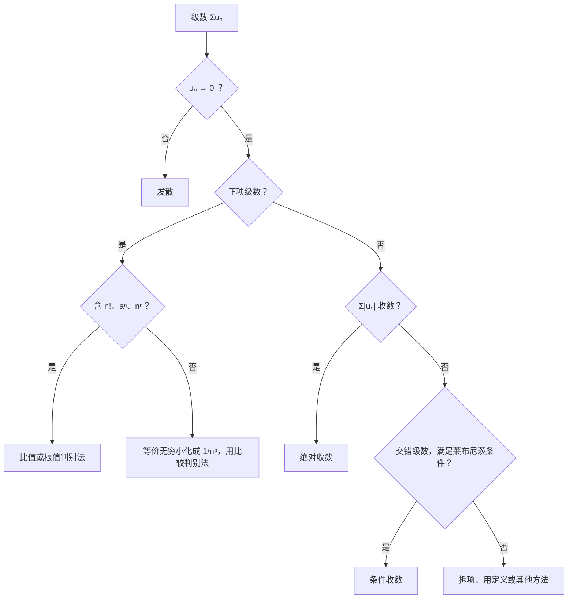

常数项级数主要考**判断收敛还是发散**，以选择题为主。判敛方法不多，难点在于**选对方法**，以及记住几个**经典反例**。选择题很多时候不需要证明，只需要用反例排除错误选项。

## 一、本章地图

| 模块 | 要掌握什么 | 常见考法 |
| --- | --- | --- |
| 定义与性质 | 部分和、必要条件、线性性、加括号 | 选择题 |
| 两个基准级数 | 几何级数、$p$ 级数 | 所有判敛的“标尺” |
| 正项级数 | 比较（极限形式）、比值、根值、积分判别法 | 选择、解答 |
| 交错级数 | 莱布尼茨判别法 | 选择、解答 |
| 任意项级数 | 绝对收敛、条件收敛 | 选择题 |
| 反例 | 判断命题真假 | 选择题 |

拿到一个级数 $\displaystyle\sum u_n$，按下面的顺序判断：

## 二、核心概念

### 1. 收敛的定义

级数 $\displaystyle\sum_{n=1}^\infty u_n$ 的**部分和** $S_n=u_1+u_2+\dots+u_n$。若 $\displaystyle\lim_{n\to\infty}S_n=S$ 存在，称级数**收敛**，和为 $S$；否则称**发散**。

**级数收敛就是部分和数列收敛。**这是所有判别法的出发点。

### 2. 基本性质

> [!IMPORTANT] 必背
> 1. **必要条件**：$\displaystyle\sum u_n$ 收敛 $\Rightarrow\lim\limits_{n\to\infty}u_n=0$。反过来**不成立**（调和级数）。
>
>    常用的逆否形式：$u_n\not\to0\Rightarrow$ **发散**。
> 2. **线性性**：$\sum u_n$、$\sum v_n$ 都收敛，则 $\sum(au_n+bv_n)$ 收敛。
>
>    收敛 + 发散 = **发散**；发散 + 发散 = **不一定**。
> 3. 改变、增加或去掉**有限项**，不影响敛散性（但可能改变和）。
> 4. **加括号**：收敛级数任意加括号后仍收敛，和不变。
>
>    反过来不成立：加括号后收敛，原级数不一定收敛。例如 $(1-1)+(1-1)+\cdots$ 收敛于 0，但 $1-1+1-1+\cdots$ 发散。

### 3. 正项级数

$u_n\ge0$ 的级数称为正项级数。它的部分和**单调不减**，所以

$$
\text{正项级数收敛}\iff\text{部分和数列有上界}.
$$

这是比较判别法的理论依据。

### 4. 绝对收敛与条件收敛

- $\displaystyle\sum\lvert u_n\rvert$ 收敛：称 $\sum u_n$ **绝对收敛**；
- $\sum u_n$ 收敛但 $\sum\lvert u_n\rvert$ 发散：称**条件收敛**。

> [!IMPORTANT] 必背
> **绝对收敛 $\Rightarrow$ 收敛**；反之不成立。

## 三、必背公式

### 1. 两个基准级数

> [!IMPORTANT] 必背
> **几何级数**：
> $$\sum_{n=0}^\infty aq^n\ \begin{cases}\text{收敛于 }\dfrac{a}{1-q},&\lvert q\rvert<1\\\text{发散},&\lvert q\rvert\ge1\end{cases}\quad(a\ne0)$$
> **$p$ 级数**：
> $$\sum_{n=1}^\infty\frac{1}{n^p}\ \begin{cases}\text{收敛},&p>1\\\text{发散},&p\le1\end{cases}$$
> $p=1$ 时是**调和级数** $\displaystyle\sum\frac1n$，发散。

和第 06 篇的 $p$ 积分 $\displaystyle\int_1^{+\infty}\frac{\mathrm dx}{x^p}$ 结论完全相同。

另一个常用结论：$\displaystyle\sum_{n=2}^\infty\frac{1}{n\ln^pn}$ 当 $p>1$ 时收敛，$p\le1$ 时发散。

### 2. 正项级数判别法

> [!IMPORTANT] 比较判别法（极限形式，最常用）
> 设 $u_n,v_n>0$，$\displaystyle\lim_{n\to\infty}\frac{u_n}{v_n}=l$：
> - $0<l<+\infty$：两者**同敛散**；
> - $l=0$：$\sum v_n$ 收敛 $\Rightarrow\sum u_n$ 收敛；
> - $l=+\infty$：$\sum v_n$ 发散 $\Rightarrow\sum u_n$ 发散。
>
> 实际做法：**用等价无穷小把 $u_n$ 化成 $\dfrac{C}{n^p}$**，再看 $p$。

> [!IMPORTANT] 比值判别法与根值判别法
> $$\rho=\lim_{n\to\infty}\frac{u_{n+1}}{u_n}\qquad\text{或}\qquad\rho=\lim_{n\to\infty}\sqrt[n]{u_n}$$
> - $\rho<1$：收敛；
> - $\rho>1$（包括 $+\infty$）：发散；
> - $\rho=1$：**判别法失效**，换其他方法。
>
> 适用场景：比值法适合含 $n!$、$a^n$ 的项；根值法适合含 $(\cdots)^n$ 的项。$u_n$ 是 $n$ 的有理函数或幂函数时，$\rho$ 一定等于 1，不要用这两个方法。

**积分判别法**：若 $f(x)$ 在 $[1,+\infty)$ 上非负、单调递减，$u_n=f(n)$，则 $\sum u_n$ 与 $\displaystyle\int_1^{+\infty}f(x)\,\mathrm dx$ 同敛散。

### 3. 交错级数

> [!IMPORTANT] 莱布尼茨判别法（必背）
> 交错级数 $\displaystyle\sum_{n=1}^\infty(-1)^{n-1}u_n$（$u_n>0$），若满足
> 1. $u_n\ge u_{n+1}$（单调不增）；
> 2. $\lim\limits_{n\to\infty}u_n=0$，
>
> 则级数收敛，且和 $S\le u_1$，余项 $\lvert r_n\rvert\le u_{n+1}$。
>
> 这是**充分条件**。不满足单调性时，级数仍可能收敛。

### 4. 常用的等价与比较

$n\to\infty$ 时：

$$
\sin\frac1n\sim\frac1n,\quad\ln\left(1+\frac1n\right)\sim\frac1n,\quad1-\cos\frac1n\sim\frac{1}{2n^2},\quad e^{\frac1n}-1\sim\frac1n.
$$

增长速度（从慢到快）：

$$
\ln n\ll n^\alpha\ (\alpha>0)\ll a^n\ (a>1)\ll n!\ll n^n.
$$

### 5. 选择题常用反例

> [!IMPORTANT] 必背反例
> | 命题 | 反例 |
> | --- | --- |
> | $u_n\to0\Rightarrow\sum u_n$ 收敛 | $\sum\dfrac1n$ |
> | $\sum u_n$ 收敛 $\Rightarrow\sum u_n^2$ 收敛 | $\sum\dfrac{(-1)^n}{\sqrt n}$ |
> | $\sum u_n$ 收敛 $\Rightarrow\sum\lvert u_n\rvert$ 收敛 | $\sum\dfrac{(-1)^n}{n}$ |
> | $\sum u_n$ 收敛，$u_n\sim v_n\Rightarrow\sum v_n$ 收敛 | $u_n=\dfrac{(-1)^n}{\sqrt n}$，$v_n=\dfrac{(-1)^n}{\sqrt n}+\dfrac1n$ |
> | $\sum u_n$ 收敛 $\Rightarrow\sum u_nu_{n+1}$ 收敛 | $\sum\dfrac{(-1)^n}{\sqrt n}$ |
> | 加括号后收敛 $\Rightarrow$ 原级数收敛 | $\sum(-1)^n$ |
>
> **注意**：上表中“等价则同敛散”对**正项级数**成立，对一般级数不成立。

几个**正确**的结论，也常在选择题里出现：

- $\sum u_n$ **绝对收敛** $\Rightarrow\sum u_n^2$ 收敛；
- $\sum u_n^2$ 和 $\sum v_n^2$ 都收敛 $\Rightarrow\sum u_nv_n$ 绝对收敛（因为 $\lvert u_nv_n\rvert\le\dfrac{u_n^2+v_n^2}{2}$）；
- $\sum u_n$ 收敛 $\Rightarrow\sum(u_n+u_{n+1})$ 收敛；
- $\sum u_n$ **绝对收敛**，$\{v_n\}$ 有界 $\Rightarrow\sum u_nv_n$ 绝对收敛。

## 四、题型与解题套路

### 题型 1：用定义求和、判敛

**例 1** 求 $\displaystyle\sum_{n=1}^\infty\frac{1}{n(n+1)}$ 的和。

**解** 裂项：$\dfrac{1}{n(n+1)}=\dfrac1n-\dfrac{1}{n+1}$，

$$
S_n=1-\frac{1}{n+1}\to\boxed1.
$$

**例 2** 判断 $\displaystyle\sum_{n=1}^\infty\ln\frac{n+1}{n}$ 的敛散性。

**解** $S_n=\ln2-\ln1+\ln3-\ln2+\dots+\ln(n+1)-\ln n=\ln(n+1)\to+\infty$，**发散**。

也可以用等价无穷小：$\ln\left(1+\dfrac1n\right)\sim\dfrac1n$，与调和级数同敛散。

### 题型 2：必要条件判发散

**例 3** 判断 $\displaystyle\sum_{n=1}^\infty\left(1-\frac1n\right)^n$ 的敛散性。

**解** $\left(1-\dfrac1n\right)^n\to e^{-1}\ne0$，**发散**。

> [!TIP] 先看通项是否趋于 0
> 这一步只需几秒钟。通项不趋于 0 就直接发散，不用再用其他判别法。

### 题型 3：比较判别法（等价无穷小）

**例 4** 判断下列级数的敛散性：

1. $\displaystyle\sum_{n=1}^\infty\sin\frac{1}{n^2}$；
2. $\displaystyle\sum_{n=1}^\infty\frac{\sqrt{n+1}-\sqrt n}{n}$；
3. $\displaystyle\sum_{n=1}^\infty\left(1-\cos\frac1n\right)$；
4. $\displaystyle\sum_{n=1}^\infty\frac{1}{\sqrt n}\ln\left(1+\frac1n\right)$。

**解**

1. $\sin\dfrac{1}{n^2}\sim\dfrac{1}{n^2}$，$p=2>1$，**收敛**。
2. $\sqrt{n+1}-\sqrt n=\dfrac{1}{\sqrt{n+1}+\sqrt n}\sim\dfrac{1}{2\sqrt n}$，通项 $\sim\dfrac{1}{2n^{3/2}}$，$p=\dfrac32>1$，**收敛**。
3. $1-\cos\dfrac1n\sim\dfrac{1}{2n^2}$，**收敛**。
4. 通项 $\sim\dfrac{1}{\sqrt n}\cdot\dfrac1n=\dfrac{1}{n^{3/2}}$，**收敛**。

**例 5** 判断 $\displaystyle\sum_{n=2}^\infty\frac{1}{\ln n}$ 的敛散性。

**解** $\ln n<n$，所以 $\dfrac{1}{\ln n}>\dfrac1n$。调和级数发散，由比较判别法，原级数**发散**。

**例 6** 判断 $\displaystyle\sum_{n=1}^\infty\frac{\ln n}{n^2}$ 的敛散性。

**解** $\ln n$ 增长得比任何正幂次都慢，取 $v_n=\dfrac{1}{n^{3/2}}$：

$$
\frac{\ln n/n^2}{1/n^{3/2}}=\frac{\ln n}{\sqrt n}\to0.
$$

$\sum v_n$ 收敛，由极限形式（$l=0$），原级数**收敛**。

> [!TIP] 含 $\ln n$ 的处理方法
> $\dfrac{\ln n}{n^p}$：$p>1$ 时，取 $1<q<p$，与 $\dfrac{1}{n^q}$ 比较，收敛；$p\le1$ 时，$\dfrac{\ln n}{n^p}\ge\dfrac{1}{n^p}$（$n\ge3$），发散。

### 题型 4：比值判别法与根值判别法

**例 7** 判断 $\displaystyle\sum_{n=1}^\infty\frac{n!}{n^n}$ 的敛散性。

**解** 比值法：

$$
\frac{u_{n+1}}{u_n}=\frac{(n+1)!}{(n+1)^{n+1}}\cdot\frac{n^n}{n!}=\left(\frac{n}{n+1}\right)^n\to\frac1e<1,
$$

**收敛**。

**例 8** 判断 $\displaystyle\sum_{n=1}^\infty\frac{2^n\cdot n!}{n^n}$ 和 $\displaystyle\sum_{n=1}^\infty\frac{3^n\cdot n!}{n^n}$ 的敛散性。

**解** 同例 7，比值分别为 $\dfrac2e<1$ 和 $\dfrac3e>1$。前者**收敛**，后者**发散**。

**例 9** 判断 $\displaystyle\sum_{n=1}^\infty\left(\frac{n}{2n+1}\right)^n$ 的敛散性。

**解** 根值法：$\sqrt[n]{u_n}=\dfrac{n}{2n+1}\to\dfrac12<1$，**收敛**。

**例 10** 判断 $\displaystyle\sum_{n=1}^\infty\frac{n^2}{a^n}$（$a>0$）的敛散性。

**解** $\dfrac{u_{n+1}}{u_n}=\dfrac{(n+1)^2}{n^2}\cdot\dfrac1a\to\dfrac1a$。

- $a>1$：**收敛**；
- $0<a<1$：**发散**；
- $a=1$：比值法失效，此时通项为 $n^2\to\infty$，**发散**。

> [!WARNING] $\rho=1$ 时必须换方法
> 参数题中，比值或根值等于 1 的情况一定要单独讨论，通常回到必要条件或比较判别法。

### 题型 5：交错级数

**例 11** 判断 $\displaystyle\sum_{n=1}^\infty\frac{(-1)^{n-1}}{n}$ 是绝对收敛、条件收敛还是发散。

**解** $\displaystyle\sum\frac1n$ 发散，不绝对收敛。$u_n=\dfrac1n$ 单调递减趋于 0，由莱布尼茨判别法，原级数收敛。所以**条件收敛**。它的和是 $\ln2$（见第 15 篇）。

**例 12** 判断 $\displaystyle\sum_{n=2}^\infty\frac{(-1)^n\ln n}{n}$ 的敛散性。

**解** $\dfrac{\ln n}{n}\ge\dfrac1n$（$n\ge3$），绝对值级数发散。

再看单调性：令 $f(x)=\dfrac{\ln x}{x}$，$f'(x)=\dfrac{1-\ln x}{x^2}<0$（$x>e$），所以 $n\ge3$ 时单调递减，且 $\dfrac{\ln n}{n}\to0$。由莱布尼茨判别法收敛。**条件收敛**。

> [!TIP] 证明单调性的方法
> 1. 作差 $u_n-u_{n+1}\ge0$；
> 2. 作商 $\dfrac{u_{n+1}}{u_n}\le1$；
> 3. 把 $n$ 换成 $x$，**求导**看 $f'(x)\le0$。第 3 种最常用。
>
> 只要从某一项开始单调即可，前面有限项不影响敛散性。

### 题型 6：绝对收敛与条件收敛

**例 13** 讨论 $\displaystyle\sum_{n=1}^\infty\frac{(-1)^n}{n^p}$（$p>0$）的敛散性。

**解**

- $p>1$：$\displaystyle\sum\frac{1}{n^p}$ 收敛，**绝对收敛**；
- $0<p\le1$：绝对值级数发散；$\dfrac{1}{n^p}$ 单调递减趋于 0，莱布尼茨判别法成立，**条件收敛**。

（$p\le0$ 时通项不趋于 0，发散。）

**例 14** 判断 $\displaystyle\sum_{n=1}^\infty\frac{\sin n}{n^2}$ 的敛散性。

**解** $\left\lvert\dfrac{\sin n}{n^2}\right\rvert\le\dfrac{1}{n^2}$，绝对值级数收敛，所以**绝对收敛**。

### 题型 7：拆项（等价无穷小对一般级数失效时）

**例 15** 判断 $\displaystyle\sum_{n=2}^\infty\ln\left(1+\frac{(-1)^n}{\sqrt n}\right)$ 的敛散性。

**解** 通项虽然 $\sim\dfrac{(-1)^n}{\sqrt n}$，但这不是正项级数，**等价无穷小不能直接用**。用泰勒展开，$\ln(1+x)=x-\dfrac{x^2}{2}+o(x^2)$：

$$
\ln\left(1+\frac{(-1)^n}{\sqrt n}\right)=\frac{(-1)^n}{\sqrt n}-\frac{1}{2n}+o\left(\frac1n\right).
$$

- $\displaystyle\sum\frac{(-1)^n}{\sqrt n}$：莱布尼茨，收敛；
- $\displaystyle\sum\left[-\frac{1}{2n}+o\left(\frac1n\right)\right]$：这部分 $\sim-\dfrac{1}{2n}$，**符号最终不变**，可以用比较判别法，发散。

收敛 + 发散 = **发散**。

> [!CAUTION] 等价无穷小只能用于正项级数
> 例 15 正是“$u_n\sim v_n$，$\sum v_n$ 收敛，但 $\sum u_n$ 发散”的例子。对变号级数，要用泰勒展开把通项**展开到足够多的项**，把“交错部分”和“定号部分”拆开分别判断。

### 题型 8：抽象级数选择题

**例 16** 设 $\displaystyle\sum_{n=1}^\infty a_n$ 收敛，下列级数中**一定收敛**的是：

(A) $\displaystyle\sum a_n^2$　(B) $\displaystyle\sum\lvert a_n\rvert$　(C) $\displaystyle\sum(a_n+a_{n+1})$　(D) $\displaystyle\sum a_na_{n+1}$

**解**

- (A)、(B)、(D) 的反例都是 $a_n=\dfrac{(-1)^n}{\sqrt n}$：$\sum a_n^2=\sum\dfrac1n$ 发散；$\sum\lvert a_n\rvert$ 发散；$a_na_{n+1}=-\dfrac{1}{\sqrt{n(n+1)}}$，$\sum$ 发散。
- (C)：$\sum a_{n+1}$ 是去掉第一项的 $\sum a_n$，收敛；两个收敛级数相加，收敛。

答案 $\boxed{\text{(C)}}$。

**例 17** 设 $u_n>0$ 且 $\displaystyle\sum u_n$ 收敛，判断 $\displaystyle\sum\frac{\sqrt{u_n}}{n}$ 的敛散性。

**解** 由 $ab\le\dfrac{a^2+b^2}{2}$：

$$
\frac{\sqrt{u_n}}{n}\le\frac12\left(u_n+\frac{1}{n^2}\right).
$$

右边两个级数都收敛，由比较判别法，原级数**收敛**。

> [!TIP] 抽象级数的两个工具
> - **找反例**排除错误选项：首选 $\dfrac{(-1)^n}{\sqrt n}$、$\dfrac1n$、$\dfrac{(-1)^n}{n}$；
> - **均值不等式** $\lvert ab\rvert\le\dfrac{a^2+b^2}{2}$ 证明收敛。

## 五、证明思路

### 1. 必要条件

$u_n=S_n-S_{n-1}$。若 $S_n\to S$，则 $S_{n-1}\to S$，所以 $u_n\to S-S=0$。

### 2. 调和级数发散

把项分组，每组项数翻倍：

$$
1+\frac12+\left(\frac13+\frac14\right)+\left(\frac15+\dots+\frac18\right)+\cdots\ge1+\frac12+\frac12+\frac12+\cdots.
$$

每个括号都 $\ge\dfrac12$，部分和无上界，所以发散。

### 3. $p$ 级数

用积分判别法：$\displaystyle\sum\frac{1}{n^p}$ 与 $\displaystyle\int_1^{+\infty}\frac{\mathrm dx}{x^p}$ 同敛散，再用第 06 篇的 $p$ 积分结论。

积分判别法的原理：$f$ 单调递减时，$\displaystyle\int_k^{k+1}f(x)\,\mathrm dx\le f(k)\le\int_{k-1}^kf(x)\,\mathrm dx$，把各项加起来，部分和被积分夹住。

### 4. 比值判别法

设 $\rho<1$，取 $q$ 满足 $\rho<q<1$。当 $n$ 充分大（$n\ge N$）时，$\dfrac{u_{n+1}}{u_n}<q$，所以

$$
u_{N+k}<u_Nq^k.
$$

右边是收敛的几何级数，由比较判别法，原级数收敛。$\rho>1$ 时，$u_n$ 最终递增，不趋于 0，发散。

### 5. 莱布尼茨判别法

把偶数项部分和写成两种形式：

$$
S_{2n}=(u_1-u_2)+(u_3-u_4)+\dots+(u_{2n-1}-u_{2n}),
$$

$$
S_{2n}=u_1-(u_2-u_3)-\dots-(u_{2n-2}-u_{2n-1})-u_{2n}.
$$

由单调性，每个括号都 $\ge0$。第一式说明 $S_{2n}$ 单调递增，第二式说明 $S_{2n}\le u_1$。单调有界，$S_{2n}\to S\le u_1$。又 $S_{2n+1}=S_{2n}+u_{2n+1}\to S+0$，所以 $S_n\to S$。

### 6. 绝对收敛 $\Rightarrow$ 收敛

令 $v_n=\dfrac{u_n+\lvert u_n\rvert}{2}$，则 $0\le v_n\le\lvert u_n\rvert$，由比较判别法 $\sum v_n$ 收敛。$u_n=2v_n-\lvert u_n\rvert$ 是两个收敛级数的线性组合，所以收敛。

## 六、易错点

> [!CAUTION] 比较判别法只能用于正项级数
> 等价无穷小、比较判别法、比值法、根值法，**前提都是正项级数**（或至少从某项起定号）。对变号级数，先取绝对值判断是否绝对收敛；不绝对收敛时，再用莱布尼茨判别法或拆项。

- **把 $u_n\to0$ 当成收敛的充分条件**。
- **比值或根值等于 1 时下结论**：此时判别法失效。
- **对有理函数型的通项用比值法**：$\rho$ 必为 1，白费功夫。
- **莱布尼茨判别法漏验单调性**。
- **以为不满足莱布尼茨条件就发散**：它只是充分条件。
- **以为两个发散级数之和一定发散**：例如 $\sum\dfrac1n$ 与 $\sum\left(-\dfrac1n\right)$，和为 0。
- **以为收敛级数的平方一定收敛**：只有绝对收敛时才成立。

## 七、小练习

**1.** 判断 $\displaystyle\sum_{n=1}^\infty\frac{n+1}{n^3+2}$ 的敛散性。

点击查看答案

通项 $\sim\dfrac{n}{n^3}=\dfrac{1}{n^2}$，收敛。

**2.** 判断 $\displaystyle\sum_{n=1}^\infty\frac{3^n}{n\cdot2^n}$ 的敛散性。

点击查看答案

通项 $=\dfrac1n\left(\dfrac32\right)^n\to+\infty$，不趋于 0，发散。

**3.** 判断 $\displaystyle\sum_{n=1}^\infty\frac{n^n}{(n!)^2}$ 的敛散性。

点击查看答案

比值法：

$$\frac{u_{n+1}}{u_n}=\frac{(n+1)^{n+1}}{n^n}\cdot\frac{1}{(n+1)^2}=\left(1+\frac1n\right)^n\cdot\frac{1}{n+1}\to e\cdot0=0<1,$$

收敛。

**4.** 判断 $\displaystyle\sum_{n=1}^\infty(-1)^n\left(1-\cos\frac1n\right)$ 是绝对收敛、条件收敛还是发散。

点击查看答案

$\left\lvert u_n\right\rvert=1-\cos\dfrac1n\sim\dfrac{1}{2n^2}$，绝对值级数收敛，所以**绝对收敛**。

**5.** 判断 $\displaystyle\sum_{n=2}^\infty\frac{(-1)^n}{\sqrt n+(-1)^n}$ 的敛散性。

点击查看答案

这个级数不满足单调性，要拆项。分子分母同乘 $\sqrt n-(-1)^n$：

$$\frac{(-1)^n}{\sqrt n+(-1)^n}=\frac{(-1)^n\sqrt n-1}{n-1}=\frac{(-1)^n\sqrt n}{n-1}-\frac{1}{n-1}.$$

- $\displaystyle\sum\frac{(-1)^n\sqrt n}{n-1}$：$\dfrac{\sqrt n}{n-1}$ 从某项起单调递减趋于 0，莱布尼茨，收敛；
- $\displaystyle\sum\frac{1}{n-1}$：发散。

收敛 − 发散 = **发散**。

## 八、本章小结

- **第一步：看通项是否趋于 0**，不趋于 0 直接发散。
- 正项级数：**等价无穷小化成 $\dfrac{1}{n^p}$** 最常用；含 $n!$、$a^n$ 用**比值法**；含 $(\cdots)^n$ 用**根值法**；$\rho=1$ 时换方法。
- 两个标尺：几何级数（$\lvert q\rvert<1$）、$p$ 级数（$p>1$）。
- 变号级数：**先看绝对收敛**；不绝对收敛再用**莱布尼茨**（单调 + 趋于 0）。
- 等价无穷小对变号级数失效时：**泰勒展开、拆项**。
- 选择题：记住 $\dfrac{(-1)^n}{\sqrt n}$、$\dfrac1n$、$\dfrac{(-1)^n}{n}$ 三个反例，配合均值不等式。

下一篇：**15 幂级数与傅里叶级数**。
