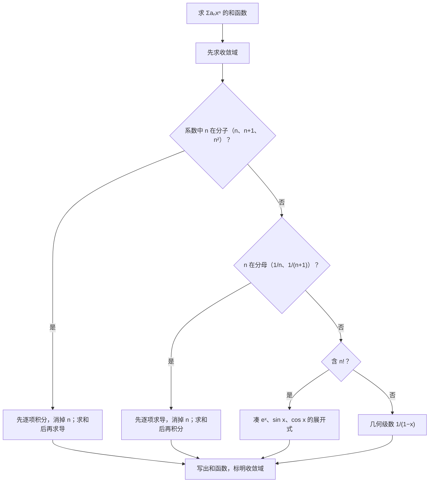

幂级数的考法非常固定：**求收敛域、求和函数、把函数展开成幂级数**。核心工具只有两个：**6 个基本展开式**，以及**逐项求导、逐项积分**。傅里叶级数是数一专属，计算量大但套路简单，重点是狄利克雷定理。

## 一、本章地图

| 模块 | 要掌握什么 | 常见考法 |
| --- | --- | --- |
| 收敛半径与收敛域 | 阿贝尔定理、比值法、端点单独判断 | 填空、选择 |
| 和函数 | 逐项求导、逐项积分、凑基本展开式 | 解答 |
| 函数展开 | 间接展开法、6 个基本展开式 | 解答 |
| 数项级数求和 | 构造幂级数、取 $x$ 为特定值 | 填空、解答 |
| 傅里叶级数（数一） | 系数公式、狄利克雷定理 | 填空、选择 |
| 正弦、余弦级数 | 奇延拓、偶延拓 | 填空 |

求和函数的思路：

## 二、核心概念

### 1. 阿贝尔定理与收敛半径

> [!IMPORTANT] 阿贝尔定理（必背）
> - 若 $\displaystyle\sum a_nx^n$ 在 $x=x_0\ (x_0\ne0)$ 处**收敛**，则对所有 $\lvert x\rvert<\lvert x_0\rvert$，级数**绝对收敛**；
> - 若在 $x=x_0$ 处**发散**，则对所有 $\lvert x\rvert>\lvert x_0\rvert$，级数**发散**。

所以存在**收敛半径** $R$：$\lvert x\rvert<R$ 时绝对收敛，$\lvert x\rvert>R$ 时发散，$x=\pm R$ 处要**单独判断**。

- **收敛区间**：开区间 $(-R,R)$；
- **收敛域**：收敛区间加上收敛的端点。

### 2. 和函数的性质

在收敛区间 $(-R,R)$ 内，和函数 $S(x)=\displaystyle\sum a_nx^n$ 连续，并且可以**逐项求导、逐项积分**，收敛半径不变：

$$
S'(x)=\sum_{n=1}^\infty na_nx^{n-1},\qquad\int_0^xS(t)\,\mathrm dt=\sum_{n=0}^\infty\frac{a_n}{n+1}x^{n+1}.
$$

> [!WARNING] 端点处的收敛性可能改变
> 逐项求导、积分后，**收敛半径不变**，但端点处的收敛性可能改变：求导可能失去端点，积分可能得到端点。所以最终的收敛域要对结果**重新检查端点**。

### 3. 泰勒级数

若 $f$ 在 $x_0$ 处任意阶可导，称

$$
\sum_{n=0}^\infty\frac{f^{(n)}(x_0)}{n!}(x-x_0)^n
$$

为 $f$ 的泰勒级数；$x_0=0$ 时称为**麦克劳林级数**。函数的幂级数展开式如果存在，**一定是唯一的**，就是它的泰勒级数。

这和第 01、02 篇的泰勒公式是同一组系数，区别在于这里是**无穷多项**，要讨论收敛范围。

### 4. 傅里叶级数（数一）

周期为 $2\pi$ 的函数 $f(x)$，把它写成三角函数之和：

$$
f(x)\sim\frac{a_0}{2}+\sum_{n=1}^\infty(a_n\cos nx+b_n\sin nx).
$$

用的符号是“$\sim$”，因为级数不一定在每一点都等于 $f(x)$，具体看狄利克雷定理。

## 三、必背公式

### 1. 收敛半径

> [!IMPORTANT] 必背
> 对 $\displaystyle\sum a_nx^n$（不缺项）：
> $$\rho=\lim_{n\to\infty}\left\lvert\frac{a_{n+1}}{a_n}\right\rvert\quad\text{或}\quad\rho=\lim_{n\to\infty}\sqrt[n]{\lvert a_n\rvert},\qquad R=\frac1\rho.$$
> $\rho=0$ 时 $R=+\infty$；$\rho=+\infty$ 时 $R=0$。
>
> **缺项**（如只有偶次幂 $x^{2n}$）时，不能用这个公式，要对**整个通项** $u_n(x)$ 用比值法：$\displaystyle\lim\left\lvert\frac{u_{n+1}(x)}{u_n(x)}\right\rvert<1$，解出 $x$ 的范围。

### 2. 六个基本展开式

> [!IMPORTANT] 必背（一定要背熟）
> $$\frac{1}{1-x}=\sum_{n=0}^\infty x^n=1+x+x^2+\cdots,\qquad-1<x<1$$
> $$\frac{1}{1+x}=\sum_{n=0}^\infty(-1)^nx^n=1-x+x^2-\cdots,\qquad-1<x<1$$
> $$e^x=\sum_{n=0}^\infty\frac{x^n}{n!}=1+x+\frac{x^2}{2!}+\cdots,\qquad-\infty<x<+\infty$$
> $$\sin x=\sum_{n=0}^\infty\frac{(-1)^nx^{2n+1}}{(2n+1)!}=x-\frac{x^3}{3!}+\frac{x^5}{5!}-\cdots,\qquad-\infty<x<+\infty$$
> $$\cos x=\sum_{n=0}^\infty\frac{(-1)^nx^{2n}}{(2n)!}=1-\frac{x^2}{2!}+\frac{x^4}{4!}-\cdots,\qquad-\infty<x<+\infty$$
> $$\ln(1+x)=\sum_{n=1}^\infty\frac{(-1)^{n-1}x^n}{n}=x-\frac{x^2}{2}+\frac{x^3}{3}-\cdots,\qquad-1<x\le1$$

补充两个常用的：

$$
\arctan x=\sum_{n=0}^\infty\frac{(-1)^nx^{2n+1}}{2n+1},\quad-1\le x\le1;\qquad(1+x)^\alpha=1+\alpha x+\frac{\alpha(\alpha-1)}{2!}x^2+\cdots,\quad-1<x<1.
$$

$\ln(1+x)$ 在 $x=1$ 处收敛，得到 $1-\dfrac12+\dfrac13-\cdots=\ln2$；$\arctan x$ 在 $x=1$ 处得到 $1-\dfrac13+\dfrac15-\cdots=\dfrac\pi4$。

### 3. 常用的“求和模板”

| 级数 | 和函数 | 来源 |
| --- | --- | --- |
| $\displaystyle\sum_{n=1}^\infty nx^{n-1}$ | $\dfrac{1}{(1-x)^2}$ | 对 $\dfrac{1}{1-x}$ 求导 |
| $\displaystyle\sum_{n=1}^\infty nx^n$ | $\dfrac{x}{(1-x)^2}$ | 上式乘 $x$ |
| $\displaystyle\sum_{n=1}^\infty\frac{x^n}{n}$ | $-\ln(1-x)$ | 对 $\dfrac{1}{1-x}$ 积分 |

### 4. 傅里叶系数（数一）

> [!IMPORTANT] 周期为 $2\pi$（必背）
> $$a_n=\frac1\pi\int_{-\pi}^\pi f(x)\cos nx\,\mathrm dx\quad(n=0,1,2,\dots),\qquad b_n=\frac1\pi\int_{-\pi}^\pi f(x)\sin nx\,\mathrm dx\quad(n=1,2,\dots).$$
> - $f$ 是**奇函数**：$a_n=0$，$b_n=\dfrac2\pi\displaystyle\int_0^\pi f(x)\sin nx\,\mathrm dx$，得到**正弦级数**；
> - $f$ 是**偶函数**：$b_n=0$，$a_n=\dfrac2\pi\displaystyle\int_0^\pi f(x)\cos nx\,\mathrm dx$，得到**余弦级数**。

**周期为 $2l$**：把 $nx$ 换成 $\dfrac{n\pi x}{l}$，

$$
a_n=\frac1l\int_{-l}^lf(x)\cos\frac{n\pi x}{l}\,\mathrm dx,\qquad b_n=\frac1l\int_{-l}^lf(x)\sin\frac{n\pi x}{l}\,\mathrm dx.
$$

### 5. 狄利克雷定理（数一）

> [!IMPORTANT] 必背
> 设 $f$ 是周期为 $2\pi$ 的函数，在一个周期内**连续或只有有限个第一类间断点**，且**只有有限个极值点**，则 $f$ 的傅里叶级数处处收敛，和函数 $S(x)$ 为：
> - $x$ 是 $f$ 的**连续点**：$S(x)=f(x)$；
> - $x$ 是 $f$ 的**间断点**：$S(x)=\dfrac{f(x^-)+f(x^+)}{2}$，即左右极限的平均值。
>
> 在端点 $x=\pm\pi$ 处，要把 $f$ **周期延拓**后再看：$S(\pm\pi)=\dfrac{f(-\pi^+)+f(\pi^-)}{2}$。

### 6. 正弦级数与余弦级数

$f$ 只定义在 $[0,\pi]$ 上时：

- 展开成**正弦级数**：先**奇延拓**到 $[-\pi,\pi]$，用奇函数的公式；
- 展开成**余弦级数**：先**偶延拓**，用偶函数的公式。

计算时只需要 $[0,\pi]$ 上的积分，**延拓只影响和函数在端点和区间外的取值**。

## 四、题型与解题套路

### 题型 1：收敛半径与收敛域

**解法步骤**：求 $R$ → 得到收敛区间 → **分别代入两个端点**，变成常数项级数，用第 14 篇的方法判断。

**例 1** 求 $\displaystyle\sum_{n=1}^\infty\frac{x^n}{n\cdot2^n}$ 的收敛域。

**解** $\left\lvert\dfrac{a_{n+1}}{a_n}\right\rvert=\dfrac{n}{2(n+1)}\to\dfrac12$，$R=2$。

- $x=2$：$\displaystyle\sum\frac1n$，发散；
- $x=-2$：$\displaystyle\sum\frac{(-1)^n}{n}$，收敛。

收敛域为 $\boxed{[-2,2)}$。

**例 2** 求 $\displaystyle\sum_{n=1}^\infty\frac{(x-1)^n}{3^n\sqrt n}$ 的收敛域。

**解** 令 $t=x-1$，$\displaystyle\sum\frac{t^n}{3^n\sqrt n}$ 的 $R=3$。

- $t=3$：$\displaystyle\sum\frac{1}{\sqrt n}$，发散；
- $t=-3$：$\displaystyle\sum\frac{(-1)^n}{\sqrt n}$，收敛。

$-3\le x-1<3$，收敛域为 $\boxed{[-2,4)}$。

**例 3（缺项）** 求 $\displaystyle\sum_{n=1}^\infty\frac{x^{2n}}{4^n}$ 的收敛域。

**解** 只有偶次幂，对整个通项用比值法：

$$
\left\lvert\frac{u_{n+1}}{u_n}\right\rvert=\frac{x^2}{4}<1\ \Longrightarrow\ \lvert x\rvert<2.
$$

$x=\pm2$ 时通项为 $1$，不趋于 0，发散。收敛域为 $\boxed{(-2,2)}$。

**例 4** 已知 $\displaystyle\sum a_n(x-1)^n$ 在 $x=-1$ 处条件收敛，求它的收敛半径。

**解** $x=-1$ 对应 $\lvert x-1\rvert=2$。条件收敛说明在这一点收敛但不绝对收敛。由阿贝尔定理：

- 收敛，所以 $R\ge2$；
- 若 $R>2$，则在 $\lvert x-1\rvert=2$ 处应**绝对收敛**，矛盾，所以 $R\le2$。

$R=\boxed2$。

> [!TIP] 条件收敛的点一定是端点
> 幂级数在收敛区间内部都是**绝对收敛**的。所以条件收敛只能发生在收敛区间的**端点**上，这个结论在选择题中很好用。

### 题型 2：求和函数（逐项积分型）

**例 5** 求 $\displaystyle\sum_{n=1}^\infty nx^n$ 的和函数，并求 $\displaystyle\sum_{n=1}^\infty\frac{n}{2^n}$。

**解** 收敛域：$R=1$；$x=\pm1$ 时通项不趋于 0，收敛域为 $(-1,1)$。

$$
\sum_{n=1}^\infty nx^n=x\sum_{n=1}^\infty nx^{n-1}=x\left(\sum_{n=1}^\infty x^n\right)'=x\left(\frac{x}{1-x}\right)'=\boxed{\frac{x}{(1-x)^2}},\quad-1<x<1.
$$

取 $x=\dfrac12$：$\displaystyle\sum\frac{n}{2^n}=\frac{1/2}{1/4}=\boxed2$。

**例 6** 求 $\displaystyle\sum_{n=1}^\infty n(n+1)x^n$ 的和函数。

**解** 收敛域为 $(-1,1)$。$n(n+1)x^{n-1}$ 正好是 $x^{n+1}$ 的二阶导数：

$$
\sum_{n=1}^\infty n(n+1)x^{n-1}=\left(\sum_{n=1}^\infty x^{n+1}\right)''=\left(\frac{x^2}{1-x}\right)''.
$$

$\dfrac{x^2}{1-x}=-x-1+\dfrac{1}{1-x}$，求两次导得 $\dfrac{2}{(1-x)^3}$。所以

$$
\sum_{n=1}^\infty n(n+1)x^n=\boxed{\frac{2x}{(1-x)^3}},\quad-1<x<1.
$$

### 题型 3：求和函数（逐项求导型）

**例 7** 求 $\displaystyle\sum_{n=1}^\infty\frac{x^{n+1}}{n(n+1)}$ 的和函数。

**解** $R=1$；$x=\pm1$ 时通项绝对值为 $\dfrac{1}{n(n+1)}$，绝对收敛。收敛域为 $[-1,1]$。

记和为 $S(x)$，$S(0)=0$。求导两次：

$$
S'(x)=\sum_{n=1}^\infty\frac{x^n}{n}=-\ln(1-x),\qquad S''(x)=\sum_{n=1}^\infty x^{n-1}=\frac{1}{1-x}.
$$

从 $S'(x)=-\ln(1-x)$ 积分（$S(0)=0$）：

$$
S(x)=\int_0^x-\ln(1-t)\,\mathrm dt=(1-x)\ln(1-x)+x.
$$

在 $(-1,1)$ 内成立。$x=-1$ 处级数收敛、和函数连续，公式仍成立。$x=1$ 处级数收敛，和为 $\displaystyle\sum\frac{1}{n(n+1)}=1$；公式中 $\lim\limits_{x\to1^-}(1-x)\ln(1-x)=0$，极限也是 1。所以

$$
\boxed{S(x)=\begin{cases}(1-x)\ln(1-x)+x,&-1\le x<1\\1,&x=1\end{cases}}
$$

> [!WARNING] 端点处要单独写
> 和函数的表达式在端点处可能无定义（如本题 $x=1$ 处 $\ln0$），这时要**单独写出该点的值**，用和函数的连续性求极限得到。

### 题型 4：含阶乘的和函数

**例 8** 求 $\displaystyle\sum_{n=0}^\infty\frac{n+1}{n!}x^n$ 的和函数。

**解** $R=+\infty$。拆成两部分：

$$
\sum_{n=0}^\infty\frac{n}{n!}x^n+\sum_{n=0}^\infty\frac{x^n}{n!}=x\sum_{n=1}^\infty\frac{x^{n-1}}{(n-1)!}+e^x=xe^x+e^x.
$$

和函数为 $\boxed{(x+1)e^x}$，$x\in(-\infty,+\infty)$。

> [!TIP] 含 $n!$ 的套路
> 把分子的 $n$ 与分母的 $n!$ 约成 $(n-1)!$，**调整下标**，凑成 $e^x$、$\sin x$ 或 $\cos x$ 的展开式。

### 题型 5：函数展开为幂级数

**方法**：**间接展开法**。利用 6 个基本展开式，通过**变量代换、四则运算、逐项求导或积分**得到。最后**一定要写收敛域**。

**例 9** 把 $f(x)=\dfrac{1}{x^2-3x+2}$ 展开成 $x$ 的幂级数。

**解** 部分分式：

$$
f(x)=\frac{1}{(x-1)(x-2)}=\frac{1}{1-x}-\frac{1}{2-x}=\frac{1}{1-x}-\frac12\cdot\frac{1}{1-\frac x2}.
$$

$$
f(x)=\sum_{n=0}^\infty x^n-\sum_{n=0}^\infty\frac{x^n}{2^{n+1}}=\boxed{\sum_{n=0}^\infty\left(1-\frac{1}{2^{n+1}}\right)x^n},\quad-1<x<1.
$$

两个展开式的收敛域分别是 $(-1,1)$ 和 $(-2,2)$，取**交集**。

**例 10** 把 $f(x)=\arctan x$ 展开成 $x$ 的幂级数。

**解** $f'(x)=\dfrac{1}{1+x^2}=\displaystyle\sum_{n=0}^\infty(-1)^nx^{2n}$，$-1<x<1$。逐项积分（$f(0)=0$）：

$$
\arctan x=\sum_{n=0}^\infty\frac{(-1)^nx^{2n+1}}{2n+1}.
$$

端点 $x=\pm1$ 处级数都收敛（莱布尼茨），且 $\arctan x$ 连续，收敛域为 $\boxed{[-1,1]}$。

**例 11** 把 $f(x)=\dfrac1x$ 展开成 $(x-3)$ 的幂级数。

**解** 凑成 $\dfrac{1}{1+t}$ 的形式：

$$
\frac1x=\frac{1}{3+(x-3)}=\frac13\cdot\frac{1}{1+\frac{x-3}{3}}=\frac13\sum_{n=0}^\infty(-1)^n\left(\frac{x-3}{3}\right)^n=\boxed{\sum_{n=0}^\infty\frac{(-1)^n(x-3)^n}{3^{n+1}}}.
$$

由 $\left\lvert\dfrac{x-3}{3}\right\rvert<1$，收敛域为 $(0,6)$。

> [!TIP] 在 $x_0$ 处展开
> 把函数中的 $x$ 写成 $x_0+(x-x_0)$，整理成基本展开式中的形式，**让 $(x-x_0)$ 作为一个整体**出现。

### 题型 6：用幂级数求数项级数的和

**解法**：观察数项级数，把某个数**换成 $x$**，构造幂级数，求出和函数，再代入那个数。

**例 12** 求 $\displaystyle\sum_{n=1}^\infty\frac{(-1)^{n-1}}{n\cdot2^n}$。

**解** 这正是 $\ln(1+x)=\displaystyle\sum\frac{(-1)^{n-1}x^n}{n}$ 在 $x=\dfrac12$ 处的值：

$$
\ln\left(1+\frac12\right)=\boxed{\ln\frac32}.
$$

**例 13** 求 $\displaystyle\sum_{n=0}^\infty\frac{(-1)^n}{(2n)!}\cdot\frac{\pi^{2n}}{4^n}$。

**解** 写成 $\displaystyle\sum\frac{(-1)^n}{(2n)!}\left(\frac\pi2\right)^{2n}=\cos\frac\pi2=\boxed0$。

### 题型 7：傅里叶级数

**例 14** 设 $f(x)$ 是周期为 $2\pi$ 的函数，在 $[-\pi,\pi)$ 上 $f(x)=x$。求 $f$ 的傅里叶级数，并写出和函数在 $x=\pi$ 处的值。

**解** $f$ 在 $(-\pi,\pi)$ 内是奇函数，$a_n=0$。

$$
b_n=\frac2\pi\int_0^\pi x\sin nx\,\mathrm dx=\frac2\pi\left[-\frac{x\cos nx}{n}+\frac{\sin nx}{n^2}\right]_0^\pi=\frac2\pi\cdot\frac{-\pi\cos n\pi}{n}=\frac{2(-1)^{n+1}}{n}.
$$

所以

$$
f(x)\sim\sum_{n=1}^\infty\frac{2(-1)^{n+1}}{n}\sin nx=2\left(\sin x-\frac{\sin2x}{2}+\frac{\sin3x}{3}-\cdots\right).
$$

在 $x=\pi$ 处，周期延拓后左极限为 $\pi$、右极限为 $-\pi$，所以 $S(\pi)=\dfrac{\pi+(-\pi)}{2}=\boxed0$。级数每项都是 $\sin n\pi=0$，也验证了这一点。

**例 15** 把 $f(x)=x^2$（$-\pi\le x\le\pi$）展开成傅里叶级数，并求 $\displaystyle\sum_{n=1}^\infty\frac{1}{n^2}$。

**解** 偶函数，$b_n=0$。

$$
a_0=\frac2\pi\int_0^\pi x^2\,\mathrm dx=\frac{2\pi^2}{3}.
$$

$n\ge1$ 时，分部积分两次：

$$
a_n=\frac2\pi\int_0^\pi x^2\cos nx\,\mathrm dx=\frac2\pi\cdot\frac{2\pi\cos n\pi}{n^2}=\frac{4(-1)^n}{n^2}.
$$

周期延拓后 $f$ 处处连续，所以

$$
x^2=\frac{\pi^2}{3}+\sum_{n=1}^\infty\frac{4(-1)^n}{n^2}\cos nx,\quad-\pi\le x\le\pi.
$$

取 $x=\pi$，$\cos n\pi=(-1)^n$：

$$
\pi^2=\frac{\pi^2}{3}+4\sum_{n=1}^\infty\frac1{n^2}\ \Longrightarrow\ \sum_{n=1}^\infty\frac{1}{n^2}=\boxed{\frac{\pi^2}{6}}.
$$

> [!TIP] 用傅里叶级数求数项级数的和
> 在**连续点**取 $x=0$ 或 $x=\pi$，让 $\cos nx$ 变成 $1$ 或 $(-1)^n$，就能得到数项级数的和。例 15 取 $x=0$ 还能得到 $\displaystyle\sum\frac{(-1)^{n-1}}{n^2}=\frac{\pi^2}{12}$。

### 题型 8：正弦级数、余弦级数与和函数的值

**例 16** 把 $f(x)=x+1$（$0\le x\le\pi$）展开成正弦级数，并写出和函数在 $x=0$、$x=\pi$、$x=-\dfrac\pi2$ 处的值。

**解** 奇延拓：

$$
b_n=\frac2\pi\int_0^\pi(x+1)\sin nx\,\mathrm dx=\frac2\pi\left[\frac{-\pi\cos n\pi}{n}+\frac{1-\cos n\pi}{n}\right]=\frac{2}{n\pi}\Bigl[1-(\pi+1)(-1)^n\Bigr].
$$

和函数 $S(x)$ 是周期为 $2\pi$ 的奇函数：

- $x=0$：奇延拓后左极限为 $-1$，右极限为 $1$，$S(0)=\boxed0$；
- $x=\pi$：左极限 $f(\pi^-)=\pi+1$，周期延拓后右极限为 $-(\pi+1)$，$S(\pi)=\boxed0$；
- $x=-\dfrac\pi2$：连续点，$S=-f\left(\dfrac\pi2\right)=\boxed{-\left(\dfrac\pi2+1\right)}$。

> [!CAUTION] 和函数的值要按延拓方式来算
> 正弦级数对应**奇延拓**，余弦级数对应**偶延拓**。在 $[-\pi,0)$ 上的值要用延拓后的函数，在间断点（包括 $0$、$\pm\pi$）处取左右极限的平均值。直接代入 $f$ 的表达式，是这类填空题最常见的错误。

## 五、证明思路

### 1. 阿贝尔定理

$\sum a_nx_0^n$ 收敛，所以 $a_nx_0^n\to0$，有界：$\lvert a_nx_0^n\rvert\le M$。当 $\lvert x\rvert<\lvert x_0\rvert$ 时，

$$
\lvert a_nx^n\rvert=\lvert a_nx_0^n\rvert\cdot\left\lvert\frac{x}{x_0}\right\rvert^n\le Mq^n,\qquad q=\left\lvert\frac{x}{x_0}\right\rvert<1.
$$

右边是收敛的几何级数，所以绝对收敛。第二条是第一条的逆否命题。

### 2. 收敛半径公式

对 $\sum\lvert a_nx^n\rvert$ 用比值法：$\dfrac{\lvert a_{n+1}x^{n+1}\rvert}{\lvert a_nx^n\rvert}\to\rho\lvert x\rvert$。$\rho\lvert x\rvert<1$ 时收敛，$>1$ 时通项不趋于 0、发散，所以 $R=\dfrac1\rho$。

### 3. 六个展开式

- $\dfrac{1}{1-x}$：几何级数；
- $e^x$、$\sin x$、$\cos x$：泰勒公式，余项（拉格朗日型）对任意 $x$ 都趋于 0；
- $\ln(1+x)$：对 $\dfrac{1}{1+t}=\sum(-t)^n$ 从 $0$ 到 $x$ 逐项积分。

### 4. 傅里叶系数公式

三角函数系 $1,\cos x,\sin x,\cos2x,\sin2x,\dots$ 在 $[-\pi,\pi]$ 上**正交**：任意两个不同函数的乘积，积分为 0。

假设 $f(x)=\dfrac{a_0}{2}+\sum(a_k\cos kx+b_k\sin kx)$，两边乘 $\cos nx$ 再在 $[-\pi,\pi]$ 上积分，右边只剩 $a_n\displaystyle\int_{-\pi}^\pi\cos^2nx\,\mathrm dx=\pi a_n$，就得到 $a_n$ 的公式。$b_n$ 同理。

$a_0$ 前面写 $\dfrac12$，是为了让 $a_0$ 和 $a_n$ 共用同一个公式。

## 六、易错点

> [!CAUTION] 收敛域的端点必须单独判断
> 收敛半径只决定开区间。端点处幂级数变成常数项级数，可能收敛也可能发散，必须代入检验。“求收敛域”漏判端点，是最常见的扣分点。

- **缺项幂级数直接用 $\left\lvert\dfrac{a_{n+1}}{a_n}\right\rvert$**：要对整个通项用比值法。
- **在 $(x-x_0)$ 的幂级数中，收敛区间写成以 0 为中心**。
- **逐项求导、积分后，收敛域照抄原来的**：端点可能改变。
- **求和函数时下标没有对齐**：例如 $\sum_{n=1}$ 求导后，常数项消失，下标要检查。
- **展开式没有写收敛域**。
- **两个展开式相加，收敛域没取交集**。
- **傅里叶级数和函数在间断点处直接代入 $f$**：应取左右极限的平均值。
- **正弦、余弦级数在 $[-\pi,0)$ 上的值没有按延拓方式计算**。

## 七、小练习

**1.** 求 $\displaystyle\sum_{n=1}^\infty\frac{(-1)^nx^n}{n^2}$ 的收敛域。

点击查看答案

$R=1$。$x=\pm1$ 时通项绝对值为 $\dfrac{1}{n^2}$，绝对收敛。收敛域为 $[-1,1]$。

**2.** 求 $\displaystyle\sum_{n=1}^\infty\frac{x^n}{n}$ 的和函数。

点击查看答案

收敛域 $[-1,1)$。求导：$S'(x)=\displaystyle\sum x^{n-1}=\frac{1}{1-x}$，$S(0)=0$，所以 $S(x)=-\ln(1-x)$，$-1\le x<1$。

**3.** 把 $f(x)=xe^{-x}$ 展开成 $x$ 的幂级数。

点击查看答案

$$xe^{-x}=x\sum_{n=0}^\infty\frac{(-x)^n}{n!}=\sum_{n=0}^\infty\frac{(-1)^nx^{n+1}}{n!},\quad-\infty<x<+\infty.$$

**4.** 求 $\displaystyle\sum_{n=1}^\infty\frac{n}{3^{n-1}}$。

点击查看答案

$\displaystyle\sum_{n=1}^\infty nx^{n-1}=\frac{1}{(1-x)^2}$，取 $x=\dfrac13$：$\dfrac{1}{(2/3)^2}=\dfrac94$。

**5.** 设 $f(x)$ 是周期为 $2\pi$ 的函数，在 $(-\pi,\pi]$ 上 $f(x)=\begin{cases}-1,&-\pi<x\le0\\1+x^2,&0<x\le\pi\end{cases}$，$S(x)$ 是它的傅里叶级数的和函数。求 $S(0)$ 和 $S(\pi)$。

点击查看答案

- $x=0$：左极限 $-1$，右极限 $1$，$S(0)=0$。
- $x=\pi$：左极限 $1+\pi^2$，右极限（周期延拓，等于 $f(-\pi^+)$）$-1$，$S(\pi)=\dfrac{\pi^2}{2}$。

## 八、本章小结

- 收敛半径：$R=\dfrac1\rho$；缺项时对整个通项用比值法；**端点单独判断**。
- 条件收敛只能出现在收敛区间的端点。
- 和函数：$n$ 在分子**先积后导**，$n$ 在分母**先导后积**，含 $n!$ **凑 $e^x$、$\sin x$、$\cos x$**；最后检查端点。
- 函数展开：**间接法**，凑成 6 个基本展开式；在 $x_0$ 处展开，让 $(x-x_0)$ 整体出现；**写出收敛域**。
- 数项级数求和：把某个数换成 $x$，构造幂级数。
- 傅里叶级数：奇函数只有 $b_n$，偶函数只有 $a_n$；**狄利克雷定理**：连续点等于 $f$，间断点取左右极限的平均。
- 正弦级数对应奇延拓，余弦级数对应偶延拓。

到这里，高数部分的 16 篇正文就全部结束了。最后一篇是**附录：公式速查表**，把所有必背公式整理在一起，方便考前快速复习。
